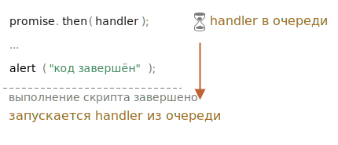

# Микрозадачи

Обработчики промисов `.then`/`.catch`/`.finally` всегда асинхронны.

<<<<<<< HEAD
Даже когда промис сразу же выполнен, код в строках *ниже* `.then`/`.catch`/`.finally` будет запущен до этих обработчиков.

Вот демо:
=======
Even when a Promise is immediately resolved, the code on the lines *below* `.then`/`.catch`/`.finally` will still execute before these handlers.

Here's a demo:
>>>>>>> 162280b6d238ce32bbd8ff7a3f7992be82c2311a

```js run
let promise = Promise.resolve();

promise.then(() => alert("промис выполнен"));

alert("код выполнен"); // этот alert показывается первым
```

Если вы запустите его, сначала вы  увидите `код выполнен`, а потом `промис выполнен`.

Это странно, потому что промис определённо был выполнен с самого начала.

Почему `.then` срабатывает позже? Что происходит?

## Очередь микрозадач

<<<<<<< HEAD
Асинхронные задачи требуют правильного управления. Для этого стандарт предусматривает внутреннюю очередь `PromiseJobs`, более известную как "очередь микрозадач (microtask queue)" (термин V8).

Как сказано в [спецификации](https://tc39.github.io/ecma262/#sec-jobs-and-job-queues):
=======
Asynchronous tasks need proper management. For that, the ECMA standard specifies an internal queue `PromiseJobs`, more often referred to as the "microtask queue" (ES8 term).

As stated in the [specification](https://tc39.github.io/ecma262/#sec-jobs-and-job-queues):
>>>>>>> 162280b6d238ce32bbd8ff7a3f7992be82c2311a

- Очередь определяется как первым-пришёл-первым-ушёл (FIFO): задачи, попавшие в очередь первыми, выполняются тоже первыми.
- Выполнение задачи происходит только в том случае, если ничего больше не запущено.

<<<<<<< HEAD
Или, проще говоря, когда промис выполнен, его обработчики `.then/catch/finally` попадают в очередь. Они пока не выполняются. Движок JavaScript берёт задачу из очереди и выполняет её, когда он освободится от выполнения текущего кода.
=======
Or, to say more simply, when a promise is ready, its `.then/catch/finally` handlers are put into the queue; they are not executed yet. When the JavaScript engine becomes free from the current code, it takes a task from the queue and executes it.
>>>>>>> 162280b6d238ce32bbd8ff7a3f7992be82c2311a

Вот почему сообщение "код выполнен" в примере выше будет показано первым.



<<<<<<< HEAD
Обработчики промисов всегда проходят через эту внутреннюю очередь.

Если есть цепочка с несколькими `.then/catch/finally`, то каждый из них выполняется асинхронно. То есть сначала ставится в очередь, а потом выполняется, когда выполнение текущего кода завершено и добавленные ранее в очередь обработчики выполнены.

**Но что если порядок имеет значение для нас? Как мы можем вывести `код выполнен` после `промис выполнен`?**
=======
Promise handlers always go through this internal queue.

If there's a chain with multiple `.then/catch/finally`, then every one of them is executed asynchronously. That is, it first gets queued, then executed when the current code is complete and previously queued handlers are finished.

**What if the order matters for us? How can we make `code finished` run after `promise done`?**
>>>>>>> 162280b6d238ce32bbd8ff7a3f7992be82c2311a

Легко, используя `.then`:

```js run
Promise.resolve()
  .then(() => alert("промис выполнен!"))
  .then(() => alert("код выполнен"));
```

Теперь порядок стал таким, как было задумано.

## Необработанные ошибки

<<<<<<< HEAD
Помните "необработанные ошибки" из главы <info:promise-error-handling>?

Теперь мы можем описать, как именно JavaScript понимает, что ошибка не обработана.

**"Необработанная ошибка" возникает в случае, если ошибка промиса не обрабатывается в конце очереди микрозадач.**
=======
Remember the `unhandledrejection` event from the article <info:promise-error-handling>?

Now we can see exactly how JavaScript finds out that there was an unhandled rejection.

**An "unhandled rejection" occurs when a promise error is not handled at the end of the microtask queue.**
>>>>>>> 162280b6d238ce32bbd8ff7a3f7992be82c2311a

Обычно, если мы ожидаем ошибку, мы добавляем `.catch` в конец цепочки промисов, чтобы обработать её:

```js run
let promise = Promise.reject(new Error("Ошибка в промисе!"));
*!*
promise.catch(err => alert('поймана!'));
*/!*

// не запустится, ошибка обработана
window.addEventListener('unhandledrejection', event => {
  alert(event.reason);
});
```

<<<<<<< HEAD
...Но если мы забудем добавить `.catch`, то, когда очередь микрозадач опустеет, движок сгенерирует событие:

=======
But if we forget to add `.catch`, then, after the microtask queue is empty, the engine triggers the event:
>>>>>>> 162280b6d238ce32bbd8ff7a3f7992be82c2311a

```js run
let promise = Promise.reject(new Error("Ошибка в промисе!"));

// Ошибка в промисе!
window.addEventListener('unhandledrejection', event => alert(event.reason));
```

А что, если мы поймаем ошибку, но позже? Вот так:

```js run
let promise = Promise.reject(new Error("Ошибка в промисе!"));

*!*
setTimeout(() => promise.catch(err => alert('поймана')), 1000);
*/!*

// Ошибка в промисе!
window.addEventListener('unhandledrejection', event => alert(event.reason));
```

<<<<<<< HEAD
Теперь, при запуске, мы сначала увидим "Ошибка в промисе!", а затем "поймана".

Если бы мы не знали про очередь микрозадач, то могли бы удивиться: "Почему сработал обработчик `unhandledrejection`? Мы же поймали ошибку!".

Но теперь мы понимаем, что событие `unhandledrejection` возникает, когда очередь микрозадач завершена: движок проверяет все промисы и, если какой-либо из них в состоянии "rejected", то генерируется это событие.

В примере выше `.catch`, добавленный в `setTimeout`, также срабатывает, но позже, уже после возникновения `unhandledrejection`, так что это ни на что не влияет.
=======
Now, if we run it, we'll see `Promise Failed!` first and then `caught`.

If we didn't know about the microtasks queue, we could wonder: "Why did `unhandledrejection` handler run? We did catch and handle the error!"

But now we understand that `unhandledrejection` is generated when the microtask queue is complete: the engine examines promises and, if any of them is in the "rejected" state, then the event triggers.

In the example above, `.catch` added by `setTimeout` also triggers. But it does so later, after `unhandledrejection` has already occurred, so it doesn't change anything.
>>>>>>> 162280b6d238ce32bbd8ff7a3f7992be82c2311a

## Итого

<<<<<<< HEAD
Обработка промисов всегда асинхронная, т.к. все действия промисов проходят через внутреннюю очередь "promise jobs", так называемую "очередь микрозадач (microtask queue)" (термин v8).

Таким образом, обработчики `.then/catch/finally` вызываются после выполнения текущего кода.
=======
Promise handling is always asynchronous, as all promise actions pass through the internal "promise jobs" queue, also called "microtask queue" (ES8 term).

So `.then/catch/finally` handlers are always called after the current code is finished.
>>>>>>> 162280b6d238ce32bbd8ff7a3f7992be82c2311a

Если нам нужно гарантировать выполнение какого-то кода после `.then/catch/finally`, то лучше всего добавить его вызов в цепочку `.then`.

<<<<<<< HEAD
В большинстве движков JavaScript, включая браузеры и Node.js, микрозадачи тесно связаны с так называемым "событийным циклом" и "макрозадачами". Так как они не связаны напрямую с промисами, то рассматриваются в другой части учебника, в главе <info:event-loop>.
=======
In most Javascript engines, including browsers and Node.js, the concept of microtasks is closely tied with the "event loop" and "macrotasks". As these have no direct relation to promises, they are covered in another part of the tutorial, in the article <info:event-loop>.
>>>>>>> 162280b6d238ce32bbd8ff7a3f7992be82c2311a
