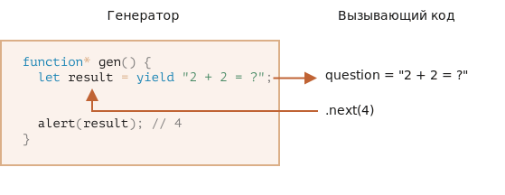
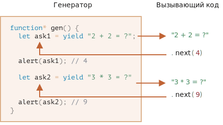

# Генераторы

<<<<<<< HEAD
Обычные функции возвращают только одно-единственное значение (или ничего).
=======
Generators can return ("yield") multiple values, one after another, on-demand. They work great with [iterables](info:iterable), allowing to create data streams with ease.
>>>>>>> 5cb9760abb8499bf1e99042d866c3c1db8cd61ca

Генераторы могут порождать (yield) множество значений одно за другим, по мере необходимости. Генераторы отлично работают с перебираемыми объектами и позволяют легко создавать потоки данных.

## Функция-генератор

Для объявления генератора используется специальная синтаксическая конструкция: `function*`, которая называется "функция-генератор".

Выглядит она   так:

```js
function* generateSequence() {
  yield 1;
  yield 2;
  return 3;
}
```

<<<<<<< HEAD
Функции-генераторы ведут себя не так, как обычные. Когда такая функция вызвана, она не выполняет свой код. Вместо этого она возвращает специальный объект, так называемый "генератор" для управления её выполнением.

Вот, посмотрите:

```js run
function* generateSequence() {
  yield 1;
  yield 2;
  return 3;
}

// "функция-генератор" создаёт объект "генератор"
=======
Generator functions behave differently from regular ones. When such function is called, it doesn't run its code. Instead it returns a special object, called "generator object", to manage the execution.

Here, take a look:

```js run
function* generateSequence() {
  yield 1;
  yield 2;
  return 3;
}

// "generator function" creates "generator object"
>>>>>>> 5cb9760abb8499bf1e99042d866c3c1db8cd61ca
let generator = generateSequence();
*!*
alert(generator); // [object Generator]
*/!*
```

<<<<<<< HEAD
Выполнение кода функции ещё не началось:


Основным методом генератора является `next()`. При вызове он запускает выполнение кода до ближайшей инструкции `yield <значение>` (значение может отсутствовать, в этом случае оно полагается равным `undefined`). По достижении `yield` выполнение функции приостанавливается, а соответствующее значение – возвращается во внешний код:

Результатом метода `next()` всегда является объект с двумя свойствами:
- `value`: значение из `yield`.
- `done`: `true`, если выполнение функции завершено, иначе `false`.
=======
The function code execution hasn't started yet:


The main method of a generator is `next()`. When called, it runs the execution till the nearest `yield <value>` statement (`value` can be omitted, then it's `undefined`). Then the function execution pauses, and the yielded `value` is returned to the outer code.

The result of `next()` is always an object with two properties:
- `value`: the yielded value.
- `done`: `true` if the function code has finished, otherwise `false`.
>>>>>>> 5cb9760abb8499bf1e99042d866c3c1db8cd61ca

Например, здесь мы создаём генератор и получаем первое из возвращаемых им значений:

```js run
function* generateSequence() {
  yield 1;
  yield 2;
  return 3;
}

let generator = generateSequence();

*!*
let one = generator.next();
*/!*

alert(JSON.stringify(one)); // {value: 1, done: false}
```

<<<<<<< HEAD
На данный момент мы получили только первое значение, выполнение функции остановлено на второй строке:
=======
As of now, we got the first value only, and the function execution is on the second line:
>>>>>>> 5cb9760abb8499bf1e99042d866c3c1db8cd61ca


Повторный вызов `generator.next()` возобновит выполнение кода и вернёт результат следующего `yield`:

```js
let two = generator.next();

alert(JSON.stringify(two)); // {value: 2, done: false}
```


И, наконец, последний вызов завершит выполнение функции и вернёт результат `return`:

```js
let three = generator.next();

alert(JSON.stringify(three)); // {value: 3, *!*done: true*/!*}
```


<<<<<<< HEAD
Сейчас генератор полностью выполнен. Мы можем увидеть это по свойству `done:true` и обработать `value:3` как окончательный результат.

Новые вызовы `generator.next()` больше не имеют смысла. Впрочем, если они и будут, то не вызовут ошибки, но будут возвращать один и тот же объект: `{done: true}`.

```smart header="`function* f(…)` или `function *f(…)`?"
Нет разницы, оба синтаксиса корректны.

Но обычно предпочтителен первый вариант, так как звёздочка относится к типу объявляемой сущности (`function*` – "функция-генератор"), а не к её названию, так что резонно расположить её у слова `function`.
=======
Now the generator is done. We should see it from `done:true` and process `value:3` as the final result.

New calls `generator.next()` don't make sense any more. If we do them, they return the same object: `{done: true}`.

```smart header="`function* f(…)` or `function *f(…)`?"
Both syntaxes are correct.

But usually the first syntax is preferred, as the star `*` denotes that it's a generator function, it describes the kind, not the name, so it should stick with the `function` keyword.
>>>>>>> 5cb9760abb8499bf1e99042d866c3c1db8cd61ca
```

## Перебор генераторов

Как вы, наверное, уже догадались по наличию метода `next()`, генераторы являются [перебираемыми](info:iterable) объектами.

Возвращаемые ими значения можно перебирать через `for..of`:

```js run
function* generateSequence() {
  yield 1;
  yield 2;
  return 3;
}

let generator = generateSequence();

for(let value of generator) {
  alert(value); // 1, затем 2
}
```

<<<<<<< HEAD
Выглядит гораздо красивее, чем использование `.next().value`, верно?
=======
Looks a lot nicer than calling `.next().value`, right?
>>>>>>> 5cb9760abb8499bf1e99042d866c3c1db8cd61ca

...Но обратите внимание: пример выше выводит значение `1`, затем `2`. Значение `3` выведено не будет!

<<<<<<< HEAD
Это потому что перебор через `for..of` игнорирует последнее значение, при котором `done: true`. Поэтому, если мы хотим, чтобы были все значения при переборе через `for..of`, то надо возвращать их через `yield`:
=======
It's because `for..of` iteration ignores the last `value`, when `done: true`. So, if we want all results to be shown by `for..of`, we must return them with `yield`:
>>>>>>> 5cb9760abb8499bf1e99042d866c3c1db8cd61ca

```js run
function* generateSequence() {
  yield 1;
  yield 2;
*!*
  yield 3;
*/!*
}

let generator = generateSequence();

for(let value of generator) {
  alert(value); // 1, затем 2, затем 3
}
```

<<<<<<< HEAD
Так как генераторы являются перебираемыми объектами, мы можем использовать всю связанную с ними функциональность, например оператор расширения `...`:
=======
As generators are iterable, we can call all related functionality, e.g. the spread operator `...`:
>>>>>>> 5cb9760abb8499bf1e99042d866c3c1db8cd61ca

```js run
function* generateSequence() {
  yield 1;
  yield 2;
  yield 3;
}

let sequence = [0, ...generateSequence()];

alert(sequence); // 0, 1, 2, 3
```

<<<<<<< HEAD
В коде выше `...generateSequence()` превращает перебираемый объект-генератор в массив элементов (подробнее ознакомиться с оператором расширения можно в главе [](info:rest-parameters-spread-operator#spread-operator))
=======
In the code above, `...generateSequence()` turns the iterable generator object into array of items (read more about the spread operator in the chapter [](info:rest-parameters-spread-operator#spread-operator))
>>>>>>> 5cb9760abb8499bf1e99042d866c3c1db8cd61ca

## Использование генераторов для перебираемых объектов

Некоторое время назад, в главе [](info:iterable), мы создали перебираемый объект `range`, который возвращает значения `from..to`.

Давайте вспомним код:

```js run
let range = {
  from: 1,
  to: 5,

  // for..of range вызывает этот метод один раз в самом начале
  [Symbol.iterator]() {
    // ...он возвращает перебираемый объект:
    // далее for..of работает только с этим объектом, запрашивая следующие значения
    return {
      current: this.from,
      last: this.to,

      // next() вызывается при каждой итерации цикла for..of
      next() {
        // нужно вернуть значение как объект {done:.., value :...}
        if (this.current <= this.last) {
          return { done: false, value: this.current++ };
        } else {
          return { done: true };
        }
      }
    };
  }
};

<<<<<<< HEAD
// при переборе объекта range будут числа от range.from до range.to
alert([...range]); // 1,2,3,4,5
```

Мы можем использовать функцию-генератор для итерации, указав её в `Symbol.iterator`.

Вот тот же `range`, но с гораздо более компактным итератором:
=======
// iteration over range returns numbers from range.from to range.to
alert([...range]); // 1,2,3,4,5
```

We can use a generator function for iteration by providing it as `Symbol.iterator`.

Here's the same `range`, but much more compact:
>>>>>>> 5cb9760abb8499bf1e99042d866c3c1db8cd61ca

```js run
let range = {
  from: 1,
  to: 5,

  *[Symbol.iterator]() { // краткая запись для [Symbol.iterator]: function*()
    for(let value = this.from; value <= this.to; value++) {
      yield value;
    }
  }
};

alert( [...range] ); // 1,2,3,4,5
```

Это работает, потому что `range[Symbol.iterator]()` теперь возвращает генератор, и его методы - в точности то, что ожидает `for..of`:
- у него есть метод `.next()`
- который возвращает значения в виде `{value: ..., done: true/false}`

Это не совпадение, конечно. Генераторы были добавлены в язык JavaScript, в частности, с целью упростить создание перебираемых объектов.

<<<<<<< HEAD
Вариант с генератором намного короче, чем исходный вариант перебираемого `range`, и сохраняет те же функциональные возможности.
=======
The variant with a generator is much more concise than the original iterable code of `range`, and keeps the same functionality.
>>>>>>> 5cb9760abb8499bf1e99042d866c3c1db8cd61ca

```smart header="Генераторы могут генерировать бесконечно"
В примерах выше мы генерировали конечные последовательности, но мы также можем сделать генератор, который будет возвращать значения бесконечно. Например, бесконечная последовательность псевдослучайных чисел.

Конечно, нам потребуется `break` (или `return`) в цикле `for..of` по такому генератору, иначе цикл будет продолжаться бесконечно и скрипт "зависнет".
```

## Композиция генераторов

Композиция генераторов - это особенная возможность генераторов, которая позволяет прозрачно "встраивать" генераторы друг в друга.

<<<<<<< HEAD
Например, у нас есть функция для генерации последовательности чисел:

```js
function* generateSequence(start, end) {
  for (let i = start; i <= end; i++) yield i;
}
```

Мы хотели бы использовать её при генерации более сложной последовательности:
- сначала цифры `0..9` (с кодами символов 48..57),
- за которыми следуют буквы алфавита `a..z` (коды символов 65..90)
- за которыми следуют буквы в верхнем регистре `A..Z` (коды символов 97..122)

Мы можем использовать такую последовательность для генерации паролей, выбирать символы из неё (может быть, ещё добавить символы пунктуации), но сначала её нужно сгенерировать.
=======
For instance, we have a function that generates a sequence of numbers:

```js
function* generateSequence(start, end) {
  for (let i = start; i <= end; i++) yield i;
}
```

Now we'd like to reuse it for generation of a more complex sequence:
- first, digits `0..9` (with character codes 48..57),
- followed by alphabet letters `a..z` (character codes 65..90)
- followed by uppercased letters `A..Z` (character codes 97..122)

We can use this sequence e.g. to create passwords by selecting characters from it (could add syntax characters as well), but let's generate it first.
>>>>>>> 5cb9760abb8499bf1e99042d866c3c1db8cd61ca

В обычной функции, чтобы объединить результаты из нескольких других функций, мы вызываем их, сохраняем промежуточные результаты, а затем в конце их объединяем.

<<<<<<< HEAD
Для генераторов есть особый синтаксис `yield*`, который позволяет "вкладывать" генераторы один в другой (осуществлять их композицию).

Вот генератор с композицией:
=======
For generators, there's a special `yield*` syntax to "embed" (compose) one generator into another.

The composed generator:
>>>>>>> 5cb9760abb8499bf1e99042d866c3c1db8cd61ca

```js run
function* generateSequence(start, end) {
  for (let i = start; i <= end; i++) yield i;
}

function* generatePasswordCodes() {

*!*
  // 0..9
  yield* generateSequence(48, 57);

  // A..Z
  yield* generateSequence(65, 90);

  // a..z
  yield* generateSequence(97, 122);
*/!*

}

let str = '';

for(let code of generatePasswordCodes()) {
  str += String.fromCharCode(code);
}

alert(str); // 0..9A..Za..z
```

<<<<<<< HEAD
Директива `yield*` *делегирует* выполнение другому генератору. Этот термин означает, что `yield* gen` перебирает генератор `gen` и прозрачно направляет его вывод наружу. Как если бы значения были сгенерированы внешним генератором.
=======
The `yield*` directive *delegates* the execution to another generator. This term means that `yield* gen` iterates over the generator `gen` and transparently forwards its yields outside. As if the values were yielded by the outer generator.
>>>>>>> 5cb9760abb8499bf1e99042d866c3c1db8cd61ca

Результат - такой же, как если бы мы встроили код из вложенных генераторов:

```js run
function* generateSequence(start, end) {
  for (let i = start; i <= end; i++) yield i;
}

function* generateAlphaNum() {

*!*
  // yield* generateSequence(48, 57);
  for (let i = 48; i <= 57; i++) yield i;

  // yield* generateSequence(65, 90);
  for (let i = 65; i <= 90; i++) yield i;

  // yield* generateSequence(97, 122);
  for (let i = 97; i <= 122; i++) yield i;
*/!*

}

let str = '';

for(let code of generateAlphaNum()) {
  str += String.fromCharCode(code);
}

alert(str); // 0..9a..zA..Z
```

<<<<<<< HEAD
Композиция генераторов – естественный способ вставлять вывод одного генератора в поток другого. Она не использует дополнительную память для хранения промежуточных результатов.

## yield – дорога в обе стороны

До этого момента генераторы сильно напоминали перебираемые объекты, со специальным синтаксисом для генерации значений. Но на самом деле они намного мощнее и гибче.
=======
A generator composition is a natural way to insert a flow of one generator into another. It doesn't use extra memory to store intermediate results.

## "yield" is a two-way road

Till this moment, generators were similar to iterable objects, with a special syntax to generate values. But in fact they are much more powerful and flexible.
>>>>>>> 5cb9760abb8499bf1e99042d866c3c1db8cd61ca

Всё дело в том, что `yield` – дорога в обе стороны: он не только возвращает результат наружу, но и может передавать значение извне в генератор.

Чтобы это сделать, нам нужно вызвать `generator.next(arg)` с аргументом. Этот аргумент становится результатом `yield`.

Продемонстрируем это на примере:

```js run
function* gen() {
*!*
<<<<<<< HEAD
  // Передаём вопрос во внешний код и ожидаем ответа
=======
  // Pass a question to the outer code and wait for an answer
>>>>>>> 5cb9760abb8499bf1e99042d866c3c1db8cd61ca
  let result = yield "2 + 2 = ?"; // (*)
*/!*

  alert(result);
}

let generator = gen();

let question = generator.next().value; // <-- yield возвращает значение

generator.next(4); // --> передаём результат в генератор  
```



<<<<<<< HEAD
1. Первый вызов `generator.next()` – всегда без аргумента, он начинает выполнение и возвращает результат первого `yield "2+2=?"`. На этой точке генератор приостанавливает выполнение.
2. Затем, как показано на картинке выше, результат `yield` переходит во внешний код в переменную `question`.
3. При `generator.next(4)` выполнение генератора возобновляется, а `4` выходит из присваивания как результат: `let result = 4`.

Обратите внимание, что внешний код не обязан немедленно вызывать `next(4)`. Ему может потребоваться время. Это не проблема, генератор подождёт.

Например:
=======
1. The first call `generator.next()` is always without an argument. It starts the execution and returns the result of the first `yield "2+2=?"`. At this point the generator pauses the execution (still on that line).
2. Then, as shown at the picture above, the result of `yield` gets into the `question` variable in the calling code.
3. On `generator.next(4)`, the generator resumes, and `4` gets in as the result: `let result = 4`.

Please note, the outer code does not have to immediately call`next(4)`. It may take time. That's not a problem: the generator will wait.

For instance:
>>>>>>> 5cb9760abb8499bf1e99042d866c3c1db8cd61ca

```js
// возобновить генератор через некоторое время
setTimeout(() => generator.next(4), 1000);
```

<<<<<<< HEAD
Как видно, в отличие от обычных функций, генератор может обмениваться результатами с вызывающим кодом, передавая значения в `next/yield`.
=======
As we can see, unlike regular functions, a generator and the calling code can exchange results by passing values in `next/yield`.
>>>>>>> 5cb9760abb8499bf1e99042d866c3c1db8cd61ca

Чтобы сделать происходящее более очевидным, вот ещё один пример с большим количеством вызовов:

```js run
function* gen() {
  let ask1 = yield "2 + 2 = ?";

  alert(ask1); // 4

  let ask2 = yield "3 * 3 = ?"

  alert(ask2); // 9
}

let generator = gen();

alert( generator.next().value ); // "2 + 2 = ?"

alert( generator.next(4).value ); // "3 * 3 = ?"

alert( generator.next(9).done ); // true
```

Картинка выполнения:



1. Первый `.next()` начинает выполнение… Оно доходит до первого `yield`.
2. Результат возвращается во внешний код.
3. Второй `.next(4)` передаёт `4` обратно в генератор как результат первого `yield` и возобновляет выполнение.
4. …Оно доходит до второго `yield`, который станет результатом `.next(4)`.
5. Третий `next(9)` передаёт `9` в генератор как результат второго `yield` и возобновляет выполнение, которое завершается окончанием функции, так что `done: true`.

Получается такой "пинг-понг": каждый `next(value)` передаёт в генератор значение, которое становится результатом текущего `yield`, возобновляет выполнение и получает выражение из следующего `yield`.

## generator.throw

Как мы видели в примерах выше, внешний код может передавать значение в генератор как результат `yield`.

...Но можно передать не только результат, но и инициировать (throw) ошибку. Это естественно, так как ошибка является своего рода результатом.

Для того, чтобы передать ошибку в `yield`, нам нужно вызвать `generator.throw(err)`. В этом случае, исключение `err` возникнет на строке с `yield`.

<<<<<<< HEAD
Например, здесь `yield "2 + 2 = ?"` приведёт к ошибке:
=======
For instance, here the yield of `"2 + 2 = ?"` leads to an error:
>>>>>>> 5cb9760abb8499bf1e99042d866c3c1db8cd61ca

```js run
function* gen() {
  try {
    let result = yield "2 + 2 = ?"; // (1)

    alert("Выполнение программы не дойдет до этой строки, потому что выше возникнет исключение");
  } catch(e) {
    alert(e); // покажет ошибку
  }
}

let generator = gen();

let question = generator.next().value;

*!*
generator.throw(new Error("Ответ не найден в моей базе данных")); // (2)
*/!*
```

Ошибка, которая проброшена в генератор на строке `(2)`, приводит к исключению на строке `(1)` с `yield`. В примере выше `try..catch` перехватывает её и отображает.

Если мы не хотим перехватывать её, то она, как и любое обычное исключение, "вывалится" из генератора во внешний код.

Текущая строка вызывающего кода - это строка с `generator.throw`, отмечена `(2)`. Таким образом, мы можем отловить её во внешнем коде, как здесь:

```js run
function* generate() {
<<<<<<< HEAD
  let result = yield "2 + 2 = ?"; // Ошибка в этой строке
=======
  let result = yield "2 + 2 = ?"; // Error in this line
>>>>>>> 5cb9760abb8499bf1e99042d866c3c1db8cd61ca
}

let generator = generate();

let question = generator.next().value;

*!*
try {
  generator.throw(new Error("Ответ не найден в моей базе данных"));
} catch(e) {
  alert(e); // покажет ошибку
}
*/!*
```

Если же ошибка и там не перехвачена, то дальше – как обычно, она выпадает наружу и, если не перехвачена, "повалит" скрипт.

## Итого

- Генераторы создаются при помощи функций-генераторов `function* f(…) {…}`.
- Внутри генераторов и только внутри них существует оператор `yield`.
- Внешний код и генератор обмениваются промежуточными результатами посредством вызовов `next/yield`.

В современном Javascript генераторы используются редко. Но иногда они оказываются полезными, потому что способность функции обмениваться данными с вызывающим кодом во время выполнения совершенно уникальна. И, конечно, для создания перебираемых объектов.

Также, в следующей главе мы будем изучать асинхронные генераторы, которые используются чтобы читать потоки асинхронно сгенерированных данных (например, постранично загружаемые из сети) в цикле `for await ... of`.

В веб-программировании мы часто работаем с потоками данных, так что это ещё один важный случай использования.
