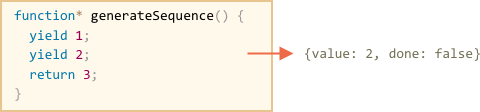

# Генераторы

Обычные функции возвращают только одно-единственное значение (или ничего).

Генераторы могут порождать (yield) множество значений, возможно даже бесконечное количество значений, одно за другим, по мере необходимости. Генераторы отлично работают с перебираемыми объектами и позволяют легко создавать потоки данных.

## Функция-генератор

Для объявления генератора используется специальная синтаксическая конструкция: `function*`, которая называется "функция-генератор".

Выглядит это так:

```js
function* generateSequence() {
  yield 1;
  yield 2;
  return 3;
}
```

Термин "функция-генератор" может немного запутать, важно то, что при запуске такая функция не выполняется, а возвращается специальный объект - "генератор".

То есть, это своего рода "конструктор генераторов".

```js
// "функция-генератор" создаёт generator
let generator = generateSequence();
```

Объект-генератор можно воспринимать как "замороженный вызов функции":


При создании генератора код находится в начале своего выполнения.

Основным методом генератора является `next()`. При вызове он возобновляет выполнение кода до ближайшего ключевого слова `yield`. По достижении `yield` выполнение приостанавливается, а значение – возвращается во внешний код:

Например, здесь мы создаём генератор и получаем первое из возвращаемых им значений:

```js run
function* generateSequence() {
  yield 1;
  yield 2;
  return 3;
}

let generator = generateSequence();

*!*
let one = generator.next();
*/!*

alert(JSON.stringify(one)); // {value: 1, done: false}
```

Результатом метода `next()` всегда является объект:
- `value`: значение.
- `done`: `false`, если выполнение функции ещё не завершено, в противном случае `true`.

На данный момент мы получили только первое значение:


Повторный вызов `generator.next()` возобновит выполнение кода и вернёт результат следующего `yield`:

```js
let two = generator.next();

alert(JSON.stringify(two)); // {value: 2, done: false}
```



И, наконец, последний вызов завершит выполнение функции и вернёт результат `return`:

```js
let three = generator.next();

alert(JSON.stringify(three)); // {value: 3, *!*done: true*/!*}
```


Сейчас генератор полностью выполнен. Мы можем убедиться в этом, проверив свойство `done:true`, и обработать `value:3` как окончательный результат.

Новые вызовы `generator.next()` больше не имеют смысла. Впрочем, если они и будут, то не вызовут ошибки, но будут возвращать один и тот же объект: `{done: true}`.

"Открутить назад" завершившийся генератор нельзя, но можно создать новый ещё одним вызовом `generateSequence()` и выполнить его.

Пока что самое важное, что нужно понимать - это то, что функция-генератор, в отличие от обычных функций, не выполняет код. Она служит "фабрикой генераторов". Запуск `function*` возвращает генератор, и затем мы запрашиваем из него значения.

```smart header="`function* f(…)` или `function *f(…)`?"
Нет разницы, оба синтаксиса корректны.


Но обычно предпочтителен первый вариант, так как звёздочка относится к типу объявляемой сущности (`function*` – "функция-генератор"), а не к её названию.
```

## Перебор генераторов

Как вы, наверное, уже догадались по наличию метода `next()`, генераторы являются [перебираемыми](info:iterable) объектами.

Возвращаемые ими значения можно перебирать через `for..of`:

```js run
function* generateSequence() {
  yield 1;
  yield 2;
  return 3;
}

let generator = generateSequence();

for(let value of generator) {
  alert(value); // 1, затем 2
}
```

Это выглядит гораздо более привлекательно, чем использование `.next().value`, верно?

...Но обратите внимание: пример выше выводит значение `1`, затем `2`. Значение `3` выведено не будет!

Это потому что перебор игнорирует `value` на последнем значении, когда `done: true`. Поэтому, если мы хотим, чтобы все значения возвращались при переборе через `for..of`, то надо возвращать их через `yield`:

```js run
function* generateSequence() {
  yield 1;
  yield 2;
*!*
  yield 3;
*/!*
}

let generator = generateSequence();

for(let value of generator) {
  alert(value); // 1, затем 2, затем 3
}
```

Естественно, так как генераторы являются итерируемыми объектами, мы можем использовать всю связанную с ними функциональность, например оператор расширения `...`:

```js run
function* generateSequence() {
  yield 1;
  yield 2;
  yield 3;
}

let sequence = [0, ...generateSequence()];

alert(sequence); // 0, 1, 2, 3
```

В коде выше `...generateSequence()` превращает итерируемый объект в массив элементов (подробнее ознакомиться с оператором расширения можно в главе [](info:rest-parameters-spread-operator#spread-operator))

## Использование генераторов для создания перебираемых объектов

Некоторое время назад, в главе [](info:iterable), мы создали перебираемый объект `range`, который возвращает значения `from..to`.

Давайте вспомним код:

```js run
let range = {
  from: 1,
  to: 5,

  // for..of range вызывает этот метод один раз в самом начале
  [Symbol.iterator]() {
    // ...он возвращает перебираемый объект:
    // далее for..of работает только с этим объектом, запрашивая следующие значения
    return {
      current: this.from,
      last: this.to,

      // next() вызывается при каждой итерации циклом for..of
      next() {
        // нужно вернуть значение как объект {done:.., value :...}
        if (this.current <= this.last) {
          return { done: false, value: this.current++ };
        } else {
          return { done: true };
        }
      }
    };
  }
};

alert([...range]); // 1,2,3,4,5
```

Использование генератора для создания перебираемых последовательностей намного проще и более элегантно:

```js run
function* generateSequence(start, end) {
  for (let i = start; i <= end; i++) {
    yield i;
  }
}

let sequence = [...generateSequence(1,5)];

alert(sequence); // 1, 2, 3, 4, 5
```

## Преобразование Symbol.iterator в генератор

Мы можем применить генераторы для реализации перебора объекта, в частности, в нашем `range`:

```js run
let range = {
  from: 1,
  to: 5,

  *[Symbol.iterator]() { // краткая запись для [Symbol.iterator]: function()
    for(let value = this.from; value <= this.to; value++) {
      yield value;
    }
  }
};

alert( [...range] ); // 1,2,3,4,5
```

Теперь объект `range` является перебираемым.

Это работает, потому что `range[Symbol.iterator]()` теперь возвращает генератор, и его методы - в точности то, что ожидает `for..of`:
- у него есть метод `.next()`
- который возвращает значения в виде `{value: ..., done: true/false}`

Это не совпадение, конечно. Генераторы были добавлены в язык JavaScript, в частности, с целью упростить создание перебираемых объектов.

Последний вариант с генератором намного короче, чем исходный вариант перебираемого `range`, и сохраняет те же функциональные возможности.

```smart header="Генераторы могут продолжаться бесконечно"
В примерах выше мы генерировали конечные последовательности, но мы также можем сделать генератор, который будет возвращать значения бесконечно. Например, бесконечная последовательность псевдослучайных чисел.

Конечно, нам потребуется `break` (или `return`) в цикле `for..of` по такому генератору, иначе цикл будет продолжаться бесконечно и скрипт "зависнет".
```

## Композиция генераторов

Композиция генераторов - это особенная возможность генераторов, которая позволяет прозрачно "встраивать" генераторы друг в друга.

Например, мы хотели бы создать последовательность:
- цифр `0..9` (коды символов 48..57),
- за которыми следуют буквы алфавита `a..z` (коды символов 65..90)
- за которыми следуют буквы в верхнем регистре `A..Z` (коды символов 97..122)

Мы можем использовать такую последовательность для генерации паролей, выбирать символы из неё (может быть, ещё добавить символы пунктуации), но сначала её нужно сгенерировать.

У нас уже есть функция-генератор `function* generateSequence(start, end)`. Давайте используем её, чтобы получить 3 последовательности, одну за другой, вместе они именно то, что нам нужно.

В обычной функции, чтобы объединить результаты из нескольких других функций, мы вызываем их, сохраняем результаты, а затем объединяем их в конце.

Для генераторов мы можем сделать лучше, как тут:

```js run
function* generateSequence(start, end) {
  for (let i = start; i <= end; i++) yield i;
}

function* generatePasswordCodes() {

*!*
  // 0..9
  yield* generateSequence(48, 57);

  // A..Z
  yield* generateSequence(65, 90);

  // a..z
  yield* generateSequence(97, 122);
*/!*

}

let str = '';

for(let code of generatePasswordCodes()) {
  str += String.fromCharCode(code);
}

alert(str); // 0..9A..Za..z
```

Специальная директива `yield*` в примере отвечает за композицию. Она *делегирует* выполнение другому генератору. Или, проще говоря, `yield* gen` перебирает генератор `gen` и прозрачно направляет его вывод наружу. Как если бы значения были сгенерированы внешним генератором.

Результат такой же, как если бы мы встроили код из вложенных генераторов:

```js run
function* generateSequence(start, end) {
  for (let i = start; i <= end; i++) yield i;
}

function* generateAlphaNum() {

*!*
  // yield* generateSequence(48, 57);
  for (let i = 48; i <= 57; i++) yield i;

  // yield* generateSequence(65, 90);
  for (let i = 65; i <= 90; i++) yield i;

  // yield* generateSequence(97, 122);
  for (let i = 97; i <= 122; i++) yield i;
*/!*

}

let str = '';

for(let code of generateAlphaNum()) {
  str += String.fromCharCode(code);
}

alert(str); // 0..9a..zA..Z
```

Композиция генераторов – естественный способ вставлять вывод одного генератора в поток другого.

Это работает, даже если поток данных из вложенного генератора оказался бесконечным. Это просто и не использует дополнительную память для хранения промежуточных результатов.

## yield – дорога в обе стороны

До этого генераторы наиболее напоминали "итераторы на стероидах". Это то, как они часто используются.

Но на самом деле они намного мощнее и гибче.

Всё дело в том, что `yield` – дорога в обе стороны: он не только возвращает результат наружу, но и может передавать значение извне в генератор.

Чтобы это сделать, нам нужно вызвать `generator.next(arg)` с аргументом. Этот аргумент становится результатом `yield`.

Продемонстрируем это на примере:

```js run
function* gen() {
*!*
  // Передаём вопрос во внешний код и ожидаем ответа
  let result = yield "2 + 2?"; // (*)
*/!*

  alert(result);
}

let generator = gen();

let question = generator.next().value; // <-- yield возвращает значение

generator.next(4); // --> передаём результат в генератор  
```


1. Первый вызов `generator.next()` – всегда без аргумента, он начинает выполнение и возвращает результат первого `yield` ("2+2?"). На этой точке генератор приостанавливает выполнение.
2. Затем, как показано на картинке выше, результат `yield` переходит во внешний код в переменную `question`.
3. При `generator.next(4)` выполнение генератора возобновляется, а `4` выходит из присваивания как результат: `let result = 4`.

Обратите внимание, что внешний код не обязан немедленно вызывать `next(4)`. Ему может потребоваться время, чтобы рассчитать значение. Это не проблема, генератор продолжит выполнение, когда вызов состоится.

Например:

```js
// возобновить генератор через некоторое время
setTimeout(() => generator.next(4), 1000);
```

Как мы можем видеть, в отличие от обычных функций, генераторы могут обмениваться результатами с вызывающим их кодом, передавая значения в `next/yield`.

Чтобы сделать происходящее более очевидным, вот ещё один пример с большим количеством вызовов:

```js run
function* gen() {
  let ask1 = yield "2 + 2?";

  alert(ask1); // 4

  let ask2 = yield "3 * 3?"

  alert(ask2); // 9
}

let generator = gen();

alert( generator.next().value ); // "2 + 2?"

alert( generator.next(4).value ); // "3 * 3?"

alert( generator.next(9).done ); // true
```

Картинка выполнения:


1. Первый `.next()` начинает выполнение… Оно доходит до первого `yield`.
2. Результат возвращается во внешний код.
3. Второй `.next(4)` передаёт `4` обратно в генератор как результат первого `yield` и возобновляет выполнение.
4. …Оно доходит до второго `yield`, который станет результатом `.next(4)`.
5. Третий `next(9)` передаёт `9` в генератор как результат второго `yield` и возобновляет выполнение, которое завершается окончанием функции, так что `done: true`.

Получается "пинг-понг": каждый `next(value)` передаёт в генератор значение, которое становится результатом текущего `yield`, возобновляет выполнение и получает выражение из следующего `yield`.

## generator.throw

Как мы видели в примерах выше, внешний код может передавать значение в генератор как результат `yield`.

...Но можно передать не только результат, но и инициировать (throw) ошибку. Это естественно, так как ошибка является своего рода результатом.

Для того, чтобы передать ошибку в `yield`, нам нужно вызвать `generator.throw(err)`. В этом случае, исключение `err` возникнет на строке с `yield`.

Например, здесь `yield "2 + 2?"` приведёт к ошибке:

```js run
function* gen() {
  try {
    let result = yield "2 + 2?"; // (1)

    alert("Выполнение программы не дойдет до этой строки, потому что выше возникнет исключение");
  } catch(e) {
    alert(e); // покажет ошибку
  }
}

let generator = gen();

let question = generator.next().value;

*!*
generator.throw(new Error("Ответ не найден в моей базе данных")); // (2)
*/!*
```

Ошибка, которая проброшена в генератор на строке `(2)`, приводит к исключению на строке `(1)` с `yield`. В примере выше `try..catch` перехватывает её и отображает.

Если мы не хотим перехватывать её, то она, как и любое обычное исключение, "вывалится" из генератора во внешний код.

Текущая строка вызывающего кода - это строка с `generator.throw`, отмечена `(2)`. Таким образом, мы можем отловить её во внешнем коде, как здесь:

```js run
function* generate() {
  let result = yield "2 + 2?"; // Ошибка в этой строке
}

let generator = generate();

let question = generator.next().value;

*!*
try {
  generator.throw(new Error("Ответ не найден в моей базе данных"));
} catch(e) {
  alert(e); // покажет ошибку
}
*/!*
```

Если же ошибка и там не перехвачена, то дальше – как обычно, она выпадает наружу и, если не перехвачена, "повалит" скрипт.

## Итого

- Генераторы создаются при помощи функций-генераторов `function* f(…) {…}`.
- Внутри генераторов и только внутри них существует оператор `yield`.
- Внешний код и генератор обмениваются промежуточными результатами посредством вызовов `next/yield`.

В современном Javascript генераторы используются редко. Но иногда они оказываются полезными, потому что способность функции обмениваться данными с вызывающим кодом во время выполнения совершенно уникальна. И, конечно, для создания перебираемых объектов.

Также, в следующей главе мы будем изучать асинхронные генераторы, которые используются чтобы читать потоки асинхронно сгенерированных данных (например, постранично загружаемые из сети) в цикле `for await ... of`.

В веб-программировании мы часто работаем с потоками данных, так что это ещё один важный случай использования.
