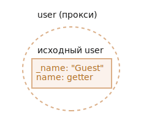

# Proxy и Reflect

Объект *прокси* "оборачивается" вокруг другого объекта и может перехватывать (и, при желании, самостоятельно обрабатывать) разные действия с ним, например чтение/запись свойств и другие.

Прокси используются во многих библиотеках и некоторых браузерных фреймворках. В этой главе мы увидим много случаев применения прокси в решении реальных задач.

Синтаксис:

```js
let proxy = new Proxy(target, handler)
```

- `target` -- это объект, который обёртывается, может быть чем угодно, включая функции.
- `handler` -- объект с "ловушками" ("traps"): методами, которые перехватывают разные операции, например `get` при чтении свойства, `set` при записи свойства и так далее.

При операциях над `proxy`, если в `handler` имеется соответствующая "ловушка", то она срабатывает, и прокси имеет возможность как-то среагировать, иначе действие будет совершено над оригинальным объектом `target`.

В качестве примера давайте для начала создадим прокси без всяких ловушек:

```js run
let target = {};
let proxy = new Proxy(target, {}); // пустой handler

proxy.test = 5; // записываем в прокси (1)
alert(target.test); // 5, свойство появилось в target!

alert(proxy.test); // 5, мы также можем прочитать его из прокси (2)

for(let key in proxy) alert(key); // test, итерация работает (3)
```

Так как нет ловушек, то все операции на `proxy` применяются к оригинальному объекту `target`.

1. Запись свойства `proxy.test=` устанавливает значение на `target`.
2. Чтение свойства `proxy.test` возвращает значение из `target`.
3. Итерация по `proxy` возвращает значения из `target`.

Как мы видим, без ловушек `proxy` является прозрачной обёрткой над `target`.


Прокси -- это особенный объект, у него нет собственных свойств. С пустым `handler` он просто перенаправляет все операции на `target`.

Чтобы активировать его возможности, добавим ловушки.

Вот список внутренних методов объектов из [спецификации Proxy](https://tc39.es/ecma262/#sec-proxy-object-internal-methods-and-internal-slots). Прокси может перехватывать вызов любого из них, нужно только добавить соответствующий обработчик в `handler`.

В таблице ниже:
- **Внутренний метод** -- название операции над объектом, определённое в спецификации. Например, `[[Get]]` -- это имя внутреннего (используемого только внутри спецификации) метода для чтения свойства объекта. В спецификации описывается, как это должно быть реализовано, до мельчайших низкоуровневых подробностей.
- **Ловушка** -- это имя метода, который мы можем добавить в параметр `handler` при создании прокси. Этот метод будет действовать как ловушка, перехватывающая данную операцию и позволяющая совершать какие-то дополнительные действия.


| Внутренний метод | Ловушка | Срабатывает при... |
|-----------------|----------------|-------------|
| `[[Get]]` | `get` | чтении свойства |
| `[[Set]]` | `set` | записи свойства |
| `[[HasProperty]]` | `has` | использовании в операторе `in` |
| `[[Delete]]` | `deleteProperty` | при использовании оператора `delete` |
| `[[Call]]` | `apply` | вызове функции |
| `[[Construct]]` | `construct` | использовании оператора `new` |
| `[[GetPrototypeOf]]` | `getPrototypeOf` | [Object.getPrototypeOf](https://developer.mozilla.org/ru/docs/Web/JavaScript/Reference/Global_Objects/Object/getPrototypeOf) |
| `[[SetPrototypeOf]]` | `setPrototypeOf` | [Object.setPrototypeOf](https://developer.mozilla.org/ru/docs/Web/JavaScript/Reference/Global_Objects/Object/setPrototypeOf) |
| `[[IsExtensible]]` | `isExtensible` | [Object.isExtensible](https://developer.mozilla.org/ru/docs/Web/JavaScript/Reference/Global_Objects/Object/isExtensible) |
| `[[PreventExtensions]]` | `preventExtensions` | [Object.preventExtensions](https://developer.mozilla.org/ru/docs/Web/JavaScript/Reference/Global_Objects/Object/preventExtensions) |
| `[[GetOwnProperty]]` | `getOwnPropertyDescriptor` | [Object.getOwnPropertyDescriptor](https://developer.mozilla.org/ru/docs/Web/JavaScript/Reference/Global_Objects/Object/getOwnPropertyDescriptor) |
| `[[DefineOwnProperty]]` | `defineProperty` | [Object.defineProperty](https://developer.mozilla.org/ru/docs/Web/JavaScript/Reference/Global_Objects/Object/defineProperty), [Object.defineProperties](https://developer.mozilla.org/ru/docs/Web/JavaScript/Reference/Global_Objects/Object/defineProperties) |
| `[[OwnPropertyKeys]]` | `ownKeys` | [Object.keys](https://developer.mozilla.org/ru/docs/Web/JavaScript/Reference/Global_Objects/Object/keys), [Object.getOwnPropertyNames](https://developer.mozilla.org/ru/docs/Web/JavaScript/Reference/Global_Objects/Object/getOwnPropertyNames), [Object.getOwnPropertySymbols](https://developer.mozilla.org/ru/docs/Web/JavaScript/Reference/Global_Objects/Object/getOwnPropertySymbols), итерация по ключам |

```warn header="Инварианты"
JavaScript налагает некоторые условия - инварианты на реализацию внутренних методов и ловушек.

Большинство из них касаются возвращаемых значений:
- `[[Set]]` должен возвращать `true`, если значение было успешно записано, иначе `false`.
- `[[Delete]]` должен возвращать `true`, если значение было успешно удалено, иначе `false`.
- ...и так далее, мы увидим больше в примерах ниже.

Есть и другие инварианты, например:
- метод `[[GetPrototypeOf]]`, применённый к прокси, должен возвращать то же значение, что и метод `[[GetPrototypeOf]]`, применённый к оригинальному объекту.

Другими словами, чтение прототипа объекта `proxy` всегда должно возвращать прототип оригинального объекта. Ловушка `getPrototypeOf` может перехватывать эту операцию, но в любом случае должна выполнять указанное условие, а не делать что-то сумасшедшее.

Инварианты гарантируют корректное и последовательное поведение конструкций и методов языка. Полный список инвариантов можно найти в [спецификации](https://tc39.es/ecma262/#sec-proxy-object-internal-methods-and-internal-slots), хотя скорее всего вы не нарушите эти условия, если только не соберётесь делать что-то совсем уж странное.
```

Теперь давайте посмотрим, как это всё работает на реальных примерах.

## Значение по умолчанию с ловушкой "get"

Чаще всего используются ловушки на чтение/запись свойств.

Чтобы перехватить операцию чтения, `handler` должен иметь метод  `get(target, property, receiver)`.

Он срабатывает при попытке прочитать свойство объекта, с аргументами:

- `target` -- это оригинальный объект, который передавался первым аргументом в конструктор `new Proxy`,
- `property` -- имя свойства,
- `receiver` -- если свойство объекта является геттером, то объект `receiver` будет использован как контекст `this` в том коде. Обычно это сам объект прокси (или наследующий от него объект). Прямо сейчас нам не понадобится этот аргумент, подробнее разберём его позже.

Давайте применим ловушку `get`, чтобы реализовать "значения по умолчанию" для свойств объекта.

Например, сделаем такой числовой массив, чтобы при чтении из него несуществующего элемента возвращался `0` вместо `undefined`.

Для этого обернём его в прокси, который перехватывает операцию чтения элемента массива и возвращает значение по умолчанию, если такого элемента нет:

```js run
let numbers = [0, 1, 2];

numbers = new Proxy(numbers, {
  get(target, prop) {
    if (prop in target) {
      return target[prop];
    } else {
      return 0; // значение по умолчанию
    }
  }
});

*!*
alert( numbers[1] ); // 1
alert( numbers[123] ); // 0 (нет такого элемента)
*/!*
```

Этот подход достаточно общий. Мы можем использовать `Proxy` для реализации любой логики возврата значений по умолчанию.

Представим, что у нас есть объект-словарь с фразами на английском и их переводом на испанский:

```js run
let dictionary = {
  'Hello': 'Hola',
  'Bye': 'Adiós'
};

alert( dictionary['Hello'] ); // Hola
alert( dictionary['Welcome'] ); // undefined
```

Сейчас при отсутствии запрашиваемой фразы в `dictionary` возвращается `undefined`. Но на практике оставлять фразы непереведёнными лучше, чем использовать `undefined`. Поэтому давайте сделаем так, чтобы при отсутствии перевода оригинальная фраза на английском возвращалась бы как значение по умолчанию, вместо `undefined`.

Чтобы достичь этого, мы обернём `dictionary` в прокси, перехватывающий операцию чтения:

```js run
let dictionary = {
  'Hello': 'Hola',
  'Bye': 'Adiós'
};

dictionary = new Proxy(dictionary, {
*!*
  get(target, phrase) { // перехватываем чтение свойства в dictionary
*/!*
    if (phrase in target) { // если перевод для фразы есть в словаре
      return target[phrase]; // возвращаем его
    } else {
      // иначе возвращаем непереведённую фразу
      return phrase;
    }
  }
});

// Запросим перевод произвольного выражения в словаре!
// В худшем случае оно не будет переведено
alert( dictionary['Hello'] ); // Hola
*!*
alert( dictionary['Welcome to Proxy']); // Welcome to Proxy (нет перевода)
*/!*
```

````smart header="Прокси следует использовать везде вместо `target`"
Пожалуйста, обратите внимание: прокси перезаписывает переменную:

```js
dictionary = new Proxy(dictionary, ...);
numbers = new Proxy(numbers, ...);
```

Прокси должен заменить собой оригинальный объект повсюду. Никто не должен ссылаться на оригинальный объект после того, как он был проксирован. Иначе очень легко запутаться.
````

## Валидация с ловушкой "set"

Теперь давайте также перехватим запись свойства.

Допустим, мы хотим сделать массив только для чисел. Если в него добавляется значение иного типа, то это должно приводить к ошибке.

Ловушка `set` срабатывает, когда происходит запись свойства: `set(target, property, value, receiver)`

- `target` -- это оригинальный объект, который передавался первым аргументом в конструктор `new Proxy`,
- `property` -- имя свойства,
- `value` -- значение свойства,
- `receiver` -- аналогично ловушке `get`, этот аргумент имеет значение, только если свойство - сеттер.

Ловушка `set` должна вернуть `true`, если запись прошла успешно, и `false` в противном случае, что ведёт к `TypeError`.

Давайте применим её для проверки новых значений:

```js run
let numbers = [];

numbers = new Proxy(numbers, { // (*)
*!*
  set(target, prop, val) { // для перехвата записи свойства
*/!*
    if (typeof val == 'number') {
      target[prop] = val;
      return true;
    } else {
      return false;
    }
  }
});

numbers.push(1);
numbers.push(2);
alert("Length is: " + numbers.length); // 2

*!*
numbers.push("test"); // TypeError (ловушка 'set' на прокси вернула false)
*/!*

alert("Интерпретатор никогда не доходит до этой строки (из-за ошибки в строке выше)");
```

Обратите внимание, что собственная функциональность массивов по-прежнему в силе! Свойство `length` увеличивается при добавлении значений. Наш прокси ничего не ломает.

Также мы не должны перезаписывать методы массива `push` и `unshift`, которые добавляют в него значения! Внутри себя они используют операцию `[[Set]]`, которая перехватывается прокси.

Таким образом, код остаётся чистым и прозрачным.

```warn header="Не забывайте вернуть `true`"
Как сказано ранее, нужно соблюдать инварианты.

Для `set` реализация ловушки должна возвращать `true` в случае успешной записи свойства.

Если возвращается ложное значение (или вообще ничего), то это вызывает ошибку `TypeError`.
```

## Защищённые свойства с ловушками "deleteProperty" и "ownKeys"

Существует широко распространённое соглашение о том, что свойства и методы, название которых начинается с символа подчёркивания `_`, следует считать внутренними. К ним не следует обращаться снаружи объекта.

Однако технически это всё равно возможно:

```js run
let user = {
  name: "John",
  _password: "secret"
};

alert(user._password); // secret
```

Давайте применим прокси, чтобы защитить свойства, начинающиеся на `_`, от доступа извне.

Нам будут нужны следующие ловушки:
- `get` для того, чтобы кинуть ошибку при чтении,
- `set` для того, чтобы кинуть ошибку при записи,
- `deleteProperty` для того, чтобы кинуть ошибку при удалении,
- `ownKeys` для того, чтобы исключить свойства, начинающиеся на `_`, из итерации и чтобы они не были видны функции `Object.keys()`

Вот соответствующий код:

```js run
let user = {
  name: "John",
  _password: "***"
};

user = new Proxy(user, {
*!*
  get(target, prop) {
*/!*
    if (prop.startsWith('_')) {
      throw new Error("Отказано в доступе");
    }
    let value = target[prop];
    return (typeof value === 'function') ? value.bind(target) : value; // (*)
  },
*!*
  set(target, prop, val) { // перехватываем запись свойства
*/!*
    if (prop.startsWith('_')) {
      throw new Error("Отказано в доступе");
    } else {
      target[prop] = val;
    }
  },
*!*
  deleteProperty(target, prop) { // перехватываем удаление свойства
*/!*
    if (prop.startsWith('_')) {
      throw new Error("Отказано в доступе");
    } else {
      delete target[prop];
      return true;
    }
  },
*!*
  ownKeys(target) { // перехватываем попытку итерации
*/!*
    return Object.keys(target).filter(key => !key.startsWith('_'));
  }
});

// "get" не позволяет прочитать _password
try {
  alert(user._password); // Error: Отказано в доступе
} catch(e) { alert(e.message); }

// "set" не позволяет записать _password
try {
  user._password = "test"; // Error: Отказано в доступе
} catch(e) { alert(e.message); }

// "deleteProperty" не позволяет удалить _password
try {
  delete user._password; // Error: Отказано в доступе
} catch(e) { alert(e.message); }

// "ownKeys" исключает _password из списка видимых для итерации свойств
for(let key in user) alert(key); // name
```

Обратите внимание на важную деталь в ловушке `get` на строке `(*)`:

```js
get(target, prop) {
  // ...
  let value = target[prop];
*!*
  return (typeof value === 'function') ? value.bind(target) : value; // (*)
*/!*
}
```

Если произошёл вызов метода того же объекта, например `user.checkPassword()`, то ему должен предоставляться доступ к свойству `_password`:

```js
user = {
  // ...
  checkPassword(value) {
    // метод объекта должен иметь доступ на чтение _password
    return value === this._password;
  }
}
```

Обычно вызов `user.checkPassword()` получает проксированный объект `user` в качестве `this` (объект перед точкой становится `this`), так что когда такой вызов обращается к `this._password`, защитный механизм вступает в действие, и выбрасывается ошибка. Мы привязываем функции в качестве контекста оригинальный объект `target` в строке `(*)`. Тогда все операции, осуществляемые этой функцией, будут использовать напрямую изначальный объект, то есть без всяких ловушек.

Такое решение не является идеальным, поскольку метод может передать оригинальный объект куда-то ещё, и возможна путаница: где изначальный объект, а где - проксированный.

Так как объект может проксироваться несколько раз (для добавления различных возможностей), то в результате могут появиться странные баги.

Так что для сложных объектов такой прокси, скорее, не стоит использовать.

```smart header="Приватные свойства в классах"
Современные интерпретаторы JavaScript поддерживают приватные свойства в классах. Названия таких свойств должны начинаться с символа `#`. Они подробно описаны в главе <info:private-protected-properties-methods>. В таком случае не нужны никакие прокси вообще.

Впрочем, приватные свойства имеют свои недостатки. В частности, они не наследуются.
```


## "В диапазоне" с ловушкой "has"

Предположим, у нас есть объект, описывающий диапазон:

```js
let range = {
  start: 1,
  end: 10
};
```

Мы бы хотели использовать оператор "in", чтобы проверить, что некоторое число находится в указанном диапазоне.

Ловушка "has" перехватывает вызовы "in": `has(target, property)`

- `target` -- это оригинальный объект, который передавался первым аргументом в конструктор `new Proxy`,
- `property` -- имя свойства

Вот демо:

```js run
let range = {
  start: 1,
  end: 10
};

range = new Proxy(range, {
*!*
  has(target, prop) {
*/!*
    return prop >= target.start && prop <= target.end
  }
});

*!*
alert(5 in range); // true
alert(50 in range); // false
*/!*
```

Отлично выглядит, не правда ли?

## Оборачиваем функции: "apply"

Мы можем оборачивать в прокси и функции.

Ловушка `apply(target, thisArg, args)` вступает в действие при вызове прокси как функции:

- `target` -- это оригинальный объект (как мы помним, функция - это объект в языке JavaScript),
- `thisArg` -- это контекст `this`.
- `args` -- список аргументов.

Например, давайте вспомним декоратор `delay(f, ms)`, созданный нами в главе <info:call-apply-decorators>.

Тогда мы обошлись без создания прокси. Вызов `delay(f, ms)` возвращал функцию, которая вызывала переданную ей первым аргументом функцию через `ms` миллисекунд.

Вот реализация на основе функции:

```js run
// без проксирования, просто функция-обёртка
function delay(f, ms) {
  // возвращает обёртку, которая вызывает функцию f через таймаут
  return function() { // (*)
    setTimeout(() => f.apply(this, arguments), ms);
  };
}

function sayHi(user) {
  alert(`Hello, ${user}!`);
}

// сейчас вызов sayHi сработает с задержкой в 3 секунды
sayHi = delay(sayHi, 3000);

sayHi("John"); // Hello, John! (через 3 секунды)
```

Как вы видите, это в целом работает. Функция-обёртка в строке `(*)` вызывает нужную функцию с указанной задержкой.

Но наша функция-обёртка не перенаправляет операции чтения/записи и т.д. Если у оригинальной функции есть свойства, то после обёртывания доступ к ним потерян:

```js run
function delay(f, ms) {
  return function() {
    setTimeout(() => f.apply(this, arguments), ms);
  };
}

function sayHi(user) {
  alert(`Hello, ${user}!`);
}

*!*
alert(sayHi.length); // 1 (в функции length - это число аргументов в её объявлении)
*/!*

sayHi = delay(sayHi, 3000);

*!*
alert(sayHi.length); // 0 (в объявлении функции-обёртки ноль аргументов)
*/!*
```


Прокси куда более мощные в этом смысле, поскольку они перенаправляют всё к оригинальному объекту.

Давайте использовать прокси вместо функции-обёртки:

```js run
function delay(f, ms) {
  return new Proxy(f, {
    apply(target, thisArg, args) {
      setTimeout(() => target.apply(thisArg, args), ms);
    }
  });
}

function sayHi(user) {
  alert(`Hello, ${user}!`);
}

sayHi = delay(sayHi, 3000);

*!*
alert(sayHi.length); // 1 (*) прокси перенаправляет операцию чтения свойства length к оригинальному объекту
*/!*

sayHi("John"); // Hello, John! (через 3 секунды)
```

Результат такой же, но сейчас не только вызовы, но и другие операции на прокси перенаправляются к оригинальной функции. Таким образом, операция чтения свойства `sayHi.length` возвращает корректное значение в строке `(*)` после проксирования.

Мы получили более функциональную обёртку.

Существуют и другие ловушки: полный список есть в начале этой главы. Использовать их можно по аналогии с вышеописанными.

## Reflect

`Reflect` API было создано для совместной работы с прокси.

Для каждой внутренней операции объекта, которая может быть перехвачена, существует метод в `Reflect` с таким же именем и теми же аргументами, что и у ловушки в прокси. Этот метод может использоваться для перенаправления операции на оригинальный объект из ловушки.

Например:

```js run
let user = {
  name: "John",
};

user = new Proxy(user, {
  get(target, prop, receiver) {
    alert(`GET ${prop}`);
*!*
    return Reflect.get(target, prop, receiver); // (1)
*/!*
  },
  set(target, prop, val, receiver) {
    alert(`SET ${prop} TO ${val}`);
*!*
    return Reflect.set(target, prop, val, receiver); // (2)
*/!*
  }
});

let name = user.name; // выводит "GET name"
user.name = "Pete"; // выводит "SET name TO Pete"
```

- `Reflect.get` читает свойство - так же, как и `target[prop]`.
- `Reflect.set` записывает свойство так же, как и `target[prop] = value`, и возвращает `true/false`, как полагается для `[[Set]]`.

В большинстве случаев мы можем сделать всё то же самое и без `Reflect`. Но некоторые тонкости могут быть упущены.

Следующий пример не использует `Reflect` и работает не совсем корректно.

Имеется проксированный объект `user` с данными пользователя и геттером `name`, от которого наследуется другой объект `admin`:

```js run
let user = {
  _name: "Guest",
  get name() {
    return this._name;
  }
};

user = new Proxy(user, {
  get(target, prop, receiver) {
    return target[prop]; // (*)
  }
});


let admin = {
  __proto__: user,
  _name: "Admin"
};

*!*
// Ожидается: Admin
alert(admin.name); // выводится Guest (?!?)
*/!*
```

Как вы видите, в результате выводится не то, что нужно. Ожидалось, что обращение к свойству `admin.name` вернёт строку `"Admin"`, не `"Guest"`! Без прокси возвращается действительно `"Admin"`. Выглядит так, как будто проксирование испортило наш объект.



Почему так произошло? Это легко понять, если проследить, что происходит в ходе вызова в последней строке кода.

1. У объекта `admin` нет свойства `name`, поэтому оно ищется в его прототипе.
2. В качестве прототипа у `admin` выступает прокси, где определена ловушка `get`, которая в итоге и перехватывает попытку прочитать свойство `name`.
3. В строке `(*)` возвращается `target[prop]`, но что является `target` на тот момент?
    - `target`, первый аргумент в `get`, это всегда объект, переданный в конструктор `new Proxy`, то есть оригинальный объект `user`.
    - Таким образом, `target[prop]` вызывает геттер `name` с `this=target=user`.
    - Поэтому в результате выводится `"Guest"`.

Как же это исправить? Именно для таких случаев нужен `receiver`, третий аргумент ловушки `get`! В нём хранится ссылка на правильный контекст `this`. Просто вызываем `Reflect.get`, чтобы передать его.

Вот исправленный вариант:

```js run
let user = {
  _name: "Guest",
  get name() {
    return this._name;
  }
};

user = new Proxy(user, {
  get(target, prop, receiver) {
*!*
    return Reflect.get(target, prop, receiver); // (*)
*/!*
  }
});


let admin = {
  __proto__: user,
  _name: "Admin"
};

*!*
alert(admin.name); // Admin
*/!*
```

Сейчас `receiver`, содержащий ссылку на корректный `this`, передаётся геттеру посредством `Reflect.get` в строке `(*)`, так что всё работает правильно.

Можно переписать ловушку ещё и так:

```js
get(target, prop, receiver) {
  return Reflect.get(*!*...arguments*/!*);
}
```

Методы в `Reflect` API имеют те же названия, что и соответствующие ловушки, и принимают такие же аргументы. Это было специально задумано.

Таким образом, `return Reflect...` даёт простую и безопасную возможность перенаправить операцию на оригинальный объект и при этом предохраняет нас от возможных ошибок, связанных с этим действием.

## Ограничения прокси

Прокси -- это прекрасный способ изменить или настроить поведение уже существующих объектов, включая встроенные, например массивы.

Но они не идеальны, есть некоторые ограничения.

### Встроенные объекты: внутренние слоты

Многие встроенные объекты, например `Map`, `Set`, `Date`, `Promise` и другие используют так называемые "внутренние слоты".

Это как свойства, но только для внутреннего использования в самой спецификациии. Встроенные методы обращаются к ним напрямую, не через внутренние методы `[[Get]]/[[Set]]`. Таким образом, прокси просто не может перехватить их.

Почему это важно? Они же всё равно внутренние!

Есть один нюанс. Если встроенный объект проксируется, то в прокси не будет этих "внутренних слотов", так что попытка вызвать на таком прокси встроенный метод приведёт к ошибке.

Пример:

```js run
let map = new Map();

let proxy = new Proxy(map, {});

*!*
proxy.set('test', 1); // будет ошибка
*/!*
```

Попытка записать значение в проксированный объект `Map` заканчивается неудачей по причине, связанной с [внутренней реализации set](https://tc39.es/ecma262/#sec-map.prototype.set).

Внутри себя объект типа `Map` хранит все данные во внутреннем слоте `[[MapData]]`. Прокси не имеет такого слота. Встроенный метод `set` пытается получить доступ к своему внутреннему свойству `this.[[MapData]]`, но так как `this=proxy`, то не может его найти и завершается с ошибкой.

К счастью, есть способ исправить это:

```js run
let map = new Map();

let proxy = new Proxy(map, {
  get(target, prop, receiver) {
    let value = Reflect.get(...arguments);
*!*
    return typeof value == 'function' ? value.bind(target) : value;
*/!*
  }
});

proxy.set('test', 1);
alert(proxy.get('test')); // 1 (работает!)
```

Сейчас всё сработало, потому что `get` привязывает свойства-функции, такие как `map.set`, к оригинальному объекту `map`.

В отличие от предыдущего примера, в данном случае значением `this` внутри `proxy.set(...)` будет не прокси, а оригинальный объект `map`. Таким образом, когда реализация метода `set` попытается получить доступ к внутреннему слоту `this.[[MapData]]`, то всё пройдёт благополучно.

```smart header="Объект `Array` не использует внутренние слоты"
Важным исключением является встроенный объект `Array`: он не использует внутренние слоты. Так сложилось исторически, ведь массивы были добавлены в язык очень давно.

То есть описанная выше проблема не возникает при проксировании массивов.
```

### Приватные поля

Нечто похожее происходит и с приватными полями классов.

Например, метод `getName()` имеет доступ к приватному полю `#name` и после проксирования перестаёт работать:

```js run
class User {
  #name = "Guest";

  getName() {
    return this.#name;
  }
}

let user = new User();

user = new Proxy(user, {});

*!*
alert(user.getName()); // Ошибка
*/!*
```

Причина всё та же: приватные поля реализованы с использованием внутренних слотов. JavaScript не использует `[[Get]]/[[Set]]` при доступе к ним.

В вызове `user.getName()` значением `this` является проксированный объект с данными пользователя, в котором нет внутреннего слота с приватными полями.

Решением, как и в предыдущем случае, является привязка контекста методу:

```js run
class User {
  #name = "Guest";

  getName() {
    return this.#name;
  }
}

let user = new User();

user = new Proxy(user, {
  get(target, prop, receiver) {
    let value = Reflect.get(...arguments);
    return typeof value == 'function' ? value.bind(target) : value;
  }
});

alert(user.getName()); // Guest
```

Однако, показанное решение имеет ряд недостатков, о которых уже говорилось: методу передаётся оригинальный объект, который может быть передан куда-то ещё, и это может поломать весь функционал проксирования.

### Прокси != оригинальный объект

Прокси и объект, который проксируется, являются двумя разными объектами. Это естественно, не правда ли?

Если мы сохраним где-то оригинальный объект и потом проксируем его, то всё может поломаться:

```js run
let allUsers = new Set();

class User {
  constructor(name) {
    this.name = name;
    allUsers.add(this);
  }
}

let user = new User("John");

alert(allUsers.has(user)); // true

user = new Proxy(user, {});

*!*
alert(allUsers.has(user)); // false
*/!*
```

Как мы видим, после проксирования не получается найти объект `user` внутри сета `allUsers`, потому что прокси -- это другой объект.

```warn header="Прокси не перехватывают проверку на строгое равенство `===`"
Прокси способны перехватывать много операторов, например `new` (ловушка `construct`), `in` (ловушка `has`), `delete` (ловушка `deleteProperty`) и так далее.

Но нет способа перехватить операцию проверки на строгое равенство. Объект строго равен только самому себе, а не другим значениям.

Таким образом, все операции и встроенные классы, которые используют строгую проверку объектов на равенство, отличат прокси от изначального объекта. Прозрачной замены в данном случае не произойдёт.
```


## Отключаемые прокси

*Отключаемый* (revocable) прокси -- это прокси, который может быть отключён вызовом специальной функции.

Допустим, у нас есть какой-то ресурс, и мы бы хотели иметь возможность закрыть к нему доступ в любой момент.

Для того, чтобы решить поставленную задачу, мы можем использовать отключаемый прокси, без ловушек. Такой прокси будет передавать все операции на проксируемый объект, и у нас будет возможность в любой момент отключить это.

Синтаксис:

```js
let {proxy, revoke} = Proxy.revocable(target, handler)
```

Вызов возвращает объект с `proxy` и функцией `revoke`, которая отключает его.

Вот пример:

```js run
let object = {
  data: "Valuable data"
};

let {proxy, revoke} = Proxy.revocable(object, {});

// передаём прокси куда-нибудь вместо оригинального объекта...
alert(proxy.data); // Valuable data

// позже в коде
revoke();

// прокси больше не работает (отключён)
alert(proxy.data); // Ошибка
```

Вызов `revoke()` удаляет все внутренние ссылки на оригинальный объект из прокси, так что между ними больше нет связи, и оригинальный объект теперь может быть очищен сборщиком мусора.

Мы можем хранить `revoke` в `WeakMap`, чтобы легко найти её по объекту прокси:

```js run
*!*
let revokes = new WeakMap();
*/!*

let object = {
  data: "Valuable data"
};

let {proxy, revoke} = Proxy.revocable(object, {});

revokes.set(proxy, revoke);

// ..далее в нашем коде..
revoke = revokes.get(proxy);
revoke();

alert(proxy.data); // Ошибка (отменён)
```

Преимущество такого подхода в том, что мы не должны таскать функцию `revoke` повсюду. Мы получаем её при необходимости из `revokes` по прокси.

Мы использовали `WeakMap` вместо `Map`, чтобы не блокировать сборку мусора. Если прокси объект становится "недостижимым" (то есть на него больше нет ссылок), то `WeakMap` позволяет сборщику мусора удалить его из памяти, вместе с соответствующей функцией `revoke`, которая в этом случае больше не нужна.

## Ссылки

- Спецификация: [Прокси](https://tc39.es/ecma262/#sec-proxy-object-internal-methods-and-internal-slots).
- MDN: [Прокси](https://developer.mozilla.org/ru/docs/Web/JavaScript/Reference/Global_Objects/Proxy).

## Итого

Прокси -- это обёртка вокруг объекта, которая перенаправляет все операции на сам объект, но при этом также имеет способность перехватывать некоторые из этих операций.

Проксировать можно любой объект, включая классы и функции.

Синтаксис:

```js
let proxy = new Proxy(target, {
  /* ловушки */
});
```

...Затем используем прокси везде вместо оригинального объекта `target`. Прокси не имеет собственных свойств или методов. Он просто перехватывает операцию, если имеется соответствующая ловушка, или перенаправляет её сразу на объект `target`.

Мы можем перехватывать:
- Чтение (`get`), запись (`set`), удаление (`deleteProperty`) свойства (даже несуществующего).
- Вызов функции с помощью `new` (ловушка `construct`) и без `new` (ловушка `apply`)
- И многие другие операции (полный список приведён в начале статьи, а также в [документации](https://developer.mozilla.org/ru/docs/Web/JavaScript/Reference/Global_Objects/Proxy)).

Это позволяет нам создавать "виртуальные" свойства и методы, реализовывать значения по умолчанию, наблюдаемые объекты, функции-декораторы и многое другое.

Мы также можем оборачивать один и тот же объект много раз в разные прокси, добавляя ему различные аспекты функциональности.

[Reflect](https://developer.mozilla.org/ru/docs/Web/JavaScript/Reference/Global_Objects/Reflect) API создано как дополнение к [Proxy](https://developer.mozilla.org/ru/docs/Web/JavaScript/Reference/Global_Objects/Proxy). Для любой ловушки из `Proxy` существует метод в `Reflect` с теми же аргументами. Нам следует использовать его, если нужно перенаправить вызов на оригинальный объект.

Прокси имеют некоторые ограничения:

- Встроенные объекты используют так называемые "внутренние слоты", доступ к которым нельзя проксировать. Однако, ранее в этой главе был показан один способ, как обойти это ограничение.
- То же самое можно сказать и о приватных полях классов, так как они реализованы на основе слотов. То есть вызовы проксированных методов должны иметь оригинальный объект в качестве `this`, чтобы получить к ним доступ.
- Проверка объектов на строгое равенство `===` не может быть перехвачена.
- Производительность: конкретные показатели зависят от интерпретатора, но в целом получение свойства с помощью простейшего прокси занимает в несколько раз больше времени. В реальности это имеет значение только для некоторых "особо нагруженных" объектов.
