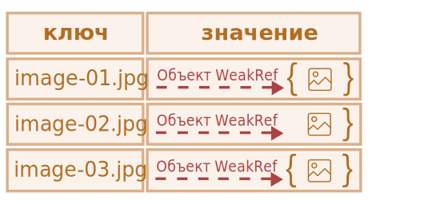
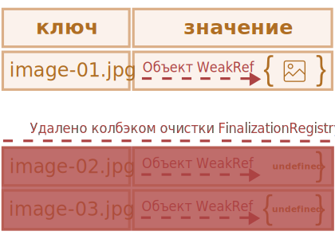

# WeakRef и FinalizationRegistry

```warn header="\"Скрытые\" возможности языка"
В этой статье рассматривается очень узконаправленная тема, с которой большинство разработчиков на практике сталкиваются чрезвычайно редко (а могут и вообще не знать о её существовании).

Мы рекомендуем пропустить эту главу, если вы только начали изучение JavaScript.
```

Вспоминая основную концепцию *принципа достижимости* из главы <info:garbage-collection>, мы можем отметить, что движок JavaScript гарантированно хранит в памяти значения, которые доступны или используются.

Например:

```js
//  в переменной user находится сильная ссылка на объект
let user = { name: "John" };

// перезапишем значение переменной user
user = null;

// ссылка теряется и объект будет удалён из памяти
```

Или же похожий, но немного усложнённый код с двумя сильными ссылками:

```js
//  в переменной user находится сильная ссылка на объект
let user = { name: "John" };

// скопировали сильную ссылку на объект в переменную admin
*!*
let admin = user;
*/!*

// перезапишем значение переменной user
user = null;

// объект всё ещё доступен через переменную admin
```
Объект `{ name: "John" }` удалился бы из памяти только в случае отсутствия сильных ссылок на него (если бы мы также перезаписали значение переменной `admin`).

В JavaScript существует концепция под названием `WeakRef`, которая ведёт себя немного иначе в этом случае.

````smart header="Термины: \"Сильная ссылка\", \"Слабая ссылка\""
**Сильная ссылка** - это ссылка на объект или значение, которая предотвращает их удаление сборщиком мусора. При этом, сохраняя объект или значение в памяти, на которые она указывает.

Это означает, что объект или значение остаются в памяти и не удаляются сборщиком мусора до тех пор, пока на них есть активные сильные ссылки.

В JavaScript стандартные ссылки на объекты являются *сильными* ссылками. Например:
```js
// переменная user содержит сильную ссылку на этот объект.
let user = { name: "John" };
```

**Слабая ссылка** - это ссылка на объект или значение, которая *не* предотвращает их удаление сборщиком мусора. Объект или значение могут быть удалены сборщиком мусора в случае, если на них существуют только слабые ссылки.

````

## WeakRef

````warn header="Предостережение"

Прежде чем мы перейдём к изучению, стоит отметить, что правильное применение структур, о которых пойдёт речь в этой статье, требует очень тщательного обдумывания, и по возможности их использования лучше избегать. 

````

`WeakRef` - это объект, содержащий слабую ссылку на другой объект, называемый `target` или `referent`. 

Особенность `WeakRef` заключается в том, что он не препятствует сборщику мусора удалять свой объект-референт. Другими словами, он просто не удерживает его "в живых".

Теперь давайте возьмём переменную `user` в качестве "референта" и создадим слабую ссылку от неё к переменной `admin`. Чтобы создать слабую ссылку, необходимо использовать конструктор `WeakRef`, передав целевой объект (объект, на который вы хотите создать слабую ссылку). 

В нашем случае — это переменная `user`:

```js
//  в переменной user находится сильная ссылка на объект
let user = { name: "John" };

//  в переменной admin находится слабая ссылка на объект
*!*
let admin = new WeakRef(user);
*/!*
```

На схеме ниже изображены два типа ссылок: сильная ссылка с использованием переменной `user` и слабая ссылка с использованием переменной `admin`:

  

Затем, в какой-то момент, мы перестаём использовать переменную `user` - она перезаписывается, выходит из области видимости и т.д., при этом сохраняя экземпляр `WeakRef` в переменной `admin`:

```js
// перезапишем значение переменной user
user = null;
```

Слабой ссылки на объект недостаточно, чтобы сохранить его "в живых". Когда единственными оставшимися ссылками на объект-референт являются слабые ссылки, сборщик мусора вправе уничтожить этот объект и использовать его память для чего-то другого.

Однако до тех пор, пока объект фактически не уничтожен, слабая ссылка может вернуть его, даже если на данный объект больше нет сильных ссылок. То есть наш объект становится своеобразным "[котом Шрёдингера](https://ru.wikipedia.org/wiki/Кот_Шрёдингера)" - мы не можем знать точно, "жив" он или "мёртв":


На этом этапе, чтобы получить объект из экземпляра `WeakRef`, мы воспользуемся его методом `deref()`.

Метод `deref()` возвращает объект-референт, на который ссылается `WeakRef`, в случае, если объект всё ещё находится в памяти. Если объект был удалён сборщиком мусора, - метод `deref()` вернёт `undefined`:

```js
let ref = admin.deref();

if (ref) { 
  // объект всё ещё доступен: можем произвести какие-либо манипуляции с ним
} else {
  // объект был удалён сборщиком мусора
}
```

## Варианты использования WeakRef

`WeakRef` обычно используется для создания кешей или
[ассоциативных массивов](https://ru.wikipedia.org/wiki/Ассоциативный_массив), в которых хранятся ресурсоёмкие объекты. Это позволяет избежать предотвращение удаления этих объектов сборщиком мусора только на основе их присутствия в кеше или ассоциативном массиве.

Один из основных примеров - это ситуация, когда у нас есть большое количество объектов бинарных изображений (например, представленных в виде `ArrayBuffer` или `Blob`),
и мы хотим связать имя или путь с каждым изображением. Существующие структуры данных не совсем подходят для этих целей:

- Использование `Map` для создания ассоциаций между именами и изображениями, или наоборот, сохранит объекты изображений в памяти,
  поскольку они фигурируют в `Map` в качестве ключей или значений.
- `WeakMap` также не подойдёт в этом случае: из-за того, что объекты, представленные в качестве ключей `WeakMap` используют слабые ссылки, и не защищены от удаления сборщиком мусора.

Но, в данной ситуации нам нужна структура данных, которая бы использовала слабые ссылки в своих значениях.

Для этого мы можем использовать коллекцию `Map`, значениями которой являются экземпляры `WeakRef`, ссылающиеся на нужные нам большие объекты. Следовательно, мы не будем хранить в памяти эти большие и ненужные объекты дольше, чем требуется.

В противном случае это способ получить объект изображения из кеша, если он всё ещё доступен.
Если же он был удалён сборщиком мусора, мы сгенерируем или скачаем его заново.

Таким образом, в некоторых ситуациях используется меньше памяти.  

## Пример №1: применение WeakRef для кеширования

Ниже находится фрагмент кода, который демонстрирует технику использования `WeakRef`.

Говоря кратко, мы используем `Map` со строковыми ключами и объектами `WeakRef` в качестве их значений. Если объект `WeakRef` не был удалён сборщиком мусора, мы берём его из кеша. В противном случае мы скачиваем его заново и помещаем в кеш для возможности повторного использования в будущем:

```js
function fetchImg() {
  // абстрактная функция для загрузки изображений...
}

function weakRefCache(fetchImg) { // (1)
  const imgCache = new Map(); // (2)
  
  return (imgName) => { // (3)
    const cachedImg = imgCache.get(imgName); // (4)
    
    if (cachedImg?.deref()) { // (5)
      return cachedImg?.deref();
    }

    const newImg = fetchImg(imgName); // (6)
    imgCache.set(imgName, new WeakRef(newImg)); // (7)

    return newImg;
  };
}

const getCachedImg = weakRefCache(fetchImg);
```

Давайте подробно разберём всё, что тут произошло:

1. `weakRefCache` - функция высшего порядка, которая принимает другую функцию `fetchImg` в качестве аргумента. В данном примере мы можем пренебречь подробным описанием функции `fetchImg`, так как это может быть абсолютно любая логика скачивания изображений.
2. `imgCache` - кеш изображений, который хранит кешированные результаты функции `fetchImg`, в виде строковых ключей (имя изображения) и объектов `WeakRef` в качестве их значений.
3. Возвращаем анонимную функцию, которая принимает имя изображения в качестве аргумента. Данный аргумент будет использоваться в качестве ключа для кешированного изображения.
4. Пытаемся получить кешированный результат из кеша, используя предоставленный ключ (имя изображения).
5. Если кеш содержит значение по указанному ключу, и объект `WeakRef` не был удалён сборщиком мусора, возвращаем кешированный результат.
6. Если в кеше нет записи с запрошенным ключом, либо метод `deref()` возвращает `undefined` (что означает, что объект `WeakRef` был удалён сборщиком мусора), функция `fetchImg` скачивает изображение заново.
7. Помещаем скачанное изображение в кеш в виде `WeakRef` объекта.


Теперь у нас есть коллекция `Map`, в которой ключи - это имена изображений в виде строк, а значения - это объекты `WeakRef`, содержащие сами изображения.

Эта техника помогает избежать выделения большого объёма памяти на ресурсоёмкие объекты, которые больше никто не использует. Также она экономит память и время в случае повторного использования кешированных объектов.

Вот визуальное представление того, как выглядит этот код:

 

Но, у данной реализации есть свои недостатки: со временем `Map` будет заполняться строками в качестве ключей, которые указывают на `WeakRef`, чей объект-референт уже был удалён сборщиком мусора:


Один из способов справиться с этой проблемой - это периодически проверять кеш и удалять "мёртвые" записи. Другой способ - использовать финализаторы, с которыми мы ознакомимся далее.  

## Пример №2: применение WeakRef для отслеживания объектов DOM

Ещё один вариант использования `WeakRef` – отслеживание объектов DOM.

Давайте представим ситуацию, когда какой-либо сторонний код или библиотека работают с элементами на нашей странице до тех пор, пока они существуют в DOM. Например, это может быть сторонняя утилита для мониторинга и оповещений о состоянии системы (так называемый "логгер" - программа, которая присылает информационные сообщения, называемые "логами").

Интерактивный пример:

[codetabs height=420 src="weakref-dom"]

При нажатии на кнопку "Начать отправку сообщений", в так называемом "окне отображения логов" (элемент с классом `.window__body`) начинают появляться надписи (логи).

Но, как только этот элемент удалится из DOM, логгер должен перестать присылать сообщения. Чтобы воспроизвести удаление данного элемента, достаточно лишь нажать на кнопку "Закрыть" в правом верхнем углу.

Для того, чтобы нам не усложнять работу, и не уведомлять сторонний код каждый раз, когда наш DOM-элемент доступен, а когда - нет, достаточно будет создать на него слабую ссылку с помощью `WeakRef`.

После того как элемент будет удалён из DOM, логгер это увидит и перестанет присылать сообщения.

Теперь давайте рассмотрим исходный код детальнее (вкладка `index.js`):

1. Получаем DOM-элемент кнопки "Начать отправку сообщений".
2. Получаем DOM-элемент кнопки "Закрыть".
3. Получаем DOM-элемент окна отображения логов с использованием конструктора `new WeakRef()`. Таким образом переменная `windowElementRef` хранит слабую ссылку на DOM-элемент.
4. Добавляем обработчик событий на кнопку "Начать отправку сообщений", отвечающий за запуск логгера по нажатию.
5. Добавляем обработчик событий на кнопку "Закрыть", отвечающий за закрытие окна отображения логов по нажатию.
6. С помощью `setInterval` запускаем отображение нового сообщения каждую секунду.
7. Если DOM-элемент окна отображения логов всё ещё доступен и находится в памяти, создаём и отправляем новое сообщение.
8. Если метод `deref()` возвращает `undefined`, это значит, что DOM-элемент был удалён из памяти. В таком случае логгер прекращает показ сообщений и сбрасывает таймер.
9. `alert`, который будет вызван после того, как DOM-элемент окна отображения логов удалится из памяти (т.е. после нажатия на кнопку "Закрыть"). **Обратите внимание, что удаление из памяти может произойти не сразу, т.к оно зависит только от внутренних механизмов сборщика мусора.**

    Мы не можем контролировать этот процесс напрямую из кода. Но, несмотря на это, у нас всё ещё есть возможность выполнить принудительную сборку мусора из бразуера. 

    В Google Chrome, например, для этого нужно открыть инструменты разработчика (`key:Ctrl` + `key:Shift` + `key:J` на Windows/Linux или `key:Option` + `key:⌘` + `key:J` на macOS), перейти во вкладку "Производительность (Performance)" и нажать на кнопку с иконкой урны - "Собрать мусор (Collect garbage)":

    

    Данный функционал поддерживается в большинстве современных браузеров. После проделанных действий <code>alert</code> сработает незамедлительно.

## FinalizationRegistry

А теперь пришло время поговорить о финализаторах. Прежде чем мы перейдём дальше, давайте разберёмся с терминологией:

**Колбэк очистки (финализатор)** - это функция, которая выполняется в случае, если объект, зарегистрированный в `FinalizationRegistry`, удаляется из памяти сборщиком мусора. 

Его цель - предоставить возможность выполнения дополнительных операций, связанных с объектом, после его окончательного удаления из памяти.

**Реестр** (или `FinalizationRegistry`) - это специальный объект в JavaScript, который управляет регистрацией и отменой регистрации объектов и их колбэков очистки.

Этот механизм позволяет зарегистрировать объект для отслеживания и связать с ним колбэк очистки. По сути, это структура, которая хранит информацию о зарегистрированных объектах и их колбэках очистки, а затем автоматически вызывает эти колбэки при удалении объектов из памяти.

Для создания экземпляра реестра `FinalizationRegistry`, необходимо вызвать его конструктор,
который принимает единственный аргумент - колбэк очистки (финализатор).

Синтаксис:

```js
function cleanupCallback(heldValue) { 
  // код колбэка очистки 
}

const registry = new FinalizationRegistry(cleanupCallback);
```

Здесь:

- `cleanupCallback` - колбэк очистки, который будет автоматически вызван при удалении зарегистрированного объекта из памяти.
- `heldValue` - значение, которое передаётся в качестве аргумента для колбэка очистки. Если `heldValue` является объектом, реестр сохраняет на него сильную ссылку.
- `registry` - экземпляр `FinalizationRegistry`.

Методы `FinalizationRegistry`:

- `register(target, heldValue [, unregisterToken])` - используется для регистрации объектов в реестре.

  `target` - регистрируемый для отслеживания объект. Если `target` будет удалён сборщиком мусора, колбэк очистки будет вызван с `heldValue` в качестве аргумента.

  Опциональный `unregisterToken` - токен отмены регистрации. Может быть передан для отмены регистрации до удаления объекта сборщиком мусора. Обычно в качестве `unregisterToken` используется объект `target`, что является стандартной практикой.
- `unregister(unregisterToken)` - метод `unregister` используется для отмены регистрации объекта в реестре. Он принимает один аргумент - `unregisterToken` (токен отмены регистрации, который был получен при регистрации объекта).  

Теперь перейдём к простому примеру. Воспользуемся уже известным нам объектом `user` и создадим экземпляр `FinalizationRegistry`:

```js
let user = { name: "John" };

const registry = new FinalizationRegistry((heldValue) => {
  console.log(`${heldValue} был собран сборщиком мусора.`);
});
```

Затем зарегистрируем объект, для которого требуется колбэк очистки, вызвав метод `register`:

```js
registry.register(user, user.name);
```

Реестр не хранит сильную ссылку на регистрируемый объект, так как это бы противоречило его предназначению. Если бы реестр сохранял сильную ссылку, то объект никогда бы не был очищен сборщиком мусора.

Если же объект удаляется сборщиком мусора, наш колбэк очистки может быть вызван в какой-то момент в будущем, с переданным ему `heldValue`:

```js
// Когда объект user удалится сборщиком мусора, в консоль будет выведено сообщение:
"John был собран сборщиком мусора."
```

Также существуют ситуации, когда даже в реализациях, где используется колбэк очистки, есть вероятность, что он не будет вызван.
  
Например:
- Когда программа полностью завершает свою работу (например, при закрытии вкладки в браузере). 
- Когда сам экземпляр `FinalizationRegistry` больше не доступен для JavaScript кода.
  Если объект, создающий экземпляр `FinalizationRegistry`, выходит из области видимости или удаляется, то колбэки очистки, зарегистрированные в этом реестре, также могут быть не вызваны.

## Кеширование с FinalizationRegistry

Возвращаясь к нашему примеру *слабого* кеша, мы можем заметить следующее:  
- Несмотря на то, что значения, обёрнутые в `WeakRef`, были собраны сборщиком мусора, всё ещё актуальна проблема "утечки памяти" в виде оставшихся ключей, значения которых были собраны сборщиком мусора.

Вот улучшенный пример кеширования, в котором используется `FinalizationRegistry`:

```js
function fetchImg() {
  // абстрактная функция для загрузки изображений...
}

function weakRefCache(fetchImg) {
  const imgCache = new Map();

  *!*
  const registry = new FinalizationRegistry((imgName) => { // (1)
    const cachedImg = imgCache.get(imgName);
    if (cachedImg && !cachedImg.deref()) imgCache.delete(imgName);
  });
  */!*

  return (imgName) => {
    const cachedImg = imgCache.get(imgName);
    
    if (cachedImg?.deref()) {
      return cachedImg?.deref();
    }

    const newImg = fetchImg(imgName);
    imgCache.set(imgName, new WeakRef(newImg));
    *!*
    registry.register(newImg, imgName); // (2)
    */!*

    return newImg;
  };
}

const getCachedImg = weakRefCache(fetchImg);
```

1. Для управления очисткой "мёртвых" записей в кеше, когда связанные с ними объекты `WeakRef` собираются сборщиком мусора, создаём реестр очистки `FinalizationRegistry`.

    Важным моментом здесь является то, что в колбэке очистки должно проверяться, была ли запись удалена сборщиком мусора и не была ли добавлена заново, чтобы не удалить "живую" запись.
2.  После загрузки и установки нового значения (изображения) в кеш, регистрируем его в реестре финализатора для отслеживания объекта `WeakRef`.

Данная реализация содержит только актуальные или "живые" пары ключ/значение.
В этом случае каждый объект `WeakRef` зарегистрирован в `FinalizationRegistry`.
А после того, как объекты будут очищены сборщиком мусора, колбэк очистки удалит все значения `undefined`.

Вот визуальное представление обновлённого кода:



Ключевым аспектом в обновлённой реализации является то, что финализаторы позволяют создавать параллельные процессы между "основной" программой и колбэками очистки. В контексте JavaScript, "основная" программа - это наш JavaScript-код, который запускается и выполняется в нашем приложении или на веб-странице.

Следовательно, с момента, когда объект помечается для удаления сборщиком мусора, до фактического выполнения колбэка очистки, может возникнуть определённый промежуток времени. Важно понимать, что в этом временном интервале основная программа может внести любые изменения в объект или даже вернуть его обратно в память.

Поэтому, в колбэке очистки мы должны проверить, не была ли запись добавлена обратно в кеш основной программой, чтобы избежать удаления "живых" записей. Аналогично, при поиске ключа в кеше существует вероятность того, что значение было удалено сборщиком мусора, но колбэк очистки ещё не был выполнен.

Такие ситуации требуют особого внимания, если вы работаете с `FinalizationRegistry`.

## Использование WeakRef и FinalizationRegistry на практике

Переходя от теории к практике, представьте себе реальный сценарий, когда пользователь синхронизирует свои фотографии на мобильном устройстве
с каким-либо облачным сервисом (таким как [iCloud](https://ru.wikipedia.org/wiki/ICloud) или [Google Photos](https://ru.wikipedia.org/wiki/Google_Фото)), и хочет просматривать их с других устройств. Подобные сервисы помимо основного функционала просмотра фотографий, предлагают массу дополнительных возможностей, например:

- Редактирование фотографий и видео эффекты.
- Создание "воспоминаний" и альбомов. 
- Монтаж видео из серии фотографий. 
- ...и многое другое.

В качестве примера здесь мы будем использовать достаточно примитивную реализацию подобного сервиса. Основная суть — показать возможный сценарий совместного использования `WeakRef` и `FinalizationRegistry` в реальной жизни.

Вот как это выглядит:


В левой части находится облачная библиотека фотографий (они отображаются в виде миниатюр). Мы можем выбрать нужные нам изображения и создать коллаж, нажав на кнопку "Create collage" в правой части страницы. Затем, получившийся результат можно будет скачать в виде изображения.

Для увеличения скорости загрузки страницы разумно будет загружать и показывать миниатюры фотографий именно в *сжатом* качестве. Но, для создания коллажа из выбранных фотографий, загружать и использовать их в *полноразмерном* качестве.

Ниже мы видим, что внутренний размер миниатюр составляет 240×240 пикселей. Размер был выбран специально для увеличения скорости загрузки. Кроме того, нам не нужны полноразмерные фотографии в режиме предпросмотра.


Предположим, что нам нужно создать коллаж из 4 фотографий: мы выбираем их, после чего нажимаем кнопку "Create collage".
На этом этапе уже известная нам функция <code>weakRefCache</code> проверяет, есть ли нужное изображение в кеше. Если нет, то скачивает его из облака и помещает в кеш для возможности дальнейшего использования. И так происходит для каждого выбранного изображения:


Обратив внимание на вывод в консоли можно увидеть, какие из фотографий были загружены из облака - на это указывает <span style="background-color:#133159;color:white;font-weight:500">FETCHED_IMAGE</span>. Так как это первая попытка создания коллажа, это означает, что на данном этапе "слабый кеш" ещё был пуст, а все фотографии были скачаны из облака и помещены в него.  

Но, наряду с процессом загрузки изображений, происходит ещё и процесс очистки памяти сборщиком мусора. Это означает, что хранящийся в кеше объект, на который мы ссылаемся используя слабую ссылку, удаляется сборщиком мусора. И наш финализатор выполняется успешно, тем самым удаляя ключ, по которому изображение хранилось в кеше. Об этом нас уведомляет <span style="background-color:#901e30;color:white;font-weight:500;">CLEANED_IMAGE</span>:

  

Далее мы понимаем, что нам не нравится получившийся коллаж, и решаем изменить одно из изображений и создать новый. Для этого достаточно снять выделение с ненужного изображения, выбрать другое, и ещё раз нажать на кнопку "Create collage":

  

Но, на этот раз не все изображения были скачаны из сети, и одно из них было взято из слабого кеша: об этом нам говорит сообщение <span style="background-color:#385950;color:white;font-weight:500;">CACHED_IMAGE</span>. Это означает, что на момент создания коллажа сборщик мусора ещё не удалил наше изображение, и мы смело взяли его из кеша,
тем самым сократив количество сетевых запросов и ускорив общее время процесса создания коллажа:


Давайте ещё немного "поиграем", заменив одно из изображений ещё раз и создав новый коллаж:

  

На этот раз результат ещё более внушительный. Из 4 выбранных изображений, 3 из них были взяты из слабого кеша, и только одно пришлось скачать из сети.
Снижение нагрузки на сеть составило около 75%. Впечатляет, не правда ли?


Конечно, не следует забывать, что такое поведение не является гарантированным, и зависит от конкретной реализации и работы сборщика мусора.

Исходя из этого, сразу же возникает вполне логичный вопрос: почему бы нам не использовать обычный кеш, где мы можем сами управлять его сущностями, а не полагаться на сборщик мусора? Всё верно, в большинстве случаев нет необходимости использовать `WeakRef` и `FinalizationRegistry`.

Здесь мы просто продемонстрировали альтернативную реализацию подобного функционала, используя нетривиальный подход с интересными особенностями языка. Всё же, мы не можем полагаться на этот пример, если нам необходим постоянный и предсказуемый результат.  

Вы можете [открыть данный пример в песочнице](sandbox:weakref-finalizationregistry).

## Итого

`WeakRef` - предназначен для создания слабых ссылок на объекты, что позволяет им быть удалёнными из памяти сборщиком мусора, если на них больше нет сильных ссылок. Это полезно для решения проблемы чрезмерного использования памяти и оптимизации использования системных ресурсов в приложениях.

`FinalizationRegistry` - это средство регистрации колбэков, которые выполняются при уничтожении объектов, на которые больше нет сильных ссылок. Это позволяет освобождать связанные с объектом ресурсы или выполнять другие необходимые операции перед удалением объекта из памяти.
