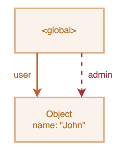
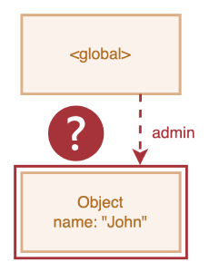
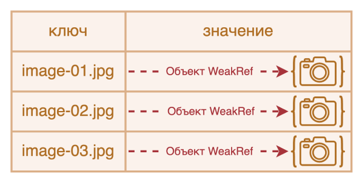
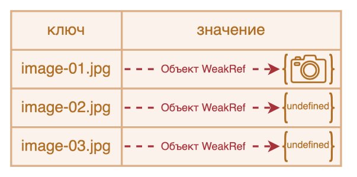
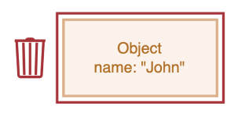

# WeakRef и FinalizationRegistry

```warn header="Базовые знания DOM"
Прочтение этой главы требует базовых знаний в DOM, так как она содержит примеры его использования
```

Вспоминая основную концепцию принципа *достижимости* из главы <info:garbage-collection>,
мы можем отметить, что движок JavaScript гарантированно хранит в памяти значения, которые доступны или используются.

````smart header="Термины: \"Сильная ссылка\", \"Слабая ссылка\""
**Сильная ссылка** - это ссылка на объект или значение, которая предотвращает их удаление сборщиком мусора.
При этом, сохраняя объект или значение в памяти, на которые она указывает.
Это означает, что объект или значение остаются в памяти и не удаляются сборщиком мусора, пока на них есть активные сильные ссылки.
В JavaScript стандартные ссылки на объекты являются сильными ссылками. Например:
```js
// переменная user содержит сильную ссылку на этот объект.
let user = { name: "John" };
```

**Слабая ссылка** - это ссылка на объект или значение, которая не предотвращает сборку мусора.
Если на объект или значение существуют только слабые ссылки, они могут быть удалены сборщиком мусора.
````

Например:

```js
//  в переменной user находится сильная ссылка на объект
let user = { name: "John" };

// перезапишем значение переменной user
user = null;

// ссылка теряется и объект будет удалён из памяти
```
Или же, похожий, но немного усложнённый пример с двумя сильными ссылками.
Теперь мы скопировали ссылку из `user` в переменную `admin`.
В этом случае объект `John` имеет две сильные ссылки, ссылающиеся на него - `user` и `admin`:

```js
//  в переменной user находится сильная ссылка на объект
let user = { name: "John" };

// скопировали сильную ссылку на объект в переменную admin
*!*
let admin = user;
*/!*

// перезапишем значение переменной user
user = null;

// объект всё ещё доступен через глобальную переменную admin
```
Объект `John` удалился бы из памяти только в случае отсутствия сильных ссылок на него (если бы мы также перезаписали значение переменной `admin`).

В JavaScript существует концепция под названием `WeakRef`, которая ведёт себя немного иначе в этом случае.

## WeakRef

````warn header="Предостережение"

Прежде чем мы перейдём к изучению, стоит отметить, что правильное использование структур, о которых пойдёт речь в этой статье, требует очень тщательного обдумывания, и по возможности их лучше избегать. 

````

`WeakRef` - это объект, содержащий слабую ссылку на другой объект, называемый `target` или `referent`,
который не препятствует сборщику мусора удалять указанный объект.
Другими словами, объект `WeakRef` не удерживает "в живых" объект-референт.  

Теперь давайте возьмём переменную `user` в качестве референта и создадим слабую ссылку от `user` к переменной `admin`.
Чтобы создать слабую ссылку, необходимо использовать конструктор `WeakRef`,
передав целевой объект (объект, на который вы хотите создать слабую ссылку), в нашем случае это переменная `user`:

```js
//  в переменной user находится сильная ссылка на объект
let user = { name: "John" };

//  в переменной admin находится слабая ссылка на объект
*!*
let admin = new WeakRef(user);
*/!*
```

На схеме ниже изображены два типа ссылок: сильная ссылка с использованием переменной `user` и слабая ссылка с использованием переменной `admin`.

  

Затем, в какой-то момент, мы перестаём использовать переменную `user` - она перезаписывается,
выходит из области видимости и т.д., при этом сохраняя экземпляр `WeakRef` в переменной `admin`:

```js
// перезапишем значение переменной user
user = null;
```

Слабой ссылки на объект недостаточно для того, чтобы сохранить его "в живых".
Когда единственными оставшимися ссылками на референт являются слабые ссылки,
сборщик мусора вправе уничтожить объект и использовать его память для чего-то другого.
Однако до тех пор, пока объект фактически не уничтожен, слабая ссылка может вернуть объект, даже если на него больше нет сильных ссылок.
То есть наш объект становится своеобразным "[котом Шрёдингера](https://ru.wikipedia.org/wiki/Кот_Шрёдингера)". Мы не можем точно знать, "жив" он или "мёртв":



На этом этапе, чтобы получить объект из экземпляра `WeakRef`, нам нужно использовать его метод `deref()`.
Метод `deref()` возвращает объект-референт, на который ссылается `WeakRef`, в случае, если объект всё ещё находится в памяти.
Если объект был удалён сборщиком мусора, метод `deref()` вернёт `undefined`:

```js
let ref = admin.deref();

if (ref) {
  // сделать что-нибудь со значением ref
}
```

## Варианты использования WeakRef

`WeakRef` обычно используется для создания кешей или
[ассоциативных массивов](https://ru.wikipedia.org/wiki/%D0%90%D1%81%D1%81%D0%BE%D1%86%D0%B8%D0%B0%D1%82%D0%B8%D0%B2%D0%BD%D1%8B%D0%B9_%D0%BC%D0%B0%D1%81%D1%81%D0%B8%D0%B2), в которых хранятся ресурсоёмкие объекты.
Это позволяет избежать предотвращение удаления этих объектов сборщиком мусора только на основе их присутствия в кеше или ассоциативном массиве.
Одним из основных примеров является ситуация, когда у нас есть большое количество объектов бинарных изображений (например, представленных в виде `ArrayBuffer` или `Blob`),
и мы хотим связать имя или путь с каждым изображением. Существующие структуры данных не совсем подходят для этих целей:

- Использование `Map` для создания ассоциаций между именами и изображениями, или наоборот, сохранит объекты изображений в памяти,
  поскольку они фигурируют в `Map` в качестве ключей или значений.
- `WeakMap` также не подходит для этой цели: так как объекты применяемые в качестве ключей `WeakMap` используют слабые ссылки, и не защищены от удаления сборщиком мусора.
Но, в данном случае нам нужна структура данных, которая бы использовала слабые ссылки в своих значениях.

Вместо этого мы можем использовать `Map`, значениями которого являются объекты `WeakRef`, ссылающиеся на нужные нам большие объекты.
Следовательно, мы не будем хранить в памяти эти большие и ненужные объекты дольше, чем требуется.
В противном случае это способ получить объект изображения из кеша, если он всё ещё доступен.
Если же он был удалён сборщиком мусора, мы сгенерируем или скачаем его заново.

Таким образом, в некоторых ситуациях используется меньше памяти.  

## Пример №1: применение WeakRef для кеширования

Ниже находится фрагмент кода, который демонстрирует технику использования `WeakRef`.
Говоря кратко, мы используем `Map` со строковыми ключами и объектами `WeakRef` в качестве их значений.
Если объект `WeakRef` не был удалён сборщиком мусора, мы берём его из кеша.
В противном случае мы скачиваем его заново и помещаем в кеш для возможности повторного использования в будущем:

```js
const fetchImg = () => {
  // абстрактная функция для загрузки изображений...
}

const weakRefCache = (fetchImg) => { // (1)
  const imgCache = new Map(); // (2)
  
  return (imgName) => { // (3)
    const cachedImg = imgCache.get(imgName); // (4)
    
    if (cachedImg?.deref()) { // (5)
      return cachedImg?.deref();
    }

    const newImg = fetchImg(imgName); // (6)
    imgCache.set(imgName, new WeakRef(newImg)); // (7)

    return newImg;
  };
};

const getCachedImg = weakRefCache(fetchImg);
```

Давайте подробно разберём всё, что тут произошло:
- `(1)` `weakRefCache` - функция высшего порядка, которая принимает другую функцию `fetchImg` в качестве аргумента. В данном примере мы можем пренебречь деталями имплементации функции
`fetchImg`. Так как это может быть абсолютно любая логика по скачиванию изображений.
- `(2)` `imgCache` - кеш изображений, который хранит кешированные результаты функции `fetchImg`, в виде строковых ключей (имя изображения) и объектов `WeakRef` в качестве их значений.
- `(3)` Возвращаем анонимную функцию, которая принимает имя изображения в качестве аргумента. Данный аргумент будет использоваться в качестве ключа для кешированного изображения.
- `(4)` Пытаемся получить кешированный результат из кеша, используя предоставленный ключ (имя изображения).
- `(5)` Если кеш содержит значение по указанному ключу, и объект `WeakRef` не был удалён сборщиком мусора, возвращаем закешированный результат.
- `(6)` Если в кеше нет записи с запрошенным ключом, либо метод `deref()` возвращает `undefined`, что означает, что объект `WeakRef` был удалён сборщиком мусора,
  функция `fetchImg` скачивает изображение заново.
- `(7)` Помещаем скачанное изображение в кеш в виде `WeakRef` объекта.  

Теперь у нас есть коллекция `Map`, в которой ключи - это имена изображений в виде строк, а значения - это объекты `WeakRef`, содержащие сами изображения.
Эта техника помогает избежать выделения большого объёма памяти на ресурсоёмкие объекты, которые больше никто не использует.
Также она экономит память и время в случае повторного использования кешированных объектов.

Вот визуальное представление того, как выглядит этот код:

 

Но, у данной реализации есть свои недостатки: со временем `Map` будет заполняться строками в качестве ключей,
которые указывают на `WeakRef`, чей объект-референт уже был удалён сборщиком мусора:



Один из способов справиться с этой проблемой - это периодически проверять кеш и удалять "мёртвые" записи.
Другой способ - использование финализаторов, с которыми мы ознакомися далее.  

## Пример №2: применение WeakRef для отслеживания объектов DOM

Ещё один вариант использования `WeakRef` – отслеживание объектов DOM.
Давайте представим ситуацию, когда какой-либо сторонний код или библиотека работает с элементами на нашей странице до тех пор, пока они существуют в DOM.
Например, это может быть какая-то условная сторонняя утилита для мониторинга и оповещений о состоянии системы.
Так называемый "логгер", программа, которая присылает информационные сообщения, называемые логами.
При нажатии на кнопку "Start messages", логгер начинает отображение сообщений в DOM элемент с классом `.window__body` с помощью методов вставки из главы: <info:modifying-document#metody-vstavki>.
Назовём этот DOM элемент - окно отображения логов.  

Но, как только элемент удаляется из DOM, логгер должен перестать присылать сообщения.
Для закрытия окна отображения логов достаточно нажать кнопку "Close", это удалит DOM элемент.
Для того чтобы нам не усложнять нашу работу, и не уведомлять сторонний код каждый раз, когда наш DOM элемент доступен и когда он удалён, достаточно лишь сослаться на него с помощью `WeakRef`, тем самым создав на него слабую ссылку.
После того как элемент будет удалён из DOM, логгер это увидит и через какое-то время перестанет присылать сообщения.

[codetabs height=420 src="weakref-dom"]  

Давайте подробно разберём всё, что тут произошло:

*Вкладка: `index.js`*

- `(1)`, `(2)` Получаем DOM элементы кнопок "Start messages" и "Close".
- `(3)` Получаем DOM элемент окна отображения логов с использованием конструктора `new WeakRef()`. Таким образом переменная `windowElementRef` хранит слабую ссылку на DOM элемент.
- `(4)`, `(5)` Добавляем обработчики событий на кнопки "Start messages" и "Close", отвечающие за запуск логгера и закрытие окна отображения логов.
- `(6)` С помощью функции `setInterval` запускаем отображение нового сообщения каждую секунду.
- `(7)` Если DOM элемент окна отображения логов всё ещё доступен и находится в памяти, создаём и отправляем новое сообщение.
- `(8)` Если метод `deref()` возвращает `undefined`, это значит что DOM элемент был удалён из памяти. В таком случае логгер прекращает показ сообщений и очищает таймер.
- `(9)` Обратите внимание, что данный `alert()` будет вызван только в том случае, когда сборщик мусора удалит из памяти объект окна отображения логов который ссылается на DOM элемент.
  Это может произойти не сразу и зависит только от внутренних механизмов сборщика мусора. 

P.S. Некоторые браузеры, например Google Chrome, позволяют выполнить принудительную сборку мусора.
Для этого, откройте инструменты разработчика (`key:Option` + `key:⌘` + `key:J` на macOS, или `key:Shift` + `key:Ctrl` + `key:J` на Windows/Linux),
и перейдите на вкладку "Производительность (Performance)".
Затем, нажмите на кнопку с иконкой урны - "Собрать мусор (Collect garbage)", что б выполнить принудительную сборку мусора.


## FinalizationRegistry

Прежде чем мы двинемся дальше, давайте разберёмся с терминологией.

**Колбэк очистки (финализатор)** - это функция, которая выполняется когда объект, зарегистрированный в `FinalizationRegistry` удаляется из памяти сборщиком мусора.
Его цель - предоставить возможность выполнения дополнительных операций, связанных с объектом, после его окончательного удаления из памяти.

**Реестр** (или `FinalizationRegistry`) - это специальный объект в JavaScript, который управляет регистрацией и отменой регистрации объектов и их колбэков очистки.
Этот механизм позволяет зарегистрировать объект для отслеживания и связать с ним колбэк очистки.
По сути, это структура, которая хранит информацию о зарегистрированных объектах и их колбэках очистки, а затем автоматически вызывает эти колбэки при удалении объектов из памяти.

Для создания экземпляра реестра `FinalizationRegistry`, необходимо вызвать его конструктор,
который принимает единственный аргумент - колбэк очистки (финализатор).   
Синтаксис:

```js
const cleanupCallback = (heldValue) => { /* код колбэка очистки */ };

const registry = new FinalizationRegistry(callback);
```

Здесь:

- `cleanupCallback` - колбэк очистки, который будет автоматически вызван при удалении зарегистрированного объекта из памяти.
  - `heldValue` - произвольное значение, которое передаётся в качестве аргумента для колбэка очистки.
    Может быть любого типа: примитив, объект, даже `null` или `undefined`. Если `heldValue` является объектом, реестр сохраняет на него сильную ссылку.
  - `registry` - экземпляр `FinalizationRegistry`, создаваемый с помощью оператора `new`.

Методы `FinalizationRegistry`:

- `register(target, heldValue [,unregisterToken ])` - метод `register` используется для регистрации объектов в реестре.
`target` - регистрируемый для отслеживания объект. Если `target` будет удалён сборщиком мусора, колбэк очистки будет вызван с `heldValue` в качестве аргумента.
Опциональный `unregisterToken` - токен отмены регистрации. Может быть передан для отмены регистрации до удаления объекта сборщиком мусора.
Обычно в качестве `unregisterToken` используется объект `target`, что является стандартной практикой.
- `unregister(unregisterToken)` - метод `unregister` используется для отмены регистрации объекта в реестре.
Он принимает один аргумент - `unregisterToken`, токен отмены регистрации, который был получен при регистрации объекта.  

Пример использования `FinalizationRegistry`:

```js
let user = { name: "John" };

const registry = new FinalizationRegistry((heldValue) => {
  console.log(`${heldValue} has been garbage collected.`);
});
```

Затем, мы регистрируем объект для которого требуется колбэк очистки, вызывая метод `register`.
Реестр не хранит сильную ссылку на регистрируемый объект, так как это противоречило бы цели (если бы реестр сохранял сильную ссылку на объект, то объект никогда бы не был очищен сборщиком мусора).

```js
registry.register(user, user.name);
```

Если объект был удалён сборщиком мусора, наш колбэк очистки может быть вызван в какой-то момент в будущем с переданным ему `heldValue`.



```js
// Когда объект user будет удалён сборщиком мусора, в консоль будет выведено сообщение:
"John has been garbage collected."
```

Также существуют ситуации, когда даже в реализациях, которые обычно вызывают колбэк очистки, есть вероятность, что они не будут вызваны.  
Например:
- Когда программа полностью завершает свою работу (например, при закрытии вкладки в браузере). 
- Когда сам экземпляр `FinalizationRegistry` больше не доступен для JavaScript кода.
  Если объект, создающий экземпляр `FinalizationRegistry`, выходит из области видимости или удаляется, то колбэки очистки, зарегистрированные в этом реестре, также могут быть не вызваны.

## Совместное использование WeakRef и FinalizationRegistry

Возвращаясь к нашему примеру [слабого кеша](#primer-primenenie-weakref-dlya-keshirovaniya), мы можем заметить следующее:  
- Несмотря на то, что значения, обёрнутые в `WeakRef`, были собраны сборщиком мусора,
всё ещё актуальна проблема "утечки памяти" в виде оставшихся ключей, значения которых были собраны сборщиком мусора.

Вот улучшенный пример слабого кеша, в котором используется `FinalizationRegistry`:

```js
const fetchImg = () => {
  // абстрактная функция для загрузки изображений...
}

const weakRefCache = (fetchImg) => {
  const imgCache = new Map();
  *!*
  const registry = new FinalizationRegistry((imgName) => { // (1)
    const cachedImg = imgCache.get(imgName);
    if (cachedImg && !cachedImg.deref()) imgCache.delete(imgName);
  });
  */!*
  
  return (imgName) => {
    const cachedImg = imgCache.get(imgName);
    
    if (cachedImg?.deref()) {
      return cachedImg?.deref();
    }

    
    const newImg = fetchImg(imgName);
    imgCache.set(imgName, new WeakRef(newImg));
    *!*
    registry.register(newImg, imgName); // (2)
    */!*

    return newImg;
  };
};

const getCachedImg = weakRefCache(fetchImg);
```

- `(1)` Для управления очисткой "мёртвых" записей в кеше, когда связанные с ними объекты `WeakRef` собираются сборщиком мусора, создаём реестр очистки с использованием конструктора `FinalizationRegistry()`.
  Важным моментом здесь является то, что колбэк должен проверить, что запись была удалена сборщиком мусора и не была добавлена заново, чтобы не удалить "живую" запись.
- `(2)` После загрузки и установки нового значения (изображения) в кеш, регистрируем его в реестре финализатора для отслеживания объекта `WeakRef`.

Данная реализация содержит только актуальные или «живые» пары ключ/значение.
В этом случае каждый объект `WeakRef` зарегистрирован в `FinalizationRegistry`.
А после того, как объекты будут очищены сборщиком мусора, колбэк очистки удалит все значения `undefined`.

Вот визуальное представление обновлённого кода:


Важным моментом в реализации выше является то, что финализаторы позволяют создавать параллельные процессы между "основной" программой и колбэками очистки.
В контексте JavaScript, "основная" программа - это наш JavaScript код, который запускается и выполняется в нашем приложении или на веб-странице.
Поэтому, между моментом когда объект помечается для удаления сборщиком мусора, и моментом, когда колбэк очистки фактически выполняется, может возникнуть определённый промежуток времени.
Важно понимать, что в этом временном интервале "основная" программа может внести изменения в объект или даже вернуть его обратно в память.
Поэтому, вышеупомянутый колбэк очистки должен проверить, не была ли запись добавлена обратно в кеш «основной» программой,
в момент времени между сборкой мусора и выполнением колбэка, чтобы избежать удаления активных («живых») записей.  
Аналогично, при поиске ключа в кеше, существует вероятность того, что значение было удалено сборщиком мусора,
но функция очистки ещё не была выполнена. Такие ситуации требуют тщательного внимания при работе с `FinalizationRegistry`.

## Совместное использование WeakRef и FinalizationRegistry

```smart header="Примечание"
Интерактивное демо (песочница) будет представлено в конце статьи.
```

Переходя от теории к практике, представьте себе реальный сценарий, когда пользователь синхронизирует свои фотографии на мобильном устройстве
с каким-либо облачным сервисом (таким как [iCloud](https://ru.wikipedia.org/wiki/ICloud) или [Google Photos](https://ru.wikipedia.org/wiki/Google_Фото)), и хочет просматривать их с других устройств.
Подобные сервисы помимо основного функционала просмотра фотографий, предлагают массу дополнительных возможностей, таких как:

- Редактирование фотографий и видео эффекты.
- Создание воспоминаний и альбомов. 
- Монтаж видео из серии фотографий. 
- ...и многое другое.

Одна из возможных функций, которая будет показана в демо — это создание фотоколлажа из выбранных пользователем фотографий.
Конечно, для демонстрационных целей это очень упрощено, и основная суть — показать возможный сценарий совместного использования `WeakRef` и `FinalizationRegistry` в реальной жизни.  

Краткое описание: Мы открываем свою облачную библиотеку фотографий, выбираем нужные фотографии, макет, и нажимаем кнопку "Create collage".
Затем, мы можем скачать созданный коллаж в виде изображения.  

Итак, представим, что мы открыли свою библиотеку фотографий и в левой части экрана видим список миниатюр наших фотографий.
Для увеличения скорости загрузки страницы разумно будет загружать и показывать миниатюры фотографий не в полном размере, а в сжатом качестве.
Но, для создания коллажа из выбранных фотографий, загружать и использовать их в полноразмерном качестве.
На скриншоте ниже мы видим, что внутренний размер миниатюр составляет 240×240 пикселей.
Размер был выбран специально для увеличения скорости загрузки. Кроме того, нам не нужны полноразмерные фотографии в режиме предпросмотра.

  

Давайте представим, что мы хотим создать коллаж из 4 фотографий, выбираем их, и нажимаем кнопку «Create collage».
На этом этапе наша функция `weakCache` проверяет, есть ли нужное изображение в кеше, и если нет,
то скачивает его из облака и помещает в кеш для возможности дальнейшего использования.
И так происходит для каждого выбранного изображения:


Обратив внимание на вывод в консоли, можно увидеть, какие из фотографий были загружены из облака (синее сообщение с текстом `FETCHED_IMAGE`).
Так как это первая попытка создания коллажа, это означает, что на данном этапе слабый кеш был пуст, а все фотографии были скачаны из облака и помещены в кеш.  

Но, наряду с процессом загрузки изображений, происходит ещё и процесс очистки памяти сборщиком мусора.
Обратите внимание на красное сообщение с текстом `CLEANED_IMAGE`.
Это означает, что хранящийся в кеше объект на который мы ссылаемся используя слабую ссылку, был удалён сборщиком мусора.
И наш финализатор выполнился успешно, тем самым удалив ключ, по которому изображение хранилось в кеше. Об этом нас уведомляет красное сообщение в консоли:

  

Далее мы понимаем, что нам не нравится получившийся коллаж, и решаем изменить одно из изображений и создать новый.
Для этого достаточно снять выделение с ненужного изображения, выбрать желаемое, и ещё раз нажать кнопку "Create collage":

  

Но, обратите внимание на зелёное сообщение в консоли с текстом `CACHED_IMAGE`:
на этот раз не все изображения были скачаны из сети, и одно из них было взято из слабого кеша.
Это означает, что на момент создания коллажа сборщик мусора ещё не удалил наше изображение, и мы смело взяли его из кеша,
тем самым сократив количество сетевых запросов и ускорив общее время процесса создания коллажа:


Давайте ещё немного "поиграем", заменив одно из изображений ещё раз и создав новый коллаж:

  

На этот раз результат ещё более впечатляющий.
Из 4 выбранных изображений, 3 из них были взяты из слабого кеша, и только одно пришлось скачать из сети.
Снижение нагрузки на сеть составило около 75%. Впечатляет, не правда ли?


Конечно, не следует забывать, что такое поведение не является гарантированным, и зависит от конкретной реализации и работы сборщика мусора.
Это не является постоянным и предсказуемым результатом, а скорее может быть рассмотрено как дополнительная возможность или приятный бонус.
Сразу же возникает вполне логичный вопрос: почему бы нам не использовать обычный кеш, где мы можем сами управлять его сущностями, а не полагаться на сборщик мусора?
Всё верно, в большинстве случаев нет необходимости использовать `WeakRef` и `FinalizationRegistry`.
В данном случае была представлена альтернативная реализация, которая может быть полезной лишь для редких, неординарных сценариев.
Это, скорее, демонстрация возможности и предоставление основы для собственных размышлений и исследований.

```smart header="Примечание"
Для оптимального взаимодействия откройте демо в новом окне в полноэкранном режиме,
а также откройте консоль в инструментах разработчика.
```

[codetabs height=420 src="weakref-finalizationregistry"]

## Итого

`WeakRef` - предназначен для создания слабых ссылок на объекты, что позволяет им быть удалёнными из памяти сборщиком мусора, если на них больше нет сильных ссылок.
Это полезно для решения проблемы чрезмерного использования памяти и оптимизации использования системных ресурсов в приложениях.

`FinalizationRegistry` - это средство регистрации колбэков, которые выполняются при уничтожении объектов, на которые больше нет сильных ссылок.
Это позволяет освобождать связанные с объектом ресурсы или выполнять другие необходимые операции перед удалением объекта из памяти.
`FinalizationRegistry` помогает улучшить управление ресурсами и избегать утечек памяти в приложениях JavaScript.