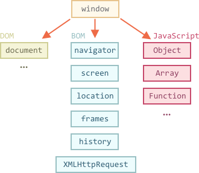

# Браузерное окружение, спецификации

Язык JavaScript изначально был создан для веб-браузеров. Но с тех пор он значительно эволюционировал и превратился в кроссплатформенный язык программирования для решения широкого круга задач.

Сегодня JavaScript может использоваться в браузере, на веб-сервере, в стиральной машинке или в какой-то другой среде. Каждая среда предоставляет свой специфический функционал. Спецификация JavaScript называет это *окружением*.

Окружение предоставляет специфические для себя объекты и дополнительные функции. Браузеры, например, дают средства для управления веб-страницами. Node.js делает доступными какие-то серверные возможности и так далее.

На картинке ниже в общих чертах показано, что доступно для JavaScript в браузерном окружении:



Как мы видим, имеется корневой объект `window`, который выступает в 2 ролях:

1. Во-первых, это глобальный объект для JavaScript-кода, об этом более подробно говорится в главе <info:global-object>.
2. Во-вторых, он также представляет собой окно браузера и располагает методами для управления им.

Например, здесь мы используем `window` как глобальный объект:

```js run
function sayHi() {
  alert("Hello");
}

// глобальные функции доступны как свойства window
window.sayHi();
```

А здесь мы используем `window` как объект окна браузера, чтобы узнать его высоту:

```js run
alert(window.innerHeight); // внутренняя высота окна браузера
```

Существует гораздо больше свойств и методов для управления окном браузера. Мы рассмотрим их позднее.

## Объектная модель документа (DOM)

Объект `document` предоставляет доступ к содержимому страницы. С его помощью мы можем что-то создавать или менять на странице.

Например:
```js run
// заменим цвет фона на красный,
document.body.style.background = "red";

// а через секунду вернём как было
setTimeout(() => document.body.style.background = "", 1000);
```

Мы использовали в примере только `document.body.style`, но на самом деле возможности по управлению страницей намного шире. Все свойства и методы, необходимые для этого, описаны в спецификации. Исторически получилось так, что её развитием занимаются сразу две рабочие группы:

1. [W3C](https://en.wikipedia.org/wiki/World_Wide_Web_Consortium) -- документация находится по адресу <https://www.w3.org/TR/dom>.
2. [WhatWG](https://en.wikipedia.org/wiki/WHATWG) публикует свои материалы на <https://dom.spec.whatwg.org>.

Как это часто бывает, две стороны не всегда могут договориться, и получается, что существуют как бы два стандарта. Но они очень похожи между собой и в конце концов, скорее всего, придут к слиянию. Сведения, которые вы найдете на указанных выше ресурсах, совпадают примерно на 99%. Различия настолько незначительные, что вы, возможно, даже не заметите их.

Лично я нахожу <https://dom.spec.whatwg.org> более приятным в использовании.

Когда-то в далёком прошлом не было вообще никаких стандартов -- каждый браузер реализовывал всё по-своему. Разные браузеры имели разные определения, свойства и методы для одних и тех же вещей, и программистам приходилось писать отдельный код под каждый браузер. Это были тёмные времена хаоса.

Даже сейчас мы иногда встречаем старый код, в котором используются специфичные для какого-то браузера свойства или специальные скрипты для достижения кросс-браузерности. Но в этом учебнике мы будем использовать современные стандарты: не нужно изучать устаревшие подходы, если только в этом нет реальной необходимости (высоки шансы, что и не будет).

Затем, как результат попытки прийти к общему соглашению, появился стандарт DOM. Первая версия называлась "DOM Level 1", затем она была дополнена "DOM Level 2", потом "DOM Level 3", и сейчас дошло до "DOM Level 4". Команда из WhatWG устала от нумерации версий, и они просто называют стандарт "DOM", не указывая номера. Мы будем придерживаться той же практики в этом учебнике.

```smart header="DOM не только для браузеров"
Спецификация DOM объясняет структуру документа и предоставляет объекты для манипуляций со страницей. Существует и другое, отличное от браузеров, программное обеспечение, которое тоже использует эту спецификацию.

Например, серверные средства, которые загружают и обрабатывают HTML-страницы, тоже используют DOM. При этом они могут поддерживать спецификацию не полностью.
```

```smart header="CSSOM для стилей"
Правила стилей CSS не структурированы подобно HTML. Для них есть отдельная спецификация [CSSOM](https://www.w3.org/TR/cssom-1/), которая объясняет, как стили должны представляться в виде объектов, как их читать и писать.

CSSOM используется вместе с DOM при изменении стилей документа. В реальности CSSOM требуется редко, потому что правила стилей CSS статичны. Мы редко добавляем/удаляем стили из JavaScript, поэтому не будем сейчас рассматривать этот вопрос.
```

## BOM (часть спецификации HTML)

Объектная модель браузера (BOM) представляет собой дополнительные объекты, предоставляемые браузером (окружением), чтобы работать со всем, кроме содержимого страницы.

Например:

- Объект [navigator](mdn:api/Window/navigator) даёт информацию о самом браузере и операционной системе. Среди множества его свойств самыми известными являются: `navigator.userAgent` -- информация о текущем браузере, и `navigator.platform` -- информация о платформе (может помочь в понимании того, в какой ОС открыт браузер -- Windows/Linux/Mac и так далее).
- Объект [location](mdn:api/Window/location) позволяет получить текущий URL и перенаправить браузер по новому адресу.

Вот как мы можем использовать объект `location`:

```js run
alert(location.href); // показывает текущий URL
if (confirm("Go to wikipedia?")) {
  location.href = "https://wikipedia.org"; // перенаправляет браузер на другой URL
}
```

Функции `alert/confirm/prompt` тоже являются частью BOM: они не относятся непосредственно к странице, но представляют собой методы объекта окна браузера для коммуникации с пользователем.


```smart header="Спецификация HTML"
BOM является частью общей [спецификации HTML](https://html.spec.whatwg.org).

Да, вы всё верно услышали. Спецификация HTML по адресу <https://html.spec.whatwg.org> не только про "язык HTML" (теги, атрибуты), она также покрывает целое множество объектов, методов и специфичных для каждого браузера расширений DOM. Это всё "HTML в широком смысле".
```

## Итого

Говоря о стандартах, у нас есть:

спецификация DOM
: описывает структуру документа, манипуляции с контентом и события, подробнее на <https://dom.spec.whatwg.org>.

спецификация CSSOM
: Описывает файлы стилей, правила написания стилей и манипуляций с ними, а также то, как это всё связано со страницей, подробнее на <https://www.w3.org/TR/cssom-1/>.

спецификация HTML
: Описывает язык HTML (например, теги) и BOM (объектную модель браузера) -- разные функции браузера: `setTimeout`, `alert`, `location` и так далее, подробнее на <https://html.spec.whatwg.org>. Тут берётся за основу спецификация DOM и расширяется дополнительными свойствами и методами.

Вскоре мы перейдём к изучению DOM, потому что страница является основой пользовательского интерфейса.

Пожалуйста, сохраните ссылки, указанные выше, так как по ним содержится очень много информации, которую невозможно изучить полностью и держать в уме.

Когда вам нужно будет прочитать о каком-то свойстве или методе, учебник на сайте Mozilla <https://developer.mozilla.org/en-US/search> тоже очень хороший ресурс, хотя ничто не сравнится с чтением спецификации: она сложная и объёмная, но сделает ваши знания более чёткими и полными.
