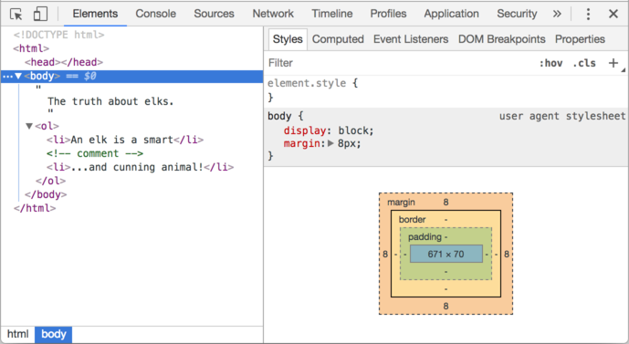
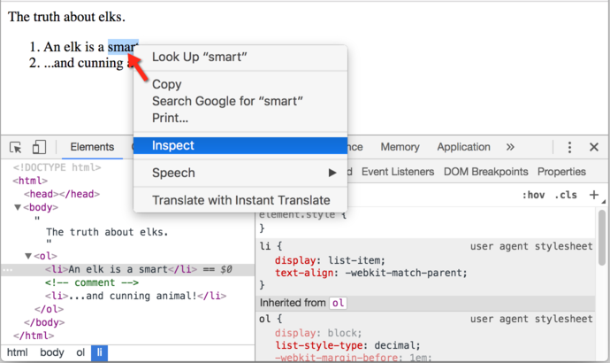

libs:
  - d3
  - domtree

---

# DOM дерево

Основой HTML документа являются теги.

В соответствии с Объектной Моделью Документа (DOM), каждый HTML-тег является объектом. Вложенные теги называют "дочерними" узлами родительского элемента.

Текст написанный внутри тега также является объектом.

Все эти объекты доступны для изменения при помощи JavaScript.

## Пример DOM

Для начала, исследуем дерево DOM в этом документе:

```html run no-beautify
<!DOCTYPE HTML>
<html>
<head>
  <title>О лосях</title>
</head>
<body>
  Правда о лосях.
</body>
</html>
```

DOM -- это представление HTML документа в виде дерева тегов. Вот как это выглядит:

<div class="domtree"></div>

<script>
let node1 = {"name":"HTML","nodeType":1,"children":[{"name":"HEAD","nodeType":1,"children":[{"name":"#text","nodeType":3,"content":"\n    "},{"name":"TITLE","nodeType":1,"children":[{"name":"#text","nodeType":3,"content":"О лосях"}]},{"name":"#text","nodeType":3,"content":"\n  "}]},{"name":"#text","nodeType":3,"content":"\n  "},{"name":"BODY","nodeType":1,"children":[{"name":"#text","nodeType":3,"content":"\n  Правда о лосях."}]}]}

drawHtmlTree(node1, 'div.domtree', 690, 320);
</script>

```online
На рисунке выше, узлы-элементы можно кликать и их дети будут скрываться и раскрываться.
```

Теги будем называть *узлы-элементы* (или просто элементы). Вложенные теги становятся дочерними узлами родительского элемента. И в результате мы получаем дерево элементов: `<html>` -- это корневой узел, а `<head>` и `<body>` его дочерние узлы, и т.д.

Текст внутри элементов образует *текстовые узлы*, обозначенные как `#text`. Текстовый узел содержит в себе только строку текста. У него не может быть потомков, т.е. он находится всегда на самом нижнем уровне.

Например, у тега `<title>` текстовый узел `"О лосях"`.

Обратите внимание на специальные символы в текстовых узлах:

- перевод строки: `↵` (в JavaScript он обозначается как `\n`)
- пробел: `␣`

Пробелы и переводы строки -- это полноправные символы, которые образуют текстовые узлы и становятся частью дерева DOM. Так, в примере выше в теге `<head>` есть несколько пробелов перед `<title>`, которые образуют текстовый узел `#text` (он содержит в себе только перенос строки и несколько пробелов).

Существует всего два исключения из этого правила:
1. По историческим причинам пробелы и перевод строки перед тегом `<head>` игнорируются
2. Если мы записываем что-либо после закрывающего тега `</body>`, браузер автоматически перемещает эту запись в конец `body`, поскольку спецификация HTML требует чтобы все содержимое было внутри `<body>`. Поэтому после закрывающего тега `</body>` не должно быть никаких пробелов.

В остальных случаях все просто -- если в документе есть пробелы (или любые другие символы), они становятся текстовыми узлами дерева DOM, и если мы их удалим, то в DOM их не тоже не будет.

Как в примере ниже:

```html no-beautify
<!DOCTYPE HTML>
<html><head><title>О лосях</title></head><body>Правда о лосях.</body></html>
```

<div class="domtree"></div>

<script>
let node2 = {"name":"HTML","nodeType":1,"children":[{"name":"HEAD","nodeType":1,"children":[{"name":"TITLE","nodeType":1,"children":[{"name":"#text","nodeType":3,"content":"About elks"}]}]},{"name":"BODY","nodeType":1,"children":[{"name":"#text","nodeType":3,"content":"The truth about elks."}]}]}

drawHtmlTree(node2, 'div.domtree', 690, 210);
</script>

```smart header="Edge spaces and in-between empty text are usually hidden in tools"
Когда мы работаем с деревом DOM используя инструменты разработчика в браузере (которые мы рассмотрим позже) пробелы в начале/конце текста и пустые текстовые узлы (переносы строк) между тегами обычно не отображаются.

Потому что в основном они используются для лучшей читабельности HTML, и в большинстве случаев не влияют на отображение элементов на странице.

В дальнейшем, где это не очень важно, мы их иногда не отображаем, чтобы сделать дерево DOM проще.
```


## Автоисправление

Если браузер сталкивается с некорректно написанным HTML кодом, он автоматически корректирует его для показа и при построении DOM.

Например, в начале документа всегда должен быть тег `<html>`. Даже если его нет в документе -- он будет в дереве DOM, браузер его создаст. Тоже самое касается и тега `<body>`.

Рассмотрим такой пример, если в HTML файле записано только слово `"Привет"`, браузер обернет его в теги `<html>` и `<body>`, добавит необходимый тег `<head>`, и DOM дом будет выглядеть так:


<div class="domtree"></div>

<script>
let node3 = {"name":"HTML","nodeType":1,"children":[{"name":"HEAD","nodeType":1,"children":[]},{"name":"BODY","nodeType":1,"children":[{"name":"#text","nodeType":3,"content":"Привет"}]}]}

drawHtmlTree(node3, 'div.domtree', 690, 150);
</script>

При генерации DOM браузер самостоятельно обрабатывает ошибки в документе, закрывает теги и так далее.

Так выглядит неправильно написанный документ:

```html no-beautify
<p>Привет
<li>Мама
<li>и
<li>Папа
```

...Но DOM будет нормальным, потому что браузер сам закроет теги и восстановит отсутствующие детали:

<div class="domtree"></div>

<script>
let node4 = {"name":"HTML","nodeType":1,"children":[{"name":"HEAD","nodeType":1,"children":[]},{"name":"BODY","nodeType":1,"children":[{"name":"P","nodeType":1,"children":[{"name":"#text","nodeType":3,"content":"Привет"}]},{"name":"LI","nodeType":1,"children":[{"name":"#text","nodeType":3,"content":"Мама"}]},{"name":"LI","nodeType":1,"children":[{"name":"#text","nodeType":3,"content":"и"}]},{"name":"LI","nodeType":1,"children":[{"name":"#text","nodeType":3,"content":"Папа"}]}]}]}

drawHtmlTree(node4, 'div.domtree', 690, 360);
</script>

````warn header="Таблицы всегда содержат `<tbody>`"
Важный "особый случай" -- работа с таблицами. По стандарту DOM у них должен быть `<tbody>`, но в HTML их можно написать (официально) без него . В этом случае браузер добавляет `<tbody>` в DOM самостоятельно.

Для такого HTML:

```html no-beautify
<table id="table"><tr><td>1</td></tr></table>
```

DOM-структура будет такой:
<div class="domtree"></div>

<script>
let node5 = {"name":"TABLE","nodeType":1,"children":[{"name":"TBODY","nodeType":1,"children":[{"name":"TR","nodeType":1,"children":[{"name":"TD","nodeType":1,"children":[{"name":"#text","nodeType":3,"content":"1"}]}]}]}]};

drawHtmlTree(node5,  'div.domtree', 600, 200);
</script>

Видите? Из пустоты появился `<tbody>`, как будто документ был таким. Важно знать об этом, иначе при работе с таблицами возможны сюрпризы.
````

## Другие типы узлов

Добавим на страницу новые теги и комментарий:

```html
<!DOCTYPE HTML>
<html>
<body>
  Правда о лосях.
  <ol>
    <li>Лось -- животное умное</li>
*!*
    <!-- comment -->
*/!*
    <li>...и хитрое!</li>
  </ol>
</body>
</html>
```

<div class="domtree"></div>

<script>
let node6 = {"name":"HTML","nodeType":1,"children":[{"name":"HEAD","nodeType":1,"children":[]},{"name":"BODY","nodeType":1,"children":[{"name":"#text","nodeType":3,"content":"\n  Правда о лосях.\n    "},{"name":"OL","nodeType":1,"children":[{"name":"#text","nodeType":3,"content":"\n      "},{"name":"LI","nodeType":1,"children":[{"name":"#text","nodeType":3,"content":"Лось -- животное умное"}]},{"name":"#text","nodeType":3,"content":"\n      "},{"name":"#comment","nodeType":8,"content":"comment"},{"name":"#text","nodeType":3,"content":"\n      "},{"name":"LI","nodeType":1,"children":[{"name":"#text","nodeType":3,"content":"...и хитрое!"}]},{"name":"#text","nodeType":3,"content":"\n    "}]},{"name":"#text","nodeType":3,"content":"\n  \n"}]}]};

drawHtmlTree(node6, 'div.domtree', 690, 500);
</script>

Здесь мы видим новый узел нового типа -- *комментарий*, обозначенный как `#comment`.

Казалось бы -- зачем комментарий в DOM? Он никак не влияет на визуальное отображение. Это важное правило -- если что-то есть в HTML, то оно должно быть в DOM-дереве.

**Все что есть в HTML, даже комментарии, является частью DOM.**

Даже директива `<!DOCTYPE...>`, которую мы ставим в начале HTML тоже является DOM узлом. Она находится в дереве DOM прямо перед `<html>`. Мы не будем рассматривать этот узел, мы даже не рисуем его на наших диаграммах, но он существует.

Даже объект `document` представляющий весь документ, формально, является DOM узлом.

Существует [12 типов узлов](https://dom.spec.whatwg.org/#node). Но на практике мы в основном работаем с 4 из них:

1. `document` -- "входная точка" в DOM.
2. узлы-элементы -- HTML-теги, основные строительные блоки.
3. текстовые узлы -- содержат текст.
4. комментарии -- иногда в них можно включить информацию, которая не будет показана, но доступна в DOM для чтения JS.

## Поэкспериментируйте сами

Чтобы посмотреть структуру DOM реальном времени, попробуйте [Live DOM Viewer](http://software.hixie.ch/utilities/js/live-dom-viewer/). Просто введите что-нибудь в поле, и ниже увидите, как меняется DOM.

## В инспекторе браузера

Другой способ исследовать DOM использовать инструменты разработчика браузера. На самом деле, это то что мы каждый день используем при разработке.

Для этого откройте страницу [elks.html](elks.html), включите инструменты разработчика и перейдите на вкладку Elements.

Вот как это должно выглядеть:



Вы можете увидеть DOM, понажимать на элементы, детально рассмотреть их и так далее.

Обратите внимание, что структура DOM в инструментах разработчика отображается в упрощенном виде. Текстовые узлы показаны, как простой текст. И кроме пробелов нет никаких "пустых" текстовых узлов. Ну и отлично, потому что большую часть времени нас будут интересовать узлы-элементы.

Клик по этой <span class="devtools" style="background-position:-328px -124px"></span> кнопке в левом верхнем углу инспектора позволяет при помощи мыши (или другого устройства ввода) выбрать элемент на веб-странице и "проинспектировать" его (браузер сам найдет и отметит его во вкладке Elements). Этот способ отлично подходит, когда у нас огромная HTML-страница (и соответствующий ей огромный DOM) и мы хотим увидеть, где находится интересующий нас элемент.

Есть и другой способ сделать это, можно кликнуть на странице по элементу правой кнопкой мыши и в контекстном меню выбрать "Inspect".



В правой части инструментов разработчика находятся следующие подразделы:
- **Styles** -- здесь мы видим CSS примененный к текущему элементу правило за правилом, включая встроенные стили (выделены серым). Почти все можно отредактировать на месте, включая размеры/внешние и внутренние отступы.
- **Computed** -- здесь мы видим итоговые свойства CSS элемента, которые он приобрёл в результате применения всего каскада стилей (в том числе унаследованные свойства и т.д.).
- **Event Listeners** -- в этом разделе мы видим слушателей событий привязанных к DOM элементам (мы поговорим о них в следующей части учебника).
- ... и т.д.

Лучший способ изучить инструменты разработчика поиграть с ними. Большинство значений можно менять и тут же смотреть результат.

## Взаимодействие с консолью

Изучая DOM, мы также хотим применять к нему JavaScript. Например: получить узел и запустить какой-нибудь код для его изменения, чтобы посмотреть как он выглядит. Ниже приведено несколько способов перемещения между вкладками Elements и Console.

- На вкладке the Elements выберите первый элемент `<li>`.
- Нажмите `клавишу:Esc` -- прямо под вкладкой Elements откроется Console.

Последний элемент, выбранный во вкладке Elements, доступен в консоли как `$0`, предыдущий как `$1` и т.д.

Теперь мы можем запускать на них команды. Например `$0.style.background = 'red'` сделает выбранный элемент красным, как здесь:


С другой стороны, если мы находимся в консоли и есть переменная ссылающаяся на DOM узел, можно использовать команду `inspect(имя узла)` и увидеть этот элемент во вкладке Elements.

Или мы можем просто вывести его в консоль и  исследовать "на месте", написав `document.body` как показано ниже:


Как мы увидим позже это необходимо для отладки. В следующей главе мы рассмотрим доступ и изменение DOM используя JavaScript.

Инструменты разработчика браузера отлично помогают в разработке: мы можем исследовать DOM, пробовать разные фичи и смотреть что идет не так.

## Итого

HTML/XML документы представлены в браузере в виде DOM-дерева.

- Теги становятся узлами-элементами и формируют структуру документа.
- Текст становится текстовыми узлами.
- ...и т.д., все что записано в HTML есть и в DOM-дереве, даже комментарии.

Для изменения элементов или проверки DOM-дерева мы можем использовать инструменты разработчика в браузере.

Здесь мы рассмотрели основы, наиболее часто используемые и важные возможности для начального уровня. Подробную документацию по инструментам разработки Chrome Developer Tools можно найти на странице <https://developers.google.com/web/tools/chrome-devtools>. Лучший способ изучить инструменты походить по разным вкладкам, почитать меню: большинство действий очевидны для пользователя. Позже, когда вы немного их изучите, прочитайте документацию и узнаете то что осталось.

У DOM узлов есть свойства и методы которые позволяют выбирать любой из элементов, изменять, перемещать их на странице и многое другое. Мы вернемся к ним в следующем разделе.
