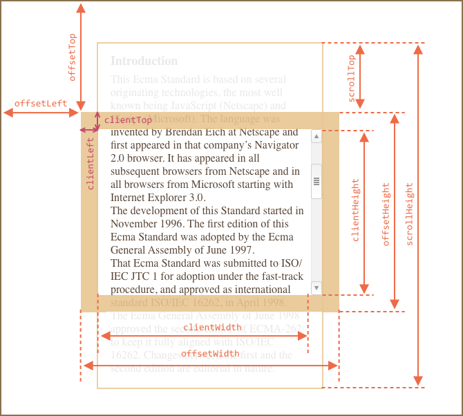
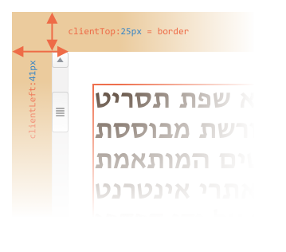
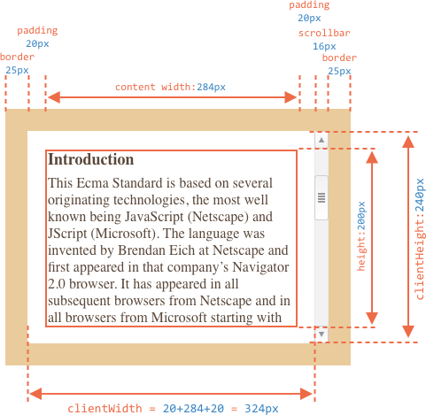
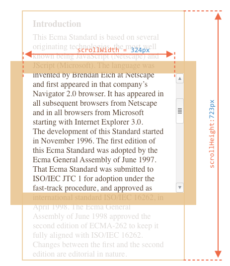
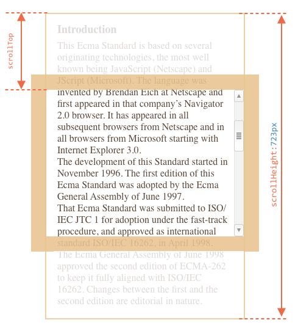

# Размеры и прокрутка элементов

Существует множество JavaScript-свойcтв, которые позволяют считывать информацию об элементе: ширину, высоту и другие геометрические характеристики.

Они часто требуются, когда нам нужно передвигать или позиционировать элементы с помощью JavaScript для того, чтобы правильно вычислять координаты.


## Простой пример

В качестве простого примера демонстрации свойств мы будем использовать следующий элемент:

```html no-beautify
<div id="example">
  ...Текст...
</div>
<style>
  #example {
    width: 300px;
    height: 200px;
    border: 25px solid #E8C48F;
    padding: 20px;
    overflow: auto;
  }
</style>
```

У элемента есть рамка (border), внутренний отступ (padding) и прокрутка. Полный набор характеристик. Обратите внимание, тут нет внешних отступов (margin), потому что они не являются непосредственной частью элемента, и у него нет соответствующих JavaScript-свойств.

Результат выглядит так:


Вы можете [открыть этот документ в песочнице](sandbox:metric).

```smart header="Внимание, полоса прокрутки"
В иллюстрации выше намеренно продемонстрирован самый сложный и полный случай, когда у элемента есть ещё и полоса прокрутки. Некоторые браузеры (не все) оставляют место для неё, забирая его у области отведённой для содержимого.

Таким образом, без учёта полосы прокрутки ширина области содержимого будет `300px`, но если предположить, что ширина полосы прокрутки равна `16px` (её точное значение зависит от устройства и браузера), тогда остаётся только `300 - 16 = 284px` и мы должны это учитывать. Вот почему примеры в этой главе даны с полосой прокрутки. Если её не будет, то вычисления будут немного проще.
```

```smart header="CSS-свойство `padding-bottom` может быть заполнено текстом"
Обычно внутренние отступы изображены пустыми на иллюстрациях, но если элемент содержит много текста, они могут перекрывать друг друга. В этом случае браузеры отображают такой текст "перекрывающим" нижний внутренний отступ (`padding-bottom`). Вы можете наблюдать это в примерах. Несмотря на это, отступы есть, если не указано иное.
```

## Метрики

Свойства элемента отражают ширину, высоту и другие геометрические характеристики всегда в виде чисел. Предполагается, что они в пикселях.

Вот общая картина:



Существует множество свойств, и довольно трудно поместить их всех на одном изображении, но их значения просты и понятны.

Давайте начнём исследовать их снаружи элемента и во внутрь.

## Свойства: offsetParent, offsetLeft/Top

Эти свойства редко используются, но так как они являются "самыми внешними" метриками, мы начнём с них.

В свойстве `offsetParent` находится ближайший родитель элемента:

1. он является CSS-позиционированным (когда CSS-свойство `position` равно `absolute`, `relative`, `fixed` или `sticky`),
2. или `<td>`, `<th>`, `<table>`,
2. или `<body>`.

В большинстве практических ситуаций мы можем использовать `offsetParent`, чтобы получить ближайшего родителя, спозиционированного через CSS. Свойства `offsetLeft/offsetTop` содержат координаты x/y относительно верхнего-левого родительского угла.

В примере ниже внутренний `<div>` имеет элемент `<main>` в качестве `offsetParent`, а свойства `offsetLeft/offsetTop` являются сдвигами относительно верхнего-левого угла (`180`):

```html run height=10
<main style="position: relative" id="main">
  <article>
    <div id="example" style="position: absolute; left: 180px; top: 180px">...</div>
  </article>
</main>
<script>
  alert(example.offsetParent.id); // main
  alert(example.offsetLeft); // 180 (обратите внимание: число, а не строка "180px")
  alert(example.offsetTop); // 180
</script>
```


Существует несколько частных случаев, когда `offsetParent` равно `null`:

1. Для скрытых элементов (с CSS-свойством `display:none` или когда его нет в документе).
2. Для элементов `<body>` и `<html>`.
3. Для элементов с `position:fixed`.

## Свойства: offsetWidth/Height

Теперь переходим к самому элементу.

Эти два свойства – самые простые. Они содержат "внешнюю" ширину/высоту элемента, то есть его полный размер, включая рамки.


Для нашего элемента:

- `offsetWidth = 390` -- внешняя ширина блока, её можно получить сложением CSS-ширины (`300px`), внутренних отступов (`2 * 20px`) и рамок (`2 * 25px`).
- `offsetHeight = 290` -- внешняя высота блока.

````smart header="Метрики для невидимых элементов равны нулю."
Координаты и размеры в JavaScript устанавливаются только для видимых элементов.

Если элемент (или любой его родитель) имеет `display:none` или отсутствует в документе, то все его метрики равны нулю или `null`, в зависимости от того, что это.

Например, свойство `offsetParent` является `null`, а `offsetWidth`, `offsetHeight` -- `0`.

Мы можем выполнить проверку на видимость, вот так:

```js
function isHidden(elem) {
  return !elem.offsetWidth && !elem.offsetHeight;
}
```

Отметим, что функция `isHidden` вернёт `true` для элементов, которые, как бы есть на экране, но их размеры равны нулю (например, пустые `<div>`).
````

## Свойства: clientTop/Left

Далее внутри элемента у нас рамки (border).

Для них есть свойства-метрики `clientTop` и `clientLeft`.

В нашем примере:

- `clientLeft = 25` -- ширина левой рамки
- `clientTop = 25` -- ширина верхней рамки


...На на самом деле -- это вовсе не рамки, а отступ внутренней части элемента от внешней.

В чём же разница?

Она возникает, когда документ располагается справа налево (операционная система на арабском языке или иврите). Полоса прокрутки в этом случае находится слева, и тогда свойство `clientLeft` включает в себя ещё и ширину полосы прокрутки.

В этом случае, `clientLeft` будет равно `25`, но с прокруткой -- `25 + 16 = 41`:



## Свойства: clientWidth/Height

Эти свойства -- размер области внутри рамок элемента.

Они включают в себя ширину содержимого вместе с внутренними отступами, но без прокрутки:



На рисунке выше посмотрим вначале на `clientHeight`: её посчитать проще всего. Горизонтально прокрутки нет, так что это в точности то, что внутри рамок: CSS-высота `200px` плюс верхнее и нижнее внутренние отступы (`2 * 20px`), итого `240px`.

Теперь `clientWidth` -- ширина содержимого здесь равна не `300px`, а `284px`, т.к. `16px` отведено для полосы прокрутки. Таким образом: `284px` плюс левый и правый отступы -- всего `324px`.

**Если нет внутренних отступов, то `clientWidth/Height` в точности равны размеру области содержимого внутри рамок и полосы прокрутки (если она есть).**


Поэтому в тех случаях, когда мы точно знаем, что отступов нет, можно использовать `clientWidth/clientHeight` для получения размеров внутренней области содержимого.

## Свойства: scrollWidth/Height

- Свойства `clientWidth/clientHeight` относятся только к видимой области элемента.
- Свойства `scrollWidth/scrollHeight` добавляют к ней прокрученную (которую не видно) по горизонтали/вертикали:



На рисунке выше:

- `scrollHeight = 723` -- полная внутренняя высота, включая прокрученную область.
- `scrollWidth = 324` -- полная внутренняя ширина, в данном случае прокрутки нет, поэтому она равна `clientWidth`.

Эти свойства можно использовать, чтобы "распахнуть" элемент на всю ширину/высоту.

Таким кодом:

```js
// распахнуть элемент на всю высоту
element.style.height = `${element.scrollHeight}px`;
```

```online
Нажмите на кнопку, чтобы распахнуть элемент:

<div id="element" style="width:300px;height:200px; padding: 0;overflow: auto; border:1px solid black;">текст текст текст текст текст текст текст текст текст текст текст текст текст текст текст текст текст текст текст текст текст текст текст текст текст текст текст текст текст текст текст текст текст текст текст текст текст текст текст текст текст текст текст текст текст текст текст текст текст текст текст текст текст текст текст текст текст текст текст текст текст текст текст текст текст текст текст текст текст текст текст текст текст текст текст текст текст текст текст текст текст текст текст текст текст текст текст текст текст текст текст текст текст текст текст текст текст текст текст текст текст текст текст текст текст текст текст текст текст текст текст текст текст текст текст текст текст текст текст текст текст текст текст текст текст текст текст текст текст текст текст текст текст текст текст текст текст текст текст текст</div>

<button style="padding:0" onclick="element.style.height = `${element.scrollHeight}px`">element.style.height = `${element.scrollHeight}px`</button>
```

## Свойства: scrollLeft/scrollTop

Свойства `scrollLeft/scrollTop` -- ширина/высота невидимой, прокрученной в данный момент, части элемента слева и сверху.

Следующая иллюстрация показывает значения `scrollHeight` и `scrollTop` для блока с вертикальной прокруткой.



Другими словами, свойство `scrollTop` -- это "сколько уже прокручено вверх".

````smart header="`Свойства scrollLeft/scrollTop` можно изменять"
В отличие от большинства свойств, которые доступны только для чтения, значения `scrollLeft/scrollTop` можно изменять, и браузер выполнит прокрутку элемента..

```online
При клике на следующий элемент будет выполняться код  `elem.scrollTop += 10`. Поэтому он будет прокручиваться на `10px` вниз.

<div onclick="this.scrollTop+=10" style="cursor:pointer;border:1px solid black;width:100px;height:80px;overflow:auto">Кликни<br>Меня<br>1<br>2<br>3<br>4<br>5<br>6<br>7<br>8<br>9</div>
```

Установка значения `scrollTop` на `0` или `Infinity` прокрутит элемент в самый верх/низ соответственно.
````

## Не стоит брать width/height из CSS

Мы рассмотрели метрики – свойства, которые есть у DOM-элементов. Их обычно используют для получения их различных высот, ширин и прочих расстояний.

Но как мы знаем из главы <info:styles-and-classes>, CSS-высоту и ширину можно извлечь, используя `getComputedStyle`.

Не лучше ли так получать ширину вместо метрик?

```js run
let elem = document.body;

alert( getComputedStyle(elem).width ); // show CSS width for elem
```

Почему мы должны использовать свойства метрик вместо этого? На это есть две причины:

1. Во-первых, CSS-свойства width/height зависят от другого свойства -- `box-sizing` которое определяет, "что такое", собственно, эти CSS-ширина и высота. Получается, что изменение `box-sizing`, к примеру, для более удобной вёрстки, сломает такой JavaScript.
2. Во-вторых, в CSS -- свойства `width/height` могут быть равны `auto`, например, для строчного элемента:

    ```html run
    <span id="elem">Привет!</span>

    <script>
    *!*
      alert( getComputedStyle(elem).width ); // auto
    */!*
    </script>
    ```

    Конечно, с точки зрения CSS `width:auto` – совершенно нормально, но нам-то в JavaScript нужен конкретный размер в `px`, который мы могли бы использовать для вычислений. Получается, что в данном случае ширина из CSS вообще бесполезна.

Есть и ещё одна причина: полоса прокрутки. Бывает без полосы прокрутки код работает прекрасно, но стоит ей появиться, как начинают появляться баги. Так происходит потому, что полоса прокрутки "отъедает" место от области внутреннего содержимого в некоторых браузерах. Таким образом, реальная ширина содержимого *меньше* CSS-ширины. Как раз это и учитывают свойства `clientWidth/clientHeight`.

...Но с `getComputedStyle(elem).width` ситуация иная. Некоторые браузеры (например, Chrome) возвращают реальную внутреннюю ширину с вычетом ширины полосы прокрутки, а некоторые (например, Firefox) -- именно CSS-свойство (игнорируя полосу прокрутки). Эти кроссбраузерные отличия – ещё один повод не использовать `getComputedStyle`, а использовать свойства-метрики.

```online
Если ваш браузер показывает полосу прокрутки (например, под Windows почти все браузеры так делают), то вы можете протестировать это сами, нажав на кнопку в ифрейме ниже.

[iframe src="cssWidthScroll" link border=1]

У элемента с текстом в стилях указано CSS-свойство `width:300px`.

На ОС Windows браузеры Firefox, Chrome, Edge учитывают место для полосы прокрутки. Но Firefox отображал `300px`, в то время, как Chrome и Edge -- меньше. Это из-за того, что Firefox возвращал именно CSS-ширину, а остальные браузеры -- "реальную" ширину, за вычетом прокрутки.
```

Обратите внимание: описанные разночтения касаются только чтения свойства `getComputedStyle(...).width` из JavaScript, визуальное отображение корректно в обоих случаях.

## Итого

У элементов есть следующие метрики:

- `offsetParent` -- ближайший CSS-спозиционированный родитель или `td`, `th`, `table`, `body`.
- `offsetLeft/offsetTop` -- позиция в пикселях верхнего левого угла, относительно `offsetParent`.
- `offsetWidth/offsetHeight` -- "внешняя" ширина/высота элемента, включая рамки.
- `clientLeft/clientTop` -- расстояние от верхнего левого внешнего угла до верхнего-левого внутренного угла элемента. Для операционных систем с ориентацией слева на право, эти свойства равны ширинам левой/верхней рамки. Если же вертикальная полоса прокрутки находится не справа, а слева, то `clientLeft` включает в своё значение её ширину.
- `clientWidth/clientHeight` -- ширина/высота содержимого вместе с полями внутреннего отступа, но без полосы прокрутки.
- `scrollWidth/scrollHeight` -- ширина/высота содержимого, включая прокручиваемую область. Включает в себя внутренние отступы и не включает полосу прокрутки.
- `scrollLeft/scrollTop` -- ширина/высота прокрученной части элемента, считается от верхнего левого угла.

Все свойства доступны только для чтения, кроме `scrollLeft/scrollTop`. Изменение этих свойств заставляет браузер прокручивать элемент.
