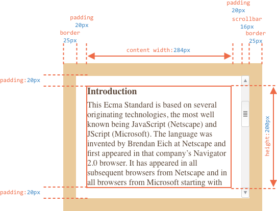
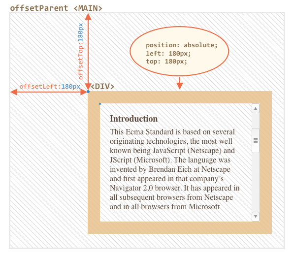

# Размеры и прокрутка элементов

Существует множество JavaScript-свойтв, которые позволяют считывать информацию об элементе: ширину, высоту и другие геометрические характеристики.

Они часто требуются, когда нам нужно передвигать или позиционировать элементы с помощью JavaScript, для того, чтобы правильно вычислить координаты.


## Простой пример

В качестве простого примера демонстрации свойств мы будем использовать следующий элемент:

```html no-beautify
<div id="example">
  ...Text...
</div>
<style>
  #example {
    width: 300px;
    height: 200px;
    border: 25px solid #E8C48F;
    padding: 20px;
    overflow: auto;
  }
</style>
```

У элемента есть рамка (border), поля внутреннего отступа (padding) и прокрутка. Полный набор характеристик. Обратите внимание, тут нет внешних отступов (margin), т.к. они не являются непосредственной частью элемента, и у него нет соответствующих JavaScript-свойств.

Результат выглядит так:



Вы можете [открыть этот документ в песочнице](sandbox:metric).

```smart header="Внимание, полоса прокрутки"
В иллюстрации выше намеренно продемонстрирован самый сложный и полный случай, когда у элемента есть ещё и полоса прокрутки. Некоторые браузеры (не все) оставляют место для неё забирая его у области отведённой для содержимого.

Таким образом, без учёта полосы прокрутки ширина области содержимого будет `300px`, но если предположить, что ширина полосы прокрутки равна `16px` (её точное значение зависит от устройства и браузера), тогда остаётся только `300 - 16 = 284px` и мы должны это учитывать. Вот почему примеры в этой главе даны с полосой прокрутки. Если её не будет, то вычисления будут немного проще.
```

```smart header="CSS-свойство `padding-bottom` может быть заполнено текстом"
Обычно внутренние отступы изображены пустыми на иллюстрациях, но если элемент содержит много текста, они могут перекрывать друг друга, в этом случае браузеры отображают такой текст "перекрывающим" `нижний внутренний отступ` (padding-bottom). Вы можете наблюдать это в примерах. Несмотря на это, отступы есть, пока не указано иное.
```

## Метрики

Свойства элемента отражают ширину, высоту и другие геометрические характеристики всегда в виде чисел. Предполагается, что они в пикселях.

Вот общая картина:


Существует множество свойств, и довольно трудно поместить их всех на одном изображении, но их значения просты и понятны.

Давайте начнём исследовать их снаружи элемента и во внутрь.

## Свойства: offsetParent, offsetLeft/Top

Эти свойства редко используются, но так как они являются "самыми внешними" метриками, мы начнём с них.

В свойстве `offsetParent` находится ближайший родитель элемента:

1. он является CSS-спозиционированным (когда CSS-свойство `position` равно `absolute`, `relative`, `fixed` или `sticky`),
2. или `<td>`, `<th>`, `<table>`,
2. или `<body>`.

В большинстве практических ситуаций мы можем использовать `offsetParent`, чтобы получить ближайшего CSS-спозиционированного родителя. Свойства `offsetLeft/offsetTop` содержат x/y координаты относительно верхнего-левого родительского угла.

В примере ниже внутренний `<div>` имеет элемент `<main>` в качестве `offsetParent`, а свойства `offsetLeft/offsetTop` являются сдвигами относительно верхнего-левого угла (`180`):

```html run height=10
<main style="position: relative" id="main">
  <article>
    <div id="example" style="position: absolute; left: 180px; top: 180px">...</div>
  </article>
</main>
<script>
  alert(example.offsetParent.id); // main
  alert(example.offsetLeft); // 180 (note: a number, not a string "180px")
  alert(example.offsetTop); // 180
</script>
```




Существует несколько частных случаев, когда `offsetParent` равно `null`:

1. Для скрытых элементов (с CSS-свойством `display:none`, либо когда его нет в документе).
2. Для элементов `<body>` и `<html>`.
3. Для элементов с `position:fixed`.

## Свойства: offsetWidth/Height

Теперь переходим к самому элементу.

Эти два свойства – самые простые. Они содержат "внешнюю" ширину/высоту элемента, то есть его полный размер, включая рамки.


Для нашего элемента:

- `offsetWidth = 390` -- внешняя ширина блока, её можно получить сложением CSS-ширины (`300px`), полей(`2 * 20px`) и рамок (`2 * 25px`).
- `offsetHeight = 290` -- внешняя высота блока.

````smart header="Метрики для невидимых элементов равны нулю."
Координаты и размеры в JavaScript устанавливаются только для видимых элементов.

Если элемент (или любой его родитель) имеет `display:none` или отсутствует в документе, то все его метрики равны нулю или `null`, в зависимости от того, что это.

Например, свойство `offsetParent` является `null`, а `offsetWidth`, `offsetHeight` -- `0`.

Мы можем выполнить проверку на видимость, вот так:

```js
function isHidden(elem) {
  return !elem.offsetWidth && !elem.offsetHeight;
}
```

Отметим, что функция `isHidden` вернёт `true` для элементов, которые, как бы есть на экране, но их размеры равны нулю (например, пустые `<div>`).
````

## Свойства: clientTop/Left

Далее внутри элемента у нас рамки (border).

Для них есть свойства-метрики `clientTop` и `clientLeft`.

В нашем примере:

- `clientLeft = 25` -- ширина левой рамки
- `clientTop = 25` -- ширина верхней рамки


...На на самом деле -- оно вовсе не рамки, а отступ внутренней части элемента от внешней.

В чём же разница?

Она возникает, когда документ располагается справа налево (операционная система на арабском языке или иврите). Полоса прокрутки в этом случае находится слева, и тогда свойство `clientLeft` включает в себя еще и ширину полосы прокрутки.

В этом случае, `clientLeft` будет равно `25`, но с прокруткой -- `25 + 16 = 41`:


## Свойства: clientWidth/Height

Эти свойства -- размер элемента внутри рамок border.

Они включают в себя ширину содержимого width вместе с полями padding, но без прокрутки:


На рисунке выше посмотрим вначале на `clientHeight`: её посчитать проще всего. Горизонтально прокрутки нет, так что это в точности то, что внутри рамок: CSS-высота `200px` плюс верхнее и нижнее поля (`2 * 20px`), итого `240px`.

Теперь `clientWidth` -- ширина содержимого здесь равна не `300px`, а `284px`, т.к. `16px` отведено для полосы прокрутки. Таким образом: `284px` плюс левый и правый отступы -- всего `324px`.

**Если нет внутренних отступов, то `clientWidth/Height` в точности равны размеру области содержимого, внутри рамок и полосы прокрутки (если она есть).**


Поэтому, в тех случаях, когда мы точно знаем, что отступов нет, можно использовать `clientWidth/clientHeight` для получения размеров внутренней области содержимого.

## Свойства: scrollWidth/Height

- Properties `clientWidth/clientHeight` only account for the visible part of the element.
- Properties `scrollWidth/scrollHeight` also include the scrolled out (hidden) parts:


On the picture above:

- `scrollHeight = 723` -- is the full inner height of the content area including the scrolled out parts.
- `scrollWidth = 324` -- is the full inner width, here we have no horizontal scroll, so it equals `clientWidth`.

We can use these properties to expand the element wide to its full width/height.

Like this:

```js
// expand the element to the full content height
element.style.height = `${element.scrollHeight}px`;
```

```online
Click the button to expand the element:

<div id="element" style="width:300px;height:200px; padding: 0;overflow: auto; border:1px solid black;">text text text text text text text text text text text text text text text text text text text text text text text text text text text text text text text text text text text text text text text text text text text text text text text text text text text text text text text text text text text text text text text text text text text text text text text text text text text text text text text text text text text text text text text text text text text text text text text text text text text text text text text text text text text text text text text text text text text text text text text text text text text text text text text text text text text text text text text text text text text text</div>

<button style="padding:0" onclick="element.style.height = `${element.scrollHeight}px`">element.style.height = `${element.scrollHeight}px`</button>
```

## scrollLeft/scrollTop

Properties `scrollLeft/scrollTop` are the width/height of the hidden, scrolled out part of the element.

On the picture below we can see `scrollHeight` and `scrollTop` for a block with a vertical scroll.


In other words, `scrollTop` is "how much is scrolled up".

````smart header="`scrollLeft/scrollTop` can be modified"
Most of the geometry properties here are read-only, but `scrollLeft/scrollTop` can be changed, and the browser will scroll the element.

```online
If you click the element below, the code `elem.scrollTop += 10` executes. That makes the element content scroll `10px` down.

<div onclick="this.scrollTop+=10" style="cursor:pointer;border:1px solid black;width:100px;height:80px;overflow:auto">Click<br>Me<br>1<br>2<br>3<br>4<br>5<br>6<br>7<br>8<br>9</div>
```

Setting `scrollTop` to `0` or `Infinity` will make the element scroll to the very top/bottom respectively.
````

## Don't take width/height from CSS

We've just covered geometry properties of DOM elements. They are normally used to get widths, heights and calculate distances.

But as we know from the chapter <info:styles-and-classes>, we can read CSS-height and width using `getComputedStyle`.

So why not to read the width of an element like this?

```js run
let elem = document.body;

alert( getComputedStyle(elem).width ); // show CSS width for elem
```

Why should we use geometry properties instead? There are two reasons:

1. First, CSS width/height depend on another property: `box-sizing` that defines "what is" CSS width and height. A change in `box-sizing` for CSS purposes may break such JavaScript.
2. Second, CSS `width/height` may be `auto`, for instance for an inline element:

    ```html run
    <span id="elem">Hello!</span>

    <script>
    *!*
      alert( getComputedStyle(elem).width ); // auto
    */!*
    </script>
    ```

    From the CSS standpoint, `width:auto` is perfectly normal, but in JavaScript we need an exact size in `px` that we can use in calculations. So here CSS width is useless at all.

And there's one more reason: a scrollbar. Sometimes the code that works fine without a scrollbar starts to bug with it, because a scrollbar takes the space from the content in some browsers. So the real width available for the content is *less* than CSS width. And `clientWidth/clientHeight` take that into account.

...But with `getComputedStyle(elem).width` the situation is different. Some browsers (e.g. Chrome) return the real inner width, minus the scrollbar, and some of them (e.g. Firefox) -- CSS width (ignore the scrollbar). Such cross-browser differences is the reason not to use `getComputedStyle`, but rather rely on geometry properties.

```online
If your browser reserves the space for a scrollbar (most browsers for Windows do), then you can test it below.

[iframe src="cssWidthScroll" link border=1]

The element with text has CSS `width:300px`.

On a Desktop Windows OS, Firefox, Chrome, Edge all reserve the space for the scrollbar. But  Firefox shows `300px`, while Chrome and Edge show less. That's because Firefox returns the CSS width and other browsers return the "real" width.
```

Please note that the described difference is only about reading `getComputedStyle(...).width` from JavaScript, visually everything is correct.

## Summary

Elements have the following geometry properties:

- `offsetParent` -- is the nearest positioned ancestor or `td`, `th`, `table`, `body`.
- `offsetLeft/offsetTop` -- coordinates relative to the upper-left edge of `offsetParent`.
- `offsetWidth/offsetHeight` -- "outer" width/height of an element including borders.
- `clientLeft/clientTop` -- the distance from the upper-left outer corner to its upper-left inner corner. For left-to-right OS they are always the widths of left/top borders. For right-to-left OS the vertical scrollbar is on the left so `clientLeft` includes its width too.
- `clientWidth/clientHeight` -- the width/height of the content including paddings, but without the scrollbar.
- `scrollWidth/scrollHeight` -- the width/height of the content including the scrolled out parts. Also includes paddings, but not the scrollbar.
- `scrollLeft/scrollTop` -- width/height of the scrolled out part of the element, starting from its upper-left corner.

All properties are read-only except `scrollLeft/scrollTop`. They make the browser scroll the element if changed.
