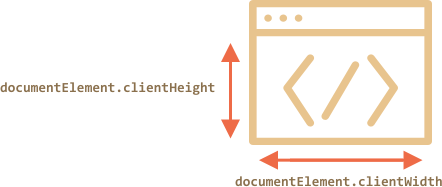

# Размеры и прокрутка окна

Как узнать ширину и высоту окна браузера? Как получить полную ширину и высоту документа, включая прокрученную часть? Как прокрутить страницу с помощью JavaScript?

С точки зрения DOM, корневым элементом документа является элемент `document.documentElement`. Он соответствует тегу `<html>` и имеет геометрические свойства, описанные в [предыдущей статье](info:size-and-scroll). В некоторых случаях мы можем использовать их, однако есть дополнительные методы и особенности, которые необходимо учитывать.

## Ширина/высота окна

Свойства `clientWidth/clientHeight` из `document.documentElement` -- это именно то, что нам нужно:



```online
Например, эта кнопка показывает высоту вашего окна:

<button onclick="alert(document.documentElement.clientHeight)">alert(document.documentElement.clientHeight)</button>
```

````warn header="Не `window.innerWidth/Height`"
Браузеры также поддерживают свойства `window.innerWidth/innerHeight`. Они выглядят так, как мы хотим. Так в чём разница?
Она небольшая, но чрезвычайно важная.

Если полоса прокрутки занимает некоторое место, то свойства `clientWidth/clientHeight` указывают на ширину/высоту без учёта полосы прокрутки.

И `window.innerWidth/innerHeight` игнорирует полосу прокрутки.

Если полоса прокрутки занимает некоторое место, то эти две строки выведут разные значения:
```js run
alert( window.innerWidth ); // полная ширина окна
alert( document.documentElement.clientWidth ); // ширина окна за вычетом полосы прокрутки
```

В большинстве случаев нам нужна *доступная* ширина окна: для рисования или позиционирования. То есть: внутри полос прокрутки, если таковые имеются. Поэтому мы должны использовать `documentElement.clientHeight/Width`.
````

```warn header="`DOCTYPE` -- это важно"
Обратите внимание, что геометрические свойства верхнего уровня могут работать немного иначе, если в HTML нет `<!DOCTYPE HTML>`. Иногда возникают странные вещи.

В принципе, это не касается непосредственно JavaScript, но отсутствие `DOCTYPE` может повлиять на работу скриптов на странице.
[Подробнее в](https://developer.mozilla.org/ru/docs/%D0%A1%D0%BB%D0%BE%D0%B2%D0%B0%D1%80%D1%8C/Doctype)
```

## Ширина/высота документа

Теоретически, т.к. корневым элементом документа является `documentElement.clientWidth/Height`, и он включает в себя всё содержимое, мы можем измерить его полный размер как `documentElement.scrollWidth/scrollHeight`.

Эти свойства хорошо подходят для обычных элементов. Но для целой страницы эти свойства работают не так, как предполагалось. В Chrome/Safari/Opera, если нет прокрутки, то `documentElement.scrollHeight` может быть даже меньше, чем
`documentElement.clientHeight`! Для обычных элементов это не имеет смысла.

Чтобы получить надёжный результат для высоты всего документа, мы должны взять максимум из этих свойств:

```js run
let scrollHeight = Math.max(
  document.body.scrollHeight, document.documentElement.scrollHeight,
  document.body.offsetHeight, document.documentElement.offsetHeight,
  document.body.clientHeight, document.documentElement.clientHeight
);

alert('Полная высота документа с прокручиваемой частью: ' + scrollHeight);
```

Почему?
Лучше не спрашивайте. Эти несоответствия идут с древних времён. Глубокой логики здесь нет.

## Получение текущей прокрутки [#page-scroll]

Обычные элементы хранят текущее состояние прокрутки в `elem.scrollLeft/scrollTop`.

Что же со страницей?
Большинство браузеров корректно обработает запрос к `documentElement.scrollLeft/Top`, однако в Chrome/Safari/Opera есть ошибки (например, [157855](https://code.google.com/p/chromium/issues/detail?id=157855), [106133](https://bugs.webkit.org/show_bug.cgi?id=106133)), из-за которых следует использовать `document.body` вместо `document.documentElement`.

К счастью, нам совсем не обязательно запоминать эти особенности из-за специальных свойств `window.pageXOffset/pageYOffset`:

```js run
alert('Текущая прокрутка сверху: ' + window.pageYOffset);
alert('Текущая прокрутка слева: ' + window.pageXOffset);
```

Эти свойства доступны только для чтения.

## Прокрутка: scrollTo, scrollBy, scrollIntoView [#window-scroll]

```warn
Для прокрутки страницы из JavaScript её DOM должен быть полностью собран.

Например, если мы попытаемся прокрутить страницу из скрипта в `<head>`, это не сработает.
```

Обычные элементы можно прокручивать, изменяя `scrollTop/scrollLeft`.

Мы можем сделать то же самое для страниц, но:
- Все браузеры, кроме Chrome/Safari/Opera: используйте для этого `document.documentElement.scrollTop/Left`.
- В Chrome/Safari/Opera: вместо этого используйте `document.body.scrollTop/Left`.

Должно сработать, но выглядит как кроссбраузерная несовместимость. Это не очень хорошо.
К счастью, есть более простое и универсальное решение: специальные методы [window.scrollBy(x,y)](mdn:api/Window/scrollBy) и [window.scrollTo(pageX,pageY)](mdn:api/Window/scrollTo).

- Метод `scrollBy(x,y)` прокручивает страницу относительно её текущего положения. Например, `scrollBy(0,10)` прокручивает страницу на `10px` вниз.

    ```online
    Кнопка ниже демонстрирует это:

    <button onclick="window.scrollBy(0,10)">window.scrollBy(0,10)</button>
    ```
- Метод `scrollTo(pageX,pageY)` прокручивает страницу относительно левого верхнего угла документа. Это всё равно, что `scrollLeft/scrollTop`.

    Для прокрутки до самого начала мы можем использовать `scrollTo(0,0)`.

    ```online
    <button onclick="window.scrollTo(0,0)">window.scrollTo(0,0)</button>
    ```

Эти методы одинаково работают для всех браузеров.

## scrollIntoView

Для полноты картины давайте рассмотрим ещё один метод: [elem.scrollIntoView(top)](mdn:api/Element/scrollIntoView).

Вызов `elem.scrollIntoView(top)` прокручивает страницу, чтобы `elem` оказался вверху.
У него есть один аргумент:

- если `top=true` (по умолчанию), то страница будет прокручена, чтобы `elem` появился в верхней части окна. Верхний край элемента совмещён с верхней частью окна.
- если `top=false`, то страница будет прокручена, чтобы `elem` появился внизу. Нижний край элемента будет совмещён с нижним краем окна.

```online
Кнопка ниже прокрутит страницу так, что она сама окажется вверху:

<button onclick="this.scrollIntoView()">this.scrollIntoView()</button>

А следующая кнопка прокрутит страницу так, что она сама окажется внизу

<button onclick="this.scrollIntoView(false)">this.scrollIntoView(false)</button>
```

## Запретить прокрутку

Иногда нам нужно сделать документ "непрокручиваемым". Например, при показе большого диалогового окна над документом – чтобы посетитель мог прокручивать это окно, но не документ.

Чтобы запретить прокрутку страницы, достаточно установить `document.body.style.overflow = "hidden"`.

```online
Попробуйте сами:

<button onclick="document.body.style.overflow = 'hidden'">`document.body.style.overflow = 'hidden'`</button>

<button onclick="document.body.style.overflow = ''">`document.body.style.overflow = ''`</button>

Первая кнопка останавливает прокрутку, вторая возобновляет её.
```
Аналогичным образом мы можем "заморозить" прокрутку для других элементов, а не только для `document.body`.

Недостатком этого способа является то, что сама полоса прокрутки исчезает. Если она занимала некоторую ширину, то теперь эта ширина освободится, и содержимое страницы расширится, текст «прыгнет», заняв освободившееся место.

Это выглядит немного странно, но это можно обойти, если сравнить `clientWidth` до и после остановки, и если `clientWidth` увеличится (значит полоса прокрутки исчезла), то добавим `padding` в `document.body` вместо полосы прокрутки, чтобы оставить ширину содержимого прежней.

## Итого

Размеры:

- Ширина/высота видимой части документа (ширина/высота области содержимого): `document.documentElement.clientWidth/Height`
- Ширина/высота всего документа с прокрученной частью:

    ```js
    let scrollHeight = Math.max(
      document.body.scrollHeight, document.documentElement.scrollHeight,
      document.body.offsetHeight, document.documentElement.offsetHeight,
      document.body.clientHeight, document.documentElement.clientHeight
    );
    ```

Прокрутка:

- Прокрутку окна можно получить так: `window.pageYOffset/pageXOffset`.
- Изменить текущую прокрутку:

    - `window.scrollTo(pageX,pageY)` -- абсолютные координаты,
    - `window.scrollBy(x,y)` -- прокрутка относительно текущего места,
    - `elem.scrollIntoView(top)` -- прокрутить страницу так, чтобы сделать `elem` видимым
    (выровнять относительно верхней/нижней части окна).
