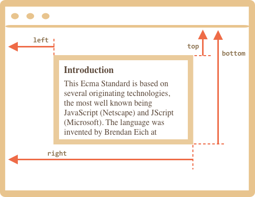
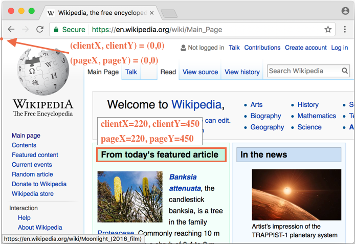
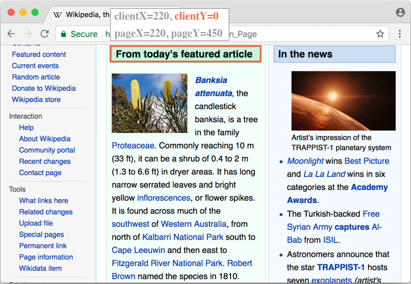

# Координаты

Чтобы передвигать элементы по экрану, нам следует познакомиться с системами координат.

Большинство соответствующих методов JavaScript работают в одной из двух указанных ниже систем координат:

1. Относительно верхнего левого угла окна браузера (или его видимой части).
2. Относительно верхнего левого угла документа.

Важно понимать разницу между этими системами, а также где какая используется.

## Координаты относительно окна: getBoundingClientRect

Начальной точкой служит верхний левый угол окна браузера.

Метод `elem.getBoundingClientRect()` возвращает координаты в контексте окна для элемента `elem` в виде объекта со свойствами:

- `top` -- позиция по оси Y верхнего края элемента,
- `left` -- позиция по оси X левого края элемента,
- `right` -- позиция по оси X правого края элемента,
- `bottom` -- позиция по оси Y нижнего края элемента.

Вот так:




Координаты относительно окна не учитывают прокрутку, они считаются от левого верхнего угла.

Другими словами, если мы прокрутим страницу, и элемент уйдёт вниз или вверх, то это *изменит его координаты в контексте окна*. Это очень важно.

```online
Кликните на кнопку, чтобы увидеть её координаты относительно окна:

<input id="brTest" type="button" value="Показать результат вызова button.getBoundingClientRect() для этой кнопки" onclick='showRect(this)'/>

<script>
function showRect(elem) {
  let r = elem.getBoundingClientRect();
  alert("{top:"+r.top+", left:"+r.left+", right:"+r.right+", bottom:"+ r.bottom + "}");
}
</script>

Если вы прокрутите страницу, то позиция кнопки поменяется, и её координаты в контексте окна тоже.
```

Также:

- Координаты могут считаться с десятичной дробью. Это нормально, ведь браузер использует дроби в своих внутренних вычислениях. Мы не обязаны округлять значения при установке `style.position.left/top`, браузер прекрасно понимает координаты с десятичными дробями.
- Координаты могут быть отрицательными. Например, если страница прокручена вниз и верхняя часть элемента `elem` ушла за пределы окна, то вызов `elem.getBoundingClientRect().top` вернёт отрицательное значение.
- Некоторые браузеры (типа Chrome) предоставляют дополнительные свойства `width` и `height` элемента, для которого вызывалась функция `getBoundingClientRect`. Их можно также получить путём вычитания: `height=bottom-top`, `width=right-left`.

```warn header="Координаты right/bottom отличаются от одноимённых CSS-свойств"
Если мы сравним координаты в контексте окна и координаты при позиционировании средствами CSS, то мы увидим сходство при использовании `position:fixed`. Ведь такое CSS-позиционирование тоже происходит относительно окна браузера (или его видимой части).

Но в CSS свойство `right` означает расстояние от правого края, и свойство `bottom` означает расстояние от нижнего края окна браузера.

Если мы взглянем на картинку выше, то будет понятно, что в JavaScript это не так. Все координаты в контексте окна считаются от верхнего левого угла, включая `right/bottom`.
```

## elementFromPoint(x, y) [#elementFromPoint]

The call to `document.elementFromPoint(x, y)` returns the most nested element at window coordinates `(x, y)`.

The syntax is:

```js
let elem = document.elementFromPoint(x, y);
```

For instance, the code below highlights and outputs the tag of the element that is now in the middle of the window:

```js run
let centerX = document.documentElement.clientWidth / 2;
let centerY = document.documentElement.clientHeight / 2;

let elem = document.elementFromPoint(centerX, centerY);

elem.style.background = "red";
alert(elem.tagName);
```

As it uses window coordinates, the element may be different depending on the current scroll position.

````warn header="For out-of-window coordinates the `elementFromPoint` returns `null`"
The method `document.elementFromPoint(x,y)` only works if `(x,y)` are inside the visible area.

If any of the coordinates is negative or exceeds the window width/height, then it returns `null`.

In most cases such behavior is not a problem, but we should keep that in mind.

Here's a typical error that may occur if we don't check for it:

```js
let elem = document.elementFromPoint(x, y);
// if the coordinates happen to be out of the window, then elem = null
*!*
elem.style.background = ''; // Error!
*/!*
```
````

## Using for position:fixed

Most of time we need coordinates to position something. In CSS, to position an element relative to the viewport we use `position:fixed` together with `left/top` (or `right/bottom`).

We can use `getBoundingClientRect` to get coordinates of an element, and then to show something near it.

For instance, the function `createMessageUnder(elem, html)` below shows the message under `elem`:

```js
let elem = document.getElementById("coords-show-mark");

function createMessageUnder(elem, html) {
  // create message element
  let message = document.createElement('div');
  // better to use a css class for the style here
  message.style.cssText = "position:fixed; color: red";

*!*
  // assign coordinates, don't forget "px"!
  let coords = elem.getBoundingClientRect();

  message.style.left = coords.left + "px";
  message.style.top = coords.bottom + "px";
*/!*

  message.innerHTML = html;

  return message;
}

// Usage:
// add it for 5 seconds in the document
let message = createMessageUnder(elem, 'Hello, world!');
document.body.append(message);
setTimeout(() => message.remove(), 5000);
```

```online
Click the button to run it:

<button id="coords-show-mark">Button with id="coords-show-mark", the message will appear under it</button>
```

The code can be modified to show the message at the left, right, below, apply CSS animations to "fade it in" and so on. That's easy, as we have all the coordinates and sizes of the element.

But note the important detail: when the page is scrolled, the message flows away from the button.

The reason is obvious: the message element relies on `position:fixed`, so it remains at the same place of the window while the page scrolls away.

To change that, we need to use document-based coordinates and `position:absolute`.

## Document coordinates

Document-relative coordinates start from the upper-left corner of the document, not the window.

In CSS, window coordinates correspond to `position:fixed`, while document coordinates are similar to `position:absolute` on top.

We can use `position:absolute` and `top/left` to put something at a certain place of the document, so that it remains there during a page scroll. But we need the right coordinates first.

For clarity we'll call window coordinates `(clientX,clientY)` and document coordinates `(pageX,pageY)`.

When the page is not scrolled, then window coordinate and document coordinates are actually the same. Their zero points match too:



And if we scroll it, then `(clientX,clientY)` change, because they are relative to the window, but `(pageX,pageY)` remain the same.

Here's the same page after the vertical scroll:



- `clientY` of the header `"From today's featured article"` became `0`, because the element is now on window top.
- `clientX` didn't change, as we didn't scroll horizontally.
- `pageX` and `pageY` coordinates of the element are still the same, because they are relative to the document.

## Getting document coordinates [#getCoords]

There's no standard method to get the document coordinates of an element. But it's easy to write it.

The two coordinate systems are connected by the formula:
- `pageY` = `clientY` + height of the scrolled-out vertical part of the document.
- `pageX` = `clientX` + width of the scrolled-out horizontal part of the document.

The function `getCoords(elem)` will take window coordinates from `elem.getBoundingClientRect()` and add the current scroll to them:

```js
// get document coordinates of the element
function getCoords(elem) {
  let box = elem.getBoundingClientRect();

  return {
    top: box.top + pageYOffset,
    left: box.left + pageXOffset
  };
}
```

## Итого

Любая точка на странице имеет координаты:

1. Относительно окна браузера -- `elem.getBoundingClientRect()`.
2. Относительно документа -- `elem.getBoundingClientRect()` плюс прокрутка.

Координаты в контексте окна подходят для использования с `position:fixed`, а координаты относительно документа -- для использования с `position:absolute`.

Каждая из систем координат имеет свои преимущества и недостатки. Иногда будет лучше применить одну, а иногда -- другую, как это и происходит с позиционированием в CSS, где мы выбираем между `absolute` и `fixed`.
