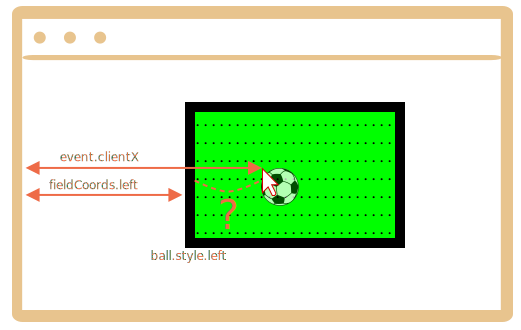

Сначала мы должны выбрать метод позиционирования мяча.

Мы не можем использовать `position:fixed`, поскольку прокрутка страницы будет перемещать мяч с поля.

Правильнее использовать `position:absolute`, и, чтобы сделать позиционирование действительно надёжным, сделаем само поле (`field`) позиционированным.

Тогда мяч будет позиционирован относительно поля:

```css
#field {
  width: 200px;
  height: 150px;
  position: relative;
}

#ball {
  position: absolute;
  left: 0; /* по отношению к ближайшему расположенному предку (поле) */
  top: 0;
  transition: 1s all; /* CSS-анимация для значений left/top делает передвижение мяча плавным */
}
```

Далее мы должны назначить корректные значения `ball.style.left/top`. Сейчас они содержат координаты относительно поля.

Картинка:



У нас есть значения `event.clientX/clientY` -- координаты нажатия мышки относительно окна браузера;

Чтобы получить значение `left` для мяча после нажатия мышки относительно поля, мы должны из координаты нажатия мышки вычесть координату левого края поля и ширину границы:

```js
let left = event.clientX - fieldCoords.left - field.clientLeft;
```

Значение `ball.style.left` означает "левый край элемента" (мяча). И если мы назначим такой `left` для мяча, тогда его левая граница, а не центр, будет под курсором мыши.

Нам нужно сдвинуть мяч на половину его высоты вверх и половину его ширины влево, чтобы центр мяча точно совпадал с точкой нажатия мышки.

В итоге значение для `left` будет таким:

```js
let left = event.clientX - fieldCoords.left - field.clientLeft - ball.offsetWidth/2;
```

Вертикальная координата будет вычисляться по той же логике.

Следует помнить, что ширина и высота мяча должна быть известна в тот момент, когда мы получаем значение `ball.offsetWidth`. Это значение может задаваться в HTML или CSS.
