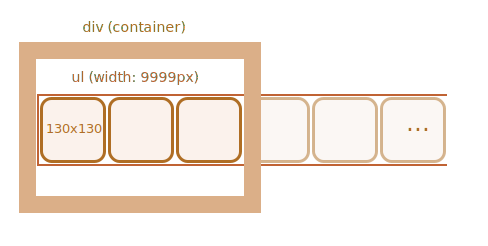

Лента изображений в разметке должна быть представлена как список `ul/li` с картинками ``.

Нужно расположить ленту внутри `
` фиксированного размера, так чтобы в один момент была видна только нужная часть списка:

Чтобы список сделать горизонтальным, нам нужно применить CSS-свойство `display: inline-block` для `<li>`.

Для тега `` мы также должны настроить `display`, поскольку по умолчанию он `inline`. Во всех элементах типа `inline` резервируется дополнительное место под "хвосты" символов. И чтобы его убрать, нам нужно прописать `display:block`.

Для «прокрутки» будем сдвигать `<ul>`. Это можно делать по-разному, например, назначением CSS-свойства `transform: translateX()` (лучше для производительности) или `margin-left`: 

У внешнего `
` фиксированная ширина, поэтому «лишние» изображения обрезаются.

Вся карусель -- это самостоятельный "графический компонент" на странице, таким образом нам лучше его "обернуть" в отдельный `
` и уже модифицировать стили внутри него.
