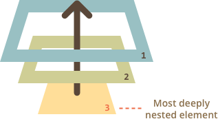

# Всплытие и перехват

Давайте начнём с примера.

Этот обработчик для `<div>` сработает, если вы кликните по вложенному тегу `<em>` или `<code>`:

```html autorun height=60
<div onclick="alert('Обработчик!')">
  <em>Если вы кликните на <code>EM</code>, сработает обработчик на <code>DIV</code></em>
</div>
```

Вам не кажется это странным? Почему же сработал обработчик на `<div>`, если клик произошёл на `<em>`?

## Всплытие

Принцип всплытия очень простой.

**Когда на элементе происходит событие, обработчики сначала срабатывают на нём, потом на его родителе, затем выше и так далее, вверх по цепочке вложенности.**

Например, есть 3 вложенных элемента `FORM > DIV > P`, с обработчиком на каждом:

```html run autorun
<style>
  body * {
    margin: 10px;
    border: 1px solid blue;
  }
</style>

<form onclick="alert('form')">FORM
  <div onclick="alert('div')">DIV
    <p onclick="alert('p')">P</p>
  </div>
</form>
```

Клик по внутреннему `<p>` вызовет обработчик `onclick`:
1. Сначала на самом `<p>`.
2. Потом на внешнем `<div>`.
3. Затем на внешнем `<form>`.
4. И так далее вверх по цепочке до самого `document`.



Поэтому если кликнуть на `<p>`, то мы увидим три оповещения: `p` -> `div` -> `form`.

Этот процесс называется "всплытием", потому что события "всплывают" от внутреннего элемента вверх через родителей, подобно тому, как всплывает пузырек воздуха в воде.

```warn header="*Почти* все события всплывают."
Ключевое слово в этой фразе -- "почти".

Например, событие `focus` не всплывает. В дальнейшем мы увидим и другие примеры. Однако, стоит понимать, что это скорее исключение, чем правило, всё-таки большинство событий всплывают.
```

## event.target

A handler on a parent element can always get the details about where it actually happened.

**The most deeply nested element that caused the event is called a *target* element, accessible as `event.target`.**

Note the differences from `this` (=`event.currentTarget`):

- `event.target` -- is the "target" element that initiated the event, it doesn't change through the bubbling process.
- `this` -- is the "current" element, the one that has a currently running handler on it.

For instance, if we have a single handler `form.onclick`, then it can "catch" all clicks inside the form. No matter where the click happened, it bubbles up to `<form>` and runs the handler.

In `form.onclick` handler:

- `this` (`=event.currentTarget`) is the `<form>` element, because the handler runs on it.
- `event.target` is the concrete element inside the form that actually was clicked.

Check it out:

[codetabs height=220 src="bubble-target"]

It's possible that `event.target` equals `this` -- when the click is made directly on the `<form>` element.

## Stopping bubbling

A bubbling event goes from the target element straight up. Normally it goes upwards till `<html>`, and then to `document` object, and some events even reach `window`, calling all handlers on the path.

But any handler may decide that the event has been fully processed and stop the bubbling.

The method for it is `event.stopPropagation()`.

For instance, here `body.onclick` doesn't work if you click on `<button>`:

```html run autorun height=60
<body onclick="alert(`the bubbling doesn't reach here`)">
  <button onclick="event.stopPropagation()">Click me</button>
</body>
```

```smart header="event.stopImmediatePropagation()"
If an element has multiple event handlers on a single event, then even if one of them stops the bubbling, the other ones still execute.

In other words, `event.stopPropagation()` stops the move upwards, but on the current element all other handlers will run.

To stop the bubbling and prevent handlers on the current element from running, there's a method `event.stopImmediatePropagation()`. After it no other handlers execute.
```

```warn header="Don't stop bubbling without a need!"
Bubbling is convenient. Don't stop it without a real need: obvious and architecturally well-thought.

Sometimes `event.stopPropagation()` creates hidden pitfalls that later may become problems.

For instance:

1. We create a nested menu. Each submenu handles clicks on its elements and calls `stopPropagation` so that the outer menu won't trigger.
2. Later we decide to catch clicks on the whole window, to track users' behavior (where people click). Some analytic systems do that. Usually the code uses `document.addEventListener('click'…)` to catch all clicks.
3. Our analytic won't work over the area where clicks are stopped by `stopPropagation`. We've got a "dead zone".

There's usually no real need to prevent the bubbling. A task that seemingly requires that may be solved by other means. One of them is to use custom events, we'll cover them later. Also we can write our data into the `event` object in one handler and read it in another one, so we can pass to handlers on parents information about the processing below.
```


## Capturing

There's another phase of event processing called "capturing". It is rarely used in real code, but sometimes can be useful.

The standard [DOM Events](http://www.w3.org/TR/DOM-Level-3-Events/) describes 3 phases of event propagation:

1. Capturing phase -- the event goes down to the element.
2. Target phase -- the event reached the target element.
3. Bubbling phase -- the event bubbles up from the element.

Here's the picture of a click on `<td>` inside a table, taken from the specification:


That is: for a click on `<td>` the event first goes through the ancestors chain down to the element (capturing), then it reaches the target, and then it goes up (bubbles), calling handlers on its way.

**Before we only talked about bubbling, because the capturing phase is rarely used. Normally it is invisible to us.**

Handlers added using `on<event>`-property or using HTML attributes or using `addEventListener(event, handler)` don't know anything about capturing, they only run on the 2nd and 3rd phases.

To catch an event on the capturing phase, we need to set the handler `capture` option to `true`:

```js
elem.addEventListener(..., {capture: true})
// or, just "true" is an alias to {capture: true}
elem.addEventListener(..., true)
```

There are two possible values of the `capture` option:

- If it's `false` (default), then the handler is set on the bubbling phase.
- If it's `true`, then the handler is set on the capturing phase.

Note that while formally there are 3 phases, the 2nd phase ("target phase": the event reached the element) is not handled separately: handlers on both capturing and bubbling phases trigger at that phase.

Let's see both capturing and bubbling in action:

```html run autorun height=140 edit
<style>
  body * {
    margin: 10px;
    border: 1px solid blue;
  }
</style>

<form>FORM
  <div>DIV
    <p>P</p>
  </div>
</form>

<script>
  for(let elem of document.querySelectorAll('*')) {
    elem.addEventListener("click", e => alert(`Capturing: ${elem.tagName}`), true);
    elem.addEventListener("click", e => alert(`Bubbling: ${elem.tagName}`));
  }
</script>
```

The code sets click handlers on *every* element in the document to see which ones are working.

If you click on `<p>`, then the sequence is:

1. `HTML` -> `BODY` -> `FORM` -> `DIV` -> `P` (capturing phase, the first listener), and then:
2. `P` -> `DIV` -> `FORM` -> `BODY` -> `HTML` (bubbling phase, the second listener).

Please note that `P` shows up two times: at the end of capturing and at the start of bubbling.

There's a property `event.eventPhase` that tells us the number of the phase on which the event was caught. But it's rarely used, because we usually know it in the handler.

```smart header="To remove the handler, `removeEventListener` needs the same phase"
If we `addEventListener(..., true)`, then we should mention the same phase in `removeEventListener(..., true)` to correctly remove the handler.
```

## Summary

The event handling process:

- When an event happens -- the most nested element where it happens gets labeled as the "target element" (`event.target`).
- Then the event first moves from the document root down to the `event.target`, calling handlers assigned with `addEventListener(...., true)` on the way (`true` is a shorthand for `{capture: true}`).
- Then the event moves from `event.target` up to the root, calling handlers assigned using  `on<event>` and `addEventListener` without the 3rd argument or with the 3rd argument `false`.

Each handler can access `event` object properties:

- `event.target` -- the deepest element that originated the event.
- `event.currentTarget` (=`this`) -- the current element that handles the event (the one that has the handler on it)
- `event.eventPhase` -- the current phase (capturing=1, bubbling=3).

Any event handler can stop the event by calling `event.stopPropagation()`, but that's not recommended, because we can't really be sure we won't need it above, maybe for completely different things.

The capturing phase is used very rarely, usually we handle events on bubbling. And there's a logic behind that.

In real world, when an accident happens, local authorities react first. They know best the area where it happened. Then higher-level authorities if needed.

The same for event handlers. The code that set the handler on a particular element knows maximum  details about the element and what it does. A handler on a particular `<td>` may be suited for that exactly `<td>`, it knows everything about it, so it should get the chance first. Then its immediate parent also knows about the context, but a little bit less, and so on till the very top element that handles general concepts and runs the last.

Bubbling and capturing lay the foundation for "event delegation" -- an extremely powerful event handling pattern that we study in the next chapter.
