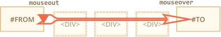
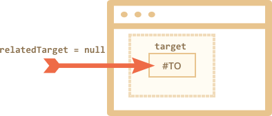
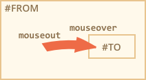

# Мышь: движение mouseover/out, mouseenter/leave

В этой главе мы более подробно рассмотрим события, возникающие при движении указателя (курсора) мыши над элементами страницы.

## Mouseover/mouseout, relatedTarget

Событие `mouseover` происходит однократно в момент, когда курсор оказывается над элементом, а событие `mouseout` -- тоже однократно, но в момент, когда курсор уходит с элемента.


Эти события являются особенными, потому что у них имеется свойство `relatedTarget`.

Для события `mouseover`:

- `event.target` -- это элемент, на который курсор перешёл.
- `event.relatedTarget` -- это элемент, с которого курсор ушёл.

Для события `mouseout` наоборот:

- `event.target` -- это элемент, с которого курсор ушёл.
- `event.relatedTarget` -- это элемент, на который курсор перешёл.

```online
В примере ниже каждое изображение - отдельный элемент. При движении курсора по этим элементам в текстовом поле отображаются произошедшие события.

Каждое из них содержит информацию о том, откуда на соответствующий элемент перешёл и куда с него ушёл курсор.

[codetabs src="mouseoverout" height=280]
```

```warn header="Свойство `relatedTarget` может быть `null`"
Свойство `relatedTarget` может быть `null`.

Это нормально и означает, что указатель мыши перешёл не с другого элемента, а из-за пределов окна браузера. Или же, наоборот, ушёл за пределы окна.

Разработчикам следует держать в голове такие варианты при использовании `event.relatedTarget` в своём коде. Если, например, написать `event.relatedTarget.tagName`, то при отсутствии `event.relatedTarget` будет ошибка.
```

## Частота запуска событий

Событие `mousemove` происходит при движении мыши. Однако, это не означает, что указанное событие генерируется при прохождении каждого пикселя.

Браузер периодически проверяет позицию курсора и, заметив изменения, генерирует события `mousemove`.

Это означает, что если пользователь двигает мышкой очень быстро, то некоторые DOM-элементы могут быть пропущены:



Если курсор мыши двигается очень быстро с `#FROM` на `#TO` элемент, как это показано выше, то лежащие между ними `<div>`-ы (или некоторые из них) могут быть пропущены. Событие `mouseout` может запуститься на элементе `#FROM` и затем сразу же сгенерируется `mouseover` на элементе `#TO`.

На практике это даже может быть полезно, потому что если промежуточных элементов много, то на самом деле не хотелось бы обрабатывать события `mouseout` и `mouseover` для каждого из них.

С другой стороны, не стоит рассчитывать, что курсор мыши будет медленно переходить от одного элемента к другому. Он может и "прыгать".

В частности, возможно, что курсор запрыгнет в середину страницы из-за пределов окна браузера, и в таком случае получится, что `relatedTarget=null`, так как курсор пришёл "из ниоткуда":



<div style="display:none">
В случае быстрого прохождения курсором промежуточных элементов события вообще могут не генерироваться. Но если уж курсор перешёл на элемент (было сгенерировано `mouseover`), то гарантировано при выходе с того элемента будет запущено событие `mouseout`.
</div>

```online
Проверьте это в песочнице ниже.

Вёрстка состоит из двух элементов типа `<div>`, один из которых вложен в другой. Если быстро провести мышью над ними, то может не будет сгенерировано никаких событий вообще, а может события будут запущены только на красном элементе, а может только на зеленом.

Также попробуйте поставить курсор на красный элемент, а затем очень быстро сделайте движение мышкой вниз через зеленый элемент. Если у вас получилось достаточно быстро, то на родительском элементе не было сгенерировано никаких событий.

[codetabs height=360 src="mouseoverout-fast"]
```

## "Лишний" mouseout при уходе на потомка

Представьте ситуацию -- курсор мыши перешёл на элемент. Сгенерировано событие `mouseover`. Затем курсор перешёл на дочерний элемент. Интересно, что в таком случае будет сгенерировано `mouseout`. То есть курсор всё ещё на элементе, но мы получили `mouseout`!



Это выглядит странно, но легко объясняется.

**По логике браузера, курсор мыши может быть только над одним элементом в любой момент времени - над самым глубоко вложенным (и/или имеющим приоритетное значение z-index).**

Таким образом, если курсор переходит на другой элемент (пусть даже дочерний), то он покидает предыдущий. Достаточно просто.

На примере ниже можно увидеть забавную последовательность сгенерированных событий.

Красный `<div>` находится внутри синего. На синем `<div>`-е определены обработчики событий `mouseover/out`, которые отображают всю информацию по ним в текстовое поле ниже.

Попробуйте зайти курсором на синий элемент, а затем перейдите на красный -- и смотрите, какие события сгенерировались:

[codetabs height=360 src="mouseoverout-child"]

1. При входе на синий элемент -- мы получили `mouseover [target: blue]`.
2. Затем при переходе с синего на красный -- `mouseout [target: blue]` (уход с родителя).
3. ...и сразу же `mouseover [target: red]`.

Таким образом, для обработчика, который не принимает во внимание свойство `target`, ситуация выглядит так, как будто курсор ушёл с родительского элемента, запустив `mouseout` `(2)`, а затем вернулся обратно, запустив `mouseover` `(3)`.

Если постоянно передвигать курсор мышки с/на элемент, то мы получим много "ложных" срабатываний обработчиков. В простых случаях это может быть незаметно для пользователя, но в сложных случаях могут проявляться нежелательные побочные эффекты.

Чтобы их избежать, можно использовать события `mouseenter/mouseleave`.

## События mouseenter и mouseleave

События `mouseenter/mouseleave` похожи на `mouseover/mouseout`. Они тоже генерируются, когда курсор мыши переходит на элемент или покидает его.

Но есть и пара важных отличий:

1. Переходы внутри элемента по дочерним элементам не считаются.
2. События `mouseenter/mouseleave` не всплывают.

Эти события интуитивно очень понятны.

Когда курсор становится над элементом -- генерируется `mouseenter`, и не имеет значения, где именно находится курсор внутри элемента. Событие `mouseleave` происходит, когда курсор покидает элемент.

Если мы вернёмся к одному из прошлых примеров и в этот раз поставим обработчики событий `mouseenter/mouseleave` на синий `<div>`, а далее произведём те же действия -- мы увидим, что сгенерируются только события, связанные с движением курсора относительно синего `<div>`. Ничего не произойдет при переходе на красный `<div>` и обратно. Переходы с/на дочерние элементы игнорируются.

[codetabs height=340 src="mouseleave"]

## Делегирование событий

События `mouseenter/leave` простые и легкие в использовании. Но они не всплывают. Таким образом, мы не можем их делегировать.

Представьте ситуацию, когда мы хотим обрабатывать события, сгенерированные при движении курсора по ячейкам таблицы. И в таблице сотни ячеек.

Очевидное решение -- определить обработчик на родительском элементе `<table>` и там обрабатывать возникающие события. Но `mouseenter/leave` не всплывают. То есть если событие происходит на ячейке `<td>`, то только обработчик на `<td>` может поймать его.

Обработчики событий `mouseenter/leave` на `<table>` срабатывают, если курсор оказывается над таблицей в целом или же уходит с неё. Невозможно получить какую-либо информацию о переходах между ячейками внутри таблицы.

Не проблема -- давайте использовать `mouseover/mouseout`.

Простой обработчик может выглядеть так:

```js
// Давайте выделим ячейки под курсором
table.onmouseover = function(event) {
  let target = event.target;
  target.style.background = 'pink';
};

table.onmouseout = function(event) {
  let target = event.target;
  target.style.background = '';
};
```

```online
[codetabs height=480 src="mouseenter-mouseleave-delegation"]
```

Эти обработчики срабатывают, когда курсор передвигается между элементами внутри таблицы (не только `<td>`).

Но мы бы хотели, чтобы они срабатывали только на переходах между ячейками и выделяли ячейку целиком. Мы не хотим обрабатывать события переходов курсора между элементами внутри ячейки `<td>`.

Одно из решений:

- Запоминать выделенную в данный момент ячейку `<td>` в переменную.
- На `mouseover` -- игнорировать событие, если мы всё ещё внутри той же самой ячейки `<td>`.
- На `mouseout` -- игнорировать событие, если это не уход с текущей ячейки `<td>`.

Это отфильтровывает все лишние события, возникающие при переходе курсора между дочерними элементами `<td>`.

```offline
Детали реализации в [полном примере](sandbox:mouseenter-mouseleave-delegation-2).
```

```online
Полный пример со всеми деталями:

[codetabs height=380 src="mouseenter-mouseleave-delegation-2"]

Попробуйте подвигать курсор между ячейками и внутри них. Быстро или медленно - без разницы. В отличие от предыдущего примера выделяется только сама ячейка `<td>`.
```


## Итого

Мы рассмотрели события `mouseover`, `mouseout`, `mousemove`, `mouseenter` и `mouseleave`.

Стоит отметить, что:

- Быстрое движение мышкой может не запустить события `mouseover, mousemove, mouseout` на промежуточных элементах.
- События `mouseover/out` и `mouseenter/leave` имеют дополнительное свойство: `relatedTarget`. Оно дополняет свойство `target` и содержит ссылку на элемент, с/на который мы переходим.
- События `mouseover/out` запускаются, даже когда происходит переход с родительского на дочерний элемент. В этом случае предполагается, что курсор мыши может быть только над одним элементом в любой момент времени - над самым глубоко вложенным.
- События `mouseenter/leave` не всплывают и не генерируются, когда курсор переходит на дочерний элемент. Они запускаются только при переходах с/на сам элемент, не принимая во внимание его дочерние элементы.
