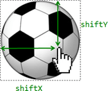

# Drag'n'Drop с событиями мыши

Drag'n'Drop - отличный способ улучшить интерфейс. Захват элемента мышкой и его перенос визуально упростят что угодно: от копирования и перетаскивания в файловых менеджерах до оформления заказа в корзине.

В современном стандарте HTML5 есть [раздел о событиях мыши](https://html.spec.whatwg.org/multipage/interaction.html#dnd).

Они интересны тем, что позволяют легко решать простые задачи. Например, можно перетащить файл в браузер, так что JS получит доступ к его содержимому.

Но у встроенных событий, входящих в Drag’n’Drop, также есть ограничения. Например, нельзя организовать перенос "только по горизонтали" или "только по вертикали". Также нельзя ограничить перенос внутри заданной зоны. Есть и другие интерфейсные задачи, которые такими встроенными событиями нереализуемы.

Поэтому здесь мы будем рассматривать Drag’n’Drop при помощи событий мыши. Это не так уж сложно.

## Алгоритм Drag'n'Drop

Основной алгоритм Drag’n’Drop выглядит так:

1. Отслеживаем событие `mousedown` на переносимом элементе.
2. При нажатии – готовим элемент к перемещению (например, создаём его копию).
3. При наступлении `mousemove` передвигаем элемент на новые координаты путём смены `left/top` и `position:absolute`.
4. На `mouseup` (при отпускании кнопки мыши) -- остановить перенос элемента и произвести все действия, связанные с окончанием Drag’n’Drop..

Это и есть база Drag'n'Drop. Мы могли бы расширить этот алгоритм, например, подсветив элементы при наведении на них курсора.

В следующем примере эти шаги реализованы для переноса мяча:

```js
ball.onmousedown = function(event) { // (1) отследить нажатие

  // (2) подготовить к перемещению: разместить поверх остального содержимого и в абсолютных координатах
  ball.style.position = 'absolute';
  ball.style.zIndex = 1000;
  // переместим в body, чтобы мяч был точно не внутри position:relative
  document.body.append(ball);  
  // и установим абсолютно спозиционированный мяч под курсор

  moveAt(event.pageX, event.pageY);

  // передвинуть мяч под координаты курсора
  // и сдвинуть на половину ширины/высоты для центрирования
  function moveAt(pageX, pageY) {
    ball.style.left = pageX - ball.offsetWidth / 2 + 'px';
    ball.style.top = pageY - ball.offsetHeight / 2 + 'px';
  }

  function onMouseMove(event) {
    moveAt(event.pageX, event.pageY);
  }

  // (3) перемещать по экрану
  document.addEventListener('mousemove', onMouseMove);

  // (4) отследить окончание переноса, удалив обработчики событий
  ball.onmouseup = function() {
    document.removeEventListener('mousemove', onMouseMove);
    ball.onmouseup = null;
  };

};
```

Если запустить этот код, то мы заметим нечто странное. При начале переноса мяч "раздваивается" и переносится не сам мяч, а его "клон".

```online
Это можно увидеть в действии:

[iframe src="ball" height=230]

Попробуйте перенести мяч мышкой и вы увидите описанное, довольно-таки странное, поведение.
```

Всё потому, что браузер имеет свой собственный Drag’n’Drop, который автоматически запускается и вступает в конфликт с нашим. Это происходит именно для картинок и некоторых других элементов.

Его нужно отключить:

```js
ball.ondragstart = function() {
  return false;
};
```

Теперь всё будет в порядке.

```online
В действии:

[iframe src="ball2" height=230]
```

Ещё одна особенность правильного Drag’n’Drop -- событие `mousemove` отслеживается на `document`, а не на `ball`. С первого взгляда кажется, что мышь всегда над мячом и обработчик `mousemove` можно повесить на сам мяч, а не на документ.

Но как мы помним, событие `mousemove` возникает хоть и часто, но не для каждого пикселя. Поэтому из-за быстрого движения курсор может спрыгнуть с мяча и оказаться где-нибудь в середине документа (или даже за пределами окна).

Вот почему мы должны отслеживать `mousemove` на всём `document`.

## Правильное позиционирование

В примерах выше мяч позиционируется в центре под курсором мыши:

```js
ball.style.left = pageX - ball.offsetWidth / 2 + 'px';
ball.style.top = pageY - ball.offsetHeight / 2 + 'px';
```

Неплохо, но есть побочные эффекты. В частности, в самом начале переноса, особенно если мячик "взят" за край – он резко "прыгает" центром под курсор мыши.

Было бы лучше, если бы изначальный сдвиг курсора относительно элемента сохранялся.

Где захватили, за ту "часть элемента" и переносим:



1. Когда человек нажимает на мячик (`mousedown`) -- мы можем зафиксировать расстояние от курсора до левого верхнего угла шара в переменных `shiftX/shiftY`. И нужно удерживать это расстояние при перетаскивании.

    Чтобы получить этот сдвиг, мы можем вычесть координаты:

    ```js
    // onmousedown
    let shiftX = event.clientX - ball.getBoundingClientRect().left;
    let shiftY = event.clientY - ball.getBoundingClientRect().top;
    ```

    Заметим, что в JavaScript нет способа получить координаты относительно документа, поэтому мы используем здесь координаты относительно окна.

2. Далее при переносе мяча мы позиционируем шар с учётом сдвига, например, так:

    ```js
    // onmousemove
    // ball has position:absoute
    ball.style.left = event.pageX - *!*shiftX*/!* + 'px';
    ball.style.top = event.pageY - *!*shiftY*/!* + 'px';
    ```

Итоговый код с правильным позиционированием:

```js
ball.onmousedown = function(event) {

*!*
  let shiftX = event.clientX - ball.getBoundingClientRect().left;
  let shiftY = event.clientY - ball.getBoundingClientRect().top;
*/!*

  ball.style.position = 'absolute';
  ball.style.zIndex = 1000;
  document.body.append(ball);

  moveAt(event.pageX, event.pageY);

  // центрирует мяч по координатам (pageX, pageY)
  function moveAt(pageX, pageY) {
    ball.style.left = pageX - *!*shiftX*/!* + 'px';
    ball.style.top = pageY - *!*shiftY*/!* + 'px';
  }

  function onMouseMove(event) {
    moveAt(event.pageX, event.pageY);
  }

  // передвигает мяч на событии mousemove
  document.addEventListener('mousemove', onMouseMove);

  // отпускает мяч, удаляя обработчики
  ball.onmouseup = function() {
    document.removeEventListener('mousemove', onMouseMove);
    ball.onmouseup = null;
  };

};

ball.ondragstart = function() {
  return false;
};
```

```online
В действии:

[iframe src="ball3" height=230]
```

Различие особенно заметно, если захватить мяч за правый нижний угол. В предыдущем примере мячик "прыгнет" серединой под курсор, в этом – будет плавно переноситься с текущей позиции.

## Выявление droppable

В предыдущих примерах мяч можно было бросить просто где угодно в пределах окна. В реальности мы обычно берём один элемент и перетаскиваем на другой. Например, файл в папку или что-то ещё.

Иначе говоря, мы берём перетаскиваемый (англ."draggable") элемент и помещаем его в элемент для "сброса" (англ. "droppable").

Нам нужно знать конечную цель, где можно осуществить сброс, чтобы выполнить соответствующее действие и желательно выделить её в процессе перетаскивания.

Решение довольно интересное и немного хитрое, давайте рассмотрим его.

Какова первая идея? Возможно, установить обработчики `onmouseover/mouseup` на те элементы, которые потенциально могли бы принять на себя окончание перетаскивания и засечь, когда указатель мыши появится над ними. И тогда бы мы поняли, что над этим элементом мы произвели `drag'n'drop`.

Но это не работает.

Проблема в том, что при перемещении перетаскиваемый элемент всегда находится над другими элементами. А события мыши срабатывают только на верхнем элементе, но не на нижнем.

Например, у нас есть два элемента `<div>`: красный поверх синего. Не получится поймать событие на синем, потому что красный сверху:

```html run autorun height=60
<style>
  div {
    width: 50px;
    height: 50px;
    position: absolute;
    top: 0;
  }
</style>
<div style="background:blue" onmouseover="alert('never works')"></div>
<div style="background:red" onmouseover="alert('over red!')"></div>
```

То же самое с перетаскиваемым элементом. Мяч всегда находится поверх других элементов, поэтому события срабатывают на нём. Какие бы обработчики мы ни ставили на нижние элементы, они не будут пойманы.

Вот почему первоначальная идея поместить обработчики в потенциальных "ловцов" перетаскиваемого элемента не реализуема. Обработчики не сработают.

Так что же делать?

Существует метод `document.elementFromPoint(clientX, clientY)`. Он возвращает наиболее глубоко вложенный элемент по заданным координатам окна (или `null`, если координаты находятся за пределами окна).

Таким образом, через любой из наших обработчиков событий мыши мы можем обнаружить тот элемент, который потеницально мог бы принять на себя перемещаемый объект:

```js
// внутри обработчика события мыши
ball.hidden = true; // (*)
let elemBelow = document.elementFromPoint(event.clientX, event.clientY);
ball.hidden = false;
// elemBelow - элемент под шаром. Если на нём можно закончить перемещение, мы сможем этим управлять.
```

Заметим, нам нужно спрятать мяч перед вызовом функции `(*)`. В противном случае по этим координатам мы будем получать мяч, ведь это и есть элемент непосредственно под указателем: `elemBelow=ball`.

Мы можем использовать этот код для проверки того, над чем мы "летим", в любое время. Также мы можем управлять моментом, когда появится элемент, где можно было бы его сбросить.

Расширенный код  `onMouseMove` для поиска элементов для "сброса":

```js
let currentDroppable = null; // потенциальный элемент для сбрасывания, над которым мы пролетаем прямо сейчас

function onMouseMove(event) {
  moveAt(event.pageX, event.pageY);

  ball.hidden = true;
  let elemBelow = document.elementFromPoint(event.clientX, event.clientY);
  ball.hidden = false;

  // события перемещения мыши могут запускаться из окна (когда мяч перетащили за пределы экрана)
  // если clientX/clientY за пределами окна, elementfromPoint вернёт null
  if (!elemBelow) return;

  // элементы, на которые можно потенциально сбросить мяч, пометим классом droppable (может быть и другая логика)
  let droppableBelow = elemBelow.closest('.droppable');

  if (currentDroppable != droppableBelow) { // если были какие-либо изменения
    // пролетаем ли мы над droppable или нет
    // внимание: оба значения могут быть null
    // currentDroppable=null, если мы не над droppable (например, над пустым пространством)
    // droppableBelow=null, если мы не над droppable именно сейчас, пока длится это событие

    if (currentDroppable) {
      // логика обработки процесса, когда мы покидаем droppable (удаляем подсветку)
      leaveDroppable(currentDroppable);
    }
    currentDroppable = droppableBelow;
    if (currentDroppable) {
      // логика обработки процесса, когда мы входим в зону droppable
      enterDroppable(currentDroppable);
    }
  }
}
```

В приведённом ниже примере, когда мяч перетаскивается через футбольные ворота, ворота подсвечиваются.

[codetabs height=250 src="ball4"]

Теперь в течение всего процесса в переменной `currentDroppable` мы храним текущую "цель удаления", и мы можем использовать её для того, чтобы выделить цель, или для любых других вещей.

## Итого

Мы рассмотрели основной алгоритм `Drag'n'Drop`.

Ключевые идеи:

1. Поток событий: `ball.mousedown` -> `document.mousemove` -> `ball.mouseup` (отменяющий стандартный `ondragstart`).
2. В начале перетаскивания: запомните начальное смещение указателя относительно элемента: `shiftX/shiftY` -- и сохраните его при перетаскивании.
3. Выявите droppable элементы под указателем с помощью `document.elementFromPoint`.

На этой основе можно сделать многое.

- На `mouseup` можно завершить сбрасывание: изменить данные, переместить элементы.
- Можно подсветить элементы, пока мышь "пролетает" над ними.
- Можно ограничить перетаскивание определенной областью или направлением.
- Можно использовать делегирование событий для `mousedown/up`. Обработчик событий большой площади, который проверяет `event.target`, может управлять Drag’n’Drop для сотен элементов.
- И так далее.

Существуют фреймворки, которые строят архитектуру поверх этого алгоритма, создавая такие классы, как `DragZone`, `Droppable`, `Draggable`. Большинство из них делают вещи, аналогичные описанным выше, поэтому вам должно быть легко их понять сейчас. Вы можете и создать ваш собственный `Drag'n'Drop`, потому что вы уже знаете, как управлять процессом, и он может быть более гибким, чем адаптация чего-то готового.
