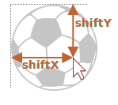

# Drag'n'Drop с событиями мыши

Drag'n'Drop - отличный способ улучшить интерфейс. Захват элемента мышкой и его перенос визуально упростят что угодно: от копирования и перемещения документов (как в файловых менеджерах) до оформления заказа ("положить в корзину").

В современном стандарте HTML5 есть [раздел о Drag and Drop](https://html.spec.whatwg.org/multipage/interaction.html#dnd) - и там есть специальные события именно для Drag'n'Drop переноса, такие как `dragstart`, `dragend` и так далее.

Они интересны тем, что позволяют легко решать простые задачи. Например, можно перетащить файл в браузер, так что JS получит доступ к его содержимому.

Но у них есть и ограничения. Например, нельзя организовать перенос "только по горизонтали" или "только по вертикали". Также нельзя ограничить перенос внутри заданной зоны. Есть и другие интерфейсные задачи, которые такими встроенными событиями не реализуемы. Кроме того, мобильные устройства плохо их поддерживают.

Здесь мы будем рассматривать Drag'n'Drop при помощи событий мыши.

## Алгоритм Drag'n'Drop

Базовый алгоритм Drag'n'Drop выглядит так:

1. При `mousedown` - готовим элемент к перемещению, если необходимо (например, создаём его копию).
2. Затем при `mousemove` передвигаем элемент на новые координаты путём смены `left/top` и `position:absolute`.
3. При `mouseup` - остановить перенос элемента и произвести все действия, связанные с окончанием Drag'n'Drop.

Это и есть основа Drag'n'Drop. Позже мы сможем расширить этот алгоритм, например, подсветив элементы при наведении на них мыши.

В следующем примере эти шаги реализованы для переноса мяча:

```js
ball.onmousedown = function(event) { // (1) отследить нажатие

  // (2) подготовить к перемещению:
  // разместить поверх остального содержимого и в абсолютных координатах
  ball.style.position = 'absolute';
  ball.style.zIndex = 1000;
  // переместим в body, чтобы мяч был точно не внутри position:relative
  document.body.append(ball);  
  // и установим абсолютно спозиционированный мяч под курсор

  moveAt(event.pageX, event.pageY);

  // передвинуть мяч под координаты курсора
  // и сдвинуть на половину ширины/высоты для центрирования
  function moveAt(pageX, pageY) {
    ball.style.left = pageX - ball.offsetWidth / 2 + 'px';
    ball.style.top = pageY - ball.offsetHeight / 2 + 'px';
  }

  function onMouseMove(event) {
    moveAt(event.pageX, event.pageY);
  }

  // (3) перемещать по экрану
  document.addEventListener('mousemove', onMouseMove);

  // (4) положить мяч, удалить более ненужные обработчики событий
  ball.onmouseup = function() {
    document.removeEventListener('mousemove', onMouseMove);
    ball.onmouseup = null;
  };

};
```

Если запустить этот код, то мы заметим нечто странное. При начале переноса мяч "раздваивается" и переносится не сам мяч, а его "клон".

```online
Это можно увидеть в действии:

[iframe src="ball" height=230]

Попробуйте перенести мяч мышкой и вы увидите описанное поведение.
```

Всё потому, что браузер имеет свой собственный Drag'n'Drop, который автоматически запускается и вступает в конфликт с нашим. Это происходит именно для картинок и некоторых других элементов.

Его нужно отключить:

```js
ball.ondragstart = function() {
  return false;
};
```

Теперь всё будет в порядке.

```online
В действии:

[iframe src="ball2" height=230]
```

Ещё одна деталь - событие `mousemove` отслеживается на `document`, а не на `ball`. С первого взгляда кажется, что мышь всегда над мячом и обработчик `mousemove` можно повесить на сам мяч, а не на документ.

Но, как мы помним, событие `mousemove` возникает хоть и часто, но не для каждого пикселя. Поэтому из-за быстрого движения указатель может спрыгнуть с мяча и оказаться где-нибудь в середине документа (или даже за пределами окна).

Вот почему мы должны отслеживать `mousemove` на всём `document`, чтобы поймать его.

## Правильное позиционирование

В примерах выше мяч позиционируется так, что его центр оказывается под указателем мыши:

```js
ball.style.left = pageX - ball.offsetWidth / 2 + 'px';
ball.style.top = pageY - ball.offsetHeight / 2 + 'px';
```

Неплохо, но есть побочные эффекты. Мы, для начала переноса, можем нажать мышью на любом месте мяча. Если мячик "взят" за самый край – то в начале переноса он резко "прыгает", центрируясь под указателем мыши.

Было бы лучше, если бы изначальный сдвиг курсора относительно элемента сохранялся.

Где захватили, за ту "часть элемента" и переносим:



Обновим наш алгоритм:

1. Когда человек нажимает на мячик (`mousedown`) -- запомним расстояние от курсора до левого верхнего угла шара в переменных `shiftX/shiftY`. Далее будем удерживать это расстояние при перетаскивании.

    Чтобы получить этот сдвиг, мы можем вычесть координаты:

    ```js
    // onmousedown
    let shiftX = event.clientX - ball.getBoundingClientRect().left;
    let shiftY = event.clientY - ball.getBoundingClientRect().top;
    ```

2. Далее при переносе мяча мы позиционируем его с тем же сдвигом относительно указателя мыши, вот так:

    ```js
    // onmousemove
    // ball has position:absoute
    ball.style.left = event.pageX - *!*shiftX*/!* + 'px';
    ball.style.top = event.pageY - *!*shiftY*/!* + 'px';
    ```

Итоговый код с правильным позиционированием:

```js
ball.onmousedown = function(event) {

*!*
  let shiftX = event.clientX - ball.getBoundingClientRect().left;
  let shiftY = event.clientY - ball.getBoundingClientRect().top;
*/!*

  ball.style.position = 'absolute';
  ball.style.zIndex = 1000;
  document.body.append(ball);

  moveAt(event.pageX, event.pageY);

  // переносит мяч на координаты (pageX, pageY),
  // дополнительно учитывая изначальный сдвиг относительно указателя мыши
  function moveAt(pageX, pageY) {
    ball.style.left = pageX - *!*shiftX*/!* + 'px';
    ball.style.top = pageY - *!*shiftY*/!* + 'px';
  }

  function onMouseMove(event) {
    moveAt(event.pageX, event.pageY);
  }

  // передвигаем мяч при событии mousemove
  document.addEventListener('mousemove', onMouseMove);

  // отпустить мяч, удалить ненужные обработчики
  ball.onmouseup = function() {
    document.removeEventListener('mousemove', onMouseMove);
    ball.onmouseup = null;
  };

};

ball.ondragstart = function() {
  return false;
};
```

```online
В действии (внутри ифрейма):

[iframe src="ball3" height=230]
```

Различие особенно заметно, если захватить мяч за правый нижний угол. В предыдущем примере мячик "прыгнет" серединой под курсор, в этом – будет плавно переноситься с текущей позиции.

## Цели переноса (droppable)

В предыдущих примерах мяч можно было бросить просто где угодно в пределах окна. В реальности мы обычно берём один элемент и перетаскиваем в другой. Например, "файл" в "папку" или что-то ещё.

Абстрактно говоря, мы берём перетаскиваемый (draggable) элемент и помещаем его в другой элемент "цель переноса" (droppable).

Нам нужно знать:
- куда пользователь положил элемент в конце переноса, чтобы обработать его окончание
- и, желательно, над какой потенциальной целью (элемент, куда можно положить, например, изображение папки) он находится в процессе переноса, чтобы подсветить её.

Решение довольно интересное и немного хитрое, давайте рассмотрим его.

Какой может быть первая мысль? Возможно, установить обработчики событий `mouseover/mouseup` на элемент - потенциальную цель переноса?

Но это не работает.

Проблема в том, что при перемещении перетаскиваемый элемент всегда находится поверх других элементов. А события мыши срабатывают только на верхнем элементе, но не на нижнем.

Например, у нас есть два элемента `<div>`: красный поверх синего (полностью перекрывает). Не получится поймать событие на синем, потому что красный сверху:

```html run autorun height=60
<style>
  div {
    width: 50px;
    height: 50px;
    position: absolute;
    top: 0;
  }
</style>
<div style="background:blue" onmouseover="alert('никогда не сработает')"></div>
<div style="background:red" onmouseover="alert('над красным!')"></div>
```

То же самое с перетаскиваемым элементом. Мяч всегда находится поверх других элементов, поэтому события срабатывают на нём. Какие бы обработчики мы ни ставили на нижние элементы, они не будут выполнены.

Вот почему первоначальная идея поставить обработчики на потенциальные цели переноса нереализуема. Обработчики не сработают.

Так что же делать?

Существует метод `document.elementFromPoint(clientX, clientY)`. Он возвращает наиболее глубоко вложенный элемент по заданным координатам окна (или `null`, если указанные координаты находятся за пределами окна).

Мы можем использовать его, чтобы из любого обработчика событий мыши выяснить, над какой мы потенциальной целью переноса, вот так:

```js
// внутри обработчика события мыши
ball.hidden = true; // (*) прячем переносимый элемент

let elemBelow = document.elementFromPoint(event.clientX, event.clientY);
// elemBelow - элемент под мячом (возможная цель переноса)

ball.hidden = false;
```

Заметим, нам нужно спрятать мяч перед вызовом функции `(*)`. В противном случае по этим координатам мы будем получать мяч, ведь это и есть элемент непосредственно под указателем: `elemBelow=ball`. Так что мы прячем его и тут же показываем обратно.

Мы можем использовать этот код для проверки того, над каким элементом мы "летим", в любое время. И обработать окончание переноса, когда оно случится.

Расширенный код  `onMouseMove` с поиском потенциальных целей переноса:

```js
// потенциальная цель переноса, над которой мы пролетаем прямо сейчас
let currentDroppable = null;

function onMouseMove(event) {
  moveAt(event.pageX, event.pageY);

  ball.hidden = true;
  let elemBelow = document.elementFromPoint(event.clientX, event.clientY);
  ball.hidden = false;

  // событие mousemove может произойти и когда указатель за пределами окна
  // (мяч перетащили за пределы экрана)

  // если clientX/clientY за пределами окна, elementFromPoint вернёт null
  if (!elemBelow) return;

  // потенциальные цели переноса помечены классом droppable (может быть и другая логика)
  let droppableBelow = elemBelow.closest('.droppable');

  if (currentDroppable != droppableBelow) {
    // мы либо залетаем на цель, либо улетаем из неё
    // внимание: оба значения могут быть null
    //   currentDroppable=null,
    //     если мы были не над droppable до этого события (например, над пустым пространством)
    //   droppableBelow=null,
    //     если мы не над droppable именно сейчас, во время этого события

    if (currentDroppable) {
      // логика обработки процесса "вылета" из droppable (удаляем подсветку)
      leaveDroppable(currentDroppable);
    }
    currentDroppable = droppableBelow;
    if (currentDroppable) {
      // логика обработки процесса, когда мы "влетаем" в элемент droppable
      enterDroppable(currentDroppable);
    }
  }
}
```

В приведённом ниже примере, когда мяч перетаскивается через футбольные ворота, ворота подсвечиваются.

[codetabs height=250 src="ball4"]

Теперь в течение всего процесса в переменной `currentDroppable` мы храним текущую потенциальную цель переноса, над которой мы сейчас, можем её подсветить или сделать что-то ещё.

## Итого

Мы рассмотрели основной алгоритм Drag'n'Drop.

Ключевые идеи:

1. Поток событий: `ball.mousedown` -> `document.mousemove` -> `ball.mouseup` (не забудьте отменить браузерный `ondragstart`).
2. В начале перетаскивания: запоминаем начальное смещение указателя относительно элемента: `shiftX/shiftY` -- и сохраняем его при перетаскивании.
3. Выявляем потенциальные цели переноса под указателем с помощью `document.elementFromPoint`.

На этой основе можно сделать многое.

- На `mouseup` - по-разному завершать перенос: изменять данные, перемещать элементы.
- Можно подсвечивать элементы, пока мышь "пролетает" над ними.
- Можно ограничить перетаскивание определённой областью или направлением.
- Можно использовать делегирование событий для `mousedown/up`. Один обработчик событий на большой зоне, который проверяет `event.target`, может управлять Drag'n'Drop для сотен элементов.
- И так далее.

Существуют фреймворки, которые строят архитектуру поверх этого алгоритма, создавая такие классы, как `DragZone`, `Droppable`, `Draggable`. Большинство из них делают вещи, аналогичные описанным выше. Вы можете и создать вашу собственную реализацию переноса, как видите, это достаточно просто, возможно, проще, чем адаптация чего-то готового.
