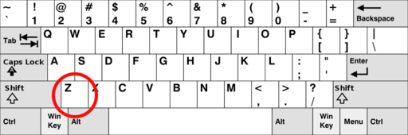
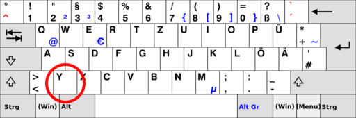

# Клавиатура: keydown и keyup

Прежде чем перейти к клавиатуре, обратите внимание, что на современных устройствах есть и другие способы "ввести что-то". Например, распознавание речи (это особенно актуально на мобильных устройствах) или Копировать/Вставить с помощью мыши.

Поэтому, если мы хотим корректно отслеживать ввод в поле `<input>`, то одних клавиатурных событий недостаточно. Существует специальное событие `input`, которое следит за любыми изменениями в поле `<input>`. И оно справляется со своей задачей намного лучше. Мы рассмотрим его позже в главе <info:events-change-input>.

События клавиатуры же должны использоваться, если мы хотим обрабатывать взаимодействие пользователя конкретно с клавиатурой (в том числе виртуальной). К примеру, если нам зачем-то нужно реагировать на стрелочные клавиши `Вверх` и `Вниз` или горячие клавиши (включая комбинации клавиш).


## Тестовый стенд [#keyboard-test-stand]

```offline
Для того, чтобы лучше понять, как работают события клавиатуры, можно использовать [тестовый стенд](sandbox:keyboard-dump).
```

```online
Для того, чтобы лучше понять, как работают события клавиатуры, можно использовать тестовый стенд ниже.

Сфокусируйтесь на поле и нажмите какую-нибудь клавишу.

[codetabs src="keyboard-dump" height=480]
```


## Keydown и keyup

Событие `keydown` происходит при нажатии клавиши, а `keyup` -- при отпускании.

### event.code и event.key

У объекта события есть свойство `key`, чьё значение -- символ, и свойство `code` -- "физический код клавиши".

Так, ту же самую клавишу `Z` можно нажать с клавишей `Shift` и без неё. В результе получится два разных символа: `z` в нижнем регистре и `Z` в верхнем регистре.

Свойство `event.key` -- это непосредственно символ, и он может различаться. Но `event.code` всегда будет тот же:

| Клавиша          | `event.key` | `event.code` |
|--------------|-------------|--------------|
| `Z`          |`z` (нижний регистр)         |`KeyZ`        |
| `Shift+Z`    |`Z` (Верхний регистр)          |`KeyZ`        |


Если пользователь работает с разными языками, то при переключении на другой язык, символ изменится с `"Z"` на совершенно другой. Получившееся станет новым значением `event.key`, тогда как `event.code` останется тем же: `"KeyZ"`.

```smart header="\"KeyZ\" и другие клавишные коды"
У каждой клавиши есть код, который зависит от её расположения на клавиатуре. Подробно о клавишных кодах можно прочитать в [спецификации о кодах событий UI](https://www.w3.org/TR/uievents-code/).

Например:
- Буквенные клавиши имеют коды по типу `"Key<буква>"`: `"KeyA"`, `"KeyB"` и т.д.
- Коды числовых клавиш строятся по принципу: `"Digit<число>"`: `"Digit0"`, `"Digit1"` и т.д.
- Код специальных клавиш это их имя: `"Enter"`, `"Backspace"`, `"Tab"` и т.д.

Существует несколько широко распостранённых раскладок клавиатуры и в спецификации приведены клавишные коды к каждой из них.

Смотрите [раздел спецификации, посвящённый буквенно-цифровым клавишам](https://www.w3.org/TR/uievents-code/#key-alphanumeric-section), там полный список кодов, или просто нажмите нужную клавишу на тестовом стенде [teststand](#keyboard-test-stand) выше.
```

```warn header="Регистр важен: `\"KeyZ\"`, а не `\"keyZ\"`"
Выглядит очевидно, но многие всё равно ошибаются.

Пожалуйста, также старайтесь избегать опечаток: правильно `KeyZ`, а не `keyZ`. Условие `event.code=="keyZ"` работать не будет: первая буква в слове `"Key"` должна быть заглавная.
```


Но что делать, если клавиша не буквенно-цифровая? Например, `Shift` или `F1`, или какая-либо другая специальная клавиша? В таких случаях значение свойства `event.key` примерно тоже, что и у `event.code`:


| Клавиша          | `event.key` | `event.code` |
|--------------|-------------|--------------|
| `F1`      |`F1`          |`F1`        |
| `Backspace`      |`Backspace`          |`Backspace`        |
| `Shift`|`Shift`          |`ShiftRight` или `ShiftLeft`        |

Обратите внимание, что `event.code` точно указывает, какая именно клавиша нажата. Так, большинство клавиатур имеют по две клавиши `Shift`: слева и справа. `event.code` уточняет, какая именно из них была нажата, в то время как `event.key` сообщает о "смысле" клавиши: что вообще было нажато (`Shift`).

Допустим, мы хотим обработать горячую клавишу `Ctrl+Z` (или `Cmd+Z` для Mac). Большинство текстовых редакторов к этой комбинации подключают действие "Отменить". Мы можем захотеть поставить обработчик событий на `keydown` и проверять, какая клавиша была нажата -- чтобы для каких-то наших целей распознать, когда произойдет нажатие горячей клавиши.

Здесь возникает дилемма: в нашем обработчике стоит проверять значение `event.key` или `event.code`?

С одной стороны, значение `event.key` изменяется в зависимости от языка и если у пользователя установлено в ОС несколько языков, и он переключается между ними, нажатие на одну и ту же клавишу будет давать разные символы. Так что имеет смысл проверять `event.code`, ведь его значение всегда одно и тоже.

Вот пример кода: 

```js run
document.addEventListener('keydown', function(event) {
  if (event.code == 'KeyZ' && (event.ctrlKey || event.metaKey)) {
    alert('Отменить!')
  }
});
```

С другой стороны, с `event.code` тоже есть проблемы. На разных раскладках, к одной и той же клавише могут быть привязаны разные символы (буквы).

Например, вот схема стандартной (US) раскладки ("QWERTY") и под ней немецкой ("QWERTZ") раскладки (которые любезно предоставляет Википедия):





Для одной и той же клавиши, в раскладке US значение `event.code` равно "Z", в то время как в немецкой "Y".

Таким образом, для пользователей с немецкой раскладкой `event.code` при нажатии на "Y" будет равен `KeyZ`.

Звучит странно, но тут уж ничего не поделать. В [спецификации](https://www.w3.org/TR/uievents-code/#table-key-code-alphanumeric-writing-system) прямо упоминается такое поведение.

- Преимущество `event.code` заключается в том, что его значение всегда остается неизменным, будучи привязанным к физическому местоположению клавиши, даже если пользователь меняет язык. Так что горячие клавиши, использущие это свойство, будут работать даже в случае переключения языка. 
- `event.code` может содержать неправильный символ на нестандартной раскладке. Одни и те же буквы на разных раскладках могут сопоставляться с разным физическими клавишам, что приводит к разным кодам. Это происходит с несколькими кодами, например `keyA`, `keyQ`, `keyZ` (как мы уже видели). Вы можете найти полный список в [спецификации](https://www.w3.org/TR/uievents-code/#table-key-code-alphanumeric-writing-system).

Таким образом, что бы надёжно отслеживать символы, зависящие от раскладки, `event.key` может быть более подходящим инструментом.

## Автоповтор

При долгом нажатии клавиши возникает автоповтор: `keydown` срабатывает снова и снова, и когда клавишу отпускают, то отрабатывает `keyup`. Так что ситуация, когда много `keydown`и один `keyup`, абсолютно нормальна.

Для событий, вызванных автоповтором, у объекта события свойство `event.repeat` равно `true`.


## Действия по умолчанию

Действия по умолчанию весьма разнообразны, так как существует много сценариев, инициируемых с помощью клавиатуры.

Для примера:

- Печатаем что-либо (самое очевидное).
- Удаляем напечатанное (клавиша `Delete`).
- Прокручиваем страницу (клавиша `PageDown`).
- Браузер открывает диалоговое окно "Сохранить" (`Ctrl+S`)
-  ...и так далее.

Предотвращение стандартного действия с помощью `event.preventDefault()` работает практически во всех сценариях, кроме тех, которые происходят на уровне операционной системы. Например, комбинация Alt+F4 инициирует закрытие браузера в Windows, что бы мы не делали в JavaScript.

Для примера, `<input>` ниже ожидает телефонный номер, так что ничего кроме чисел, `+`, `()` или `-` принято не будет:

```html autorun height=60 run
<script>
function checkPhoneKey(key) {
  return (key >= '0' && key <= '9') || key == '+' || key == '(' || key == ')' || key == '-';
}
</script>
<input *!*onkeydown="return checkPhoneKey(event.key)"*/!* placeholder="Введите номер телефона" type="tel">
```

Заметьте, что специальные клавиши по типу `Backspace`, `Left`, `Right`, `Ctrl+V` не работают как должны в поле для ввода. Это побочный эффект жесткого фильтра `checkPhoneKey`.

Добавим ему немного больше свободы:


```html autorun height=60 run
<script>
function checkPhoneKey(key) {
  return (key >= '0' && key <= '9') || key == '+' || key == '(' || key == ')' || key == '-' ||
    key == 'ArrowLeft' || key == 'ArrowRight' || key == 'Delete' || key == 'Backspace';
}
</script>
<input onkeydown="return checkPhoneKey(event.key)" placeholder="Введите номер телефона" type="tel">
```

Теперь стрелочки и удаление прекрасно работают.

...Но мы всё равно можем ввести что угодно, с помощью правого клика + Вставить. Так что наш фильтр тоже не обладает 100% надёжностью. Мы можем просто оставить всё как есть, потому что в большинстве случаев это работает. Альтернатива может быть отслеживание события `input` -- оно генерируется после любых изменений в поле `<input>` и мы можем проверять новое значение и подчеркивать/изменять его если оно нам не подходит.

## "Дела минувших дней"

Раньше, использовалось событие `keypress`, а так же свойства `keyCode`, `charCode`, `which` у объекта события.

Но количество несовместимостей браузера было так велико, что разработчики спецификации решили что нужно что-то менять и ввели `event.code` с `event.key`. Старый код еще работает, браузеры продолжают поддерживать и `keypress`, и `keyCode` с  `charCode` и `which`, но более нет никакой необходимости в их использовании. 

Было время, когда эта глава включала их подробное описание. Но теперь, всё это устарело и было заменено подробным описанием современной обработки событий клавиатуры.

## Итого

Нажатие клавиши всегда генерирует клавиатурное событие, будь то буквенно-цифровая клавиша или специальная типа `Shift` или `Ctrl` и т.д. Единственным исключением является клавиша `Fn`, которая присутствует на клавиатуре некоторых ноутбуков. События на клавиатуре для неё нет, потому что часто события, которая она инициирует, работают на более низком уровне, чем ОС.

События клавиатуры:

- `keydown` -- при нажатии на клавишу (если клавиша остается нажатой, происходит автоповтор),
- `keyup` -- при отпускании клавиши.

Главные свойства для работы с клавиатурными событиями:

- `code` -- "код клавиши" (`"KeyA"`, `"ArrowLeft"` и так далее), особый код, привязанный к физическому расположению клавиши на клавиатуре.
- `key` -- символ (`"A"`, `"a"` и так далее), для всех групп клавиш (кроме буквенно-цифровой) обычно имеет то же значение, что и `code`.

Ранее, события клавиатуры иногда ипользовались для отслеживания ввода данных пользователем в полях формы. Это не надёжно, потому как ввод данных не обязательно может осуществляться с помощью клавиатуры. Существуют события `input` и `change` специально для обработки ввода (рассмотренные позже в главе <info:events-change-input>). Они срабатывают в результате любого ввода, включая Копировать/Вставить мышью и распознование речи.

События клавиатуры же должны использоваться только по назначению, - для клавиатуры. Например, что бы реагировать на горячие или специальные клавиши.