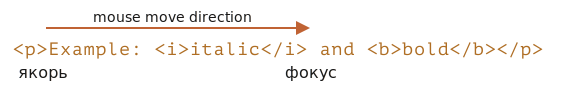

libs:
  - d3
  - domtree

---

# Selection и Range

В этой главе мы рассмотрим выделение как в документе, так и в полях формы, таких как `<input>`.

JavaScript позволяет получать существующее выделение, выделять и снимать выделение как целиком, так и по частям, убирать выделенную часть из документа, оборачивать её в тег и так далее.

Вы можете получить готовые решения в секции "Итого" в конце статьи, но узнаете гораздо больше, если прочитаете главу целиком. Используемые для выделения встроенные классы `Range` и `Selection` просты для понимания, и после их изучения вам уже не понадобятся "готовые рецепты", чтобы сделать всё, что захотите.

## Range

В основе выделения лежит [Range](https://dom.spec.whatwg.org/#ranges) -- диапазон. Он представляет собой пару "граничных точек": начало и конец диапазона.

Каждая точка представлена как родительский DOM-узел с относительным смещением от начала. Если этот узел - DOM-элемент, то смещение - это номер дочернего элемента, а для текстового узла смещение - позиция в тексте. Скоро будут примеры.

Давайте что-нибудь выделим.

Для начала мы создадим диапазон (конструктор не имеет параметров):

```js
let range = new Range();
```

Затем мы установим границы выделения, используя `range.setStart(node, offset)` и `range.setEnd(node, offset)`.

Например, рассмотрим этот фрагмент HTML-кода:

```html
<p id="p">Example: <i>italic</i> and <b>bold</b></p>
```

Взглянем на его DOM-структуру, обратите внимание на текстовые узлы, они важны для нас:

<div class="select-p-domtree"></div>

<script>
let selectPDomtree = {
  "name": "P",
  "nodeType": 1,
  "children": [{
    "name": "#text",
    "nodeType": 3,
    "content": "Example: "
  }, {
    "name": "I",
    "nodeType": 1,
    "children": [{
      "name": "#text",
      "nodeType": 3,
      "content": "italic"
    }]
  }, {
    "name": "#text",
    "nodeType": 3,
    "content": " and "
  }, {
    "name": "B",
    "nodeType": 1,
    "children": [{
      "name": "#text",
      "nodeType": 3,
      "content": "bold"
    }]
  }]
}

drawHtmlTree(selectPDomtree, 'div.select-p-domtree', 690, 320);
</script>

Выделим `"Example: <i>italic</i>"`. Это первые два дочерних узла тега `<p>` (учитывая текстовые узлы):


```html run
<p id="p">Example: <i>italic</i> and <b>bold</b></p>

<script>
*!*
  let range = new Range();

  range.setStart(p, 0);
  range.setEnd(p, 2);
*/!*

  // toString, вызванный у экземпляра Range, возвращает его содержимое в виде текста (без тегов)
  alert(range); // Example: italic

  // применим этот диапазон к выделению документа (объясняется далее)
  document.getSelection().addRange(range);
</script>
```

- `range.setStart(p, 0)` -- устанавливает начало диапазона на нулевом дочернем элементе тега `<p>` (Это текстовый узел `"Example: "`).
- `range.setEnd(p, 2)` -- расширяет диапазон до 2го (но не включая его) дочернего элемента тега `<p>` (это текстовый узел `" and "`, но так как конец не включён, последний включённый узел - это тег `<i>`).

Ниже представлен расширенный пример, в котором вы можете попробовать другие варианты:

```html run autorun
<p id="p">Example: <i>italic</i> and <b>bold</b></p>

From <input id="start" type="number" value=1> – To <input id="end" type="number" value=4>
<button id="button">Click to select</button>
<script>
  button.onclick = () => {
  *!*
    let range = new Range();

    range.setStart(p, start.value);
    range.setEnd(p, end.value);
  */!*

    // применим выделение, объясняется далее
    document.getSelection().removeAllRanges();
    document.getSelection().addRange(range);
  };
</script>
```

К примеру, выделение с `1` до `4` возвращает следующий диапазон `<i>italic</i> and <b>bold</b>`.


Не обязательно использовать один и тот же элемент в `setStart` и `setEnd`. Диапазон может охватывать множество не связанных между собой элементов. Важно лишь чтобы конец шёл после начала.

### Выделение частей текстовых узлов

Давайте выделим текст частично, как показано ниже:


Это также возможно, нужно просто установить начало и конец как относительное смещение в текстовых узлах.

Нам нужно создать диапазон, который:
- начинается со второй позиции первого дочернего узла тега `<p>` (захватываем всё, кроме первых двух букв "Ex<b>ample:</b> ")
- заканчивается на 3 позиции первого дочернего узла тега `<b>` (захватываем первые три буквы "<b>bol</b>d", но не более):

```html run
<p id="p">Example: <i>italic</i> and <b>bold</b></p>

<script>
  let range = new Range();

  range.setStart(p.firstChild, 2);
  range.setEnd(p.querySelector('b').firstChild, 3);

  alert(range); // ample: italic and bol

  // применим выделение к документу  (объясняется далее)
  window.getSelection().addRange(range);
</script>
```

Объект диапазона Range имеет следующие свойства:


- `startContainer`, `startOffset` -- узел и начальное смещение,
  - в примере выше: первый текстовый узел внутри тега `<p>` и `2`.
- `endContainer`, `endOffset` -- узел и конечное смещение,
  - в примере выше: первый текстовый узел внутри тега `<b>` и `3`.
- `collapsed` -- boolean, `true`, если диапазон начинается и заканчивается на одном и том же месте (следовательно, в диапазон ничего не входит),
  - в примере выше: `false`
- `commonAncestorContainer` -- ближайший общий предок всех узлов в пределах диапазона,
  - в примере выше: `<p>`

## Методы Range

Существует множество удобных методов для манипулирования диапазонами.

Установить начало диапазона:

- `setStart(node, offset)` установить начальную границу в позицию `offset` в `node`
- `setStartBefore(node)` установить начальную границу прямо перед `node`
- `setStartAfter(node)` установить начальную границу прямо после `node`

Установить конец диапазона (похожи на предыдущие методы):

- `setEnd(node, offset)` установить конечную границу в позицию `offset` в `node`
- `setEndBefore(node)` установить конечную границу прямо перед `node`
- `setEndAfter(node)` установить конечную границу прямо после `node`

**Как было показано, `node` может быть как текстовым узлом, так и элементом: для текстовых узлов `offset` пропускает указанное количество символов, в то время как для элементов - указанное количество дочерних узлов.**

Другие:
- `selectNode(node)` выделить `node` целиком
- `selectNodeContents(node)` выделить всё содержимое `node`
- `collapse(toStart)` если указано `toStart=true`, установить конечную границу в начало, иначе установить начальную границу в конец, схлопывая таким образом диапазон
- `cloneRange()` создать новый диапазон с идентичными границами

Чтобы манипулировать содержимым в пределах диапазона:

- `deleteContents()` - удалить содержимое диапазона из документа
- `extractContents()` - удалить содержимое диапазона из документа и вернуть как [DocumentFragment](info:modifying-document#document-fragment)
- `cloneContents()` - склонировать содержимое диапазона и вернуть как [DocumentFragment](info:modifying-document#document-fragment)
- `insertNode(node)` -- вставить `node` в документ в начале диапазона
- `surroundContents(node)` -- обернуть `node` вокруг содержимого диапазона. Чтобы этот метод сработал, диапазон должен содержать как открывающие, так и закрывающие теги для всех элементов внутри себя: не допускаются частичные диапазоны по типу `<i>abc`.

Используя эти методы, мы можем делать с выделенными узлами что угодно.

Проверим описанные методы в действии:

```html run autorun height=260
Нажмите на кнопку, чтобы соответствующий метод отработал на выделении, или на "resetExample", чтобы восстановить выделение как было.

<p id="p">Example: <i>italic</i> and <b>bold</b></p>

<p id="result"></p>
<script>
  let range = new Range();

  // Каждый описанный метод представлен здесь:
  let methods = {
    deleteContents() {
      range.deleteContents()
    },
    extractContents() {
      let content = range.extractContents();
      result.innerHTML = "";
      result.append("Извлечено: ", content);
    },
    cloneContents() {
      let content = range.cloneContents();
      result.innerHTML = "";
      result.append("Клонировано: ", content);
    },
    insertNode() {
      let newNode = document.createElement('u');
      newNode.innerHTML = "НОВЫЙ УЗЕЛ";
      range.insertNode(newNode);
    },
    surroundContents() {
      let newNode = document.createElement('u');
      try {
        range.surroundContents(newNode);
      } catch(e) { alert(e) }
    },
    resetExample() {
      p.innerHTML = `Example: <i>italic</i> and <b>bold</b>`;
      result.innerHTML = "";

      range.setStart(p.firstChild, 2);
      range.setEnd(p.querySelector('b').firstChild, 3);

      window.getSelection().removeAllRanges();  
      window.getSelection().addRange(range);  
    }
  };

  for(let method in methods) {
    document.write(`<div><button onclick="methods.${method}()">${method}</button></div>`);
  }

  methods.resetExample();
</script>
```

Также существуют методы сравнения диапазонов, но они редко используются. Когда они вам понадобятся, вы можете прочитать о них в [спецификации](https://dom.spec.whatwg.org/#interface-range) или [справочнике MDN](https://developer.mozilla.org/ru/docs/Web/API/Range).


## Selection

`Range` это общий объект для управления диапазонами выделения. Мы можем создавать и передавать подобные объекты. Сами по себе они ничего визуально не выделяют.

Выделение в документе представлено объектом `Selection`, который может быть получен как `window.getSelection()` или `document.getSelection()`.

Выделение может включать ноль или более диапазонов. По крайней мере, так утверждается в [Спецификации Selection API](https://www.w3.org/TR/selection-api/). На практике же выделить несколько диапазонов в документе можно только в Firefox, используя `key:Ctrl+click` (`key:Cmd+click` для Mac).

Ниже представлен скриншот выделения с 3 диапазонами, сделанный в Firefox:


Остальные браузеры поддерживают максимум 1 диапазон. Как мы увидим далее, некоторые методы `Selection` подразумевают, что может быть несколько диапазонов, но, как было сказано ранее, во всех браузерах, кроме Firefox, может быть не более одного диапазона.

## Свойства Selection

Аналогично диапазону, выделение имеет начальную границу, именуемую "якорем", и конечную, называемую "фокусом".

Основные свойства выделения:

- `anchorNode` -- узел, с которого начинается выделение,
- `anchorOffset` -- смещение в  `anchorNode`, где начинается выделение,
- `focusNode` -- узел, на котором выделение заканчивается,
- `focusOffset` -- смещение в  `focusNode`, где выделение заканчивается,
- `isCollapsed` -- `true`, если диапазон выделения пуст или не существует.
- `rangeCount` -- количество диапазонов в выделении, максимум `1` во всех браузерах, кроме Firefox.

````smart header="Конец выделения может быть в документе до его начала"
Существует несколько методов выделить содержимое, в зависимости от устройства пользователя: мышь, горячие клавиши, нажатия пальцем и другие.

Некоторые из них, такие как мышь, позволяют создавать выделение в обоих направлениях: слева направо и справа налево.

Если начало (якорь) выделения идёт в документе перед концом (фокус), говорят, что такое выделение "направлено вперёд".

К примеру, если пользователь начинает выделение с помощью мыши в направлении от "Example" до "italic":



Иначе, если выделение идёт от "italic" до "Example", выделение идёт в "обратном" направлении, его фокус будет перед якорем:


Это отличается от объектов `Range`, которые всегда направлены вперёд: начало диапазона не может стоять после его конца.
````

## События при выделении

Существуют события, позволяющие отслеживать выделение:

- `elem.onselectstart` -- когда с elem начинается выделение, например пользователь начинает двигать мышкой с зажатой кнопкой.
    - preventDefault() отменяет начало выделения.
- `document.onselectionchange` -- когда выделение изменено.
    - Заметьте: этот обработчик можно поставить только на `document`.

### Демо отслеживания выделения

Ниже представлено небольшое демо.
В нём границы выделения выводятся динамически по мере того, как оно меняется:

```html run height=80
<p id="p">Выдели меня: <i>курсив</i> и <b>жирный</b></p>

От <input id="from" disabled> – До <input id="to" disabled>
<script>
  document.onselectionchange = function() {
    let {anchorNode, anchorOffset, focusNode, focusOffset} = document.getSelection();

    from.value = `${anchorNode && anchorNode.data}:${anchorOffset}`;
    to.value = `${focusNode && focusNode.data}:${focusOffset}`;
  };
</script>
```

 ### Демо получения выделения

Чтобы получить всё выделение:
- Как текст: просто вызовите `document.getSelection().toString()`.
- Как DOM-элементы: получите выделенные диапазоны и вызовите их метод `cloneContents()` (только первый диапазон, если мы не поддерживаем мультивыделение в Firefox).

Ниже представлено демо получения выделения как в виде текста, так и в виде DOM-узлов:

```html run height=100
<p id="p">Выдели меня: <i>курсив</i> и <b>жирный</b></p>

Склонировано: <span id="cloned"></span>
<br>
Как текст: <span id="astext"></span>

<script>
  document.onselectionchange = function() {
    let selection = document.getSelection();

    cloned.innerHTML = astext.innerHTML = "";

    // Клонируем DOM-элементы из диапазонов (здесь мы поддерживаем множественное выделение)
    for (let i = 0; i < selection.rangeCount; i++) {
      cloned.append(selection.getRangeAt(i).cloneContents());
    }

    // Получаем как текст
    astext.innerHTML += selection;
  };
</script>
```

## Методы Selection

Методы Selection для добавления и удаления диапазонов:

- `getRangeAt(i)` -- взять i-ый диапазон, начиная с `0`. Во всех браузерах, кроме Firefox, используется только `0`.
- `addRange(range)` -- добавить `range` в выделение. Все браузеры, кроме Firefox, проигнорируют этот вызов, если в выделении уже есть диапазон.
- `removeRange(range)` -- удалить `range` из выделения.
- `removeAllRanges()` -- удалить все диапазоны.
- `empty()` -- сокращение для `removeAllRanges`.

Также существуют методы управления диапазонами выделения напрямую, без обращения к Range:

- `collapse(node, offset)` -- заменить выделенный диапазон новым, который начинается и заканчивается на `node`, на позиции `offset`.
- `setPosition(node, offset)` -- то же самое, что `collapse` (дублирующий метод-псевдоним).
- `collapseToStart()` - схлопнуть (заменить на пустой диапазон) к началу выделения,
- `collapseToEnd()` - схлопнуть диапазон к концу выделения,
- `extend(node, offset)` - переместить фокус выделения к данному `node`, с позиции `offset`,
- `setBaseAndExtent(anchorNode, anchorOffset, focusNode, focusOffset)` - заменить диапазон выделения на заданные начало `anchorNode/anchorOffset` и конец `focusNode/focusOffset`. Будет выделено всё содержимое между этими границами
- `selectAllChildren(node)` -- выделить все дочерние узлы данного узла `node`.
- `deleteFromDocument()` -- удалить содержимое выделения из документа.
- `containsNode(node, allowPartialContainment = false)` -- проверяет, содержит ли выделение `node` (частично, если второй аргумент равен `true`)

Так что для многих задач мы можем вызывать методы `Selection`, не обращаясь к связанному объекту `Range`.

К примеру, выделение всего параграфа `<p>`:

```html run
<p id="p">Выдели меня: <i>курсив</i> и <b>жирный</b></p>

<script>
  // выделить всё содержимое от нулевого потомка тега <p> до последнего
  document.getSelection().setBaseAndExtent(p, 0, p, p.childNodes.length);
</script>
```

То же самое с помощью `Range`:

```html run
<p id="p">Выдели меня: <i>курсив</i> и <b>жирный</b></p>

<script>
  let range = new Range();
  range.selectNodeContents(p); // или selectNode(p), чтобы выделить и тег <p>

  document.getSelection().removeAllRanges(); // очистить текущее выделение, если оно существует
  document.getSelection().addRange(range);
</script>
```

```smart header="Чтобы что-то выделить, сначала снимите текущее выделение"
Если выделение уже существует, сначала снимите его, используя `removeAllRanges()`, и только затем добавляйте новые диапазоны. В противном случае все браузеры, кроме Firefox, проигнорируют добавление.

Исключением являются некоторые методы выделения, которые заменяют существующее выделение, например, `setBaseAndExtent`.
```

## Выделение в элементах форм

Элементы форм, такие как `input` и `textarea`, предоставляют [отдельное API для выделения](https://html.spec.whatwg.org/#textFieldSelection). Так как значения полей представляют собой простой текст, а не HTML, и нам не нужны такие сложные объекты, как `Range` и `Selection`.

Свойства:
- `input.selectionStart` -- позиция начала выделения (это свойство можно изменять),
- `input.selectionEnd` -- позиция конца выделения (это свойство можно изменять),
- `input.selectionDirection` -- направление выделения, одно из: "forward" (вперёд), "backward" (назад) или "none" (без направления, если, к примеру, выделено с помощью двойного клика мыши).

События:
- `input.onselect` -- срабатывает, когда выделение завершено.

Методы:

- `input.select()` -- выделяет всё содержимое `input` (может быть `textarea` вместо `input`),
- `input.setSelectionRange(start, end, [direction])` -- изменить выделение, чтобы начиналось с позиции `start`, и заканчивалось `end`, в данном направлении `direction` (необязательный параметр).
- `input.setRangeText(replacement, [start], [end], [selectionMode])` -- заменяет выделенный текст в диапазоне новым.

    Если аргументы `start` и `end` указаны, то они задают начало и конец диапазона, иначе используется текущее выделение.

    Последний аргумент, `selectionMode`, определяет, как будет вести себя выделение после замены текста. Возможные значения:

    - `"select"` -- только что вставленный текст будет выделен.
    - `"start"` -- диапазон выделения схлопнется прямо перед вставленным текстом (так что курсор окажется непосредственно перед ним).
    - `"end"` -- диапазон выделения схлопнется прямо после вставленного текста (курсор окажется сразу после него).
    - `"preserve"` -- пытается сохранить выделение. Значение по умолчанию.

Давайте посмотрим на эти методы в действии.

### Пример: отслеживание выделения

К примеру, этот код использует событие `onselect`, чтобы отслеживать выделение:

```html run autorun
<textarea id="area" style="width:80%;height:60px">
Выделите что-нибудь в этом тексте, чтобы обновить значения ниже.
</textarea>
<br>
От <input id="from" disabled> – До <input id="to" disabled>

<script>
  area.onselect = function() {
    from.value = area.selectionStart;
    to.value = area.selectionEnd;
  };
</script>
```

Заметьте:
- `onselect` срабатывает при выделении чего-либо, но не при снятии выделения.
- событие `document.onselectionchange` не должно срабатывать при выделении внутри элемента формы в соответствии со [спецификацией](https://w3c.github.io/selection-api/#dfn-selectionchange), так как оно не является выделением элементов в `document`. Хотя некоторые браузеры генерируют это событие, полагаться на это не стоит.


### Пример: изменение позиции курсора

Мы можем изменять `selectionStart` и `selectionEnd`, устанавливая выделение.

Важный граничный случай - когда `selectionStart` и `selectionEnd` равны друг другу. В этом случае они указывают на позицию курсора. Иными словами, когда ничего не выбрано, выделение схлопнуто на позиции курсора.

Таким образом, задавая `selectionStart` и `selectionEnd` одно и то же значение, мы можем передвигать курсор.

Например:

```html run autorun
<textarea id="area" style="width:80%;height:60px">
Переведите фокус на меня, курсор окажется на 10-й позиции
</textarea>

<script>
  area.onfocus = () => {
    // нулевая задержка setTimeout нужна, чтобы это сработало после получения фокуса элементом формы
    setTimeout(() => {
      // мы можем задать любое выделение
      // если начало и конец совпадают, курсор устанавливается на этом месте
      area.selectionStart = area.selectionEnd = 10;
    });
  };
</script>
```

### Пример: изменение выделения

Чтобы изменять содержимое выделения, мы можем использовать метод `input.setRangeText`. Конечно, мы можем читать `selectionStart/End`  и, зная позиции выделения, изменять соответствующую подстроку в `value`, но `setRangeText` намного мощнее и, зачастую, удобнее.

Это довольно сложный метод. В простейшем случае он принимает один аргумент, заменяет содержание выделенной области и снимает выделение.

В этом примере выделенный текст будет обёрнут в `*...*`:

```html run autorun
<input id="input" style="width:200px" value="Select here and click the button">
<button id="button">Обернуть выделение звёздочками  *...*</button>

<script>
button.onclick = () => {
  if (input.selectionStart == input.selectionEnd) {
    return; // ничего не выделено
  }

  let selected = input.value.slice(input.selectionStart, input.selectionEnd);
  input.setRangeText(`*${selected}*`);
};
</script>
```

Передавая больше параметров, мы можем устанавливать `start` и `end`.

В этом примере мы найдём `"ЭТО"` в поле ввода, заменим его и оставим заменённый текст выделенным:

```html run autorun
<input id="input" style="width:200px" value="Замените ЭТО в тексте">
<button id="button">Заменить ЭТО</button>

<script>
button.onclick = () => {
  let pos = input.value.indexOf("ЭТО");
  if (pos >= 0) {
    input.setRangeText("*ЭТО*", pos, pos + 3, "select");
    input.focus(); // ставим фокус, чтобы выделение было видно
  }
};
</script>
```

### Пример: вставка на месте курсора

Если ничего не выделено, или мы указали одинаковые `start` и `end` в методе `setRangeText`, то текст просто вставляется, и ничего не удаляется.

Мы также можем вставить что-нибудь на текущей позиции курсора, используя `setRangeText`.

Кнопка в примере вставляет `"ПРИВЕТ"` на месте курсора и устанавливает его после вставленного текста. Если какой-то текст был выделен, он будет заменён (мы можем узнать о наличии выделения, проверив `selectionStart!=selectionEnd` и, если выделение есть, сделать что-то ещё):

```html run autorun
<input id="input" style="width:200px" value="Текст Текст Текст Текст Текст">
<button id="button">Вставить "ПРИВЕТ" на месте курсора</button>

<script>
  button.onclick = () => {
    input.setRangeText("ПРИВЕТ", input.selectionStart, input.selectionEnd, "end");
    input.focus();
  };    
</script>
```


## Сделать что-то невыделяемым

Существуют три способа сделать что-то невыделяемым:

1. Используйте CSS-свойство `user-select: none`.

    ```html run
    <style>
    #elem {
      user-select: none;
    }
    </style>
    <div>Можно выделить <div id="elem">Нельзя выделить</div> Можно выделить</div>
    ```

    Это свойство не позволяет начать выделение с `elem`, но пользователь может начать выделять с другого места и включить `elem`.

    После этого `elem` станет частью `document.getSelection()`, так что на самом деле выделение произойдёт, но его содержимое обычно игнорируется при копировании и вставке.


2. Предотвратить действие по умолчанию в событии `onselectstart` или `mousedown`.

    ```html run
    <div>Можно выделить <div id="elem">Нельзя выделить</div> Можно выделить</div>

    <script>
      elem.onselectstart = () => false;
    </script>
    ```

    Этот способ также не даёт начать выделение с `elem`, но пользователь может начать с другого элемента, а затем расширить выделение до `elem`.

    Это удобно, когда есть другой обработчик события на том действии, которое запускает выделение (скажем, `mousedown`). Так что мы отключаем выделение, чтобы избежать конфликта.

    А содержимое `elem` при этом может быть скопировано.

3. Мы также можем очистить выделение после срабатывания с помощью `document.getSelection().empty()`. Этот способ используется редко, так как он вызывает нежелаемое мерцание при появлении и исчезновении выделения.

## Ссылки

- [Спецификация DOM: Range](https://dom.spec.whatwg.org/#ranges)
- [Selection API](https://www.w3.org/TR/selection-api/#dom-globaleventhandlers-onselectstart)
- [Спецификация HTML: API для выделения в элементах управления текстом](https://html.spec.whatwg.org/multipage/form-control-infrastructure.html#textFieldSelection)


## Итого

Мы подробно рассмотрели два разных API для выделения:

1. Для документа: объекты `Selection` и `Range`.
2. Для `input`, `textarea`: дополнительные методы и свойства.

Второе API очень простое, так как работает с текстом.

Самые используемые готовые решения:

1. Получить выделение:
    ```js run
    let selection = document.getSelection();

    let cloned = /* элемент, в который мы хотим скопировать выделенные узлы */;

    // затем применяем методы Range к selection.getRangeAt(0)
    // или, как здесь, ко всем диапазонам, чтобы поддерживать множественное выделение
    for (let i = 0; i < selection.rangeCount; i++) {
      cloned.append(selection.getRangeAt(i).cloneContents());
    }
    ```
2. Установить выделение:
    ```js run
    let selection = document.getSelection();

    // напрямую:
    selection.setBaseAndExtent(...from...to...);

    // или можно создать диапазон range и:
    selection.removeAllRanges();
    selection.addRange(range);
    ```

И пару слов о курсоре. Позиция курсора в редактируемых элементах, таких как `<textarea>`, всегда находится в начале или конце выделения.

Мы можем использовать это, как для того, чтобы получить позицию курсора, так и чтобы переместить его, установив `elem.selectionStart` и `elem.selectionEnd`.

P.S. Если вам нужна поддержка старого IE8-, посмотрите [архивную статью](info:range-textrange-selection).
