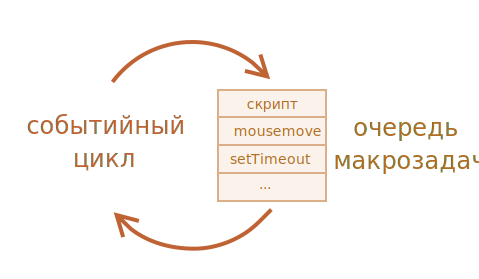

# Событийный цикл: микрозадачи и макрозадачи

Поток выполнения в браузере, равно как и в Node.js, основан на *событийном цикле*.

Понимание работы событийного цикла важно для оптимизаций, иногда для правильной архитектуры.

В этой главе мы сначала разберём теорию, а затем рассмотрим её практическое применение.

## Событийный цикл

Идея *событийного цикла* очень проста. Есть бесконечный цикл, в котором движок JavaScript ожидает задачи, исполняет их и снова ожидает появления новых.

Общий алгоритм движка:

1. Пока есть задачи:
    - выполнить их, начиная с самой старой
2. Бездействовать до появления новой задачи, а затем перейти к пункту 1

Это формализация того, что мы наблюдаем, просматривая веб-страницу. Движок JavaScript большую часть времени ничего не делает и работает, только если требуется исполнить скрипт/обработчик или обработать событие.

Примеры задач:

-  Когда загружается внешний скрипт `<script src="...">`, то задача - это выполнение этого скрипта.
-  Когда пользователь двигает мышь, задача - сгенерировать событие `mousemove` и выполнить его обработчики.
-  Когда истечёт таймер, установленный с помощью `setTimeout(func, ...)`, задача - это выполнение функции `func`
-  И так далее.

Задачи поступают на выполнение -- движок выполняет их -- затем ожидает новые задачи (во время ожидания практически не нагружая процессор компьютера)

Может так случиться, что задача поступает, когда движок занят чем-то другим, тогда она ставится в очередь.

Очередь, которую формируют такие задачи, называют "очередью макрозадач" (macrotask queue, термин [v8](https://v8.dev/)).



Например, когда движок занят выполнением скрипта, пользователь может передвинуть мышь, тем самым вызвав появление события `mousemove`, или может истечь таймер, установленный `setTimeout`, и т.п. Эти задачи формируют очередь, как показано на иллюстрации выше.

Задачи из очереди исполняются по правилу "первым пришёл - первым ушёл". Когда браузер заканчивает выполнение скрипта, он обрабатывает событие `mousemove`, затем выполняет обработчик, заданный `setTimeout`, и так далее.

Пока что всё просто, не правда ли?

Отметим две детали:
1.  Рендеринг (отрисовка страницы) никогда не происходит во время выполнения задачи движком. Не имеет значения, сколь долго выполняется задача. Изменения в DOM отрисовываются только после того, как задача выполнена.
2.  Если задача выполняется очень долго, то браузер не может выполнять другие задачи, обрабатывать пользовательские события, поэтому спустя некоторое время браузер предлагает "убить" долго выполняющуюся задачу. Такое возможно, когда в скрипте много сложных вычислений или ошибка, ведущая к бесконечному циклу.

Это была теория. Теперь давайте взглянем, как можно применить эти знания.

## Пример 1: разбиение "тяжёлой" задачи.

Допустим, у нас есть задача, требующая значительных ресурсов процессора.

Например, подсветка синтаксиса (используется для выделения цветом участков кода на этой странице) -- довольно процессороёмкая задача. Для подсветки кода надо выполнить синтаксический анализ, создать много элементов для цветового выделения, добавить их в документ -- для большого текста это требует значительных ресурсов.

Пока движок занят подсветкой синтаксиса, он не может делать ничего, связанного с DOM, не может обрабатывать пользовательские события и т.д. Возможно даже "подвисание" браузера, что совершенно неприемлемо.

Мы можем избежать этого, разбив задачу на части. Сделать подсветку для первых 100 строк, затем запланировать `setTimeout` (с нулевой задержкой) для разметки следующих 100 строк и т.д.

Чтобы продемонстрировать такой подход, давайте будем использовать для простоты функцию, которая считает от `1` до `1000000000`.

Если вы запустите код ниже, движок "зависнет" на некоторое время. Для серверного JS это будет явно заметно, а если вы будете выполнять этот код в браузере, то попробуйте понажимать другие кнопки на странице -- вы заметите, что никакие другие события не обрабатываются до завершения функции счёта.

```js run
let i = 0;

let start = Date.now();

function count() {

  // делаем тяжёлую работу
  for (let j = 0; j < 1e9; j++) {
    i++;
  }

  alert("Done in " + (Date.now() - start) + 'ms');
}

count();
```

Браузер может даже показать сообщение "скрипт выполняется слишком долго".

Давайте разобьём задачу на части, воспользовавшись вложенным `setTimeout`:

```js run
let i = 0;

let start = Date.now();

function count() {

  // делаем часть тяжёлой работы (*)
  do {
    i++;
  } while (i % 1e6 != 0);

  if (i == 1e9) {
    alert("Done in " + (Date.now() - start) + 'ms');
  } else {
    setTimeout(count); // планируем новый вызов (**)
  }

}

count();
```

Теперь интерфейс браузера полностью работоспособен во время выполнения "счёта".

Один вызов `count` делает часть работы `(*)`, а затем, если необходимо, планирует свой очередной запуск `(**)`:

1.  Первое выполнение производит счёт: i=1...1000000.
2.  Второе выполнение производит счёт: i=1000001...2000000.
3.  ...и так далее.

Теперь если новая сторонняя задача (например, событие `onclick`) появляется, пока движок занят выполнением 1-й части, то она становится в очередь, и затем выполняется, когда 1-я часть завершена, перед следующей частью. Периодические возвраты в событийный цикл между запусками `count` дают движку достаточно "воздуха", чтобы сделать что-то ещё, отреагировать на действия пользователя.

Отметим, что оба варианта -- с разбиением задачи с помощью `setTimeout` и без -- сопоставимы по скорости выполнения. Нет большой разницы в общем времени счёта.

Чтобы сократить разницу ещё сильнее, давайте немного улучшим наш код.

Мы перенесём планирование очередного вызова в начало `count()`:

```js run
let i = 0;

let start = Date.now();

function count() {

  // перенесём планирование очередного вызова в начало
  if (i < 1e9 - 1e6) {
    setTimeout(count); // запланировать новый вызов
  }

  do {
    i++;
  } while (i % 1e6 != 0);

  if (i == 1e9) {
    alert("Done in " + (Date.now() - start) + 'ms');
  }

}

count();
```

Теперь, когда мы начинаем выполнять `count()` и видим, что потребуется выполнить `count()` ещё раз, мы планируем этот вызов немедленно, перед выполнением работы.

Если вы запустите этот код, то легко заметите, что он требует значительно меньше времени.

Почему?

Всё просто: как вы помните, в браузере есть минимальная задержка в 4 миллисекунды при множестве вложенных вызовов `setTimeout`. Даже если мы указываем задержку `0`, на самом деле она будет равна `4 мс` (или чуть больше). Поэтому чем раньше мы запланируем выполнение - тем быстрее выполнится код.

Итак, мы разбили ресурсоёмкую задачу на части - теперь она не блокирует пользовательский интерфейс, причём почти без потерь в общем времени выполнения.

## Пример 2: индикация прогресса

Ещё одно преимущество разделения на части крупной задачи в браузерных скриптах - это возможность показывать индикатор выполнения.

Обычно браузер отрисовывает содержимое страницы после того, как заканчивается выполнение текущего кода. Не имеет значения, насколько долго выполняется задача. Изменения в DOM отображаются только после её завершения.

С одной стороны, это хорошо, потому что наша функция может создавать много элементов, добавлять их по одному в документ и изменять их стили -- пользователь не увидит "промежуточного", незаконченного состояния. Это важно, верно?

В примере ниже изменения `i` не будут заметны, пока функция не завершится, поэтому мы увидим только последнее значение `i`:


```html run
<div id="progress"></div>

<script>

  function count() {
    for (let i = 0; i < 1e6; i++) {
      i++;
      progress.innerHTML = i;
    }
  }

  count();
</script>
```

...Но, возможно, мы хотим что-нибудь показать во время выполнения задачи, например, индикатор выполнения.

Если мы разобьём тяжёлую задачу на части, используя `setTimeout`, то изменения индикатора будут отрисованы в промежутках между частями.

Так будет красивее:

```html run
<div id="progress"></div>

<script>
  let i = 0;

  function count() {

    // сделать часть крупной задачи (*)
    do {
      i++;
      progress.innerHTML = i;
    } while (i % 1e3 != 0);

    if (i < 1e7) {
      setTimeout(count);
    }

  }

  count();
</script>
```

Теперь `<div>` показывает растущее значение `i` - это своего рода индикатор выполнения.


## Пример 3: делаем что-нибудь после события

В обработчике события мы можем решить отложить некоторые действия, пока событие не "всплывёт" и не будет обработано на всех уровнях. Мы можем добиться этого, обернув код в `setTimeout` с нулевой задержкой.

В главе <info:dispatch-events> мы видели пример: наше событие `menu-open` генерируется через `setTimeout`, чтобы оно возникло после того, как полностью обработано событие "click".

```js
menu.onclick = function() {
  // ...

  // создадим наше собственное событие с данными пункта меню, по которому щёлкнули мышью
  let customEvent = new CustomEvent("menu-open", {
    bubbles: true
  });

  // сгенерировать наше событие асинхронно
  setTimeout(() => menu.dispatchEvent(customEvent));
};
```

## Макрозадачи и Микрозадачи

Помимо *макрозадач*, описанных в этой части, существуют *микрозадачи*, упомянутые в главе <info:microtask-queue>.

Микрозадачи приходят только из кода. Обычно они создаются промисами: выполнение обработчика `.then/catch/finally` становится микрозадачей. Микрозадачи также используются "под капотом" `await`, т.к. это форма обработки промиса.

Также есть специальная функция `queueMicrotask(func)`, которая помещает `func` в очередь микрозадач.

**Сразу после каждой *макрозадачи* движок исполняет все задачи из очереди *микрозадач* перед тем, как выполнить следующую макрозадачу или отобразить изменения на странице, или сделать что-то ещё.**

Например:

```js run
setTimeout(() => alert("timeout"));

Promise.resolve()
  .then(() => alert("promise"));

alert("code");
```

Какой здесь будет порядок?

1.  `code` появляется первым, т.к. это обычный синхронный вызов.
2.  `promise` появляется вторым, потому что `.then` проходит через очередь микрозадач и выполняется после текущего синхронного кода.
3.  `timeout` появляется последним, потому что это макрозадача.

Более подробное изображение событийного цикла выглядит так:


**Все микрозадачи завершаются до обработки каких-либо событий или рендеринга, или перехода к другой макрозадаче.**

Это важно, так как гарантирует, что общее окружение остаётся одним и тем же между микрозадачами - не изменены координаты мыши, не получены новые данные по сети и т.п.

Если мы хотим запустить функцию асинхронно (после текущего кода), но до отображения изменений и до новых событий, то можем запланировать это через `queueMicrotask`.

Вот пример с индикатором выполнения, похожий на предыдущий, но в этот раз использована функция `queueMicrotask` вместо `setTimeout`. Обратите внимание - отрисовка страницы происходит только в самом конце. Как и в случае обычного синхронного кода.

```html run
<div id="progress"></div>

<script>
  let i = 0;

  function count() {

    // делаем часть крупной задачи (*)
    do {
      i++;
      progress.innerHTML = i;
    } while (i % 1e3 != 0);

    if (i < 1e6) {
  *!*
      queueMicrotask(count);
  */!*
    }

  }

  count();
</script>
```

## Итого

Более подробный алгоритм событийного цикла (хоть и упрощённый в сравнении со [спецификацией](https://html.spec.whatwg.org/multipage/webappapis.html#event-loop-processing-model)):

1. Выбрать и исполнить старейшую задачу из очереди *макрозадач* (например, "script").
2. Исполнить все *микрозадачи*:
    - Пока очередь микрозадач не пуста:
          - Выбрать из очереди и исполнить старейшую микрозадачу
3. Отрисовать изменения страницы, если они есть.
4. Если очередь макрозадач пуста - подождать, пока появится макрозадача.
5. Перейти к шагу 1.

Чтобы добавить в очередь новую *макрозадачу*:
- Используйте `setTimeout(f)` с нулевой задержкой.

Этот способ можно использовать для разбиения больших вычислительных задач на части, чтобы браузер мог реагировать на пользовательские события и показывать прогресс выполнения этих частей.

Также это используется в обработчиках событий для отложенного выполнения действия после того, как событие полностью обработано (всплытие завершено).

Для добавления в очередь новой *микрозадачи*:
- Используйте `queueMicrotask(f)`.
- Также обработчики промисов выполняются в рамках очереди микрозадач.

События пользовательского интерфейса и сетевые события в промежутках между микрозадачами не обрабатываются: микрозадачи исполняются непрерывно одна за другой.

Поэтому `queueMicrotask` можно использовать для асинхронного выполнения функции в том же состоянии окружения.

```smart header="Web Workers"
Для длительных тяжёлых вычислений, которые не должны блокировать событийный цикл, мы можем использовать [Web Workers](https://html.spec.whatwg.org/multipage/workers.html).

Это способ исполнить код в другом, параллельном потоке.

Web Workers могут обмениваться сообщениями с основным процессом, но они имеют свои переменные и свой событийный цикл.

Web Workers не имеют доступа к DOM, поэтому основное их применение - вычисления. Они позволяют задействовать несколько ядер процессора одновременно.
```
