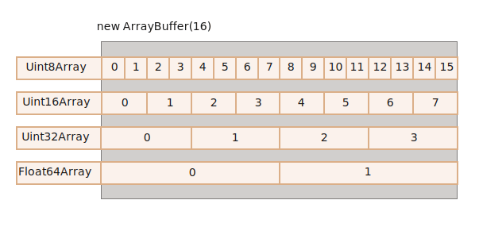

# ArrayBuffer, бинарные массивы

В сфере веб-разработки мы встречаемся с бинарными данными чаще всего тогда, когда требуется выполнить какие-то действия над файлами (создать, загрузить или скачать). Другим типичным примером такой встречи является обработка изображений.

Всё это возможно осуществить на JavaScript. Более того, операции над бинарными данными являются высокопроизводительными.

Обилие классов для работы с бинарными данными может немного запутать. Вот некоторые из них:
- `ArrayBuffer`, `Uint8Array`, `DataView`, `Blob`, `File` и т.д.

Работа с бинарными данными в JavaScript реализована нестандартно по сравнению с другими языками программирования. Но когда мы в этом разберёмся, то всё окажется весьма просто.

**Базовый объект для работы с бинарными данными имеет тип `ArrayBuffer` и представляет собой ссылку на непрерывную область памяти фиксированной длины.**

Вот так мы можем создать его экземпляр:
```js run
let buffer = new ArrayBuffer(16); // создаётся буфер длиной 16 байт
alert(buffer.byteLength); // 16
```

Инструкция выше выделяет непрерывную область памяти размером 16 байт и заполняет её нулями.

```warn header="`ArrayBuffer` -- это не массив!"
Давайте внесём ясность, чтобы не запутаться. `ArrayBuffer` не имеет ничего общего с `Array`:
- его длина фиксирована, мы не можем увеличивать или уменьшать её.
- `ArrayBuffer` занимает ровно столько места в памяти, сколько указывается при создании.
- Для доступа к отдельным байтам нужен вспомогательный объект-представление, `buffer[index]` не сработает.
```

`ArrayBuffer` -- это область памяти. Что там хранится? Этой информации нет. Просто необработанный ("сырой") массив байтов.

**Для работы с `ArrayBuffer` нам нужен специальный объект, реализующий "представление" данных.**

Такие объекты не хранят какое-то собственное содержимое. Они интерпретируют бинарные данные, хранящиеся в `ArrayBuffer`.

Например:

- **`Uint8Array`** -- представляет каждый байт в `ArrayBuffer` как отдельное число; возможные значения находятся в промежутке от 0 до 255 (в байте 8 бит, отсюда такой набор). Такое значение называется "8-битное целое без знака".
- **`Uint16Array`** -- представляет каждые 2 байта в `ArrayBuffer` как целое число; возможные значения находятся в промежутке от 0 до 65535. Такое значение называется "16-битное целое без знака".
- **`Uint32Array`** -- представляет каждые 4 байта в `ArrayBuffer` как целое число; возможные значения находятся в промежутке от 0 до 4294967295. Такое значение называется "32-битное целое без знака".
- **`Float64Array`** -- представляет каждые 8 байт в `ArrayBuffer` как число с плавающей точкой; возможные значения находятся в промежутке между <code>5.0x10<sup>-324</sup></code> и <code>1.8x10<sup>308</sup></code>.

Таким образом, бинарные данные из `ArrayBuffer` размером 16 байт могут быть представлены как 16 чисел маленькой разрядности или как 8 чисел большей разрядности (по 2 байта каждое), или как 4 числа ещё большей разрядности (по 4 байта каждое), или как 2 числа с плавающей точкой высокой точности (по 8 байт каждое).



`ArrayBuffer` -- это корневой объект, основа всего, необработанные бинарные данные.

Но если мы собираемся что-то записать в него или пройтись по его содержимому, да и вообще для любых действий мы должны использовать какой-то объект-представление ("view"), например:

```js run
let buffer = new ArrayBuffer(16); // создаётся буфер длиной 16 байт

*!*
let view = new Uint32Array(buffer); // интерпретируем содержимое как последовательность 32-битных целых чисел без знака

alert(Uint32Array.BYTES_PER_ELEMENT); // 4 байта на каждое целое число
*/!*

alert(view.length); // 4, именно столько чисел сейчас хранится в буфере
alert(view.byteLength); // 16, размер содержимого в байтах

// давайте запишем какое-нибудь значение
view[0] = 123456;

// теперь пройдёмся по всем значениям
for(let num of view) {
  alert(num); // 123456, потом 0, 0, 0 (всего 4 значения)
}

```

## TypedArray

Общий термин для всех таких представлений (`Uint8Array`, `Uint32Array` и т.д.) -- это [TypedArray](https://tc39.github.io/ecma262/#sec-typedarray-objects), типизированный массив. У них имеется набор одинаковых свойств и методов.

Они уже намного больше напоминают обычные массивы: элементы проиндексированы, и возможно осуществить обход содержимого.


Конструкторы типизированных массивов (будь то `Int8Array` или `Float64Array`, без разницы) ведут себя по-разному в зависимости от типа передаваемого им аргумента.

Есть 5 вариантов создания типизированных массивов:

```js
new TypedArray(buffer, [byteOffset], [length]);
new TypedArray(object);
new TypedArray(typedArray);
new TypedArray(length);
new TypedArray();
```

1. Если передан аргумент типа `ArrayBuffer`, то создаётся объект-представление для него. Мы уже использовали этот синтаксис ранее.

    Дополнительно можно указать аргументы `byteOffset` (0 по умолчанию) и `length` (до конца буфера по умолчанию), тогда представление будет покрывать только часть данных в `buffer`.

2. Если в качестве аргумента передан `Array` или какой-нибудь псевдомассив, то будет создан типизированный массив такой же длины и с тем же содержимым.

    Мы можем использовать эту возможность, чтобы заполнить типизированный массив начальными данными:
    ```js run
    *!*
    let arr = new Uint8Array([0, 1, 2, 3]);
    */!*
    alert( arr.length ); // 4, создан бинарный массив той же длины
    alert( arr[1] ); // 1, заполнен 4-мя байтами с указанными значениями
    ```
3. Если в конструктор передан другой объект типа `TypedArray`, то делается то же самое: создаётся типизированный массив с такой же длиной и в него копируется содержимое. При необходимости значения будут приведены к новому типу.
    ```js run
    let arr16 = new Uint16Array([1, 1000]);
    *!*
    let arr8 = new Uint8Array(arr16);
    */!*
    alert( arr8[0] ); // 1
    alert( arr8[1] ); // 232, потому что 1000 не помещается в 8 бит (разъяснения будут ниже)
    ```

4. Если передано число `length` -- будет создан типизированный массив, содержащий именно столько элементов. Размер нового массива в байтах будет равен числу элементов `length`, умноженному на размер одного элемента `TypedArray.BYTES_PER_ELEMENT`:
    ```js run
    let arr = new Uint16Array(4); // создаём типизированный массив для 4 целых 16-битных чисел без знака
    alert( Uint16Array.BYTES_PER_ELEMENT ); // 2 байта на число
    alert( arr.byteLength ); // 8 (размер массива в байтах)
    ```

5. При вызове без аргументов будет создан пустой типизированный массив.

Как видим, можно создавать типизированные массивы `TypedArray` напрямую, не передавая в конструктор объект типа `ArrayBuffer`. Но представления не могут существовать сами по себе без двоичных данных, так что на самом деле объект `ArrayBuffer` создаётся автоматически во всех случаях, кроме первого, когда он явно передан в конструктор представления.

Для доступа к `ArrayBuffer` есть следующие свойства:
- `arr.buffer` -- ссылка на объект `ArrayBuffer`.
- `arr.byteLength` -- размер содержимого `ArrayBuffer` в байтах.

Таким образом, мы всегда можем перейти от одного представления к другому:
```js
let arr8 = new Uint8Array([0, 1, 2, 3]);

// другое представление на тех же данных
let arr16 = new Uint16Array(arr8.buffer);
```


Список типизированных массивов:

- `Uint8Array`, `Uint16Array`, `Uint32Array` -- целые беззнаковые числа по 8, 16 и 32 бита соответственно.
  - `Uint8ClampedArray` -- 8-битные беззнаковые целые, обрезаются по верхней и нижней границе при присвоении (об этом ниже).
- `Int8Array`, `Int16Array`, `Int32Array` -- целые числа со знаком (могут быть отрицательными).
- `Float32Array`, `Float64Array` -- 32- и 64-битные числа со знаком и плавающей точкой.

```warn header="Не существует примитивных типов данных `int8` и т.д."
Обратите внимание: несмотря на названия вроде `Int8Array`, в JavaScript нет примитивных типов данных `int` или `int8`.

Это логично, потому что `Int8Array` -- это не массив отдельных значений, а представление, основанное на бинарных данных из объекта типа `ArrayBuffer`.
```

### Что будет, если выйти за пределы допустимых значений?

Что если мы попытаемся записать в типизированный массив значение, которое превышает допустимое для данного массива? Ошибки не будет. Лишние биты просто будут отброшены.

Например, давайте попытаемся записать число 256 в объект типа `Uint8Array`. В двоичном формате 256 представляется как `100000000` (9 бит), но `Uint8Array` предоставляет только 8 бит для значений. Это определяет диапазон допустимых значений от 0 до 255.

Если наше число больше, то только 8 младших битов (самые правые) будут записаны, а лишние отбросятся:


Таким образом, вместо 256 запишется 0.

Число 257 в двоичном формате выглядит как `100000001` (9 бит), но принимаются во внимание только 8 самых правых битов, так что в объект будет записана единичка:


Другими словами, записываются только значения по модулю 2<sup>8</sup>.

Вот демо:

```js run
let uint8array = new Uint8Array(16);

let num = 256;
alert(num.toString(2)); // 100000000 (в двоичном формате)

uint8array[0] = 256;
uint8array[1] = 257;

alert(uint8array[0]); // 0
alert(uint8array[1]); // 1
```

`Uint8ClampedArray`, упомянутый ранее, ведёт себя по-другому в данных обстоятельствах. В него записываются значения 255 для чисел, которые больше 255, и 0 для отрицательных чисел. Такое поведение полезно в некоторых ситуациях, например при обработке изображений.

## Методы TypedArray

Типизированные массивы `TypedArray`, за некоторыми заметными исключениями, имеют те же методы, что и массивы `Array`.

Мы можем обходить их, вызывать `map`, `slice`, `find`, `reduce` и т.д.

Однако, есть некоторые вещи, которые нельзя осуществить:

- Нет метода `splice` -- мы не можем удалять значения, потому что типизированные массивы - это всего лишь представления данных из буфера, а буфер - это непрерывная область памяти фиксированной длины. Мы можем только записать 0 вместо значения.
- Нет метода `concat`.

Но зато есть два дополнительных метода:

- `arr.set(fromArr, [offset])` копирует все элементы из `fromArr` в `arr`, начиная с позиции `offset` (0 по умолчанию).
- `arr.subarray([begin, end])` создаёт новое представление того же типа для данных, начиная с позиции `begin` до `end` (не включая). Это похоже на метод `slice` (который также поддерживается), но при этом ничего не копируется -- просто создаётся новое представление, чтобы совершать какие-то операции над указанными данными.

Эти методы позволяют нам копировать типизированные массивы, смешивать их, создавать новые на основе существующих и т.д.


## DataView

[DataView](https://developer.mozilla.org/en-US/docs/Web/JavaScript/Reference/Global_Objects/DataView) -- это специальное супергибкое нетипизированное представление данных из `ArrayBuffer`. Оно позволяет обращаться к данным на любой позиции и в любом формате.

- В случае типизированных массивов конструктор строго задаёт формат данных. Весь массив состоит из однотипных значений. Доступ к i-ому элементу можно получить как `arr[i]`.
- В случае `DataView` доступ к данным осуществляется посредством методов типа `.getUint8(i)` или `.getUint16(i)`. Мы выбираем формат данных в момент обращения к ним, а не в момент их создания.

Синтаксис:

```js
new DataView(buffer, [byteOffset], [byteLength])
```

- **`buffer`** -- ссылка на бинарные данные `ArrayBuffer`. В отличие от типизированных массивов, `DataView` не создаёт буфер автоматически. Нам нужно заранее подготовить его самим.
- **`byteOffset`** -- начальная позиция данных для представления (по умолчанию 0).
- **`byteLength`** -- длина данных (в байтах), используемых в представлении (по умолчанию - до конца `buffer`).

Например, извлечём числа в разных форматах из одного и того же буфера двоичных данных:

```js run
// бинарный массив из 4х байт, каждый имеет максимальное значение 255
let buffer = new Uint8Array([255, 255, 255, 255]).buffer;

let dataView = new DataView(buffer);

// получим 8-битное число на позиции 0
alert( dataView.getUint8(0) ); // 255

// а сейчас мы получим 16-битное число на той же позиции 0, оно состоит из 2-х байт, вместе составляющих число 65535
alert( dataView.getUint16(0) ); // 65535 (максимальное 16-битное беззнаковое целое)

// получим 32-битное число на позиции 0
alert( dataView.getUint32(0) ); // 4294967295 (максимальное 32-битное беззнаковое целое)

dataView.setUint32(0, 0); // при установке 4-байтового числа в 0, во все его 4 байта будут записаны нули
```

Представление `DataView` отлично подходит, когда мы храним данные разного формата в одном буфере. Например, мы храним последовательность пар, первое значение пары 16-битное целое, а второе -- 32-битное с плавающей точкой. `DataView` позволяет легко получить доступ к обоим.

## Итого

`ArrayBuffer` -- это корневой объект, ссылка на непрерывную область памяти фиксированной длины.

Чтобы работать с объектами типа `ArrayBuffer`, нам нужно представление ("view").

- Это может быть типизированный массив`TypedArray`:
    - `Uint8Array`, `Uint16Array`, `Uint32Array` -- для беззнаковых целых по 8, 16 и 32 бита соответственно.
    - `Uint8ClampedArray` -- для 8-битных беззнаковых целых, которые обрезаются по верхней и нижней границе при присвоении.
    - `Int8Array`, `Int16Array`, `Int32Array` -- для знаковых целых чисел (могут быть отрицательными).
    - `Float32Array`, `Float64Array` -- для 32- и 64-битных знаковых чисел с плавающей точкой.
- Или `DataView` -- представление, использующее отдельные методы, чтобы уточнить формат данных при обращении, например, `getUint8(offset)`.

Обычно мы создаём и работаем с типизированными массивами, оставляя `ArrayBuffer` "под капотом". Но мы можем в любой момент получить к нему доступ с помощью `.buffer` и при необходимости создать другое представление.

Существуют ещё 2 дополнительных термина, которые используются в описаниях методов, работающих с бинарными данными:
- `ArrayBufferView` -- это общее название для представлений всех типов.
- `BufferSource` -- это общее название для `ArrayBuffer` или `ArrayBufferView`.

Мы встретимся с ними в следующих главах. `BufferSource` встречается очень часто и означает "бинарные данные в любом виде" -- `ArrayBuffer` или его представление.


Вот шпаргалка:


