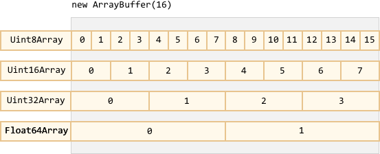
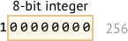
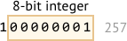
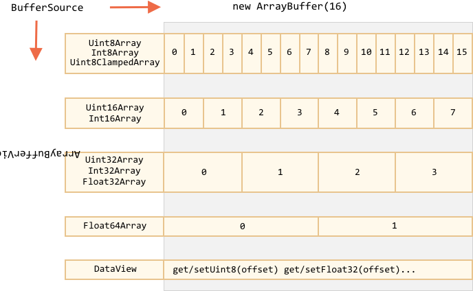

# ArrayBuffer, binary arrays

В сфере веб-разработки мы встречаемся с бинарными данными чаще всего тогда, когда требуется выполнить какие-то действия над файлами (создать, загрузить или скачать). Другим типичным примером является обработка изображений.

Всё это возможно осуществить на JavaScript. Более того, операции над бинарными данными являются высокопроизводительными.

Обилие классов для работы с бинарными данными может вас немного запутать. Назовём некоторые из них:
- `ArrayBuffer`, `Uint8Array`, `DataView`, `Blob`, `File` и т.д.

Работа с бинарными данными в JavaScript реализована нестандартно по сравнению с другими языками программирования. Но когда мы в этом разберёмся, то всё окажется весьма просто.
объект/класс?
**Базовый объект для работы с бинарными данными `ArrayBuffer` -- представляет собой ссылку на непрерывную область памяти фиксированной длины.**

Вот так мы можем создать его экземпляр:
```js run
let buffer = new ArrayBuffer(16); // создаётся буфер длиной 16 байт
alert(buffer.byteLength); // 16
```

Инструкция выше выделяет непрерывную область памяти размером 16 байт и заполняет её нулями.

```warn header="`ArrayBuffer` -- это не массив!"
Давайте внесём ясность, чтобы не запутаться. `ArrayBuffer` не имеет ничего общего с `Array`:
- его длина фиксирована, мы не можем увеличивать или уменьшать её.
- `ArrayBuffer` занимает ровно столько места в памяти, сколько указывается при создании.
- Для доступа к отдельным байтам нужен вспомогательный объект-представление, `buffer[index]` не сработает.
```

`ArrayBuffer` -- это область памяти. Что там хранится? Без понятия. Просто необработанный массив байтов.

**Для работы с `ArrayBuffer` нам нужен специальный объект для представления данных.**

Такие объекты не хранят какое-то собственное содержимое. Они интерпретируют бинарные данные, хранящиеся в `ArrayBuffer`.

Например:

- **`Uint8Array`** -- представляет каждый байт в `ArrayBuffer` как отдельное число; возможные значения находятся в промежутке между 0 и 255 (в байте 8 бит, отсюда такой набор значений). Такие значения называются "8-битное беззнаковое целое".
- **`Uint16Array`** -- представляет каждые 2 байта в `ArrayBuffer` как целое число; возможные значения находятся в промежутке между 0 и 65535. Такие значения называются "16-битное беззнаковое целое".
- **`Uint32Array`** -- представляет каждые 4 байта в `ArrayBuffer` как целое число; возможные значения находятся в промежутке между 0 и 4294967295. Такие значения называются "32-битное беззнаковое целое".
- **`Float64Array`** -- представляет каждые 8 байт в `ArrayBuffer` как число с плавающей точкой; возможные значения находятся в промежутке между <code>5.0x10<sup>-324</sup></code> и <code>1.8x10<sup>308</sup></code>.

Таким образом, бинарные данные из `ArrayBuffer` размером 16 байт могут быть представлены как 16 чисел маленькой разрядности или как 8 чисел большей разрядности (по 2 байта каждое), или как 4 числа ещё большей разрядности (по 4 байта каждое), или как 2 числа с плавающей точкой (по 8 байт каждое), позволяющие проводить вычисления с высокой точностью.



`ArrayBuffer` -- это корневой объект, основа всего, необработанные бинарные данные.

Но если мы собираемся что-то записать в него или пройтись по его содержимому, да и вообще для любых действий мы должны использовать какой-то объект-представление, например:

```js run
let buffer = new ArrayBuffer(16); // создаётся буфер длиной 16 байт

*!*
let view = new Uint32Array(buffer); // представим содержимое как последовательность 32-битных целых чисел

alert(Uint32Array.BYTES_PER_ELEMENT); // 4 байта на каждое целое число
*/!*

alert(view.length); // 4, именно столько чисел сейчас хранится в буфере
alert(view.byteLength); // 16, размер содержимого в байтах

// давайте запишем какое-нибудь значение
view[0] = 123456;

// теперь пройдёмся по всем значениям
for(let num of view) {
  alert(num); // 123456, потом 0, 0, 0 (всего 4 значения)
}

```

## TypedArray

The common term for all these views (`Uint8Array`, `Uint32Array`, etc) is [TypedArray](https://tc39.github.io/ecma262/#sec-typedarray-objects). They share the same set of methods and properities.

They are much more like regular arrays: have indexes and iterable.


A typed array constructor (be it `Int8Array` or `Float64Array`, doesn't matter) behaves differently depending on argument types.

There are 5 variants of arguments:

```js
new TypedArray(buffer, [byteOffset], [length]);
new TypedArray(object);
new TypedArray(typedArray);
new TypedArray(length);
new TypedArray();
```

1. If an `ArrayBuffer` argument is supplied, the view is created over it. We used that syntax already.

    Optionally we can provide `byteOffset` to start from (0 by default) and the `length` (till the end of the buffer by default), then the view will cover only a part of the `buffer`.

2. If an `Array`, or any array-like object is given, it creates a typed array of the same length and copies the content.

    We can use it to pre-fill the array with the data:
    ```js run
    *!*
    let arr = new Uint8Array([0, 1, 2, 3]);
    */!*
    alert( arr.length ); // 4
    alert( arr[1] ); // 1
    ```
3. If another `TypedArray` is supplied, it does the same: creates a typed array of the same length and copies values. Values are converted to the new type in the process.
    ```js run
    let arr16 = new Uint16Array([1, 1000]);
    *!*
    let arr8 = new Uint8Array(arr16);
    */!*
    alert( arr8[0] ); // 1
    alert( arr8[1] ); // 232 (tried to copy 1000, but can't fit 1000 into 8 bits)
    ```

4. For a numeric argument `length` -- creates the typed array to contain that many elements. Its byte length will be `length` multiplied by the number of bytes in a single item `TypedArray.BYTES_PER_ELEMENT`:
    ```js run
    let arr = new Uint16Array(4); // create typed array for 4 integers
    alert( Uint16Array.BYTES_PER_ELEMENT ); // 2 bytes per integer
    alert( arr.byteLength ); // 8 (size in bytes)
    ```

5. Without arguments, creates an zero-length typed array.

We can create a `TypedArray` directly, without mentioning `ArrayBuffer`. But a view cannot exist without an underlying `ArrayBuffer`, so gets created automatically in all these cases except the first one (when provided).

To access the `ArrayBuffer`, there are properties:
- `arr.buffer` -- references the `ArrayBuffer`.
- `arr.byteLength` -- the length of the `ArrayBuffer`.

So, we can always move from one view to another:
```js
let arr8 = new Uint8Array([0, 1, 2, 3]);

// another view on the same data
let arr16 = new Uint16Array(arr8.buffer);
```


Here's the list of typed arrays:

- `Uint8Array`, `Uint16Array`, `Uint32Array` -- for integer numbers of 8, 16 and 32 bits.
  - `Uint8ClampedArray` -- for 8-bit integers, "clamps" them on assignment (see below).
- `Int8Array`, `Int16Array`, `Int32Array` -- for signed integer numbers (can be negative).
- `Float32Array`, `Float64Array` -- for signed floating-point numbers of 32 and 64 bits.

```warn header="No `int8` or similar single-valued types"
Please note, despite of the names like `Int8Array`, there's no single-value type like `int`, or `int8` in JavaScript.

That's logical, as `Int8Array` is not an array of these individual values, but rather a view on `ArrayBuffer`.
```

### Out-of-bounds behavior

What if we attempt to write an out-of-bounds value into a typed array? There will be no error. But extra bits are cut-off.

For instance, let's try to put 256 into `Uint8Array`. In binary form, 256 is `100000000` (9 bits), but `Uint8Array` only provides 8 bits per value, that makes the available range from 0 to 255.

For bigger numbers, only the rightmost (less significant) 8 bits are stored, and the rest is cut off:



So we'll get zero.

For 257, the binary form is `100000001` (9 bits), the rightmost 8 get stored, so we'll have `1` in the array:



In other words, the number modulo 2<sup>8</sup> is saved.

Here's the demo:

```js run
let uint8array = new Uint8Array(16);

let num = 256;
alert(num.toString(2)); // 100000000 (binary representation)

uint8array[0] = 256;
uint8array[1] = 257;

alert(uint8array[0]); // 0
alert(uint8array[1]); // 1
```

`Uint8ClampedArray` is special in this aspect, its behavior is different. It saves 255 for any number that is greater than 255, and 0 for any negative number. That behavior is useful for image processing.

## TypedArray methods

`TypedArray` has regular `Array` methods, with notable exceptions.

We can iterate, `map`, `slice`, `find`, `reduce` etc.

There are few things we can't do though:

- No `splice` -- we can't "delete" a value, because typed arrays are views on a buffer, and these are fixed, contiguous areas of memory. All we can do is to assign a zero.
- No `concat` method.

There are two additional methods:

- `arr.set(fromArr, [offset])` copies all elements from `fromArr` to the `arr`, starting at position `offset` (0 by default).
- `arr.subarray([begin, end])` creates a new view of the same type from `begin` to `end` (exclusive). That's similar to `slice` method (that's also supported), but doesn't copy anything -- just creates a new view, to operate on the given piece of data.

These methods allow us to copy typed arrays, mix them, create new arrays from existing ones, and so on.


## DataView

[DataView](https://developer.mozilla.org/en-US/docs/Web/JavaScript/Reference/Global_Objects/DataView) is a special super-flexible "untyped" view over `ArrayBuffer`. It allows to access the data on any offset in any format.

- For typed arrays, the constructor dictates what the format is. The whole array is supposed to be uniform. The i-th number is `arr[i]`.
- With `DataView` we access the data with methods like `.getUint8(i)` or `.getUint16(i)`. We choose the format at method call time instead of the construction time.

The syntax:

```js
new DataView(buffer, [byteOffset], [byteLength])
```

- **`buffer`** -- the underlying `ArrayBuffer`. Unlike typed arrays, `DataView` doesn't create a buffer on its own. We need to have it ready.
- **`byteOffset`** -- the starting byte position of the view (by default 0).
- **`byteLength`** -- the byte length of the view (by default till the end of `buffer`).

For instance, here we extract numbers in different formats from the same buffer:

```js run
let buffer = new Uint8Array([255, 255, 255, 255]).buffer;

let dataView = new DataView(buffer);

// get 8-bit number at offset 0
alert( dataView.getUint8(0) ); // 255

// now get 16-bit number at offset 0, that's 2 bytes, both with max value
alert( dataView.getUint16(0) ); // 65535 (biggest 16-bit unsigned int)

// get 32-bit number at offset 0
alert( dataView.getUint32(0) ); // 4294967295 (biggest 32-bit unsigned int)

dataView.setUint32(0, 0); // set 4-byte number to zero
```

`DataView` is great when we store mixed-format data in the same buffer. E.g we store a sequence of pairs (16-bit integer, 32-bit float). Then `DataView` allows to access them easily.

## Summary

`ArrayBuffer` is the core object, a reference to the fixed-length contiguous memory area.

To do almost any operation on `ArrayBuffer`, we need a view.

- It can be a `TypedArray`:
    - `Uint8Array`, `Uint16Array`, `Uint32Array` -- for unsigned integers of 8, 16, and 32 bits.
    - `Uint8ClampedArray` -- for 8-bit integers, "clamps" them on assignment.
    - `Int8Array`, `Int16Array`, `Int32Array` -- for signed integer numbers (can be negative).
    - `Float32Array`, `Float64Array` -- for signed floating-point numbers of 32 and 64 bits.
- Or a `DataView` -- the view that uses methods to specify a format, e.g. `getUint8(offset)`.

In most cases we create and operate directly on typed arrays, leaving `ArrayBuffer` under cover, as a "common discriminator". We can access it as `.buffer` and make another view if needed.

There are also two additional terms:
- `ArrayBufferView` is an umbrella term for all these kinds of views.
- `BufferSource` is an umbrella term for `ArrayBuffer` or `ArrayBufferView`.

These are used in descriptions of methods that operate on binary data. `BufferSource` is one of the most common terms, as it means "any kind of binary data" -- an `ArrayBuffer` or a view over it.


Here's a cheatsheet:


