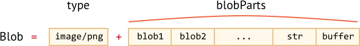

# Blob 

`ArrayBuffer` и низко-уровневый интерфейс для работы с ним являются частью ECMA стандарта, и соответственно частью Javascript.

Кроме того, в браузере, имеются дополнительные высокоуровневые объекты, описанные в [File API](https://www.w3.org/TR/FileAPI/).

`Blob` объект состоит из необязательного признака `type` (a MIME-type usually), и `blobParts` -- цепочки других `Blob` объектов, строк и `BufferSources`.



Благодаря `type`, мы можем пересылать blobs объекты, где `type` естественно становится `Content-Type` в сетевых запросах.

Конструктор имеет следующий синтаксис:

```js
new Blob(blobParts, options);
```

- **`blobParts`** -- массив `Blob`/`BufferSource`/`String` значений.
- **`options`** -- объект с дополнительными настройками:
  - **`type`** -- тип объекта, обычно MIME-тип, например. `image/png`,
  - **`endings`** -- если указан то строк создаваемого blob будет изменено в соответствии с текущей операционной системой (`\r\n` или `\n`). По умолчанию `"transparent"` (ничего не делать), но так же может быть `"native"` (изменять).

Например:

```js
// создадим Blob из строки
let blob = new Blob(["<html>…</html>"], {type: 'text/html'});
// обратите внимание: первый аргумент должен быть массивом [...]
```

```js
// создадим Blob из типизированного массива и строк
let hello = new Uint8Array([72, 101, 108, 108, 111]); // "hello" в бинарной форме

let blob = new Blob([hello, ' ', 'world'], {type: 'text/plain'});
```


Мы можем получить срез blob массива используя:

```js
blob.slice([byteStart], [byteEnd], [contentType]);
```

- **`byteStart`** -- стартовый байт, по умолчанию 0.
- **`byteEnd`** -- последний байт, по умолчанию до конца.
- **`contentType`** -- тип `type` создаваемого blob объекта, по умолчанию такой же как и исходный.

Аргументы подобные `array.slice`, негативные числа так же разрешены.

```smart header="Blob не изменяем (immutable)"
Мы не можем изменять данные прямо в blob, но мы можем создать его срез, создать новый на базе существующего, сделать объединение нескольких объектов в новый и так далее.

Это поведение аналогично Javascript строке: мы не можем изменить символы в строке, но мы можем создать новую корректную строку на базе имеющийся.
```

## Blob как URL

Blob может быть использован как URL для `<a>`, `` или других тегов, для показа содержимого.

Давайте начнем с простого примера. При клике на ссылку мы загружаем динамически генерируемый blob с `hello world` содержимым как файл:

```html run
<!-- download атрибут указывает браузеру делать загрузку вместо навигации -->
<a download="hello.txt" href='#' id="link">Download</a>

<script>
let blob = new Blob(["Hello, world!"], {type: 'text/plain'});

link.href = URL.createObjectURL(blob);
</script>
```

Мы так же можем создать ссылку динамически, используя только Javascript и эмулировать на ней клик используя `link.click()`, тогда загрузка начнется автоматически.

Далее простой пример создания "на лету" и загрузки blob объекта, без использования HTML:

```js run
let link = document.createElement('a');
link.download = 'hello.txt';

let blob = new Blob(['Hello, world!'], {type: 'text/plain'});

link.href = URL.createObjectURL(blob);

link.click();

URL.revokeObjectURL(link.href);
```

**`URL.createObjectURL` берет blob и создает уникальный url для него, в форме `blob:<origin>/<uuid>`.**

Вот как выглядит сгенерированный URL:

```
blob:https://javascript.info/1e67e00e-860d-40a5-89ae-6ab0cbee6273
```

Браузер для каждого url сгенерированного через `URL.createObjectURL` сохраняет внутреннее соответствие url -> blob. Таким образом url содержит короткий код, но это дает доступ к большому blob объекту.

Сгенерированный url действителен только пока текущий документ открыт. И это позволяет ссылаться на сгенерированный в нем blob в ``, `<a>` или любом другом объекте ожидающим url.

В данном случае возможен побочный эффект. Пока карте соответствия (mapping) существует ссылка на blob, он находится в памяти. Браузер не может освободить память занятую blob объектом.

Ссылка в карте соответствия автоматически удаляется при выгрузке документа, после этого так же освобождается память. Но если приложение имеет длительный жизненный цикл, это может произойти не скоро. Таким образом если мы создадим подобный URL, blob будет висеть в памяти, даже если в нем нет больше необходимости.

**`URL.revokeObjectURL(url)` удаляет внутреннюю ссылку на объект, что позволят удалить его (если нет другой ссылки) сборщику мусора, и память будет освобождена.**

В последнем примере, мы использовали blob только единожды, для мгновенной загрузки, после мы сразу же вызвали `URL.revokeObjectURL(link.href)`.

Хоты в предыдущем примере, с кликабельной HTML ссылкой, мы не вызывали `URL.revokeObjectURL(link.href)`, потому что это сделало бы ссылку недействительной. После отзыва, и удаления ссылки на blob, url больше не будет работать.

## Blob to base64

Альтернативой для `URL.createObjectURL` это конверсия blob в base64-encoded строку.

Эта кодировка представляет двоичные данные в виде строки с безопасными для чтения символами в ASCII-кодах от 0 до 64. И что более важно -- мы можем использовать эту кодировку для "data-urls".

[data url](https://developer.mozilla.org/en-US/docs/Web/HTTP/Basics_of_HTTP/Data_URIs) имеет форму `data:[<mediatype>][;base64],<data>`. Мы можем использовать такой url где угодно, в паре с "обычным" url.

На пример, смайлик:

```html

```

Браузер декодирует строку и покажет смайлик: 


Для трансформации blob в base64, мы будет использовать встроенный в браузер `FileReader` объект. Он может читать данные из Blobs в множестве форматов. В [следующей главе](info:file) мы рассмотрим это более глубоко.

Вот пример загрузки blob, при помощи base-64:

```js run
let link = document.createElement('a');
link.download = 'hello.txt';

let blob = new Blob(['Hello, world!'], {type: 'text/plain'});

*!*
let reader = new FileReader();
reader.readAsDataURL(blob); // конвертирует blob в base64 и вызывает onload
*/!*

reader.onload = function() {
  link.href = reader.result; // url с данными
  link.click();
};
```

Оба варианта могут быть использованы для создания URL с blob. Но обычно `URL.createObjectURL(blob)` является более быстрым и безопасным.

```compare title-plus="URL.createObjectURL(blob)" title-minus="Blob to data url"
+ Нужно отзывать объект для освобождения памяти.
+ Прямой доступ к blob, без "кодирования/декодирования".
- Нет необходимости что либо отзывать.
- Потеря производительности и памяти при декодировании больших blob объектов.
```

## Изображение в blob

Мы можем создать blob для изображения, части изображения, или даже создать скриншот страницы. Что удобно для последующей загрузки куда либо.

Операции с изображениями выполняются через `<canvas>` элемент:

1. Для отрисовки изображения (или его части) на холсте( canvas) используется [canvas.drawImage](https://developer.mozilla.org/en-US/docs/Web/API/CanvasRenderingContext2D/drawImage).
2. Вызов canvas метода [.toBlob(callback, format, quality)](https://developer.mozilla.org/en-US/docs/Web/API/HTMLCanvasElement/toBlob) создает blob и вызывает `callback` функцию при завершении.

В примере ниже, изображение просто копируется, но мы можем взять его часть, или трансформировать его на canvas перед созданием blob:

```js run
// берем какое либо изображение
let img = document.querySelector('img');

// создаем <canvas> того же размера
let canvas = document.createElement('canvas');
canvas.width = img.clientWidth;
canvas.height = img.clientHeight;

let context = canvas.getContext('2d');

// копируем изображение в  canvas  (метод позволяет вырезать часть изображения)
context.drawImage(img, 0, 0);
// мы может вращать изображение при помощи context.rotate(), и делать множество других преобразований

// toBlob является асинхронной операцией, для которой callback функция вызывается при завершении
canvas.toBlob(function(blob) {
  // после того как blob создан, загружаем его
  let link = document.createElement('a');
  link.download = 'example.png';

  link.href = URL.createObjectURL(blob);
  link.click();

  // удаляем внутреннюю ссылку на blob, что позволяет браузеру очистить память
  URL.revokeObjectURL(link.href);
}, 'image/png');
```

Или если вы предпочитает `async/await` вместо callback функции:
```js
let blob = await new Promise(resolve => canvasElem.toBlob(resolve, 'image/png'));
```

Для создания скриншота страницы, мы может использовать библиотеку <https://github.com/niklasvh/html2canvas>. Это кодирует HTML страницу в `<canvas>`. После этого мы может создать blob одним из вышеуказанных способов.

## Из Blob в ArrayBuffer

`Blob` конструктор позволят создать blob практически из чего угодно, включая `BufferSource`.

Но если нам нужен производительный низкоуровневый процесс, мы можем использовать `ArrayBuffer` из `FileReader`:

```js
// получаем arrayBuffer из blob
let fileReader = new FileReader();

*!*
fileReader.readAsArrayBuffer(blob);
*/!*

fileReader.onload = function(event) {
  let arrayBuffer = fileReader.result;
};
```


## Резюме

В то время как `ArrayBuffer`, `Uint8Array` и другие `BufferSource` являются "бинарными данными", a [Blob](https://www.w3.org/TR/FileAPI/#dfn-Blob) представляет "бинарные данные с типом".

Это делает Blob удобным для операций загрузки/выгрузки данных, которые так часто используются в браузере.

Методы, которые выполняют веб-запросы, такие как [XMLHttpRequest](info:xmlhttprequest), [fetch](info:fetch-basics) и подобные, могут работать с `Blob` изначально, также как с другими двоичными типами.

Мы можем легко конвертировать `Blob` в низкоуровневые бинарные типы данных и обратно:

- Мы можем создать Blob из типового массива используя `new Blob(...)` конструктор.
- Мы можем обратно создать `ArrayBuffer` из Blob используя `FileReader`, и затем его создать представления для низкоуровневых операций.

