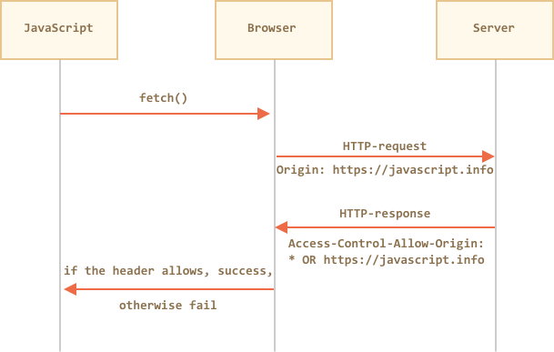
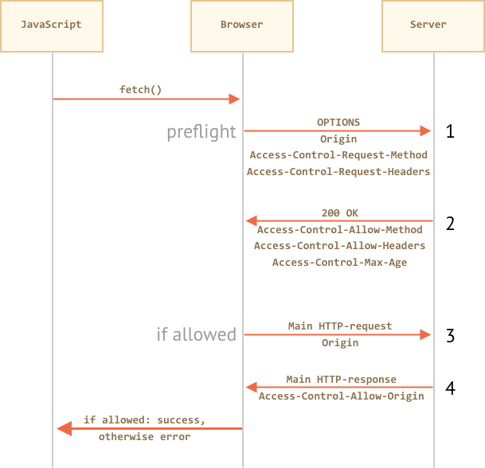

# Fetch: кроссдоменные запросы

Если мы сделаем запрос через `fetch` с произвольного веб-сайта, он, вероятно, завершится неудачей.

Ключевым понятием здесь является *источник* (origin) -- комбинация домен/порт/протокол.

Кроссдоменные (cross-origin) запросы -- запросы, отправленные на другой домен (или даже поддомен), или протокол, или порт -- требуют специальных заголовков от удалённой стороны. Эта политика называется "CORS": Cross-Origin Resource Sharing ("совместное использование ресурсов между разными источниками").

Например, давайте попробуем запросить `http://example.com`:

```js run async
try {
  await fetch('http://example.com');
} catch(err) {
  alert(err); // Failed to fetch
}
```

Fetch не удался, как и ожидалось.

## Почему?

Потому что кроссдоменные ограничения защищают интернет от злых хакеров.

Серьёзно. Давайте сделаем краткое историческое отступление.

Многие годы JavaScript не имел специальных методов для выполнения сетевых запросов.

**Скрипт с одного сайта не мог получить доступ к содержимому другого сайта.**

Это простое, но могучее правило было основой интернет-безопасности. Например, скрипт со страницы `hacker.com` не мог получить доступ к почтовому ящику пользователя на `gmail.com`. И люди чувствовали себя спокойно.

Но веб-разработчики жаждали большей власти. Чтобы обойти сей запрет, были придуманы разнообразные хитрости.

Одним из способов общения с другим сервером была отправка туда формы (`<form>`). Люди отправляли её в `<iframe>`, чтобы оставаться на текущей странице, вот так:

```html
<!-- цель формы -->
<iframe name="iframe"></iframe>

<!-- форма могла быть динамически сгенерирована и отправлена с помощью JavaScript -->
<form target="iframe" method="POST" action="http://another.com/…">
  ...
</form>

```

- Таким способом было возможно сделать GET/POST запрос к другому сайту даже без сетевых методов.
- Но так как было запрещено получать доступ к содержимому `<iframe>` с другого сайта, прочитать ответ было невозможно.

Таким образом, `<form>` позволяла отправлять данные куда угодно, но содержимое ответа было недоступно.

Ещё один трюк заключался в использовании `<script src="http://another.com/…">` тега. `script` мог иметь любой `src`, с любым доменом. Но опять же -- было невозможно получить доступ к исходному содержимому этого скрипта.

Если `another.com` хотел предоставить данные для такого доступа, тогда использовался так называемый "JSONP (JSON with padding)" протокол.

Вот последовательность:

1. Сначала мы заранее объявляем глобальную функцию для приёма данных, например `gotWeather`.
2. Затем мы создаём `<script>` и передаём имя функции в качестве параметра запроса `callback`, например `src="http://another.com/weather.json?callback=gotWeather"`.
3. Удалённый сервер динамически генерирует ответ и оборачивает данные в вызов `gotWeather(...)` (то есть отправляет данные в эту функцию в качестве аргументов).  
4. По мере работы скрипта выполняется `gotWeather`, и, так как это наша функция, мы получаем данные.

Вот пример кода для получения данных в JSONP:

```js run
// 1. Объявить функцию для обработки данных
function gotWeather({ temperature, humidity }) {
  alert(`temperature: ${temperature}, humidity: ${humidity}`);
}

// 2. Передать её имя как callback-параметр для скрипта
let script = document.createElement('script');
script.src = `https://cors.javascript.info/article/fetch-crossorigin/demo/script?callback=gotWeather`;
document.body.append(script);

// 3. Ожидаемый ответ от сервера выглядит так:
/*
gotWeather({
  temperature: 25,
  humidity: 78
});
*/
```


Это работает и не нарушает безопасность, потому что обе стороны согласились передавать данные таким образом. А когда обе стороны согласны, то это определённо не хак. Всё ещё существуют сервисы, которые предоставляют такой доступ, так как это работает даже для очень старых браузеров.

Спустя некоторое время появились современные сетевые методы. Вначале кроссдоменные запросы были запрещены. Но в результате долгих дискуссий было разрешено делать кросс-доменные запросы таким способом, который не даёт каких-то новых возможностей, если это не было явно разрешено сервером.

## Простые запросы

[Простые запросы](http://www.w3.org/TR/cors/#terminology) должны удовлетворять следующим условиям:

1. [Простой метод](http://www.w3.org/TR/cors/#simple-method): GET, POST или HEAD
2. [Простые заголовки](http://www.w3.org/TR/cors/#simple-header) -- разрешены только:
    - `Accept`,
    - `Accept-Language`,
    - `Content-Language`,
    - `Content-Type` со значением `application/x-www-form-urlencoded`, `multipart/form-data` или `text/plain`.

Любой другой запрос считается "непростым". Например, запрос с методом `PUT` или с HTTP-заголовком `API-Key` не соответствует условиям.

**Основное отличие состоит в том, что "простой запрос" может быть сделан через `<form>` или `<script>`, без каких-то специальных методов.**

Таким образом, даже очень старый сервер должен быть способен принять простой запрос.

В противоположность этому, запросы с нестандартными заголовками или, например, методом `DELETE` нельзя создать таким способом. Долгое время JavaScript не мог делать такие запросы. Поэтому старый сервер может предположить, что такие запросы поступают от привилегированного источника, "потому что веб-страница неспособна их посылать".

Когда мы пытаемся сделать непростой запрос, браузер посылает специальный "preflight" ("предполётный") запрос, который спрашивает у сервера -- согласен ли он принять такой кроссдоменный запрос или нет?

И, если сервер явно не даёт согласие в заголовках, непростой запрос не посылается.

Далее мы углубимся в детали. Все они служат единственной цели -- гарантировать, что новые кроссдоменные возможности доступны только с явного согласия сервера.

## CORS для простых запросов

Если запрос кроссдоменный, браузер всегда добавляет к нему заголовок `Origin`.

Например, если мы запрашиваем `https://anywhere.com/request` от `https://javascript.info/page`, заголовки будут такими:

```
GET /request
Host: anywhere.com
*!*
Origin: https://javascript.info
*/!*
...
```

Как вы можете видеть, `Origin` содержит именно источник (домен/протокол/порт), без пути.

Сервер может проверить `Origin` и, если он согласен принять такой запрос, добавить особый заголовок `Access-Control-Allow-Origin` к ответу. Этот заголовок должен содержать разрешённый источник (в нашем случае `https://javascript.info`) или звёздочку `*`. Тогда ответ успешен, в противном случае возникает ошибка.

Здесь браузер играет роль доверенного посредника:
1. Он гарантирует, что вместе с кросс-доменным запросом посылается правильный `Origin`.
2. Он проверяет правильность `Access-Control-Allow-Origin` в ответе, и если всё хорошо, то JavaScript получает доступ к ответу сервера, в противном случае - доступ запрещается c ошибкой.



Вот пример "принимающего" ответа:
```
200 OK
Content-Type:text/html; charset=UTF-8
*!*
Access-Control-Allow-Origin: https://javascript.info
*/!*
```

## Заголовки ответа

По умолчанию при кроссдоменном запросе JavaScript может получить доступ только к "простым заголовкам ответа":

- `Cache-Control`
- `Content-Language`
- `Content-Type`
- `Expires`
- `Last-Modified`
- `Pragma`

Любой другой заголовок ответа запрещён.

```smart header="Please note: no `Content-Length`"
Пожалуйста, обратите внимание: в списке нет заголовка `Content-Length`!

Поэтому если мы загружаем что-то и хотели бы отслеживать прогресс, то требуется дополнительное разрешение для доступа к этому заголовку (читайте ниже).
```

Чтобы дать JavaScript-у доступ к любому другому заголовку ответа, сервер должен перечислить его в заголовке `Access-Control-Expose-Headers`.

Например:

```
200 OK
Content-Type:text/html; charset=UTF-8
Content-Length: 12345
API-Key: 2c9de507f2c54aa1
Access-Control-Allow-Origin: https://javascript.info
*!*
Access-Control-Expose-Headers: Content-Length,API-Key
*/!*
```

С таким `Access-Control-Expose-Headers` заголовком скрипту разрешено обращаться к заголовкам `Content-Length` и `API-Key` ответа.


## "Непростые" запросы

Мы можем использовать любой HTTP-метод: не только `GET/POST`, но и `PATCH`, `DELETE` и другие.

Некоторое время назад никто не мог даже предположить, что веб-страница способна делать такие запросы. Так что могут существовать веб-сервисы, которые рассматривают нестандартный метод как сигнал: "Это не браузер". Они могут учитывать это при проверке прав доступа.

Поэтому, чтобы избежать недопониманий, браузер не делает "непростые" запросы (которые нельзя было сделать в прошлом) сразу. Перед этим он посылает предварительный, так назывемый "preflight" запрос, спрашивая разрешения.

Предварительный запрос использует метод `OPTIONS` и не имеет тела.
- Заголовок `Access-Control-Request-Method` содержит запрашиваемый метод.
- Заголовок `Access-Control-Request-Headers` предоставляет разделённый запятыми список непростых HTTP-заголовков.

Если сервер согласен обслуживать запросы, то он должен ответить со статусом 200, без тела.

- Заголовок ответа `Access-Control-Allow-Methods` должен содержать разрешённые методы.
- Заголовок ответа `Access-Control-Allow-Headers` должен содержать список разрешённых заголовков.
- Коме того, заголовок `Access-Control-Max-Age` может указывать количество секунд, на которое нужно кешировать разрешения. Так что браузеру не придётся посылать preflight для последующих запросов, удовлетворяющих данным разрешениям.



Давайте пошагово посмотрим, как это работает, на примере для кросс-доменного `PATCH` запроса (этот метод часто используется для обновления данных):

```js
let response = await fetch('https://site.com/service.json', {
  method: 'PATCH',
  headers: {
    'Content-Type': 'application/json'  
    'API-Key': 'secret'
  }
});
```

Этот запрос не является простым по трём причинам (достаточно одной):
- Метод `PATCH`
- `Content-Type` не один из: `application/x-www-form-urlencoded`, `multipart/form-data`,  `text/plain`.
- Кастомный `API-Key` заголовок.

### Шаг 1 (preflight запрос)

Браузер сам посылает preflight запрос, который выглядит следующим образом:

```
OPTIONS /service.json
Host: site.com
Origin: https://javascript.info
Access-Control-Request-Method: PATCH
Access-Control-Request-Headers: Content-Type,API-Key
```

- Метод: `OPTIONS`.
- Путь -- точно такой же, как в главном запросе: `/service.json`.
- Особые кроссдоменные заголовки:
    - `Origin` -- источник.
    - `Access-Control-Request-Method` -- запрашиваемый метод.
    - `Access-Control-Request-Headers` -- разделённый запятыми список "непростых" заголовков.

### Шаг 2 (preflight ответ)

Сервер должен ответить со стастусом 200 и заголовками:
- `Access-Control-Allow-Methods: PATCH`
- `Access-Control-Allow-Headers: Content-Type,API-Key`.

Это разрешило бы будущую коммуникацию, в противном случае возникает ошибка.

Если сервер ожидает другие методы и заголовки, имеет смысл перечислить их все сразу, например:

```
200 OK
Access-Control-Allow-Methods: PUT,PATCH,DELETE
Access-Control-Allow-Headers: API-Key,Content-Type,If-Modified-Since,Cache-Control
Access-Control-Max-Age: 86400
```

Теперь браузер может видеть, что `PATCH` есть в списке разрешённых методов, и оба заголовка тоже в списке, так что он посылает главный запрос.

Кроме того, preflight ответ кешируется на время, указанное в заголовке `Access-Control-Max-Age` (86400 секунд, один день), так что последующие запросы не вызовут preflight. Они будут посланы сразу при условии, что они соответствуют разрешениям.

### Шаг 3 (основной запрос)

Если preflight успешен, браузер делает основной запрос. Поток здесь такой же, что и для простых запросов.

Основной запрос имеет заголовок `Origin` (потому что он кроссдоменный):

```
PATCH /service.json
Host: site.com
Content-Type: application/json
API-Key: secret
Origin: https://javascript.info
```

### Шаг 4 (основной ответ)

Сервер не должен забывать о добавлении `Access-Control-Allow-Origin` к ответу. Успешный preflight не освобождает от этого:

```
Access-Control-Allow-Origin: https://javascript.info
```

Теперь всё правильно. JavaScript может прочитать весь ответ.


## Пользовательские данные (credentials)

Кроссдоменный запрос по умолчанию не содержит никаких пользовательских данных (куки или данные для HTTP-аутентификации).

Это необычно для HTTP-запросов. Обычно запрос к `http://site.com` сопровождается всеми куки из этого домена. Но кросс-доменные запросы, сделанные методами JavaScript - исключение.

Например, `fetch('http://another.com')` не посылает никаких куки, даже тех, которые принадлежат `another.com` домену.

Почему?

Потому что запрос с пользовательскими данными намного более мощный, чем анонимный. Если он разрешён, то это даёт JavaScript доступ к конфиденциальной информации от имени пользователя.  

Сервер действительно настолько верит страницам с `Origin`? Запросу с пользовательскими данными нужен дополнительный заголовок, чтобы пройти.

Чтобы включить пользовательские данные, нам нужно добавить опцию `credentials: "include"`, например так:

```js
fetch('http://another.com', {
  credentials: "include"
});
```

Теперь `fetch` посылает куки, происходящие от `another.com`, вместе с запросом.

Если сервер желает принять запрос с пользовательскими данными, он должен добавить заголовок `Access-Control-Allow-Credentials: true` к ответу, в дополнение к `Access-Control-Allow-Origin`.

Например:

```
200 OK
Access-Control-Allow-Origin: https://javascript.info
Access-Control-Allow-Credentials: true
```

Пожалуйста, обратите внимание: в `Access-Control-Allow-Origin` запрещено использовать звёздочку `*` для запросов с пользовательскими данными. Там должен быть именно источник, как показано выше. Это дополнительная мера безопасности, чтобы гарантировать, что сервер действительно знает, кому он доверяет.


## Итого

Сетевые методы разделяют кроссдоменные запросы на два вида: "простые" и все остальные.

[Простые запросы](http://www.w3.org/TR/cors/#terminology) должны удовлетворять следующим условиям:
- Метод: GET, POST или HEAD.
- Заголовки -- мы можем установить только:
    - `Accept`
    - `Accept-Language`
    - `Content-Language`
    - `Content-Type` к значениям `application/x-www-form-urlencoded`, `multipart/form-data` или `text/plain`.

Существенное отличие заключается в том, что простые запросы с давних времён выполнялись с использованием тегов `<form>` или `<script>`, в то время как непростые долгое время были невозможны для браузеров.

Таким образом, практическая разница состоит в том, что простые запросы отправляются сразу с заголовком `Origin`, а для других браузер делает предварительный "preflight" запрос, спрашивая разрешения.

**Для простых запросов:**

- → Браузер посылает заголовок `Origin` с источником.
- ← Для запросов без учётных данных (по умолчанию) сервер должен установить:
    - `Access-Control-Allow-Origin` к `*` или тому же значению, что и `Origin`
- ← Для запросов с пользовательскими данными сервер должен установить:
    - `Access-Control-Allow-Origin` к тому же, что и `Origin`
    - `Access-Control-Allow-Credentials` к `true`

Дополнительно, если JavaScript хочет получить доступ к непростым заголовкам ответа:
- `Cache-Control`
- `Content-Language`
- `Content-Type`
- `Expires`
- `Last-Modified`
- `Pragma`

...То сервер должен перечислить разрешённые в заголовке `Access-Control-Expose-Headers`.

**Для непростых запросов перед основным запросом отправляется предварительный "preflight" запрос:**

- → Браузер посылает запрос `OPTIONS` на тот же адрес с заголовками:
    - `Access-Control-Request-Method` содержит запрашиваемый метод,
    - `Access-Control-Request-Headers` перечисляет непростые запрашиваемые заголовки
- ← Сервер должен ответить со статусом 200 и заголовками:
    - `Access-Control-Allow-Methods` со списком разрешённых методов,
    - `Access-Control-Allow-Headers` со списком разрешённых заголовков,
    - `Access-Control-Max-Age` с количеством секунд для кеширования разрешений
- → Затем отправляется основной запрос, применяется предыдущая "простая" схема.
