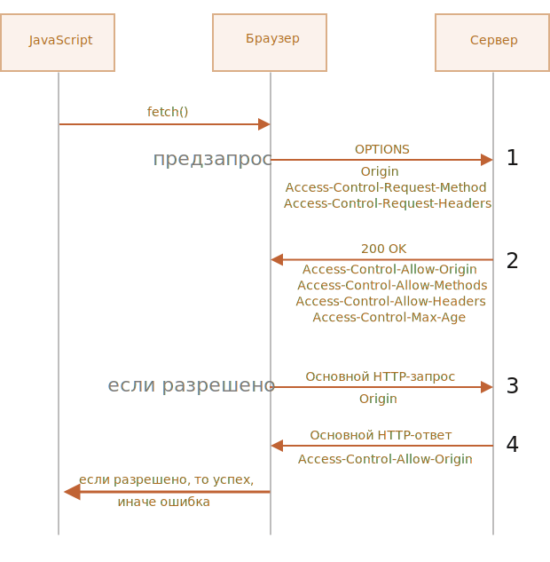

# Fetch: запросы на другие сайты

Если мы сделаем запрос `fetch` на другой веб-сайт, он, вероятно, завершится неудачей.

Например, давайте попробуем запросить `http://example.com`:

```js run async
try {
  await fetch('http://example.com');
} catch(err) {
  alert(err); // Failed to fetch
}
```

Вызов `fetch` не удался, как и ожидалось.

Ключевым понятием здесь является *источник* (origin) -- комбинация домен/порт/протокол.

Запросы на другой источник -- отправленные на другой домен (или даже поддомен), или протокол, или порт -- требуют специальных заголовков от удалённой стороны.

Эта политика называется "CORS": Cross-Origin Resource Sharing ("совместное использование ресурсов между разными источниками").

## Зачем нужен CORS? Экскурс в историю

CORS существует для защиты интернета от злых хакеров.

Серьёзно. Давайте сделаем краткое историческое отступление.

**Многие годы скрипт с одного сайта не мог получить доступ к содержимому другого сайта.**

Это простое, но могучее правило было основой интернет-безопасности. Например, хакерский скрипт с сайта `hacker.com` не мог получить доступ к почтовому ящику пользователя на сайте `gmail.com`. И люди чувствовали себя спокойно.

В то время в JavaScript не было методов для сетевых запросов. Это был "игрушечный" язык для украшения веб-страниц.

Но веб-разработчики жаждали большей власти. Чтобы обойти этот запрет и всё же получать данные с других сайтов, были придуманы разные хитрости.

### Использование форм

Одним из способов общения с другим сервером была отправка туда формы `<form>`. Люди отправляли её в `<iframe>`, чтобы оставаться на текущей странице, вот так:

```html
<!-- цель формы -->
*!*
<iframe name="iframe"></iframe>
*/!*

<!-- форма могла быть динамически сгенерирована и отправлена с помощью JavaScript -->
*!*
<form target="iframe" method="POST" action="http://another.com/…">
*/!*
  ...
</form>
```

Таким способом было возможно сделать GET/POST запрос к другому сайту даже без сетевых методов, так как формы можно отправлять куда угодно. Но так как запрещено получать доступ к содержимому `<iframe>` с другого сайта, прочитать ответ было невозможно.

Если быть точным, были трюки и для этого, требующие специального кода на странице и в ифрейме, так что общение с ифреймом было технически возможно. Сейчас мы не будем вдаваться в подробности, пусть эти динозавры покоятся в мире.

### Использование скриптов

Ещё один трюк заключался в использовании тега `script`. У него может быть любой `src`, с любым доменом, например `<script src="http://another.com/…">`. Это даёт возможность загрузить и выполнить скрипт откуда угодно.

Если сайт, например `another.com`, хотел предоставить данные для такого доступа, он предоставлял так называемый "протокол JSONP" (<b>JSON</b> with <b>P</b>adding)".

Вот как он работал.

Например, нам на нашем сайте нужны данные с сайта `http://another.com`, скажем, погода:

1. Сначала, заранее, объявляем глобальную функцию для обработки данных, например `gotWeather`.

    ```js
    // 1. Объявить функцию для обработки погодных данных
    function gotWeather({ temperature, humidity }) {
      alert(`температура: ${temperature}, влажность: ${humidity}`);
    }
    ```
2. Затем создаём тег `<script>` с `src="http://another.com/weather.json?callback=gotWeather"`, при этом имя нашей функции - в URL-параметре `callback`.

    ```js
    let script = document.createElement('script');
    script.src = `http://another.com/weather.json?callback=gotWeather`;
    document.body.append(script);
    ```
3. Удалённый сервер с `another.com` должен в ответ сгенерировать скрипт, который вызывает `gotWeather(...)` с данными, которые хочет передать.
    ```js
    // Ожидаемый ответ от сервера выглядит так:
    gotWeather({
      temperature: 25,
      humidity: 78
    });
    ```
4. Когда этот скрипт загрузится и выполнится, наша функция `gotWeather` получает данные.

Это работает и не нарушает безопасность, потому что обе стороны согласились передавать данные таким образом. А когда обе стороны согласны, то это определённо не хак. Всё ещё существуют сервисы, которые предоставляют такой доступ, так как это работает даже для очень старых браузеров.

Спустя некоторое время в браузерном JavaScript появились методы для сетевых запросов.

Вначале запросы на другой источник были запрещены. Но в результате долгих дискуссий было решено разрешить их делать, но для использования новых возможностей требовать разрешение сервера, выраженное в специальных заголовках.

## Простые запросы

Есть два вида запросов на другой источник:

1. Простые.
2. Все остальные.

Простые запросы будут попроще, поэтому давайте начнём с них.

[Простой запрос](http://www.w3.org/TR/cors/#terminology) - это запрос, удовлетворяющий следующим условиям:

1. [Простой метод](http://www.w3.org/TR/cors/#simple-method): GET, POST или HEAD
2. [Простые заголовки](http://www.w3.org/TR/cors/#simple-header) -- разрешены только:
    - `Accept`,
    - `Accept-Language`,
    - `Content-Language`,
    - `Content-Type` со значением `application/x-www-form-urlencoded`, `multipart/form-data` или `text/plain`.

Любой другой запрос считается "непростым". Например, запрос с методом `PUT` или с HTTP-заголовком `API-Key` не соответствует условиям.

**Принципиальное отличие между ними состоит в том, что "простой запрос" может быть сделан через `<form>` или `<script>`, без каких-то специальных методов.**

Таким образом, даже очень старый сервер должен быть способен принять простой запрос.

В противоположность этому, запросы с нестандартными заголовками или, например, методом `DELETE` нельзя создать таким способом. Долгое время JavaScript не мог делать такие запросы. Поэтому старый сервер может предположить, что такие запросы поступают от привилегированного источника, "просто потому, что веб-страница неспособна их посылать".

Когда мы пытаемся сделать непростой запрос, браузер посылает специальный предварительный запрос ("предзапрос", по англ. "preflight"), который спрашивает у сервера -- согласен ли он принять такой непростой запрос или нет?

И, если сервер явно не даёт согласие в заголовках, непростой запрос не посылается.

Далее мы разберём конкретные детали.

## CORS для простых запросов

При запросе на другой источник браузер всегда ставит "от себя" заголовок `Origin`.

Например, если мы запрашиваем `https://anywhere.com/request` со страницы `https://javascript.info/page`, заголовки будут такими:

```http
GET /request
Host: anywhere.com
*!*
Origin: https://javascript.info
*/!*
...
```

Как вы можете видеть, заголовок `Origin` содержит именно источник (домен/протокол/порт), без пути.

Сервер может проверить `Origin` и, если он согласен принять такой запрос, добавить особый заголовок `Access-Control-Allow-Origin` к ответу. Этот заголовок должен содержать разрешённый источник (в нашем случае `https://javascript.info`) или звёздочку `*`. Тогда ответ успешен, в противном случае возникает ошибка.

Здесь браузер играет роль доверенного посредника:
1. Он гарантирует, что к запросу на другой источник добавляется правильный заголовок `Origin`.
2. Он проверяет наличие разрешающего заголовка `Access-Control-Allow-Origin` в ответе и, если всё хорошо, то JavaScript получает доступ к ответу сервера, в противном случае - доступ запрещается с ошибкой.


Вот пример ответа сервера, который разрешает доступ:
```http
200 OK
Content-Type:text/html; charset=UTF-8
*!*
Access-Control-Allow-Origin: https://javascript.info
*/!*
```

## Заголовки ответа

По умолчанию при запросе к другому источнику JavaScript может получить доступ только к так называемым "простым" заголовкам ответа:

- `Cache-Control`
- `Content-Language`
- `Content-Type`
- `Expires`
- `Last-Modified`
- `Pragma`

При доступе к любому другому заголовку ответа будет ошибка.

```smart header="Обратите внимание: нет `Content-Length`"
Пожалуйста, обратите внимание: в списке нет заголовка `Content-Length`!

Этот заголовок содержит полную длину ответа. Поэтому если мы загружаем что-то и хотели бы отслеживать прогресс в процентах, то требуется дополнительное разрешение для доступа к этому заголовку (читайте ниже).
```

Чтобы разрешить JavaScript доступ к любому другому заголовку ответа, сервер должен указать заголовок `Access-Control-Expose-Headers`. Он содержит список, через запятую, заголовков, которые не являются простыми, но доступ к которым разрешён.

Например:

```http
200 OK
Content-Type:text/html; charset=UTF-8
Content-Length: 12345
API-Key: 2c9de507f2c54aa1
Access-Control-Allow-Origin: https://javascript.info
*!*
Access-Control-Expose-Headers: Content-Length,API-Key
*/!*
```

При таком заголовке `Access-Control-Expose-Headers`, скрипту разрешено получить заголовки `Content-Length` и `API-Key` ответа.

## "Непростые" запросы

Мы можем использовать любой HTTP-метод: не только `GET/POST`, но и `PATCH`, `DELETE` и другие.

Некоторое время назад никто не мог даже предположить, что веб-страница способна делать такие запросы. Так что могут существовать веб-сервисы, которые рассматривают нестандартный метод как сигнал: "Это не браузер". Они могут учитывать это при проверке прав доступа.

Поэтому, чтобы избежать недопониманий, браузер не делает "непростые" запросы (которые нельзя было сделать в прошлом) сразу. Перед этим он посылает предварительный запрос, спрашивая разрешения.

Предварительный запрос использует метод `OPTIONS`, у него нет тела, но есть два заголовка:

- `Access-Control-Request-Method` содержит HTTP-метод "непростого" запроса.
- `Access-Control-Request-Headers` предоставляет разделённый запятыми список его "непростых" HTTP-заголовков.

Если сервер согласен принимать такие запросы, то он должен ответить без тела,  со статусом 200 и с заголовками:

- `Access-Control-Allow-Methods` должен содержать разрешённые методы.
- `Access-Control-Allow-Headers` должен содержать список разрешённых заголовков.
- Кроме того, заголовок `Access-Control-Max-Age` может указывать количество секунд, на которое нужно кешировать разрешения. Так что браузеру не придётся посылать предзапрос для последующих запросов, удовлетворяющих данным разрешениям.



Давайте пошагово посмотрим, как это работает, на примере `PATCH` запроса (этот метод часто используется для обновления данных) на другой источник:

```js
let response = await fetch('https://site.com/service.json', {
  method: 'PATCH',
  headers: {
    'Content-Type': 'application/json'  
    'API-Key': 'secret'
  }
});
```

Этот запрос не является простым по трём причинам (достаточно одной):
- Метод `PATCH`
- `Content-Type` не один из: `application/x-www-form-urlencoded`, `multipart/form-data`, `text/plain`.
- Содержит "непростой" заголовок `API-Key`.

### Шаг 1 (предзапрос)

Перед тем, как послать такой запрос, браузер самостоятельно генерирует и посылает предзапрос, который выглядит следующим образом:

```http
OPTIONS /service.json
Host: site.com
Origin: https://javascript.info
Access-Control-Request-Method: PATCH
Access-Control-Request-Headers: Content-Type,API-Key
```

- Метод: `OPTIONS`.
- Путь -- точно такой же, как в основном запросе: `/service.json`.
- Особые заголовки:
    - `Origin` -- источник.
    - `Access-Control-Request-Method` -- запрашиваемый метод.
    - `Access-Control-Request-Headers` -- разделённый запятыми список "непростых" заголовков запроса.

### Шаг 2 (ответ сервера на предзапрос)

Сервер должен ответить со статусом 200 и заголовками:
- `Access-Control-Allow-Methods: PATCH`
- `Access-Control-Allow-Headers: Content-Type,API-Key`.

Это разрешит будущую коммуникацию, в противном случае возникает ошибка.

Если сервер ожидает в будущем другие методы и заголовки, то он может в ответе перечислить их все сразу, разрешить заранее, например:

```http
200 OK
Access-Control-Allow-Methods: PUT,PATCH,DELETE
Access-Control-Allow-Headers: API-Key,Content-Type,If-Modified-Since,Cache-Control
Access-Control-Max-Age: 86400
```

Теперь, когда браузер видит, что `PATCH` есть в `Access-Control-Allow-Methods`, а `Content-Type,API-Key` - в списке `Access-Control-Allow-Headers`, он посылает наш основной запрос.

Кроме того, ответ на предзапрос кешируется на время, указанное в заголовке `Access-Control-Max-Age` (86400 секунд, один день), так что последующие запросы не вызовут предзапрос. Они будут отосланы сразу при условии, что соответствуют закешированным разрешениям.

### Шаг 3 (основной запрос)

Если предзапрос успешен, браузер делает основной запрос. Алгоритм здесь такой же, что и для простых запросов.

Основной запрос имеет заголовок `Origin` (потому что он идёт на другой источник):

```http
PATCH /service.json
Host: site.com
Content-Type: application/json
API-Key: secret
Origin: https://javascript.info
```

### Шаг 4 (основной ответ)

Сервер не должен забывать о добавлении `Access-Control-Allow-Origin` к ответу на основной запрос. Успешный предзапрос не освобождает от этого:

```http
Access-Control-Allow-Origin: https://javascript.info
```

После этого JavaScript может прочитать ответ сервера.

```smart
Предзапрос осуществляется "за кулисами", невидимо для JavaScript.

JavaScript получает только ответ на основной запрос или ошибку, если со стороны сервера нет разрешения.
```

## Авторизационные данные

Запрос на другой источник по умолчанию не содержит авторизационных данных (credentials), под которыми здесь понимаются куки и заголовки HTTP-аутентификации.

Это нетипично для HTTP-запросов. Обычно запрос к `http://site.com` сопровождается всеми куки с этого домена. Но запросы на другой источник, сделанные методами JavaScript - исключение.

Например, `fetch('http://another.com')` не посылает никаких куки, даже тех (!), которые принадлежат домену `another.com`.

Почему?

Потому что запрос с авторизационными данными даёт намного больше возможностей, чем без них. Если он разрешён, то это позволяет JavaScript действовать от имени пользователя и получать информацию, используя его авторизационные данные.

Действительно ли сервер настолько доверяет скрипту? Тогда он должен явно разрешить такие запросы при помощи дополнительного заголовка.

Чтобы включить отправку авторизационных данных в `fetch`, нам нужно добавить опцию `credentials: "include"`, вот так:

```js
fetch('http://another.com', {
  credentials: "include"
});
```

Теперь `fetch` пошлёт куки с домена `another.com` вместе с нашим запросом на этот сайт.

Если сервер согласен принять запрос *с авторизационными данными*, он должен добавить заголовок `Access-Control-Allow-Credentials: true` к ответу, в дополнение к `Access-Control-Allow-Origin`.

Например:

```http
200 OK
Access-Control-Allow-Origin: https://javascript.info
Access-Control-Allow-Credentials: true
```

Пожалуйста, обратите внимание: в `Access-Control-Allow-Origin` запрещено использовать звёздочку `*` для запросов с авторизационными данными. Там должен быть именно источник, как показано выше. Это дополнительная мера безопасности, чтобы гарантировать, что сервер действительно знает, кому он доверяет делать такие запросы.

## Итого

С точки зрения браузера запросы к другому источнику бывают двух видов: "простые" и все остальные.

[Простые запросы](http://www.w3.org/TR/cors/#terminology) должны удовлетворять следующим условиям:
- Метод: GET, POST или HEAD.
- Заголовки -- мы можем установить только:
    - `Accept`
    - `Accept-Language`
    - `Content-Language`
    - `Content-Type` со значением `application/x-www-form-urlencoded`, `multipart/form-data` или `text/plain`.

Основное их отличие заключается в том, что простые запросы с давних времён выполнялись с использованием тегов `<form>` или `<script>`, в то время как непростые долгое время были невозможны для браузеров.

Практическая разница состоит в том, что простые запросы отправляются сразу с заголовком `Origin`, а для других браузер делает предварительный запрос, спрашивая разрешения.

**Для простых запросов:**

- → Браузер посылает заголовок `Origin` с источником.
- ← Для запросов без авторизационных данных (не отправляются по умолчанию) сервер должен установить:
    - `Access-Control-Allow-Origin` в `*` или то же значение, что и `Origin`
- ← Для запросов с авторизационными данными сервер должен установить:
    - `Access-Control-Allow-Origin` в то же значение, что и `Origin`
    - `Access-Control-Allow-Credentials` в `true`

Дополнительно, чтобы разрешить JavaScript доступ к любым заголовкам ответа, кроме `Cache-Control`,  `Content-Language`, `Content-Type`, `Expires`, `Last-Modified` или `Pragma`, сервер должен перечислить разрешённые в заголовке `Access-Control-Expose-Headers`.

**Для непростых запросов перед основным запросом отправляется предзапрос:**

- → Браузер посылает запрос `OPTIONS` на тот же адрес с заголовками:
    - `Access-Control-Request-Method` - содержит запрашиваемый метод,
    - `Access-Control-Request-Headers` - перечисляет непростые запрашиваемые заголовки.
- ← Сервер должен ответить со статусом 200 и заголовками:
    - `Access-Control-Allow-Methods` со списком разрешённых методов,
    - `Access-Control-Allow-Headers` со списком разрешённых заголовков,
    - `Access-Control-Max-Age` с количеством секунд для кеширования разрешений
- → Затем отправляется основной запрос, применяется предыдущая "простая" схема.
