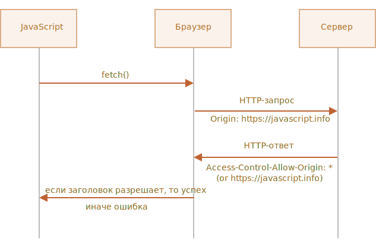

# Fetch: запросы на другие сайты

<<<<<<< HEAD
Если мы сделаем запрос `fetch` на другой веб-сайт, он, вероятно, завершится неудачей.

Например, давайте попробуем запросить `http://example.com`:
=======
If we send a `fetch` request to another web-site, it will probably fail.

For instance, let's try fetching `http://example.com`:
>>>>>>> 5cb9760abb8499bf1e99042d866c3c1db8cd61ca

```js run async
try {
  await fetch('http://example.com');
} catch(err) {
  alert(err); // Failed to fetch
}
```

Вызов `fetch` не удался, как и ожидалось.

Ключевым понятием здесь является *источник* (origin) -- комбинация домен/порт/протокол.

Запросы на другой источник -- отправленные на другой домен (или даже поддомен), или протокол, или порт -- требуют специальных заголовков от удалённой стороны.

<<<<<<< HEAD
Эта политика называется "CORS": Cross-Origin Resource Sharing ("совместное использование ресурсов между разными источниками").

## Зачем нужен CORS? Экскурс в историю
=======
The core concept here is *origin* -- a domain/port/protocol triplet.

Cross-origin requests -- those sent to another domain (even a subdomain) or protocol or port -- require special headers from the remote side.

That policy is called "CORS": Cross-Origin Resource Sharing.

## Why CORS is needed? A brief history

CORS exists protect the internet from evil hackers.
>>>>>>> 5cb9760abb8499bf1e99042d866c3c1db8cd61ca

CORS существует для защиты интернет от злых хакеров.

Серьёзно. Давайте сделаем краткое историческое отступление.

<<<<<<< HEAD
**Многие годы скрипт с одного сайта не мог получить доступ к содержимому другого сайта.**
=======
That simple, yet powerful rule was a foundation of the internet security. E.g. an evil script from website `hacker.com` could not access user's mailbox at website `gmail.com`. People felt safe.
>>>>>>> 5cb9760abb8499bf1e99042d866c3c1db8cd61ca

Это простое, но могучее правило было основой интернет-безопасности. Например, хакерский скрипт со сайта `hacker.com` не мог получить доступ к почтовому ящику пользователя на сайте `gmail.com`. И люди чувствовали себя спокойно.

<<<<<<< HEAD
В то время в JavaScript не было методов для сетевых запросов. Это был "игрушечный" язык для украшения веб-страниц.
=======
But web developers demanded more power. A variety of tricks were invented to work around the limitation and make requests to other websites.
>>>>>>> 5cb9760abb8499bf1e99042d866c3c1db8cd61ca

Но веб-разработчики жаждали большей власти. Чтобы обойти этот запрет и всё же получать данные с других сайтов, были придуманы разные хитрости.

### Использование форм

Одним из способов общения с другим сервером была отправка туда формы `<form>`. Люди отправляли её в `<iframe>`, чтобы оставаться на текущей странице, вот так:

```html
<!-- цель формы -->
*!*
<iframe name="iframe"></iframe>
*/!*

<!-- форма могла быть динамически сгенерирована и отправлена с помощью JavaScript -->
*!*
<form target="iframe" method="POST" action="http://another.com/…">
*/!*
  ...
</form>
```

<<<<<<< HEAD
Таким способом было возможно сделать GET/POST запрос к другому сайту даже без сетевых методов, так как формы можно отправлять куда угодно. Но так как запрещено получать доступ к содержимому `<iframe>` с другого сайта, прочитать ответ было невозможно.

Если быть точным, были трюки и для этого, требующие специального кода на странице и в ифрейме, так что общение с ифреймом было технически возможно. Сейчас мы не будем вдаваться в подробности, пусть эти динозавры покоятся в мире.

### Использование скриптов
=======
So, it was possible to make a GET/POST request to another site, even without networking methods, as forms can send data anywhere. But as it's forbidden to access the content of an `<iframe>` from another site, it wasn't possible to read the response.

To be precise, there were actually tricks for that, they required special scripts at both the iframe and the page. So the communication with the iframe was technically possible. Right now there's no point to go into details, let these dinosaurs rest in peace.
>>>>>>> 5cb9760abb8499bf1e99042d866c3c1db8cd61ca

Ещё один трюк заключался в использовании тега `script`. У него может быть любой `src`, с любым доменом, например `<script src="http://another.com/…">`. Это даёт возможность загрузить и выполнить скрипт откуда угодно.

<<<<<<< HEAD
Если сайт, например `another.com`, хотел предоставить данные для такого доступа, он предоставлял так называемый "протокол JSONP" (<b>JSON</b> with <b>P</b>adding)".

Вот как он работал.

Например, нам на нашем сайте нужны данные с сайта `http://another.com`, скажем, погоду:
=======
Another trick was to use a `script` tag. A script could have any `src`, with any domain, like `<script src="http://another.com/…">`. It's possible to execute a script from any website.

If a website, e.g. `another.com` intended to expose data for this kind of access, then a so-called "JSONP (JSON with padding)" protocol was used.

Here's how it worked.

Let's say we, at our site, need to get the data from `http://another.com`, such as the weather:
>>>>>>> 5cb9760abb8499bf1e99042d866c3c1db8cd61ca

1. Сначала, заранее, объявляем глобальную функцию для обработки данных, например `gotWeather`.

    ```js
<<<<<<< HEAD
    // 1. Объявить функцию для обработки погодных данных
=======
    // 1. Declare the function to process the weather data
>>>>>>> 5cb9760abb8499bf1e99042d866c3c1db8cd61ca
    function gotWeather({ temperature, humidity }) {
      alert(`температура: ${temperature}, влажность: ${humidity}`);
    }
    ```
<<<<<<< HEAD
2. Затем создаём тег `<script>` с `src="http://another.com/weather.json?callback=gotWeather"`, при этом имя нашей функции - в URL-параметре `callback`.
=======
2. Then we make a `<script>` tag with `src="http://another.com/weather.json?callback=gotWeather"`, using the name of our function as the `callback` URL-parameter.
>>>>>>> 5cb9760abb8499bf1e99042d866c3c1db8cd61ca

    ```js
    let script = document.createElement('script');
    script.src = `http://another.com/weather.json?callback=gotWeather`;
    document.body.append(script);
    ```
<<<<<<< HEAD
3. Удалённый сервер c `another.com` должен в ответ сгенерировать скрипт, который вызывает `gotWeather(...)` с данными, которые хочет передать.
=======
3. The remote server `another.com` dynamically generates a script that calls `gotWeather(...)` with the data it wants us to receive.
>>>>>>> 5cb9760abb8499bf1e99042d866c3c1db8cd61ca
    ```js
    // Ожидаемый ответ от сервера выглядит так:
    gotWeather({
      temperature: 25,
      humidity: 78
    });
    ```
<<<<<<< HEAD
4. Когда этот скрипт загрузится и выполнится, наша функция `gotWeather` получает данные.

Это работает и не нарушает безопасность, потому что обе стороны согласились передавать данные таким образом. А когда обе стороны согласны, то это определённо не хак. Всё ещё существуют сервисы, которые предоставляют такой доступ, так как это работает даже для очень старых браузеров.

Спустя некоторое время в браузерном JavaScript появились методы для сетевых запросов.

Вначале запросы на другой источник были запрещены. Но в результате долгих дискуссий было решено разрешить их делать, но для использования новых возможностей требовать разрешение сервера, выраженное в специальных заголовках.

## Простые запросы
=======
4. When the remote script loads and executes, `gotWeather` runs, and, as it's our function, we have the data.

That works, and doesn't violate security, because both sides agreed to pass the data this way. And, when both sides agree, it's definitely not a hack. There are still services that provide such access, as it works even for very old browsers.

After a while, networking methods appeared in browser JavaScript.

At first, cross-origin requests were forbidden. But as a result of long discussions, cross-origin requests were allowed, but any new capabilities unless require an explicit allowance by the server, expressed in special headers.
>>>>>>> 5cb9760abb8499bf1e99042d866c3c1db8cd61ca

Есть два вида запросов на другой источник:

<<<<<<< HEAD
1. Простые.
2. Все остальные.
=======
There are two types of cross-origin requests:

1. Simple requests.
2. All the others.
>>>>>>> 5cb9760abb8499bf1e99042d866c3c1db8cd61ca

Простые запросы будут попроще, поэтому давайте начнём с них.

[Простой запрос](http://www.w3.org/TR/cors/#terminology) - это запрос, удовлетворяющий следующим условиям:

1. [Простой метод](http://www.w3.org/TR/cors/#simple-method): GET, POST или HEAD
2. [Простые заголовки](http://www.w3.org/TR/cors/#simple-header) -- разрешены только:
    - `Accept`,
    - `Accept-Language`,
    - `Content-Language`,
    - `Content-Type` со значением `application/x-www-form-urlencoded`, `multipart/form-data` или `text/plain`.

Любой другой запрос считается "непростым". Например, запрос с методом `PUT` или с HTTP-заголовком `API-Key` не соответствует условиям.

**Принципиальное отличие между ними состоит в том, что "простой запрос" может быть сделан через `<form>` или `<script>`, без каких-то специальных методов.**

Таким образом, даже очень старый сервер должен быть способен принять простой запрос.

В противоположность этому, запросы с нестандартными заголовками или, например, методом `DELETE` нельзя создать таким способом. Долгое время JavaScript не мог делать такие запросы. Поэтому старый сервер может предположить, что такие запросы поступают от привилегированного источника, "просто потому, что веб-страница неспособна их посылать".

Когда мы пытаемся сделать непростой запрос, браузер посылает специальный предварительный запрос ("предзапрос", по англ. "preflight"), который спрашивает у сервера -- согласен ли он принять такой непростой запрос или нет?

И, если сервер явно не даёт согласие в заголовках, непростой запрос не посылается.

<<<<<<< HEAD
Далее мы разберём конкретные детали.
=======
Now we'll go into details.
>>>>>>> 5cb9760abb8499bf1e99042d866c3c1db8cd61ca

## CORS для простых запросов

При запросе на другой источник браузер всегда ставит "от себя" заголовок `Origin`.

Например, если мы запрашиваем `https://anywhere.com/request` со страницы `https://javascript.info/page`, заголовки будут такими:

```http
GET /request
Host: anywhere.com
*!*
Origin: https://javascript.info
*/!*
...
```

<<<<<<< HEAD
Как вы можете видеть, заголовок `Origin` содержит именно источник (домен/протокол/порт), без пути.
=======
As you can see, `Origin` header contains exactly the origin (domain/protocol/port), without a path.
>>>>>>> 5cb9760abb8499bf1e99042d866c3c1db8cd61ca

Сервер может проверить `Origin` и, если он согласен принять такой запрос, добавить особый заголовок `Access-Control-Allow-Origin` к ответу. Этот заголовок должен содержать разрешённый источник (в нашем случае `https://javascript.info`) или звёздочку `*`. Тогда ответ успешен, в противном случае возникает ошибка.

<<<<<<< HEAD
Здесь браузер играет роль доверенного посредника:
1. Он гарантирует, что к запросу на другой источник добавляется правильный заголовок `Origin`.
2. Он проверяет наличие разрешающего заголовка `Access-Control-Allow-Origin` в ответе и, если всё хорошо, то JavaScript получает доступ к ответу сервера, в противном случае - доступ запрещается c ошибкой.



Вот пример ответа сервера, который разрешает доступ:
=======
The browser plays the role of a trusted mediator here:
1. It ensures that the corrent `Origin` is sent with a cross-origin request.
2. If checks for permitting `Access-Control-Allow-Origin` in the response, if it exists, then JavaScript is allowed to access the response, otherwise it fails with an error.


Here's an example of a permissive server response:
>>>>>>> 5cb9760abb8499bf1e99042d866c3c1db8cd61ca
```http
200 OK
Content-Type:text/html; charset=UTF-8
*!*
Access-Control-Allow-Origin: https://javascript.info
*/!*
```

## Заголовки ответа

<<<<<<< HEAD
По умолчанию при запросе к другому источнику JavaScript может получить доступ только к так называемым "простым" заголовкам ответа:
=======
For cross-origin request, by default JavaScript may only access so-called "simple" response headers:
>>>>>>> 5cb9760abb8499bf1e99042d866c3c1db8cd61ca

- `Cache-Control`
- `Content-Language`
- `Content-Type`
- `Expires`
- `Last-Modified`
- `Pragma`

<<<<<<< HEAD
При доступе к любому другому заголовку ответа будет ошибка.
=======
Accessing any other response header causes an error.
>>>>>>> 5cb9760abb8499bf1e99042d866c3c1db8cd61ca

```smart header="Обратите внимание: нет `Content-Length`"
Пожалуйста, обратите внимание: в списке нет заголовка `Content-Length`!

Этот заголовок содержит полную длину ответа. Поэтому если мы загружаем что-то и хотели бы отслеживать прогресс в процентах, то требуется дополнительное разрешение для доступа к этому заголовку (читайте ниже).
```

<<<<<<< HEAD
Чтобы разрешить JavaScript доступ к любому другому заголовку ответа, сервер должен указать заголовок `Access-Control-Expose-Headers`. Он содержит список, через запятую, заголовков, которые не являются простыми, но доступ к которым разрешён.
=======
To grant JavaScript access to any other response header, the server must send  `Access-Control-Expose-Headers` header. It contains a comma-separated list of non-simple header names that should be made accessible.
>>>>>>> 5cb9760abb8499bf1e99042d866c3c1db8cd61ca

Например:

```http
200 OK
Content-Type:text/html; charset=UTF-8
Content-Length: 12345
API-Key: 2c9de507f2c54aa1
Access-Control-Allow-Origin: https://javascript.info
*!*
Access-Control-Expose-Headers: Content-Length,API-Key
*/!*
```

<<<<<<< HEAD
При таком заголовке `Access-Control-Expose-Headers`, скрипту разрешено получить заголовки `Content-Length` и `API-Key` ответа.

## "Непростые" запросы
=======
With such `Access-Control-Expose-Headers` header, the script is allowed to read `Content-Length` and `API-Key` headers of the response.
>>>>>>> 5cb9760abb8499bf1e99042d866c3c1db8cd61ca

Мы можем использовать любой HTTP-метод: не только `GET/POST`, но и `PATCH`, `DELETE` и другие.

Некоторое время назад никто не мог даже предположить, что веб-страница способна делать такие запросы. Так что могут существовать веб-сервисы, которые рассматривают нестандартный метод как сигнал: "Это не браузер". Они могут учитывать это при проверке прав доступа.

Поэтому, чтобы избежать недопониманий, браузер не делает "непростые" запросы (которые нельзя было сделать в прошлом) сразу. Перед этим он посылает предварительный запрос, спрашивая разрешения.

Предварительный запрос использует метод `OPTIONS`, у него нет тела, но есть два заголовка:

<<<<<<< HEAD
- `Access-Control-Request-Method` содержит HTTP-метод "непростого" запроса.
- `Access-Control-Request-Headers` предоставляет разделённый запятыми список его "непростых" HTTP-заголовков.

Если сервер согласен принимать такие запросы, то он должен ответить без тела,  со статусом 200 и с заголовками:

- `Access-Control-Allow-Methods` должен содержать разрешённые методы.
- `Access-Control-Allow-Headers` должен содержать список разрешённых заголовков.
- Коме того, заголовок `Access-Control-Max-Age` может указывать количество секунд, на которое нужно кешировать разрешения. Так что браузеру не придётся посылать предзапрос для последующих запросов, удовлетворяющих данным разрешениям.


Давайте пошагово посмотрим, как это работает, на примере `PATCH` запроса (этот метод часто используется для обновления данных) на другой источник:
=======
A preflight request uses method `OPTIONS`, no body and two headers:

- `Access-Control-Request-Method` header has the method of an the non-simple request.
- `Access-Control-Request-Headers` header provides a comma-separated list of its non-simple HTTP-headers.

If the server agrees to serve the requests, then it should respond with empty body, status 200 and headers:

- `Access-Control-Allow-Methods` must have the allowed method.
- `Access-Control-Allow-Headers` must have a list of allowed headers.
- Additionally, the header `Access-Control-Max-Age` may specify a number of seconds to cache the permissions. So the browser won't have to send a preflight for subsequent requests that satisfy given permissions.


Let's see how it works step-by-step on example, for a cross-origin `PATCH` request (this method is often used to update data):
>>>>>>> 5cb9760abb8499bf1e99042d866c3c1db8cd61ca

```js
let response = await fetch('https://site.com/service.json', {
  method: 'PATCH',
  headers: {
    'Content-Type': 'application/json'  
    'API-Key': 'secret'
  }
});
```

<<<<<<< HEAD
Этот запрос не является простым по трём причинам (достаточно одной):
- Метод `PATCH`
- `Content-Type` не один из: `application/x-www-form-urlencoded`, `multipart/form-data`, `text/plain`.
- Содержит "непростой" заголовок `API-Key`.
=======
There are three reasons why the request is not simple (one is enough):
- Method `PATCH`
- `Content-Type` is not one of: `application/x-www-form-urlencoded`, `multipart/form-data`, `text/plain`.
- "Non-simple" `API-Key` header.
>>>>>>> 5cb9760abb8499bf1e99042d866c3c1db8cd61ca

### Шаг 1 (предзапрос)

<<<<<<< HEAD
Перед тем, как послать такой запрос, браузер самостоятельно генерирует и посылает предзапрос, который выглядит следующим образом:
=======
Prior to sending such request, the browser, on its own, sends a preflight request that looks like this:
>>>>>>> 5cb9760abb8499bf1e99042d866c3c1db8cd61ca

```http
OPTIONS /service.json
Host: site.com
Origin: https://javascript.info
Access-Control-Request-Method: PATCH
Access-Control-Request-Headers: Content-Type,API-Key
```

- Метод: `OPTIONS`.
- Путь -- точно такой же, как в основном запросе: `/service.json`.
- Особые заголовки:
    - `Origin` -- источник.
    - `Access-Control-Request-Method` -- запрашиваемый метод.
    - `Access-Control-Request-Headers` -- разделённый запятыми список "непростых" заголовков запроса.

### Шаг 2 (ответ сервера на предзапрос)

Сервер должен ответить со статусом 200 и заголовками:
- `Access-Control-Allow-Methods: PATCH`
- `Access-Control-Allow-Headers: Content-Type,API-Key`.

Это разрешит будущую коммуникацию, в противном случае возникает ошибка.

<<<<<<< HEAD
Если сервер ожидает в будущем другие методы и заголовки, то он может в ответе перечислить их все сразу, разрешить заранее, например:
=======
If the server expects other methods and headers in the future, it makes sense to allow them in advance by adding to the list:
>>>>>>> 5cb9760abb8499bf1e99042d866c3c1db8cd61ca

```http
200 OK
Access-Control-Allow-Methods: PUT,PATCH,DELETE
Access-Control-Allow-Headers: API-Key,Content-Type,If-Modified-Since,Cache-Control
Access-Control-Max-Age: 86400
```

<<<<<<< HEAD
Теперь, когда браузер видит, что `PATCH` есть в `Access-Control-Allow-Methods`, а `Content-Type,API-Key` - в списке `Access-Control-Allow-Headers`, он посылает наш основной запрос.

Кроме того, ответ на предзапрос кешируется на время, указанное в заголовке `Access-Control-Max-Age` (86400 секунд, один день), так что последующие запросы не вызовут предзапрос. Они будут отосланы сразу при условии, что соответствуют закешированным разрешениям.
=======
Now the browser can see that `PATCH` in `Access-Control-Allow-Methods` and `Content-Type,API-Key` are in the list `Access-Control-Allow-Headers`, so it sends out the main request.

Besides, the preflight response is cached for time, specified by `Access-Control-Max-Age` header (86400 seconds, one day), so subsequent requests will not cause a preflight. Assuming that they fit the cached allowances, they will be sent directly.
>>>>>>> 5cb9760abb8499bf1e99042d866c3c1db8cd61ca

### Шаг 3 (основной запрос)

<<<<<<< HEAD
Если предзапрос успешен, браузер делает основной запрос. Алгоритм здесь такой же, что и для простых запросов.

Основной запрос имеет заголовок `Origin` (потому что он идёт на другой источник):
=======
When the preflight is successful, the browser now makes the main request. The algorithm here is the same as for simple requests.

The main request has `Origin` header (because it's cross-origin):
>>>>>>> 5cb9760abb8499bf1e99042d866c3c1db8cd61ca

```http
PATCH /service.json
Host: site.com
Content-Type: application/json
API-Key: secret
Origin: https://javascript.info
```

### Шаг 4 (основной ответ)

<<<<<<< HEAD
Сервер не должен забывать о добавлении `Access-Control-Allow-Origin` к ответу на основной запрос. Успешный предзапрос не освобождает от этого:
=======
The server should not forget to add `Access-Control-Allow-Origin` to the main response. A successful preflight does not relieve from that:
>>>>>>> 5cb9760abb8499bf1e99042d866c3c1db8cd61ca

```http
Access-Control-Allow-Origin: https://javascript.info
```

<<<<<<< HEAD
После этого JavaScript может прочитать ответ сервера.

```smart
Предзапрос осуществляется "за кулисами", невидимо для JavaScript.

JavaScript получает только ответ на основной запрос или ошибку, если со стороны сервера нет разрешения.
=======
Then JavaScript is able to read the main server response.

```smart
Preflight request occurs "behind the scenes", it's invisible to JavaScript.

JavaScript only gets the response to the main request or an error if there's no server permission.
>>>>>>> 5cb9760abb8499bf1e99042d866c3c1db8cd61ca
```

## Авторизационные данные

Запрос на другой источник по умолчанию не содержит авторизационных данных (credentials), под которыми здесь понимаются куки и заголовки HTTP-аутентификации.

<<<<<<< HEAD
Это нетипично для HTTP-запросов. Обычно запрос к `http://site.com` сопровождается всеми куки с этого домена. Но запросы на другой источник, сделанные методами JavaScript - исключение.

Например, `fetch('http://another.com')` не посылает никаких куки, даже тех (!), которые принадлежат домену `another.com`.
=======
That's uncommon for HTTP-requests. Usually, a request to `http://site.com` is accompanied by all cookies from that domain. But cross-origin requests made by JavaScript methods are an exception.

For example, `fetch('http://another.com')` does not send any cookies, even those  (!) that belong to `another.com` domain.
>>>>>>> 5cb9760abb8499bf1e99042d866c3c1db8cd61ca

Почему?

<<<<<<< HEAD
Потому что запрос с авторизационными данными даёт намного больше возможностей, чем без них. Если он разрешён, то это позволяет JavaScript действовать от имени пользователя и получать информацию, используя его авторизационные данные.

Действительно ли сервер настолько доверяет скрипту? Тогда он должен явно разрешить такие запросы при помощи дополнительного заголовка.

Чтобы включить отправку авторизационных данных в `fetch`, нам нужно добавить опцию `credentials: "include"`, вот так:
=======
That's because a request with credentials gives much more powerful than without them. If allowed, it grants JavaScript the full power to act on behalf of the user and access sensitive information using their credentials.

Does the server really trust the script that much? Then it must explicitly allow requests with credentials with an additional header.

To send credentials in `fetch`, we need to add the option `credentials: "include"`, like this:
>>>>>>> 5cb9760abb8499bf1e99042d866c3c1db8cd61ca

```js
fetch('http://another.com', {
  credentials: "include"
});
```

Теперь `fetch` пошлёт куки с домена `another.com` вместе с нашим запросом на этот сайт.

<<<<<<< HEAD
Если сервер согласен принять запрос *с авторизационными данными*, он должен добавить заголовок `Access-Control-Allow-Credentials: true` к ответу, в дополнение к `Access-Control-Allow-Origin`.
=======
If the server agrees to accept the request *with credentials*, it should add a header `Access-Control-Allow-Credentials: true` to the response, in addition to `Access-Control-Allow-Origin`.
>>>>>>> 5cb9760abb8499bf1e99042d866c3c1db8cd61ca

Например:

```http
200 OK
Access-Control-Allow-Origin: https://javascript.info
Access-Control-Allow-Credentials: true
```

<<<<<<< HEAD
Пожалуйста, обратите внимание: в `Access-Control-Allow-Origin` запрещено использовать звёздочку `*` для запросов с авторизационными данными. Там должен быть именно источник, как показано выше. Это дополнительная мера безопасности, чтобы гарантировать, что сервер действительно знает, кому он доверяет делать такие запросы.
=======
Please note: `Access-Control-Allow-Origin` is prohibited from using a star `*` for requests with credentials. There must be exactly the origin there, like above. That's an additional safety measure, to ensure that the server really knows who it trusts to make such requests.
>>>>>>> 5cb9760abb8499bf1e99042d866c3c1db8cd61ca

## Итого

<<<<<<< HEAD
С точки зрения браузера запросы к другому источнику бывают двух видов: "простые" и все остальные.
=======
From the browser point of view, there are to kinds of cross-origin requests: "simple" and all the others.
>>>>>>> 5cb9760abb8499bf1e99042d866c3c1db8cd61ca

[Простые запросы](http://www.w3.org/TR/cors/#terminology) должны удовлетворять следующим условиям:
- Метод: GET, POST или HEAD.
- Заголовки -- мы можем установить только:
    - `Accept`
    - `Accept-Language`
    - `Content-Language`
    - `Content-Type` со значением `application/x-www-form-urlencoded`, `multipart/form-data` или `text/plain`.

<<<<<<< HEAD
Основное их отличие заключается в том, что простые запросы с давних времён выполнялись с использованием тегов `<form>` или `<script>`, в то время как непростые долгое время были невозможны для браузеров.
=======
So, the practical difference is that simple requests are sent right away, with `Origin` header, while for the other ones the browser makes a preliminary "preflight" request, asking for permission.
>>>>>>> 5cb9760abb8499bf1e99042d866c3c1db8cd61ca

Практическая разница состоит в том, что простые запросы отправляются сразу с заголовком `Origin`, а для других браузер делает предварительный запрос, спрашивая разрешения.

**Для простых запросов:**

<<<<<<< HEAD
- → Браузер посылает заголовок `Origin` с источником.
- ← Для запросов без авторизационных данных (не отправляются умолчанию) сервер должен установить:
    - `Access-Control-Allow-Origin` в `*` или то же значение, что и `Origin`
- ← Для запросов с авторизационными данными сервер должен установить:
    - `Access-Control-Allow-Origin` в то же значение, что и `Origin`
    - `Access-Control-Allow-Credentials` в `true`

Дополнительно, чтобы разрешить JavaScript доступ к любым заголовкам ответа, кроме `Cache-Control`,  `Content-Language`, `Content-Type`, `Expires`, `Last-Modified` или `Pragma`, сервер должен перечислить разрешённые в заголовке `Access-Control-Expose-Headers`.
=======
Additionally, to grant JavaScript access to any response headers except `Cache-Control`,  `Content-Language`, `Content-Type`, `Expires`, `Last-Modified` or `Pragma`, the server should list the allowed ones in `Access-Control-Expose-Headers` header.
>>>>>>> 5cb9760abb8499bf1e99042d866c3c1db8cd61ca

**Для непростых запросов перед основным запросом отправляется предзапрос:**

<<<<<<< HEAD
- → Браузер посылает запрос `OPTIONS` на тот же адрес с заголовками:
    - `Access-Control-Request-Method` - содержит запрашиваемый метод,
    - `Access-Control-Request-Headers` - перечисляет непростые запрашиваемые заголовки.
- ← Сервер должен ответить со статусом 200 и заголовками:
    - `Access-Control-Allow-Methods` со списком разрешённых методов,
    - `Access-Control-Allow-Headers` со списком разрешённых заголовков,
    - `Access-Control-Max-Age` с количеством секунд для кеширования разрешений
- → Затем отправляется основной запрос, применяется предыдущая "простая" схема.
=======
- → The browser sends `OPTIONS` request to the same url, with headers:
    - `Access-Control-Request-Method` has requested method.
    - `Access-Control-Request-Headers` lists non-simple requested headers.
- ← The server should respond with status 200 and headers:
    - `Access-Control-Allow-Methods` with a list of allowed methods,
    - `Access-Control-Allow-Headers` with a list of allowed headers,
    - `Access-Control-Max-Age` with a number of seconds to cache permissions.
- Then the actual request is sent, the previous "simple" scheme is applied.
>>>>>>> 5cb9760abb8499bf1e99042d866c3c1db8cd61ca
