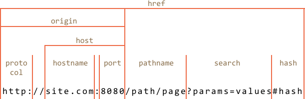

# URL объект

Встроенный класс [URL](https://url.spec.whatwg.org/#api) предоставляет удобный интерфейс для создания и анализа URL-адресов.

Мы не должны его использовать. Нет сетевых методов, которые требуют `URL` объект, достаточно использовать строку. Но иногда он может быть полезным.

## Создание URL

Синтаксис создания нового URL объекта:

```js
new URL(url, [base])
```

- **`url`** -- url-адрес
- **`base`** -- дополнительные опции для `url`

`URL` объект позволяет нам получить доступ к его свойствам, поэтому это отличный способ распарсить url, например:

```js run
let url = new URL('https://javascript.info/url');

alert(url.protocol); // https:
alert(url.host);     // javascript.info
alert(url.pathname); // /url
```

Вот шпаргалка:



- `href` это полный url-адрес, точно такой же, как `url.toString()`
- `protocol` заканчивается перед символом двоеточия `:`
- `search` начинается с вопросительного знака `?`
- `hash` начинается с символа `#`
- также есть свойства `user` и `password`, если используется http-аутентификация.

Мы можем использовать `URL` объект для создания относительных url, используя второй аргумент:

```js run
let url = new URL('profile/admin', 'https://javascript.info');

alert(url); // https://javascript.info/profile/admin

url = new URL('tester', url); // перейти к 'tester' относительно текущего url

alert(url); // https://javascript.info/profile/tester
```

```smart header="We can use `URL` everywhere instead of a string"
Мы можем использовать `URL` объект в методах `fetch` или `XMLHttpRequest` и почти во всех других, где ожидается url строка.
В подавляющем большинстве методов он автоматически конвертируется в строку.
```

## Параметры поиска

Скажем, мы хотим создать url с заданными параметрами, например, `https://google.com/search?query=value`.

Они  должны быть правильно закодированы.

В очень старых браузерах, до появления `URL`, мы использовали встроенные функции `encodeURIComponent/decodeURIComponent`.

Сейчас в этом нет необходимости: `url.searchParams` это объект типа [URLSearchParams](https://url.spec.whatwg.org/#urlsearchparams).

Он предоставляет удобные методы для работы с параметрами:

- **`append(name, value)`** -- добавить параметр,
- **`delete(name)`** -- удалить параметр,
- **`get(name)`** -- получить параметр,
- **`getAll(name)`** -- получить все параметры с этим именем (если их много, например: `?user=John&user=Pete`),
- **`has(name)`** -- проверить наличие параметра,
- **`set(name, value)`** -- задачть/заменить параметр,
- **`sort()`** -- отсортировать параметры по имени, используется редко,
- ...и другие итерируемые, подобные `Map`.

Таким образом, `URL` объект так же дает возможность оперировать параметрами url.

Пример:

```js run
let url = new URL('https://google.com/search');
url.searchParams.set('query', 'проверь меня!');

alert(url); // https://google.com/search?query=проверь+меня%21

url.searchParams.set('tbs', 'qdr:y'); // добавить параметр для диапазона дат: прошлый год

alert(url); // https://google.com/search?query=проверь+меня%21&tbs=qdr%3Ay

// перебор параметров поиска (декодирование)
for(let [name, value] of url.searchParams) {
  alert(`${name}=${value}`); // query=проверь меня!, далее tbs=qdr:y
}
```
