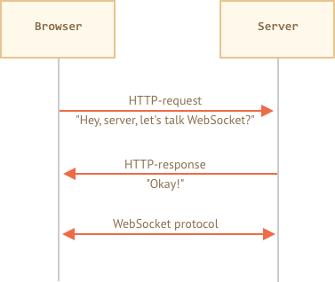

# WebSocket

Протокол `WebSocket`, описанный в спецификации [RFC 6455](http://tools.ietf.org/html/rfc6455), обеспечивает возможность обмена данными между браузером и сервером через постоянное соединение.

Как только websocket-соединение установлено, клиент и сервер могут обмениваться данными друг с другом.

WebSocket особенно хорош для сервисов, которые нуждаются в постоянном обмене данными, например онлайн игры, площадки, работающие в реальном времени, и т.д.

## Простой пример

Чтобы открыть websocket-соединение, нам нужно создать `new WebSocket`, указав в url-адресе специальный протокол `ws`:

```js
let socket = new WebSocket("*!*ws*/!*://javascript.info");
```

Также существует протокол `wss://`, использующий шифрование. Это как HTTPS для websockets.

```smart header="Always prefer `wss://`"
Протокол `wss://` не только использует шифрование, но и обладает повышенной надёжностью.
Это потому, что данные `ws://` не зашифрованы, видны для любого посредника. Старые прокси-серверы не знают о WebSocket, они могут видеть «странные» заголовки и закрывать соединение.
С другой стороны, `wss://` -- это WebSocket поверх TLS (так же, как HTTPS -- это HTTP поверх TLS), безопасный транспортный уровень шифрует данные от отправителя и расшифровывает на стороне получателя, поэтому он передаётся в зашифрованном виде через прокси. Они не могут видеть, что внутри, и всегда пропускают это.
```

Как только websocket создан, мы должны слушать его события. Всего 4 события:
- **`open`** -- соединение установлено,
- **`message`** -- получение данных,
- **`error`** -- ошибка websocket,
- **`close`** -- соединение закрыто.

...И если мы хотим отправить что-нибудь, тогда `socket.send(data)` сделает это.

Вот пример:

```js run
let socket = new WebSocket("wss://javascript.info/article/websocket/demo/hello");

socket.onopen = function(e) {
  alert("[открыто] Соединение установлено, отправить -> сервер");
  socket.send("Меня зовут Джон");
};

socket.onmessage = function(event) {
  alert(`[сообщение] Данные получены: ${event.data} <- сервер`);
};

socket.onclose = function(event) {
  if (event.wasClean) {  
    alert(`[закрыто] Соединение закрыто успешно, код=${event.code} причина=${event.reason}`);
  } else {
    // например, сервер убил процесс или сеть недоступна
    // обычно в этом случае event.code 1006
    alert('[закрыто] Соединение прервано');
  }
};

socket.onerror = function(error) {
  alert(`[ошибка] ${error.message}`);
};
```

Для демонстрации есть небольшой пример сервера [server.js](demo/server.js), написанного на Node.js, для запуска примера выше. Он отвечает "hello", после ожидает 5 секунд и закрывает соединение.

Так вы увидите события `open` -> `message` -> `close`.

На самом деле, мы уже можем общаться с WebSocket. Просто, не так ли?

Давайте поговорим более подробно.

## Открытие websocket

Когда `new WebSocket(url)` создан, он начинает HTTP рукопожатие (HTTPS для `wss://`).

Браузер спрашивает сервер: "Ты поддерживаешь Websocket?" и если сервер отвечает "да", они начинают работать с протоколом WebSocket, который не является HTTP.



Вот пример запроса браузера `new WebSocket("wss://javascript.info/chat")`.

```
GET /chat
Host: javascript.info
Origin: https://javascript.info
Connection: Upgrade
Upgrade: websocket
Sec-WebSocket-Key: Iv8io/9s+lYFgZWcXczP8Q==
Sec-WebSocket-Version: 13
```

- `Origin` -- происхождение страницы клиента. WebSocket по природе является cross-origin. Нет никаких специальных заголовков или других ограничений. Старые сервера все равно не могут работать с WebSocket, поэтому проблем с совместимостью нет. Но заголовок `Origin` важен, так как он позволяет серверу решать, использовать ли WebSocket с этим сайтом.
- `Connection: Upgrade` -- сигнализирует, что клиент хотел бы изменить протокол.
- `Upgrade: websocket` -- запрошенный протокол "websocket".
- `Sec-WebSocket-Key` -- случайный ключ, созданный браузером для обеспечения безопасности.
- `Sec-WebSocket-Version` -- версия протокола WebSocket, текущая версия 13.

```smart header="WebSocket handshake can't be emulated"
Мы не можем использовать`XMLHttpRequest` или `fetch` для создания такого HTTP-запроса, потому что JavaScript не позволяет устанавливать такие заголовки.
```

Если сервер согласен переключиться на WebSocket, то он должен отправить в ответ code 101:

```
101 Switching Protocols
Upgrade: websocket
Connection: Upgrade
Sec-WebSocket-Accept: hsBlbuDTkk24srzEOTBUlZAlC2g=
```

Здесь `Sec-WebSocket-Accept` -- это `Sec-WebSocket-Key`, перекодированный с помощью специального алгоритма. Браузер использует его, чтобы убедиться, что ответ соответствует запросу.

После этого данные передаются по протоколу WebSocket, и вскоре мы увидим его структуру ("фреймы"). И это вовсе не HTTP.

### Расширения и подпротоколы

Могут быть дополнительные заголовки `Sec-WebSocket-Extensions` и `Sec-WebSocket-Protocol`, описывающие расширения и подпротоколы.

Например:

- `Sec-WebSocket-Extensions: deflate-frame` означает, что браузер поддерживает сжатие данных. Расширение -- это нечто, связанное с передачей данных, а не сами данные

- `Sec-WebSocket-Protocol: soap, wamp` означает, что мы будем передавать не только любые данные, но и данные в протоколах [SOAP](http://en.wikipedia.org/wiki/SOAP) или WAMP ("протокол обмена сообщениями WebSocket приложений"). Подпротоколы WebSocket регистрируются в [каталоге IANA](http://www.iana.org/assignments/websocket/websocket.xml).

`Sec-WebSocket-Extensions` отправляется браузером автоматически со списком возможных расширений, которые он поддерживает.

`Sec-WebSocket-Protocol` зависит от нас: мы решаем, какие данные отправлять. Второй необязательный параметр `new WebSocket` -- массив списка подпротоколов:

```js
let socket = new WebSocket("wss://javascript.info/chat", ["soap", "wamp"]);
```
Сервер должен ответить перечнем протоколов и расширений, которые он может использовать.

Например, запрос:

```
GET /chat
Host: javascript.info
Upgrade: websocket
Connection: Upgrade
Origin: https://javascript.info
Sec-WebSocket-Key: Iv8io/9s+lYFgZWcXczP8Q==
Sec-WebSocket-Version: 13
*!*
Sec-WebSocket-Extensions: deflate-frame
Sec-WebSocket-Protocol: soap, wamp
*/!*
```

Ответ:

```
101 Switching Protocols
Upgrade: websocket
Connection: Upgrade
Sec-WebSocket-Accept: hsBlbuDTkk24srzEOTBUlZAlC2g=
*!*
Sec-WebSocket-Extensions: deflate-frame
Sec-WebSocket-Protocol: soap
*/!*
```

Здесь сервер отвечает, что поддерживает расширение -- deflate-frame и может использовать только протокол SOAP из всего списка запрошенных подпротоколов.

## Данные WebSocket

Поток данных в WebSocket состоит из "кадров", которые могут быть отправлены любой стороной:

- "text frames" -- содержат текстовые данные, которые стороны отправляют друг другу.
- "binary data frames" -- содержат бинарные данные, которые стороны отправляют друг другу..
- "ping/pong frames" используется для проверки соединения; отправляется с сервера, браузер реагирует на них автоматически.
- "connection close frame" и несколько других служебных кадров.

В браузере мы беспокоимся только о текстовых или бинарных кадрах.

**WebSocket `.send()` может отправлять текстовые или двоичные данные, не беспокойтесь об этом.**

Для отправки, `socket.send(body)` принимает строки или данные в любом другом бинарном формате, включая `Blob`, `ArrayBuffer` и другие. Дополнительных настроек не требуется, просто отправьте их.

**Текстовые данные всегда поступают в виде строки. Для получения двоичных данных мы можем выбрать один из форматов `Blob` или `ArrayBuffer`.**

Значение по умолчанию `socket.bufferType` -- `"blob"`, поэтому двоичные данные поступают в Blobs.

[Blob](info:blob) -- это высокоуровневый двоичный объект, он напрямую интегрируется с `<a>`, `` и другими тегами. Это значение по умолчанию. Но для двоичной обработки, чтобы получить доступ к отдельным байтам данных, мы можем изменить его на `"arraybuffer"`:

```js
socket.bufferType = "arraybuffer";
socket.onmessage = (event) => {
  // event.data является строкой (если текст) или arraybuffer (если двоичные данные)
};
```

## Ограничение скорости

Представьте, наше приложение генерирует много данных для отправки. Но используется медленное подключение к сети. Пользователь может находиться в сельской местности, используя мобильный телефон.

Мы можем вызывать `socket.send(data)` снова и снова. Но данные будут буферизованы в памяти и отправлены так быстро, как позволяет скорость сети.

Свойство `socket.bufferedAmount` хранит количество байт буферизованных данных на текущий момент, ожидающих отправки по сети.

Мы можем изучить его, чтобы увидеть, действительно ли сокет доступен для передачи.

```js
// каждые 100мс проверяйте сокет и отправляйте больше данных, только если нет буферизованных данных 
setInterval(() => {
  if (socket.bufferedAmount == 0) {
    socket.send(moreData());
  }
}, 100);
```


## Закрытие подключения

Обычно, когда сторона хочет закрыть соединение (браузер и сервер имеют равные права), они отправляют "фрейм закрытия соединения" с кодом закрытия и указывают причину в виде текста.

Метод:
```js
socket.close([code], [reason]);
```

Тогда другая сторона в дескрипторе события `close` может вернуть код и причину, например:

```js
// первая сторона:
socket.close(1000, "Work complete");

// другая сторонаЖ
socket.onclose = event => {
  // event.code === 1000
  // event.reason === "работа закончена"
  // event.wasClean === true (закрыто чисто)
};
```

`code` -- это не любое число, а специальный код закрытия WebSocket.

Наиболее распространенные значения:

- `1000` -- по умолчанию, нормальное закрытие,
- `1006` -- невозможно установить такой код вручную, указывает, что соединение было нарушено (нет фрейма закрытия).

Есть и другие коды:

- `1001` -- сторона отключилась, например сервер выключен или пользователь покинул страницу,
- `1009` -- сообщение слишком большое для обработки,
- `1011` -- непредвиденная ошибка на сервере,
- ...и так далее.

Пожалуйста, обратитесь к [RFC6455, §7.4.1](https://tools.ietf.org/html/rfc6455#section-7.4.1) для ознакомления с полным списком.

Коды WebSocket чем-то похожи на коды HTTP, но они разные. В частности, любые коды меньше `1000` зарезервированы. Если мы попытаемся установить такой код, то получим ошибку.

```js
// в случае, если соединение сброшено 
socket.onclose = event => {
  // event.code === 1006
  // event.reason === ""
  // event.wasClean === false (нет закрывающего кадра)
};
```


## Состояние соединения

Чтобы получить состояние соединения, существует дополнительное свойство `socket.readyState` со значениями:

- **`0`** -- "CONNECTING": соединение еще не установлено,
- **`1`** -- "OPEN": обмен данными,
- **`2`** -- "CLOSING": соединение закрывается,
- **`3`** -- "CLOSED": соединение закрыто.


## Пример чата

Давайте рассмотрим пример чата с использованием WebSocket API и Node.js <https://github.com/websockets/ws>.

HTML: есть `<form>` для отправки данных и `<div>` для отображения сообщений:

```html
<!-- форма сообщений -->
<form name="publish">
  <input type="text" name="message">
  <input type="submit" value="Send">
</form>

<!-- div с сообщениями -->
<div id="messages"></div>
```

JavaScript также прост. Мы открыли сокет, затем передаём форму -- `socket.send(message)`, при получении входящих сообщений -- добавляем их в `div#messages`:

```js
let socket = new WebSocket("wss://javascript.info/article/websocket/chat/ws");

// отправка сообщения из формы
document.forms.publish.onsubmit = function() {
  let outgoingMessage = this.message.value;

  socket.send(outgoingMessage);
  return false;
};

// отобразить данные в div#messages
socket.onmessage = function(event) {
  let message = event.data;

  let messageElem = document.createElement('div');
  messageElem.textContent = message;
  document.getElementById('messages').prepend(messageElem);
}
```

Код на стороне сервера немного выходит за рамки нашей области. Мы используем WebSocket API браузера, сервер может использовать другую библиотеку.

Это может быть очень просто. Мы будем использовать Node.js с модулем для поддержки WebSocket <https://github.com/websockets/ws>.

Алгоритм:
1. Создать `clients = new Set()` -- набор сокетов.
2. Для каждого принятого websocket: `clients.add(socket)` и прослушивать его сообщения.
3. Когда сообщение получено: перебрать клиентов и отправить его всем.
4. Когда подключение закрыто: `clients.delete(socket)`.

```js
const ws = new require('ws');
const wss = new ws.Server({noServer: true});

const clients = new Set();

http.createServer((req, res) => {
  // в реальном проекте у нас есть дополнительный код для обработки отличных от websoсket запросов
  wss.handleUpgrade(req, req.socket, Buffer.alloc(0), onSocketConnect);
});

function onSocketConnect(ws) {
  clients.add(ws);

  ws.on('message', function(message) {
    message = message.slice(0, 50); // максимальный размер сообщения 50

    for(let client of clients) {
      client.send(message);
    }
  });

  ws.on('close', function() {
    clients.delete(ws);
  });
}
```


Вот рабочий пример:

[iframe src="chat" height="100" zip]

Вы также можете скачать его (верхняя правая кнопка в ифрейме) и запустить локально. Просто не забудьте установить [Node.js](https://nodejs.org/en/) и выполнить команду `npm install ws` до запуска.


## Итого

WebSocket -- это современный способ иметь постоянное соединение между браузером и сервером.

- WebSockets не имеют ограничений, связанных с кроссдоменными запросами.
- Имеют хорошую поддержку браузерами.
- Могут отправлять/получать как строки, так и двоичные данные.

API прост.

Методы:
- `socket.send(data)`,
- `socket.close([code], [reason])`.

События:
- `open`,
- `message`,
- `error`,
- `close`.

WebSocket сам по себе не содержит такие функции, как переподключение при обрыве соединения, аутентификацию пользователей и другие механизмы высокого уровня. Для таких случаев есть клиентские и серверные библиотеки, которые при необходимости добавляют эти возможности. Также можно реализовать это всё вручную и интегрировать WebSockets с существующим сайтом.

В целях интеграции WebSocket-сервер обычно работает параллельно с основным сервером. Они совместно использует одну базу данных. Запросы к WebSocket отправляются на wss://ws.site.com -- поддомен, который ведёт к WebSocket-серверу, в то время как https://site.com ведёт на основной HTTP-сервер.

Конечно, возможны и другие пути интеграции. Многие сервера (например, Node.js) поддерживают оба протокола -- HTTP и WebSocket.
