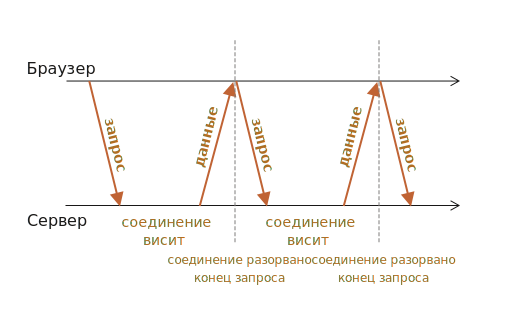

# Длинные опросы

Длинные опросы - это самый простой способ поддерживать постоянное соединение с сервером, не используя при этом никаких специфических протоколов (типа WebSocket или Server Side Events).

Его очень легко реализовать, и он хорошо подходит для многих задач.

## Частые опросы

<<<<<<< HEAD
Самый простой способ получать новую информацию от сервера - периодический опрос. То есть, регулярные запросы на сервер вида: "Привет, я здесь, у вас есть какая-нибудь информация для меня?". Например, раз в 10 секунд.

В ответ сервер, во-первых, помечает у себя, что клиент онлайн, а во-вторых посылает весь пакет сообщений, накопившихся к данному моменту.
=======
The simplest way to get new information from the server is periodic polling. That is, regular requests to the server: "Hello, I'm here, do you have any information for me?". For example, once in 10 seconds.
>>>>>>> 8c30654f694fe8682f5631809980be931ee4ed72

Это работает, но есть и недостатки:
1. Сообщения передаются с задержкой до 10 секунд (между запросами).
2. Даже если сообщений нет, сервер "атакуется" запросами каждые 10 секунд, даже если пользователь переключился куда-нибудь или спит. С точки зрения производительности, это довольно большая нагрузка.

<<<<<<< HEAD
Так что, если речь идёт об очень маленьком сервисе, подход может оказаться жизнеспособным, но в целом он нуждается в улучшении.
=======
That works, but there are downsides:
1. Messages are passed with a delay up to 10 seconds (between requests).
2. Even if there are no messages, the server is bombed with requests every 10 seconds, even if the user switched somewhere else or is asleep. That's quite a load to handle, speaking performance-wise.
>>>>>>> 8c30654f694fe8682f5631809980be931ee4ed72

## Длинные опросы

"Длинные опросы" - гораздо лучший способ взаимодействия с сервером.

Они также очень просты в реализации, и сообщения доставляются без задержек.

Как это происходит:

1. Запрос отправляется на сервер.
2. Сервер не закрывает соединение, пока у него не возникнет сообщение для отсылки.
3. Когда появляется сообщение - сервер отвечает на запрос, посылая его.
4. Браузер немедленно делает новый запрос.

<<<<<<< HEAD
Для данного метода ситуация, когда браузер отправил запрос и удерживает соединение с сервером, ожидании ответа, является стандартной. Соединение прерывается только доставкой сообщений.
=======
1. A request is sent to the server.
2. The server doesn't close the connection until it has a message to send.
3. When a message appears - the server responds to the request with it.
4. The browser makes a new request immediately.

The situation when the browser sent a request and has a pending connection with the server, is standard for this method. Only when a message is delivered, the connection is reestablished.
>>>>>>> 8c30654f694fe8682f5631809980be931ee4ed72



Если соединение будет потеряно, скажем, из-за сетевой ошибки, браузер немедленно посылает новый запрос.

Примерный код клиентской функции `subscribe`, которая реализует длинные опросы:

```js
async function subscribe() {
  let response = await fetch("/subscribe");

  if (response.status == 502) {
<<<<<<< HEAD
    // Статус 502 - это таймаут соединения;
    // возможен, когда соединение ожидало слишком долго
    // и сервер (или промежуточный прокси) закрыл его
    // давайте восстановим связь
    await subscribe();
  } else if (response.status != 200) {
    // Какая-то ошибка, покажем её
=======
    // Status 502 is a connection timeout error,
    // may happen when the connection was pending for too long,
    // and the remote server or a proxy closed it
    // let's reconnect
    await subscribe();
  } else if (response.status != 200) {
    // An error - let's show it
>>>>>>> 8c30654f694fe8682f5631809980be931ee4ed72
    showMessage(response.statusText);
    // Подключимся снова через секунду.
    await new Promise(resolve => setTimeout(resolve, 1000));
    await subscribe();
  } else {
<<<<<<< HEAD
    // Получим и покажем сообщение
    let message = await response.text();
    showMessage(message);
    // И снова вызовем subscribe() для получения следующего сообщения
=======
    // Get and show the message
    let message = await response.text();
    showMessage(message);
    // Call subscribe() again to get the next message
>>>>>>> 8c30654f694fe8682f5631809980be931ee4ed72
    await subscribe();
  }
}

subscribe();
```

Функция `subscribe()` делает запрос, затем ожидает ответ, обрабатывает его и снова вызывает сама себя.

```warn header="Сервер должен поддерживать много ожидающих соединений."
Архитектура сервера должна быть способна работать со многими ожидающими подключениями.

Некоторые серверные архитектуры запускают отдельный процесс для каждого соединения. Для большого количества соединений будет столько же процессов, и каждый процесс занимает значительный обьём памяти. Так много соединений просто поглотят всю память.

<<<<<<< HEAD
Часто такая проблема возникает с бэкендом, написанными на PHP или Ruby, но технически дело не в языке, а в реализации. На большинстве современных языков можно написать подходящий сервер, но на некоторых это проще сделать.
=======
That's often the case for backends written in PHP, Ruby languages, but technically isn't a language, but rather implementation issue. Most modern language allow to implement a proper backend, but some of them make it easier than the other.
>>>>>>> 8c30654f694fe8682f5631809980be931ee4ed72

Бэкенды, написанные с помощью Node.js, обычно не имеют таких проблем.
```

## Демо: чат

<<<<<<< HEAD
Вот демо-чат, вы также можете скачать его и запустить локально (если вам знаком Node.js и можете поставить модули):

[codetabs src="longpoll" height=500]

Браузерный код находится в `browser.js`.

## Область применения
=======
Here's a demo chat, you can also download it and run locally (if you're familiar with Node.js and can install modules):

[codetabs src="longpoll" height=500]

Browser code is in `browser.js`.

## Area of usage
>>>>>>> 8c30654f694fe8682f5631809980be931ee4ed72

Длинные опросы прекрасно работают, когда сообщения приходят редко.

Если сообщения приходят очень часто, то схема приёма-отправки сообщений, приведённая выше, становится похожей на "пилу".

Каждое сообщение - это отдельный запрос, с заголовками, авторизацией и так далее.

Поэтому в этом случае предпочтительнее использовать другой метод, такой как [Websocket](info:websocket) или [Server Sent Events](info:server-sent-events).
