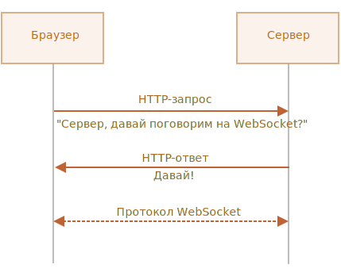

# WebSocket

Протокол `WebSocket` ("веб-сокет"), описанный в спецификации [RFC 6455](http://tools.ietf.org/html/rfc6455), обеспечивает возможность обмена данными между браузером и сервером через постоянное соединение. Данные передаются по нему в обоих направлениях в виде "пакетов", без разрыва соединения и дополнительных HTTP-запросов.

WebSocket особенно хорош для сервисов, которые нуждаются в постоянном обмене данными, например онлайн игры, торговые площадки, работающие в реальном времени, и т.д.

## Простой пример

Чтобы открыть веб-сокет-соединение, нам нужно создать объект `new WebSocket`, указав в url-адресе специальный протокол `ws`:

```js
let socket = new WebSocket("*!*ws*/!*://javascript.info");
```

Также существует протокол `wss://`, использующий шифрование. Это как HTTPS для веб-сокетов.

```smart header="Всегда предпочитайте `wss://`"
Протокол `wss://` не только использует шифрование, но и обладает повышенной надёжностью.

Это потому, что данные `ws://` не зашифрованы, видны для любого посредника. Старые прокси-серверы не знают о WebSocket, они могут увидеть "странные" заголовки и закрыть соединение.

С другой стороны, `wss://` -- это WebSocket поверх TLS (так же, как HTTPS -- это HTTP поверх TLS), безопасный транспортный уровень шифрует данные от отправителя и расшифровывает на стороне получателя. Пакеты данных передаются в зашифрованном виде через прокси, которые не могут видеть, что внутри, и всегда пропускают их.
```

Как только объект `WebSocket` создан, мы должны слушать его события. Их всего 4:
- **`open`** -- соединение установлено,
- **`message`** -- получены данные,
- **`error`** -- ошибка,
- **`close`** -- соединение закрыто.

...А если мы хотим отправить что-нибудь, то вызов `socket.send(data)` сделает это.

Вот пример:

```js run
let socket = new WebSocket("wss://javascript.info/article/websocket/demo/hello");

socket.onopen = function(e) {
  alert("[open] Соединение установлено");
  alert("Отправляем данные на сервер");
  socket.send("Меня зовут Джон");
};

socket.onmessage = function(event) {
  alert(`[message] Данные получены с сервера: ${event.data}`);
};

socket.onclose = function(event) {
  if (event.wasClean) {
    alert(`[close] Соединение закрыто чисто, код=${event.code} причина=${event.reason}`);
  } else {
    // например, сервер убил процесс или сеть недоступна
    // обычно в этом случае event.code 1006
    alert('[close] Соединение прервано');
  }
};

socket.onerror = function(error) {
  alert(`[error]`);
};
```

Для демонстрации есть небольшой пример сервера [server.js](demo/server.js), написанного на Node.js, для запуска примера выше. Он отвечает "Привет с сервера, Джон", после ожидает 5 секунд и закрывает соединение.

Так вы увидите события `open` -> `message` -> `close`.

В общем-то, всё, мы уже можем общаться по протоколу WebSocket. Просто, не так ли?

Теперь давайте поговорим более подробно.

## Открытие веб-сокета

Когда `new WebSocket(url)` создан, он тут же сам начинает устанавливать соединение.

Браузер, при помощи специальных заголовков, спрашивает сервер: "Ты поддерживаешь Websocket?" и если сервер отвечает "да", они начинают работать по протоколу WebSocket, который уже не является HTTP.



Вот пример заголовков для запроса, который делает `new WebSocket("wss://javascript.info/chat")`.

```
GET /chat
Host: javascript.info
Origin: https://javascript.info
Connection: Upgrade
Upgrade: websocket
Sec-WebSocket-Key: Iv8io/9s+lYFgZWcXczP8Q==
Sec-WebSocket-Version: 13
```

- `Origin` -- источник текущей страницы (например `https://javascript.info`). Объект WebSocket по своей природе не завязан на текущий источник. Нет никаких специальных заголовков или других ограничений. Старые сервера всё равно не могут работать с WebSocket, поэтому проблем с совместимостью нет. Но заголовок `Origin` важен, так как он позволяет серверу решать, использовать ли WebSocket с этим сайтом.
- `Connection: Upgrade` -- сигнализирует, что клиент хотел бы изменить протокол.
- `Upgrade: websocket` -- запрошен протокол "websocket".
- `Sec-WebSocket-Key` -- случайный ключ, созданный браузером для обеспечения безопасности.
- `Sec-WebSocket-Version` -- версия протокола WebSocket, текущая версия 13.

```smart header="Запрос WebSocket нельзя эмулировать"
Мы не можем использовать `XMLHttpRequest` или `fetch` для создания такого HTTP-запроса, потому что JavaScript не позволяет устанавливать такие заголовки.
```

Если сервер согласен переключиться на WebSocket, то он должен отправить в ответ код 101:

```
101 Switching Protocols
Upgrade: websocket
Connection: Upgrade
Sec-WebSocket-Accept: hsBlbuDTkk24srzEOTBUlZAlC2g=
```

Здесь `Sec-WebSocket-Accept` -- это `Sec-WebSocket-Key`, перекодированный с помощью специального алгоритма. Браузер использует его, чтобы убедиться, что ответ соответствует запросу.

После этого данные передаются по протоколу WebSocket, и вскоре мы увидим его структуру ("фреймы"). И это вовсе не HTTP.

### Расширения и подпротоколы

Могут быть дополнительные заголовки `Sec-WebSocket-Extensions` и `Sec-WebSocket-Protocol`, описывающие расширения и подпротоколы.

Например:

- `Sec-WebSocket-Extensions: deflate-frame` означает, что браузер поддерживает сжатие данных. Расширение -- это что-то, связанное с передачей данных, расширяющее сам протокол WebSocket. Заголовок `Sec-WebSocket-Extensions` отправляется браузером автоматически со списком всевозможных расширений, которые он поддерживает.

- `Sec-WebSocket-Protocol: soap, wamp` означает, что мы будем передавать не только произвольные данные, но и данные в протоколах [SOAP](https://en.wikipedia.org/wiki/SOAP) или WAMP (The WebSocket Application Messaging Protocol" -- "протокол обмена сообщениями WebSocket приложений"). То есть этот заголовок описывает не передачу, а формат данных, который мы собираемся использовать. Официальные подпротоколы WebSocket регистрируются в [каталоге IANA](https://www.iana.org/assignments/websocket/websocket.xml).

    Этот необязательный заголовок ставим мы сами, передавая массив подпротоколов вторым параметром `new WebSocket`, вот так:

    ```js
    let socket = new WebSocket("wss://javascript.info/chat", ["soap", "wamp"]);
    ```

Сервер должен ответить перечнем протоколов и расширений, которые он может использовать.

Например, запрос:

```
GET /chat
Host: javascript.info
Upgrade: websocket
Connection: Upgrade
Origin: https://javascript.info
Sec-WebSocket-Key: Iv8io/9s+lYFgZWcXczP8Q==
Sec-WebSocket-Version: 13
*!*
Sec-WebSocket-Extensions: deflate-frame
Sec-WebSocket-Protocol: soap, wamp
*/!*
```

Ответ:

```
101 Switching Protocols
Upgrade: websocket
Connection: Upgrade
Sec-WebSocket-Accept: hsBlbuDTkk24srzEOTBUlZAlC2g=
*!*
Sec-WebSocket-Extensions: deflate-frame
Sec-WebSocket-Protocol: soap
*/!*
```

Здесь сервер отвечает, что поддерживает расширение -- deflate-frame и может использовать только протокол SOAP из всего списка запрошенных подпротоколов.

## Передача данных

Поток данных в WebSocket состоит из "фреймов", фрагментов данных, которые могут быть отправлены любой стороной, и которые могут быть следующих видов:

- "текстовые фреймы" -- содержат текстовые данные, которые стороны отправляют друг другу.
- "бинарные фреймы" -- содержат бинарные данные, которые стороны отправляют друг другу.
- "пинг-понг фреймы" используется для проверки соединения; отправляется с сервера, браузер реагирует на них автоматически.
- также есть "фрейм закрытия соединения" и некоторые другие служебные фреймы.

В браузере мы напрямую работаем только с текстовыми и бинарными фреймами.

**Метод WebSocket `.send()` может отправлять и текстовые, и бинарные данные.**

Вызов `socket.send(body)` принимает `body` в виде строки или любом бинарном формате включая `Blob`, `ArrayBuffer` и другие. Дополнительных настроек не требуется, просто отправляем в любом формате.

**При получении данных, текст всегда поступает в виде строки. А для бинарных данных мы можем выбрать один из двух форматов: `Blob` или `ArrayBuffer`.**

Это задаётся свойством `socket.binaryType`, по умолчанию оно равно `"blob"`, так что бинарные данные поступают в виде `Blob`-объектов.

[Blob](info:blob) -- это высокоуровневый бинарный объект, он напрямую интегрируется с `<a>`, `` и другими тегами, так что это вполне удобное значение по умолчанию. Но для обработки данных, если требуется доступ к отдельным байтам, мы можем изменить его на `"arraybuffer"`:

```js
socket.binaryType = "arraybuffer";
socket.onmessage = (event) => {
  // event.data является строкой (если текст) или arraybuffer (если двоичные данные)
};
```

## Ограничение скорости

Представим, что наше приложение генерирует много данных для отправки. Но у пользователя медленное соединение, возможно, он в интернете с мобильного телефона и не из города.

Мы можем вызывать `socket.send(data)` снова и снова. Но данные будут буферизованы (сохранены) в памяти и отправлены лишь с той скоростью, которую позволяет сеть.

Свойство `socket.bufferedAmount` хранит количество байт буферизованных данных на текущий момент, ожидающих отправки по сети.

Мы можем изучить его, чтобы увидеть, действительно ли сокет доступен для передачи.

```js
// каждые 100мс проверить сокет и отправить больше данных,
// только если все текущие отосланы
setInterval(() => {
  if (socket.bufferedAmount == 0) {
    socket.send(moreData());
  }
}, 100);
```

## Закрытие подключения

Обычно, когда сторона хочет закрыть соединение (браузер и сервер имеют равные права), они отправляют "фрейм закрытия соединения" с кодом закрытия и указывают причину в виде текста.

Метод для этого:
```js
socket.close([code], [reason]);
```

- `code` -- специальный WebSocket-код закрытия (не обязателен).
- `reason` -- строка с описанием причины закрытия (не обязательна).

Затем противоположная сторона в обработчике события `close` получит и код `code` и причину `reason`, например:

```js
// закрывающая сторона:
socket.close(1000, "работа закончена");

// другая сторона:
socket.onclose = event => {
  // event.code === 1000
  // event.reason === "работа закончена"
  // event.wasClean === true (закрыто чисто)
};
```

`code` -- это не любое число, а специальный код закрытия WebSocket.

Наиболее распространённые значения:

- `1000` -- по умолчанию, нормальное закрытие,
- `1006` -- невозможно установить такой код вручную, указывает, что соединение было потеряно (нет фрейма закрытия).

Есть и другие коды:

- `1001` -- сторона отключилась, например сервер выключен или пользователь покинул страницу,
- `1009` -- сообщение слишком большое для обработки,
- `1011` -- непредвиденная ошибка на сервере,
- ...и так далее.

Полный список находится в [RFC6455, §7.4.1](https://tools.ietf.org/html/rfc6455#section-7.4.1).

Коды WebSocket чем-то похожи на коды HTTP, но они разные. В частности, любые коды меньше `1000` зарезервированы. Если мы попытаемся установить такой код, то получим ошибку.

```js
// в случае, если соединение сброшено
socket.onclose = event => {
  // event.code === 1006
  // event.reason === ""
  // event.wasClean === false (нет закрывающего кадра)
};
```


## Состояние соединения

Чтобы получить состояние соединения, существует дополнительное свойство `socket.readyState` со значениями:

- **`0`** -- "CONNECTING": соединение ещё не установлено,
- **`1`** -- "OPEN": обмен данными,
- **`2`** -- "CLOSING": соединение закрывается,
- **`3`** -- "CLOSED": соединение закрыто.


## Пример чата

Давайте рассмотрим пример чата с использованием WebSocket API и модуля WebSocket сервера Node.js <https://github.com/websockets/ws>. Основное внимание мы, конечно, уделим клиентской части, но и серверная весьма проста.

HTML: нам нужна форма `<form>` для отправки данных и `<div>` для отображения сообщений:

```html
<!-- форма сообщений -->
<form name="publish">
  <input type="text" name="message">
  <input type="submit" value="Отправить">
</form>

<!-- div с сообщениями -->
<div id="messages"></div>
```

От JavaScript мы хотим 3 вещи:
1. Открыть соединение.
2. При отправке формы пользователем - вызвать `socket.send(message)` для сообщения.
3. При получении входящего сообщения -- добавить его в `div#messages`.

Вот код:

```js
let socket = new WebSocket("wss://javascript.info/article/websocket/chat/ws");

// отправка сообщения из формы
document.forms.publish.onsubmit = function() {
  let outgoingMessage = this.message.value;

  socket.send(outgoingMessage);
  return false;
};

// получение сообщения - отобразить данные в div#messages
socket.onmessage = function(event) {
  let message = event.data;

  let messageElem = document.createElement('div');
  messageElem.textContent = message;
  document.getElementById('messages').prepend(messageElem);
}
```

Серверный код выходит за рамки этой главы. Здесь мы будем использовать Node.js, но вы не обязаны это делать. Другие платформы также поддерживают средства для работы с WebSocket.

Серверный алгоритм действий будет таким:

1. Создать `clients = new Set()` -- набор сокетов.
2. Для каждого принятого веб-сокета - добавить его в набор `clients.add(socket)` и поставить ему обработчик события `message` для приёма сообщений.
3. Когда сообщение получено: перебрать клиентов `clients` и отправить его всем.
4. Когда подключение закрыто: `clients.delete(socket)`.

```js
const ws = new require('ws');
const wss = new ws.Server({noServer: true});

const clients = new Set();

http.createServer((req, res) => {
  // в реальном проекте здесь может также быть код для обработки отличных от websoсket-запросов
  // здесь мы работаем с каждым запросом как с веб-сокетом
  wss.handleUpgrade(req, req.socket, Buffer.alloc(0), onSocketConnect);
});

function onSocketConnect(ws) {
  clients.add(ws);

  ws.on('message', function(message) {
    message = message.slice(0, 50); // максимальный размер сообщения 50

    for(let client of clients) {
      client.send(message);
    }
  });

  ws.on('close', function() {
    clients.delete(ws);
  });
}
```

Вот рабочий пример:

[iframe src="chat" height="100" zip]

Вы также можете скачать его (верхняя правая кнопка в ифрейме) и запустить локально. Только не забудьте установить [Node.js](https://nodejs.org/en/) и выполнить команду `npm install ws` до запуска.

## Итого

WebSocket -- это современный способ иметь постоянное соединение между браузером и сервером.

- Нет ограничений, связанных с кросс-доменными запросами.
- Имеют хорошую поддержку браузерами.
- Могут отправлять/получать как строки, так и бинарные данные.

API прост.

Методы:
- `socket.send(data)`,
- `socket.close([code], [reason])`.

События:
- `open`,
- `message`,
- `error`,
- `close`.

WebSocket сам по себе не содержит такие функции, как переподключение при обрыве соединения, аутентификацию пользователей и другие механизмы высокого уровня. Для этого есть клиентские и серверные библиотеки, а также можно реализовать это вручную.

Иногда, чтобы добавить WebSocket к уже существующему проекту, WebSocket-сервер запускают параллельно с основным сервером. Они совместно используют одну базу данных. Запросы к WebSocket отправляются на `wss://ws.site.com` -- поддомен, который ведёт к WebSocket-серверу, в то время как `https://site.com` ведёт на основной HTTP-сервер.

Конечно, возможны и другие пути интеграции.
