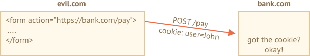
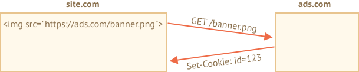
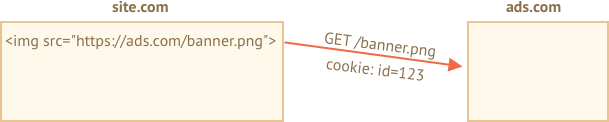
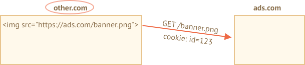

# Куки, document.cookie

Куки (cookies) - это строки, содержащие данные и хранящиеся в браузере. Они являются частью HTTP-протокола, определенного в спецификации [RFC 6265](https://tools.ietf.org/html/rfc6265).

Чаще всего куки устанавливаются веб-сервером. А затем автоматически добавляются в каждый запрос на этот домен.

Один из наиболее частых случаев использования куков - это аутентификация:

1. Во время регистрации сервер записывает в ответ HTTP-заголовок `Set-Cookie` для того, чтобы установить cookie с идентификатором сессии ("session identifier").
2. Во время следующего запроса к этому же домену браузер посылает на сервер HTTP-заголовок `Cookie` с идентификатором сессии.
3. Таким образом сервер понимает кто сделал запрос.

Мы также можем получить доступ к кукам непосредственно из браузера, используя свойство `document.cookie`.

Куки имеют множество особенностей и тонкостей в их использовании, и в этой главе мы подробнее с ними разберемся.

## Чтение document.cookie

```online
Ваш сайт содержит какие-нибудь куки? Посмотрим:
```

```offline
Предположим, что мы зашли на сайт и у нас есть возможность записать куки таким образом:
```

```run js
// На javascript.info мы используем сервис Google Analytics для сбора статистики,
// значит у нас должны храниться куки
alert( document.cookie ); // cookie1=value1; cookie2=value2;...
```


Значение свойства `document.cookie` - это набор парных элементов `name=value`, разделенных `; `. Каждая пара представляет собой отдельный кук.

Для того, чтобы найти нужный кук, нам нужно будет разбить `document.cookie` (используя разделитель  `; `) на пары ключ-значение и найти нужный нам ключ. Для этого мы можем использовать как регулярные выражения, так и функции для обработки массивов.

Оставим эту задачу читателю для самостоятельного выполнения. Кроме того, в конце этой главы вы найдете полезные функции для управления куками. 


## Запись в document.cookie

У нас есть возможность производить запись в `document.cookie`. Однако это не свойство для работы с данными, это - только средство для доступа к ним.

**Во время записи в свойство `document.cookie` браузер обновит только куки, упомянутые в этом свойстве, но при этом не затронет все остальные.**

Например, этот вызов установит кук с именем `user` и значением `John`:

```run js 
document.cookie = "user=John"; // обновляем только кук с именем 'user'
alert(document.cookie); // показываем все куки
```

Если вы запустите этот код, то скорее всего увидите множество куков. Это происходит потому что операция `document.cookie=` не перезапишет не все куки, а лишь кук с вышеупомянутым именем `user`.

Технически, и имя, и значение кука могут состоять из любых символов, однако для сохранения правильного форматирования следует использовать встроенную функцию `encodeURIComponent`:

```js run
// специальные символы, требуется кодировка
let name = "my name";
let value = "John Smith"

// перекодирует cookie к виду my%20name=John%20Smith
document.cookie = encodeURIComponent(name) + '=' + encodeURIComponent(value);

alert(document.cookie); // ...; my%20name=John%20Smith
```


```warn header="Ограничения"
Существует несколько ограничений:
- После перекодировки `encodeURIComponent` размер элемента `name=value` не должен превышать 4 Кб. Таким образом, мы не сможем сохранить в куках большие данные.
- Общее количество куков на один домен ограничивается примерно 20+. Точное ограничение зависит от конкретного браузера.
```

У куков есть несколько важных настроек, которые играют большое значение и которые обязательно следует устанавливать.

Эти свойства перечисляются после пары `ключ=значение` и отделены друг от друга разделителем `;`, как-то так:

```js run
document.cookie = "user=John; path=/; expires=Tue, 19 Jan 2038 03:14:07 GMT"
```

## path

- **`path=/mypath`**

Префикс, указывающий url, для которого доступен этот cookie. Путь должен быть абсолютный. По умолчанию указывается текущий путь.

Если кук установлен с `path=/admin`, то он будет виден так же и на страницах с url-ами `/admin` и `/admin/something`, но не на страницах `/home` или `/adminpage`.

Как правило, мы указываем путь `path=/`, для чтобы наши куки были доступны со всех страниц сайта.

## domain

- **`domain=site.com`**

Домен, на котором доступны наши куки. На практике, однако есть ограничения - мы не можем указать здесь какой угодно домен.

По умолчанию cookie доступен лишь тому домену, который его установил. Так что cookie, который был установлен сайтом `site.com`, не будет доступен на сайте `other.com`.

...Но! Что более интересно - мы так же не сможем получить этот cookie и на поддомене `forum.site.com`!

```js
// at site.com
document.cookie = "user=John"

// at forum.site.com
alert(document.cookie); // no user
```

**Способа получить доступ к кукам из доменов второго уровня нет. Поэтому сайт `other.com` никогда не получит куки, установленные сайтом `site.com`.** 

Это ограничение безопасности, которое позволяет нам сохранять чувствительные (конфиденциальные) данные в куках.

...Однако, если нам все же нужно получить доступ к поддоменам вида `forum.site.com`, это все же можно сделать. Достаточно в качестве значения опции `domain` указать корневой домен:  `domain=site.com`:

```js
// at site.com, make the cookie accessible on any subdomain:
document.cookie = "user=John; domain=site.com"

// at forum.site.com
alert(document.cookie); // with user
```

По историческим причинам запись вида `domain=.site.com` (с точкой в начале) так же будет корректно отрабатывать, точку стоит указывать в начале пути для поддержки совместимости с очень старыми браузерами.

Таким образом, опция `domain` позволяет нам получать доступ к кукам из поддоменов.

## expires, max-age

По умолчанию, если для кука не указана ни одна из этих опций, она удалится вместе с закрытием браузера. Такие куки называются - куки сессий ("session cookies").

Чтобы помочь кукам "пережить" закрытие браузера, мы можем установить значение опций `expires` или `max-age`.

- **`expires=Tue, 19 Jan 2038 03:14:07 GMT`**

Время истечения cookie (cookie expiration date) устанавливает дату, при наступлении которой браузер автоматически удалит этот cookie.

Дата истечения должна указываться строго в  UTC-формате во временной зоне GMT. Для получения строки даты мы можем использовать функцию  `date.toUTCString`. К примеру, установим cookie, который истечет через сутки:

```js
// +1 day from now
let date = new Date(Date.now() + 86400e3);
date = date.toUTCString();
document.cookie = "user=John; expires=" + date;
```

Если мы установим в `expires` прошедшую дату, то cookie удалится.

-  **`max-age=3600`**

Так же можно удалить cookie, установив время истечения cookie через несколько секунд.

При отрицательном либо нулевом значении cookie тоже удалится.

```js
// cookie will die +1 hour from now
document.cookie = "user=John; max-age=3600";

// delete cookie (let it expire right now)
document.cookie = "user=John; max-age=0";
```  

## secure

- **`secure`**

Куки должны передаваться только по HTTPS-протоколу.

**По умолчанию cookie, установленная сайтом `http://site.com`, так же будет доступна на сайте `https://site.com` и наоборот.**

Куки прикреплены к доменам и не передаются между разными протоколами.

Таким образом, если cookie установлена сайтом `https://site.com`, она не будет видна на сайте `http://site.com`, загруженном по протоколу HTTP.

```js
// assuming we're on https:// now
// set the cookie secure (only accessible if over HTTPS)
document.cookie = "user=John; secure";
```  

## samesite

Это еще одна настройка безопасности, призванная защищать пользователя от так называемых XSRF-атак (англ. cross-site request forgery - имитация кроссдоменного запроса).

Чтобы понять, как помогает эта настройка, представим себе следующую ситуацию:

### XSRF-атака

Представим, что мы залогинились на сайте `bank.com`. И теперь нам доступен аутентификационный cookie  этого сайта. Ваш сайт пересылает этот кук с каждым запросом, распознает вас и осуществляет необходимые финансовые операции.

Теперь, представим себе, что в другом окне вы открываете еще один сайт `evil.com`, который автоматически отправляет на сайт `bank.com` форму `<form action="https://bank.com/pay">` с заполненными полями платежа для банковского счета хакера.

Форма с сайта `evil.com` вместе с вашим cookie отправляется на сайт банка. Cookie так же отсылается, потому что это происходит каждый раз, когда вы заходите на сайт `bank.com`. Банк распознает вас и действительно осуществляет платеж.



Вот это и называют XSRF-атакой.

Естественно настоящие банки такого не допускают. Каждая форма, сгенерированная доменом `bank.com` имеет специальное поле, которое называется "токеном XSRF-защиты" (xsrf protection token), который зловредные сайты не способны ни сгенерировать, ни каким-либо образом извлечь с помощью удаленной страницы (зловредный сайт может отправить форму на сайт банка, но не сможет при этом получить ответ на запрос).

Но подобная реализация требует времени: нам нужно удостовериться, что у каждой формы есть такой токен, а так же проверять все запросы.

### Настройка куки samesite

Настройка куки samesite предоставляет еще один способ защиты от таких атак, что (в теории) избавляет нас от надобности использования xsrf-токенов.

У него есть два возможных значения:

- **`samesite=strict` (то же что и `samesite` без значения)**


Cookie со значением `samesite=strict` никогда не пересылается, если пользователь зашел с другого сайта.

Другими словами, если пользователь прошел по ссылке из своей почты или отправил форму через сайт  `evil.com`, либо производит операции, которые инициированы другим доменом, куки не будет пересылаться.

Если аутентификационная cookie  имеет настройку `samesite`, то никакая xsrf-атака не пройдет, т.к. форма с сайта  `evil.com` придет без куков. Банк не сможет распознать своего клиента и не осуществит платеж.

Это весьма надежная мера безопасности. Только те оерации, которые были инициированы сайтом `bank.com` смогут отправлять куки, помеченные опцией `samesite`.

Однако, существует небольшое неудобство.

Когда пользователь зайдет на сайт `bank.com` по валидной ссылке (например, из своих электронных записей), он внезапно обнаружит, что сайт не узнаёт его. Это происходит, потому что в этом случае куки с меткой `samesite=strict` не пересылаются.

Мы можем обойти это ограничение, используя два вида cookie - один для так называемого "общего распознавания" (к примеру для того, чтобы поприветствовать пользователя на сайте: "Привет, Джон!"), а второй - для операций обмена данными (с пометкой `samesite=strict`). Так пользователь, попадая на сайт по внешней ссылке, сможет увидеть приветствие, но все платежи смогут быть инициированы только с сайта банка.

- **`samesite=lax`**

Это более гибкий и не портящий впечатление от работы с сайтом подход для защиты от XSRF-атак. 

Режим lax, так же как и `strict`, запрещает браузеру пересылать куки, если пользователь зашел на сайт по внешней ссылке, и дополнительно добавляет исключение.

Кук с меткой `samesite=lax` пересылается лишь в случае, когда соблюдаются эти условия:

1. Метод HTTP безопасный (к примеру GET, а не POST).

    Полный перечень безопасных методов представлен в спецификации [RFC7231](https://tools.ietf.org/html/rfc7231). Вообще такие методы предназначены только для чтения данных, но не для записи. Такие методы не должны осуществлять операции по обмену данными. Переход по ссылке всегда осущетсвляется через GET-метод, что вполне безопасно.

2. Операция может осуществлять только навигацию верхнего уровня (то есть изменять адрес в адресной строке браузера).

    В большинстве случаев навигация, осуществляемая внутри фрейма `<iframe>` - не верхнеуровневая. Так же AJAX-запросы не смогут осуществлять навигацию по сайту, так что они тоже не помогут.
   
В общем-то все что делает пометка  `samesite=lax` - позволяет операциям типа "перейти по URL" иметь куки. К примеру, операция перехода на сатй по ссылке из записей вполне удовлетворяет этим условиям. 

Однако, любая чуть более сложная операция, к примеру AJAX-запрос с другого сайта или отправка формы потеряют куки.

Если вас это устраивает, то добавление метки  `samesite=lax` скорее всего не испортит впечатление от работы с сайтом и добавит защиту.

В целом, `samesite` - хорошая опция, но с одним исключением:
- `samesite` будет игнорироваться (не поддерживается) старыми браузерами от 2017 года и страше.

**Поэтому, если мы полагаемся исключительно на `samesite` в плане защиты сайта, то мы оставляем уязвимости в старых браузерах.**

Мы конечно можем использовать `samesite` совместно с другими мерами защиты, такими как xsrf-токены, чтобы создать дорполнительный слой защиты, а в будущем, когда старые браузеры окончательно выйдут из употребления, мы, возможно, так же сможем избавиться и от использования xsrf-токенов.

## httpOnly

Эта опция не имеет отношения к Javascript, но ее все же стоит упомянуть для целостности.

Веб-серверы используют заголовок `Set-Cookie`, чтобы установить кук. Кук так же может установить опция `httpOnly`.

Эта метка запрещает любым Javascript-скриптам получать доступ к такому cookie. Мы не можем видеть и управлять таким куком через `document.cookie`.

Ее стоит использовать в качестве меры предосторожности для защиты от атак, когда хакер внедряет свой Javascript-код на страницу и ждет, когда пользователь зайдет на страницу. Нельзя, чтобы такое было возможно, у хакера не должно быть возможности внедрять свой код на чужой сайт, но сайт может содержать баги, которые позволят это сделать. 

Обычно, если такая ситуация происходит и пользователь заходит на страницу, содержащую инъекцию (хакерский код), то она исполнится и получит доступ к переменной `document.cookie` с аутентификационныим куками пользователя. Это проблема.

Однако, ески cookie помечен как `httpOnly`, то `document.cookie` не будет видеть этот кук, так что он будет защищен.

## Приложение: функции куков

Здесь представлен небольшой набор функций для работы с куками, более удобный, чем ручное управление куками через `document.cookie`.

Так же существует убольшое множество библиотек для работы с куками, поэтому эти функции представлены только в целях демонстрации. Тем не менее они могут оказаться полезными.


### getCookie(name)

Простейший способ получить cookie  - использование [регулярного выражения](info:regular-expressions).

Функция `getCookie(name)` находит кук по заданному имени `name`:

```js
// возвращает кук с указанным именем
// либо undefined если ничего не находит
function getCookie(name) {
  let matches = document.cookie.match(new RegExp(
    "(?:^|; )" + name.replace(/([\.$?*|{}\(\)\[\]\\\/\+^])/g, '\\$1') + "=([^;]*)"
  ));
  return matches ? decodeURIComponent(matches[1]) : undefined;
}
```

Здесь регулярное выражение `new RegExp` формируется так, чтобы находить совпадения по шаблону `; name=<value>`.

Обратите внимание, что значение cookie закодировано, поэтому функция `getCookie` использует встроенный метод `decodeURIComponent` для его декодирования.

### setCookie(name, value, options)

Устанавливает значение `value` в cookie с именем `name` для пути `path=/` (настройки можно менять и добавлять другие значения настроек по умолчанию):

```js run
function setCookie(name, value, options = {}) {

  options = {
    path: '/',
    // в случае необходимости можно добавить другие настройки по умолчанию
    ...options
  };

  if (options.expires.toUTCString) {
    options.expires = options.expires.toUTCString();
  }

  let updatedCookie = encodeURIComponent(name) + "=" + encodeURIComponent(value);

  for (let optionKey in options) {
    updatedCookie += "; " + optionKey;
    let optionValue = options[optionKey];
    if (optionValue !== true) {
      updatedCookie += "=" + optionValue;
    }
  }

  document.cookie = updatedCookie;
}

// Пример использования:
setCookie('user', 'John', {secure: true, 'max-age': 3600});
```

### deleteCookie(name)

Чтобы удалить cookie нам достаточно установить ему отрицательную дату окончания действия (expiration date): 

```js
function deleteCookie(name) {
  setCookie(name, "", {
    'max-age': -1
  })
}
```

```warn header="Обновление и удаление должны производиться с теми же настройками домена и пути"
Обратите внимание: во время обновления и удаления cookie нужно следить за тем, что мы произвели изменения для тех же самых домена и пути, с которыми этот cookie был создан.
```

Все вместе: [cookie.js](cookie.js).


## Приложение: Сторонние куки (Third-party cookies)

Cookie называется сторонним (англ. third-party), если он был создан не тем же доменом, на который зашел пользователь.

Например:
1. Страница `site.com` подгружает себе баннер с другого сайта: ``.
2. Вместе с подгрузкой баннера удаленный сервер `ads.com` создает заголовок `Set-Cookie` с куком вида `id=1234`. Этот cookie создан доменом `ads.com`и будет виден только на домене `ads.com`:

    

3. В следующий раз, когда пользователь зайдет на сайт `ads.com`, удаленный сервер получит кук `id` и сможет распознать этого пользователя:

    

4. Но, что более важно - в процессе перменщения пользователя с одного сайта (`site.com`) на другой (`other.com`) сайт, на котором так же будет размещен этот баннер, домен `ads.com` вновь получит этот кук,  как если бы он относился к домену `ads.com`, распознает пользователя и начнет отслеживать его перемещения по другим сайтам:

    


Сторонние куки как правило используются рекламными и отслеживающими сервисами, ибо по сути именно для этого такие куки и создавались. Они привязаны к своему домену, поэтому `ads.com` может отслеживать перемещения одного и того же пользователя между сайтами показывать ему рекламу.

Как правило, люди не любят, когда за нами следят, поэтому бразуеры позволяют отключать такие куки.

Также, многие современные браузеры придерживаются особой политики в отношении этих куков:
- Safari вообще не разрешает использование таких куков.
- Firefox поставляется с "черным списком" сторонних доменов, для которых блокируются сторонние куки.


```smart
Если мы загружает скрипт со стороннего домена, например так: `<script src="https://google-analytics.com/analytics.js">`, и этот скрипт использует `document.cookie` чтобы создать кук, то такой кук не является сторонним.

Если кук создается скриптом, то не имеет значения откуда этот скрипт был загружен -- этот кук принадлежит домену текущей страницы.
```

## Приложение: GDPR (Общий регламент по защите данных)

Эта тема не имеет прямого отношения к JavaScript, однако эту информацию стоим иметь ввиду, кога вы создаете куки.

В Европе существует специальное законодательство  для сайтов - GDPR (англ. General Data Protection Regulation - Общий регламент по защите данных) - это свод правил, призванных обеспечить приватность пользователя. Одно из этих правил требует  получения явного согласия от пользователя о том, что он позволяет использование куков, которые будут отслежвать его действия на сайте.

Обратите внимание, что это правило касается исключительно идентифицирующих и отслеживающих куков.

Поэтому, если мы на своем сайте хотим использовать куки для хранения какой-то информации, но не собираемся опознавать пользователя или следить за ним, то мы можем использовать куки, не требуя ничьего согласия.

Однако, если мы собираемся использовать кук с идентификатором пользовательской сессии или идентификатор для отслеживания пользователя, пользователь должен подтвердить свое согласие. 


Как правило, сайты для соблюдения GDPR используют два способа. И скорее всего вы уже видели оба этих способа в интернете:

1. Если сайт хочет использовать отслеживащие куки для авторизованных пользователей. 

    В этом случае форма регистрации пользователя должна иметь галочку "Принять соглашение о безопасности". Если пользователь её устанавливает, сайт имеет право использовать авторизующие куки.

2. Если сайт хочет использовать отслеживающие куки для всех без исключения пользователей.

    Чтобы соблюсти законодательство, сайт для всех новых посетителей показывает модальный экран, на котором от пользователя требуется принять согласие об использовании куков. Только после этого сайт имеет право создавать такие куки и позволяет пользователям видеть содержимое сайта. Такие модальные экраны будут видеть только новые посетители сайта, ведь мало кому понравится каждый раз при заходе на сайт видеть обязательную  заставку вместо содержимого сайта. Однако это законодательство всегда требует получения явного согласия от пользователей.
    
Законодательство GDPR не только регулирует использование куков на сайтах, оно в целом призвано регулировать приватность пользователей в интернете. Однако рассмотрение этой темы уже выходит за рамки нашего урока.

## Итого

Свойство `document.cookie` позволяет нам получить доступ к кукам:
- операция записи изменяет только куки, упомянутые в этой операции.
- имя/значение кука должно быть закодировано.
- размер одного кука ограничен 4Кб, один сайт может иметь 20+ куков (точное количество зависит от браузера).

Настройки куков:
- `path=/`, по умолчанию устанавливается текущий путь, эта настройка ограничивает видимость кука - кук будет доступен лишь по этому пути.
- `domain=site.com`, по умолчанию кук виден только на текущем домене, если домен указан явно, то кук будет так же доступен и на поддоменах.
- `expires` или `max-age` устанавливают дату/время истечения кука, если эти настройки не установлены, кук "умрет" во время закрытия бразуера.
- `secure` заставляет кук передаваться исключительно по HTTPS-протоколу.
- `samesite` запрещает браузеру пересылать кук в ответ запросам, пришедшим с других сайтов, позволяет предупредить XSRF-атаки.

Дополнительно:
- Браузер может вообще запретить сторонние куки (как Safari).
- Для граждан Европейского союза законодательство GDPR требует от сайтов в явном виде получить согласие от пользователя использовать отслеживающие куки.
