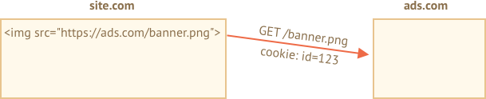
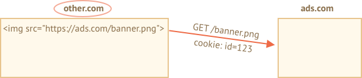

# Куки, document.cookie

Куки -- это небольшие строки данных, которые хранятся непосредственно в браузере. Они являются частью HTTP-протокола, определённого в спецификации [RFC 6265](https://tools.ietf.org/html/rfc6265).

Чаще всего куки устанавливаются веб-сервером при помощи заголовка `Set-Cookie`. Затем браузер будет автоматически добавлять их в (почти) каждый запрос на тот же домен при помощи заголовка `Cookie`.

Один из наиболее частых случаев использования куки -- это аутентификация:

1. При входе на сайт сервер отсылает в ответ HTTP-заголовок `Set-Cookie` для того, чтобы установить куки со специальным уникальным идентификатором сессии ("session identifier").
2. Во время следующего запроса к этому же домену браузер посылает на сервер HTTP-заголовок `Cookie` с идентификатором сессии.
3. Таким образом, сервер понимает, кто сделал запрос.

Мы также можем получить доступ к куки непосредственно из браузера, используя свойство `document.cookie`.

Куки имеют множество особенностей и тонкостей в использовании, и в этой главе мы подробно с ними разберёмся.

## Чтение из document.cookie

```online
Хранит ли ваш браузер какие-то куки с этого сайта? Посмотрим:
```

```offline
Если вы зашли на сайт, то куки можно посмотреть вот так:
```

```js run
// На javascript.info мы используем сервис Google Analytics для сбора статистики,
// поэтому какие-то куки должны быть
alert( document.cookie ); // cookie1=value1; cookie2=value2;...
```


Значение `document.cookie` состоит из пар `ключ=значение`, разделённых `; `. Каждая пара представляет собой отдельные куки.

Чтобы найти определённое куки, достаточно разбить строку из `document.cookie` по `; `, и затем найти нужный ключ. Для этого мы можем использовать как регулярные выражения, так и функции для обработки массивов.

Оставим эту задачу читателю для самостоятельного выполнения. Кроме того, в конце этой главы вы найдете полезные функции для управления куки.

## Запись в document.cookie

Мы можем писать в `document.cookie`. Но это не свойство данных, это акцессор (accessor).

**Во время записи в свойство `document.cookie` браузер обновит только куки, упомянутые в этом свойстве, но при этом не затронет все остальные.**

Например, этот вызов установит куки с именем `user` и значением `John`:

```js run
document.cookie = "user=John"; // обновляем только куки с именем 'user'
alert(document.cookie); // показываем все куки
```

Если вы запустите этот код, то, скорее всего, увидите множество куки. Это происходит, потому что операция `document.cookie=` перезапишет не все куки, а лишь куки с вышеупомянутым именем `user`.

Технически, и имя, и значение куки могут состоять из любых символов, но для сохранения правильного форматирования следует использовать встроенную функцию `encodeURIComponent`:

```js run
// специальные символы, требуется кодирование
let name = "my name";
let value = "John Smith"

// кодирует в my%20name=John%20Smith
document.cookie = encodeURIComponent(name) + '=' + encodeURIComponent(value);

alert(document.cookie); // ...; my%20name=John%20Smith
```


```warn header="Limitations"
Существует несколько ограничений:
- После `encodeURIComponent` пара `name=value` не должна превышать 4 Кб. Таким образом, мы не можем хранить в куки большие данные.
- Общее количество куки на один домен ограничивается примерно 20+. Точное ограничение зависит от конкретного браузера.
```

У куки есть ряд важных настроек, многие из них важны и должны быть установлены.

Эти настройки указываются после пары `ключ=значение` и отделены друг от друга разделителем `;`, как-то так:

```js run
document.cookie = "user=John; path=/; expires=Tue, 19 Jan 2038 03:14:07 GMT"
```

## path

- **`path=/mypath`**

Путь, внутри которого будет доступ к куки. Должен быть абсолютным путём. По умолчанию указывается текущий путь.

Если куки установлено с `path=/admin`, то оно будет доступно на странице `/admin` и `/admin/something`, но не на страницах `/home` или `/adminpage`.

Как правило, указывают в качестве пути корень `path=/`, чтобы наше куки было доступно на всех страницах сайта.

## domain

- **`domain=site.com`**

Домен, на котором доступны наши куки. На практике, однако, есть ограничения -- мы не можем указать здесь какой угодно домен.

По умолчанию куки доступно лишь тому домену, который его установил. Так что куки, которые были установлены сайтом `site.com`, не будут доступны на сайте `other.com`.

...Но! Это может показаться странным -- мы также не сможем получить эти куки и на поддомене `forum.site.com`!

```js
// на site.com
document.cookie = "user=John"

// на forum.site.com
alert(document.cookie); // нет user
```

**Нет способа сделать куки доступным на другом домене 2-го уровня, так что `other.com` никогда не получит куки, установленным сайтом `site.com`.**

Это ограничение безопасности, чтобы мы могли хранить в куки конфиденциальные данные, предназначенные только для одного сайта.

...Однако, если мы всё же хотим дать поддоменам типа `forum.site.com` доступ к куки, это можно сделать. Достаточно при установке куки на сайте `site.com` в качестве значения опции `domain` указать корневой домен: `domain=site.com`:

```js
// находясь на странице с site.com
// сделаем куки доступной для всех поддоменов *.site.com:
document.cookie = "user=John; domain=site.com"

// на forum.site.com
alert(document.cookie); // есть куки user=John
```

По историческим причинам, установка `domain=.site.com` (с точкой перед `site.com`) также работает, разрешает доступ к куки для поддоменов. Это старая запись, в принципе, можно использовать и её, если нужно чтобы поддерживались очень старые браузеры.

Таким образом, опция `domain` позволяет нам разрешить доступ к куки для поддоменов.

## expires, max-age

По умолчанию, если куки не имеет ни одного из этих параметров, то оно удалится при закрытии браузера. Такие куки называются сессионными ("session cookies").

Чтобы помочь куки "пережить" закрытие браузера, мы можем установить значение опций `expires` или `max-age`.

- **`expires=Tue, 19 Jan 2038 03:14:07 GMT`**

Дата истечения куки, дата, когда браузер удалит её автоматически.

Дата должна быть точно в этом формате, во временной зоне GMT. Мы можем использовать `date.toUTCString`, чтобы получить правильную дату. Например, мы можем установить срок действия куки на 1 день.

```js
// +1 день от текущей даты
let date = new Date(Date.now() + 86400e3);
date = date.toUTCString();
document.cookie = "user=John; expires=" + date;
```

Если мы установим в `expires` прошедшую дату, то куки будет удалено.

-  **`max-age=3600`**

Альтернатива `expires`, определяет срок действия куки в секундах с текущего момента.

Если задан ноль или отрицательное значение, то куки будет удалено:

```js
// куки будет удалено через 1 час
document.cookie = "user=John; max-age=3600";

// удалим куки (срок действия истекает прямо сейчас)
document.cookie = "user=John; max-age=0";
```  

## secure

- **`secure`**

Куки следует передавать только по HTTPS-протоколу.

**По умолчанию куки, установленные сайтом `http://site.com`, также будут доступны на сайте `https://site.com` и наоборот.**

То есть, куки, по умолчанию, опираются на доменное имя, они не обращают внимания на протоколы.

С этой настройкой, если куки будет установлено на сайте `https://site.com`, то оно не будет доступно на том же сайте с протоколом HTTP, как `http://site.com`. Таким образом, если в куки хранится конфиденциальная информация, которую не следует передавать по незашифрованному протоколу HTTP, то нужно установить этот флаг.

```js
// предполагается, что сейчас мы на https://
// установим опцию secure для куки (куки доступна только через HTTPS)
document.cookie = "user=John; secure";
```  

## samesite

Это ещё одна настройка безопасности, применяется для защиты от так называемой XSRF-атаки (межсайтовая подделка запроса).

Чтобы понять, где настройка может быть полезной, давайте представим следующий сценарий атаки.

### Атака XSRF

Представьте, вы авторизовались на сайте `bank.com`. То есть: у вас есть куки для аутентификации с этого сайта. Ваш браузер отправляет её на сайт `bank.com` с каждым запросом, чтобы сервер этого сайта узнавал вас и выполнял все конфиденциальные финансовые операции.

Теперь, просматривая веб-страницу в другом окне, вы случайно переходите на сайт `evil.com`, который автоматически отправляет форму `<form action="https://bank.com/pay">` на сайт `bank.com`, с заполненными полями, которые инициируют транзакцию на счёт хакера.

Форма отправляется с сайта `evil.com` непосредственно на сайт банка, и ваша куки отправляется только потому, что она отправляется каждый раз, когда вы посещаете сайт `bank.com`. Таким образом, банк узнает вас и выполнит платёж.


Такая атака называется межсайтовая подделка запроса (или XSRF).

Конечно же, в реальной жизни банки защищены от такой атаки. Во всех сгенерированных сайтом `bank.com` формах, есть специальное поле, так называемый "токен защиты от xsrf", который вредоносная страница не может ни сгенерировать, ни каким-либо образом извлечь из удалённой страницы (она может отправить форму туда, но не может получить данные обратно).

Но для этого требуется время: нам нужно убедиться, что в каждой форме есть поле с токеном, также мы должны проверить все запросы.

### Настройка samesite

Параметр куки `samesite` предоставляет ещё один способ защиты от таких атак, который (теоретически) не должен требовать "токенов защиты xsrf".

У него есть два возможных значения:

- **`samesite=strict` (`samesite` без указания режима будет работать в режиме `strict`)**

Куки с `samesite=strict` никогда не отправится, если пользователь находится за пределами сайта.

Другими словами, независимо от того, переходит ли пользователь по ссылке из своей почты или отправляет форму с `evil.com`, или выполняет любую другую операцию, исходящую с другого домена, то куки не отправляется.

Если куки имеют настройку `samesite`, то атака XSRF не имеет шансов на успех, потому что отправка с сайта `evil.com` происходит без куки. Таким образом, сайт `bank.com` не распознает пользователя и не произведёт платёж.

Защита довольно надёжная. Куки с настройкой `samesite` будет отправлено только в том случае, если операции происходят с сайта `bank.com`.

Хотя есть небольшие неудобства.

Когда пользователь перейдёт по ссылке `bank.com`, например из своих заметок, он будет удивлён, что сайт `bank.com` не узнал его. Действительно, куки с `samesite=strict` в этом случае не отправляется.

Мы могли бы обойти это ограничение, используя два куки: одно куки для "общего признания", только для того, чтобы поздороваться: "Привет, Джон", и другое куки для операций изменения данных с `samesite=strict`. Тогда пользователь, пришедший на сайт, увидит приветствие, но платежи должны будут инициироваться с сайта банка.

- **`samesite=lax`**

Это более спокойный подход, который также защищает от XSRF и не нарушает пользовательский опыт (UX).

Режим Lax, так же как и `strict`, запрещает браузеру отправлять куки, когда запрос происходит вне сайта, но добавляет исключение.

Куки с `samesite=lax` отправляется, если два этих условия верны:
1. Используются безопасные HTTP-методы (например, GET, но не POST).

    Полный список безопасных HTTP-методов можно посмотреть в спецификации [RFC7231](https://tools.ietf.org/html/rfc7231). По сути, безопасными считаются методы, которые обычно используются для чтения, но не для записи данных. Они не должны выполнять никаких операций на изменение данных. Переход по ссылке является всегда GET-методом, то есть безопасным.

2. Операция выполняет навигацию высокого уровня (изменяет URL в адресной строке браузера).

    Обычно это так, но если навигация выполняется в `<iframe>`, то это не высокий уровень. Кроме того, AJAX-запросы не выполняют никакой навигации, поэтому они не подходят.

Таким образом, режим `samesite=lax`, в основном позволяет самой распространенной операции "переход по ссылкам" передавать куки. Например, открытие сайта из заметок удовлетворяет этим условиям.

Но что-то более сложное, например, запрос AJAX с другого сайта или отправка формы, теряет куки.

Если это вам походит, то добавление `samesite=lax`, вероятно, не нарушит пользовательский опыт (UX), зато добавит защиты.

В целом, `samesite` отличная настройка, но у неё есть важный недостаток:
- `samesite` игнорируется (не поддерживается) старыми браузерами, до 2017 и старее.

**Так что, если мы будем полагаться исключительно на `samesite`, то старые браузеры будут уязвимы.**

Но мы, безусловно, можем использовать `samesite` вместе с другими методами защиты, такими как XSRF-токены, чтобы добавить дополнительный слой защиты, а затем, в будущем, когда старые браузеры полностью исчезнут, мы, вероятно, сможем полностью удалить XSRF-токены.

## httpOnly

Эта настройка не имеет ничего общего с Javascript, но мы должны упомянуть её для полноты изложения.

Веб-сервер использует заголовок `Set-Cookie` для установки куки. И он может установить настройку `httpOnly`.

Эта настройка запрещает любой доступ к куки из JavaScript. Мы не можем видеть такое куки или манипулировать им с помощью `document.cookie`.

Эта настройка используется в качестве защиты от определённых атак, когда хакер внедряет свой собственный JavaScript-код в страницу и ждёт когда пользователь посетит её. Это вообще не должно быть возможным, хакер не должен быть в состоянии внедрить свой код на ваш сайт, но могут быть ошибки, которые позволят хакеру сделать это.


Обычно, если такое происходит, и пользователь заходит на страницу с кодом хакера, то этот код выполняется и получает доступ к `document.cookie`, и тем самым к куки пользователя, которые содержат информацю об аутентификации. Это плохо.

Но если куки `httpOnly`, то `document.cookie` не видит его, поэтому такое куки защищено.

## Приложение: Функции куки

Вот небольшой набор функций для работы с куки, работать с ними намного удобнее, чем вручную модифицировать`document.cookie`.

Для этого существует множество библиотек, приведём некоторые из них.


### getCookie(name)

Самый короткий способ получить доступ к куки -- это использовать [регулярные выражения](info:regular-expressions).

Функция `getCookie(name)` возвращает куки с указанным `name`:

```js
// возвращает куки с указанным name,
// или undefined, если ничего не найдено
function getCookie(name) {
  let matches = document.cookie.match(new RegExp(
    "(?:^|; )" + name.replace(/([\.$?*|{}\(\)\[\]\\\/\+^])/g, '\\$1') + "=([^;]*)"
  ));
  return matches ? decodeURIComponent(matches[1]) : undefined;
}
```

Здесь `new RegExp` генерируется динамически, чтобы соответствовать `; name=<value>`.

Обратите внимание, значение куки кодируется, поэтому `getCookie` использует встроенную функцию `decodeURIComponent` для декодирования.

### setCookie(name, value, options)

Устанавливает в `name` указанное `value` с настройкой `path=/` по умолчанию (можно изменить, чтобы добавить другие значения по умолчанию):

```js run
function setCookie(name, value, options = {}) {

  options = {
    path: '/',
    // при необходимости добавьте другие значения по умолчанию
    ...options
  };

  if (options.expires.toUTCString) {
    options.expires = options.expires.toUTCString();
  }

  let updatedCookie = encodeURIComponent(name) + "=" + encodeURIComponent(value);

  for (let optionKey in options) {
    updatedCookie += "; " + optionKey;
    let optionValue = options[optionKey];
    if (optionValue !== true) {
      updatedCookie += "=" + optionValue;
    }
  }

  document.cookie = updatedCookie;
}

// Пример использования:
setCookie('user', 'John', {secure: true, 'max-age': 3600});
```

### deleteCookie(name)

Чтобы удалить куки, мы можем установить отрицательную дату истечения срока действия:

```js
function deleteCookie(name) {
  setCookie(name, "", {
    'max-age': -1
  })
}
```

```warn header="Операции обновления или удаления куки должны использовать тот же путь и домен"
Обратите внимание: когда мы обновляем или удаляем куки, нам следует использовать только такие же настройки пути и домена, как при установки куки.
```

Всё вместе: [cookie.js](cookie.js).


## Приложение: Сторонние куки

Куки называются сторонними, если они размещены на домене, отличном от посещаемого пользователем.

Например:
1. Страница `site.com` загружает баннер с другого сайта: ``.
2. Вместе с баннером, удаленный сервер `ads.com` может установить заголовок `Set-Cookie` с куки, например, `id=1234`. Такие куки создаются с домена `ads.com` и будут видны только на сайте `ads.com`:

    

3. В следующий раз при доступе к `ads.com` удалённый сервер получит куки `id` и распознает пользователя:

    

4. Что ещё более важно, когда пользователь переходит с `site.com` на другой сайт `other.com`, на котором тоже есть баннер, то `ads.com` получит куки, так как они принадлежат `ads.com`, таким образом `ads.com` распознает пользователя и может отслеживать его при перемещении между сайтами:

    


Сторонние куки обычно используются для отслеживания и предоставления рекламных услуг, из-за своих особенностей. Они связаны с исходным доменом, поэтому `ads.com` может отслеживать одного и того же пользователя на разных сайтах, если они все получают к нему доступ.

Естественно, некоторым пользователя не нтравится, когда их отслуживают, поэтому браузеры позволяют отключать такие куки.

Кроме того, некторые современные браузеры используют специальные политики для таких куки:
- Safari вообще не разрешает сторонние куки.
- У Firefox есть "чёрный список" сторонних доменов, где он блокирует такие куки.


```smart
Если мы загружаем скрипт со стороннего домена, например `<script src="https://google-analytics.com/analytics.js">`, и этот скрипт использует `document.cookie`, чтобы установить куки, то такое куки не является сторонним.

Если скрипт устанавливает куки, то нет разницы откуда был загружен скрипт -- он принадлежит домену текущей веб-страницы.
```

## Приложение: GDPR

Эта тема вообще не связана с JavaScript, просто имейте в виду, когда настраиваете куки.

В Европе существует законодательство под названием GDPR, которое устанавливает для сайтов ряд правил, обеспечивающих конфиденциальность пользователей. И одним из таких правил является требование явного разрешения от пользователя на отслеживание куки.

Обратите внимание, это только для отслеживания/идентификации куки.

Итак, если мы установим куки, которые просто сохраняют некоторую информацию, но не отслеживают и не идентифицируют пользователя, то мы свободны от этого правила.

Но если мы собираемся установить куки с информацией об аутентификации или идентификатором отслеживания, то пользователь должен явно разрешить это.

Сайты обычно имеют два варианта следования GDPR правилам. Вы уже должны были видеть эти варианты в сети:

1. Если сайт хочет установить куки для отслеживания только для авторизованных пользователей.

    Для этого в регистрационной форме должен быть установлен флажок "принять политику конфиденциальности", пользователь должен установить его, только тогда сайт может установить эти куки.

2. Если сайт хочет установить куки для отслеживания всем пользователям.

    Чтобы сделать это законно, сайт показывает модально окно для пользователей, которые зашли в первый раз, и требует от них согласие на использование куки. Тогда сайт может установить их и показать пользователю контент. Хотя это может немного насторожить новых пользователей, никому не нравится видеть модальные окна вместо контента. Но GDPR требует явного согласия.


GDPR касается не только куки, но и других вопросов, которые связаны с конфиденциальностью, но это уже выходит за рамки нашей компетенции.


## Summary

`document.cookie` предоставляет доступ к куки
- операция записи изменяет только то куки, которое было указано.
- название/значение должно быть закодировано.
- одно куки до 4kb, более 20+ куки на сайт (зависит от браузера).

Натсройки куки:
- `path=/`, по умолчанию устанавливается текущий путь, делает куки видимым только по указанному пути.
- `domain=site.com`, по умолчанию куки видно только на текущем домене, если явно указан домен, то куки видно и на поддоменах.
- `expires` или `max-age` устанавливает дату истечения срока действия, без них куки умрёт при закрытии браузера.
- `secure` делает куки только для HTTPS.
- `samesite` запрещает браузеру отправлять куки с запросами, поступающими извне сайта, помогает предотвратить XSRF-атаки.

Дополнительно:
- Сторонние куки могут быть запрещены браузером, например Safari делает это по умолчанию.
- При настройке куки для отслеживания граждан EU, GDPR требует спросить об этом пользователя.
