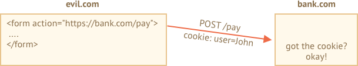
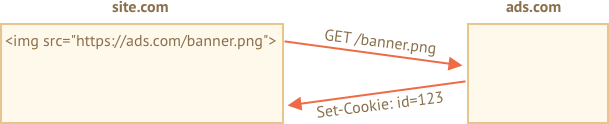

# Куки, document.cookie

Куки (cookies) - это строки, содержащие данные и хранящиеся в браузере. Они являются частью HTTP-протокола, определенного в спецификации [RFC 6265](https://tools.ietf.org/html/rfc6265).

Чаще всего куки устанавливаются веб-сервером. А затем автоматически добавляются в каждый запрос на этот домен.

Один из наиболее частых случаев использования куков - это аутентификация:

1. Во время регистрации сервер записывает в респонс (ответ) HTTP-заголовок `Set-Cookie` для того, чтобы установить cookie с идентификатором сессии ("session identifier").
2. Во время следующего запроса к этому же домену браузер посылает на сервер HTTP-заголовок `Cookie` с идентификатором сессии.
3. Таким образом сервер понимает кто сделал запрос.

Мы так же можем получить доступ к кукам непосредственно из браузера, используя свойство `document.cookie`.

Куки имеют множество особенностей и тонкостей в их использовании, и в этой главе мы подробнее с ними разберемся.

## Чтение document.cookie

```online
Ваш сайт содержит какие-нибудь куки? Посмотрим:
```

```offline
Предположим, что мы зашли на сайт и у нас есть возможность записать куки таким образом:
```

```run js
// На javascript.info мы используем сервис Google Analytics для сбора статистики,
// значит у нас должны храниться куки
alert( document.cookie ); // cookie1=value1; cookie2=value2;...
```


Значение свойства `document.cookie` - это набор парных элементов `name=value`, разделенных `; `. Каждая пара представляет собой отдельный кук.

Для того, чтобы найти нужный кук, нам нужно будет разбить `document.cookie` (используя разделитель  `; `) на пары ключ-значение и найти нужный нам ключ. Для этого мы можем использовать как регулярные выражения, так и функции для обработки массивов.

Оставим эту задачу читателю для самостоятельного выполнения. Кроме того, в конце этой главы вы найдете полезные функции для управления куками. 


## Запись в document.cookie

У нас есть возможность производить запись в `document.cookie`. Однако это не свойство для работы с данными, это - только средство для доступа к ним.

**Во время записи в свойство `document.cookie` браузер обновит только куки, упомянутые в этом свойстве, но при этом не затронет все остальные.**

Например, этот вызов установит кук с именем `user` и значением `John`:

```run js 
document.cookie = "user=John"; // обновляем только кук с именем 'user'
alert(document.cookie); // показываем все куки
```

Если вы запустите этот код, то скорее всего увидите множество куков. Это происходит потому что операция `document.cookie=` не перезапишет не все куки, а лишь кук с вышеупомянутым именем `user`.

Технически и имя, и значение кука могут состоять из любых символов, однако для сохранения правильного форматирования следует использовать встренную функцию `encodeURIComponent`:

```run js 
// специальные символы, требуется кодировка
let name = "my name";
let value = "John Smith"

// перекодирует cookie к виду my%20name=John%20Smith
document.cookie = encodeURIComponent(name) + '=' + encodeURIComponent(value);

alert(document.cookie); // ...; my%20name=John%20Smith
```


```warn header="Ограничения"
Существует несколько ограничений:
- После перекодировки `encodeURIComponent` размер элемента  `name=value` не должен превышать 4Кб. Таким образом, мы не сможем сохранить в куках большие данные.
- Общее количество куков на один домен ограничивается примерно 20+. Точное ограничение зависит от конкретного браузера.
```

У куков есть несколько важных настроек, которые играют большое значение и которые обязательно следует устанавливать.

Эти свойства перечисляются после пары `ключ=значение` и отделены друг от друга разделителем `;`, как-то так:

```js run
document.cookie = "user=John; path=/; expires=Tue, 19 Jan 2038 03:14:07 GMT"
```

## path

- **`path=/mypath`**

Префикс, указывающий url, для которого доступен этот cookie. Путь должен быть абсолютный. По умолчанию указывается текущий путь.

Если кук установлен с `path=/admin`, то он будет виден так же и на страницах с url-ами `/admin` и `/admin/something`, но не на страницах `/home` или `/adminpage`.

Как правило, мы указывем путь `path=/`, для чтобы наш кук был доступен со всех страниц сайта.

## domain

- **`domain=site.com`**

Домен, на котором доступен наш cookie. На практике, однако есть ограничения - мы не можем указать здесь какой угодно домен.

По умолчанию cookie доступен лишь тому домену, который его установил. Так что cookie, который был установлен сайтом `site.com`, не будет доступен на сайте `other.com`.

...Но! Что более интересно - мы так же не сможем получить этот cookie и на под-домене `forum.site.com`!

```js
// at site.com
document.cookie = "user=John"

// at forum.site.com
alert(document.cookie); // no user
```

**Способа получить доступ к кукам из доменов второго уровня нет. Поэтому сайт `other.com` никогда не получит куки, установленные сайтом `site.com`.** 

Это ограничение безопасности, которое позволяет нам сохранять чувствительные (конфиденциальные) данные в куках.

...Однако, если нам все же нужно получить доступ к поддоменам вида `forum.site.com`, это все же можно сделать. Достаточно в качестве значения опции `domain` указать корневой домен:  `domain=site.com`:

```js
// at site.com, make the cookie accessible on any subdomain:
document.cookie = "user=John; domain=site.com"

// at forum.site.com
alert(document.cookie); // with user
```

По историческим причинам запись вида `domain=.site.com` (с точкой в начале) так же будет корректно отрабатывать, точку стоит указывать в начале пути для поддержки совместимости с очень старыми браузерами.

Таким образом, опция `domain` позволяет нам получать доступ к кукам из поддоменов.

## expires, max-age

По умолчанию, если для кука не указана ни одна из этих опций, она удалится вместе с закрытием браузера. Такие куки называются - куки сессий ("session cookies").

Чтобы помочь кукам "пережить" закрытие бразуера, мы можем установить значение опций `expires` или `max-age`.

- **`expires=Tue, 19 Jan 2038 03:14:07 GMT`**

Время истечения cookie (cookie expiration date) устанавливает дату, при наступлении которой браузер автоматически удалит этот cookie.

Дата истечения должна указываться строго в  UTC-формате во временной зоне GMT. Для получения строки даты мы можем использовать функцию  `date.toUTCString`. К примеру, установим cookie, который истечет через сутки:

```js
// +1 day from now
let date = new Date(Date.now() + 86400e3);
date = date.toUTCString();
document.cookie = "user=John; expires=" + date;
```

Если мы установим в `expires` прошедшую дату, то cookie удалится.

-  **`max-age=3600`**

Так же можно удалить cookie, установив время истечения cookie через несколько секунд.

При отрицательном либо нулевом значении cookie тоже удалится.

```js
// cookie will die +1 hour from now
document.cookie = "user=John; max-age=3600";

// delete cookie (let it expire right now)
document.cookie = "user=John; max-age=0";
```  

## secure

- **`secure`**

Куки должны передаваться только по HTTPS-протоколу.

**По умолчанию, cookie, установленная сайтом `http://site.com`, так же будет доступна на сайте `https://site.com` и наоборот.**

Куки прикреплены к доменам и не передаются между разными протоколами.

Таким образом, если cookie установлена сайтом `https://site.com`, она не будет видна на сайте `http://site.com`, загруженном по протоколу HTTP.

```js
// assuming we're on https:// now
// set the cookie secure (only accessible if over HTTPS)
document.cookie = "user=John; secure";
```  

## samesite

Это еще одна настройка безопасности, призванная защищать пользователя от так называемых XSRF-аттак (англ. cross-site request forgery - имитация кроссдоменног запроса).

Чтобы понять, как помогает эта настройка, представим себе следующую ситуацию:

### XSRF-аттака

Представим, что мы залогинились на сайте `bank.com`. И теперь нам доступен аутентификационный cookie  этого сайта. Ваш сайт пересылает этот кук с каждым запросом, распознает вас и осуществляет необходимые финансовые операции.

Теперь, представим себе, что в другом окне вы открываете еще один сайт `evil.com`, который автоматически отправляет на сайт `bank.com` форму `<form action="https://bank.com/pay">` с заполненными полями платежа для банковского счета хакера.

Форма с сайта `evil.com` вместе с вашим cookie отправляется на сайт банка. Cookie так же отсылается, потому что это происходит каждый раз, когда вы заходите на сайт `bank.com`. Банк распознает вас и действительно осуществялет платеж.



Вот это и называют XSRF-аттакой.

Естественно настоящие банки такого не допускают. Каждая форма, сгенерированная доменом `bank.com` имеет специальный токен, называемое "xsrf protection token" (токен для xsrf-защиты), который зловредные сайты не способны ни сгенерировать, ни какким-либо образом извлечь с помощью удаленной страницы (они могут отправить форму на сайт банка, но не способны получить ответ на запрос).

Но подобная реализация требует времени: нам нужно удостовериться, что у каждой формы есть такой токен, а так же проверять все запросы.

### Настройка куки samesite

Настройка куки samesite предоставляет еще один способ защиты от таких аттак, что (в теории) избавляет нас от надобности использования xsrf-токенов.

У него есть два возможных значения:

- **`samesite=strict` (то же что и `samesite` без значения)**


Cookie со значением `samesite=strict` никогда не пересылается, если пользователь зашел с другого сайта.

Другими словами, если пользователь прошел по ссылке из своей почты или отправил форму через сайт  `evil.com`, либо производит операции, которые инициированы другим доменом, куки не будет пересылаться.

Если аутентификационная cookie  имеет настройку `samesite`, то никакая xsrf-аттака не пройдет, т.к. форма с сайта  `evil.com` придет без куков. Банк не сможет распознать своего клиента и не осуществит платеж.

Это весьма надежная мера безопасности. Только те оерации, которые были инициированы сайтом `bank.com` смогут отправлять куки, помеченные опцией `samesite`.

Однако, существует небольшое неудобство.

Когда пользователь зайдет на сайт `bank.com` по валидной ссылке (например, из своих электронных записей), он внезапно обнаружит, что сайт не узнаёт его. Это происходит, потому что в этом случае куки с меткой `samesite=strict` не пересылаются.

Мы можем обойти это ограничение, используя два вида cookie - один для так называемого "общего распознавания" (к примеру для того, чтобы поприветствовать пользователя на сайте: "Привет, Джон!"), а второй - для операций обмена данными (с пометкой `samesite=strict`). Так пользователь, попадая на сайт по внешней ссылке, сможет увидеть приветствие, но все платежи смогут быть инициированы только с сайта банка.

- **`samesite=lax`**

Это более "расслабленный" и не портящий впечатление от работы с сайтом подход для защиты от xsrf-аттак. 

Режим lax, так же как и `strict`, запрещает браузеру пересылать куки, если пользователь зашел на сайт по внешней ссылке, и дополнительно добавляет исключение.

Кук с меткой `samesite=lax` переслыается лишь в случае, когда соблюдаются эти условия:

1. Метод HTTP безопасный (к примеру GET, а не POST).

    Полный перечень безопасных методов представлен в спецификации [RFC7231](https://tools.ietf.org/html/rfc7231). Вообще такие методы предназначены только для чтения данных, но не для записи. Такие методы не должны осуществлять операции по обмену данными. Переход по ссылке всегда осущетсвляется через GET-метод, что вполне безопасно.

2. Операция может осуществлять только навигацию верхнего уровня (то есть изменять адрес в адресной строке браузера).

    В большинстве случаев навигация, осуществляемая внутри фрейма `<iframe>` - не верхнеуровневая. Так же AJAX-запросы не смогут осуществлять навигацию по сайту, так что они тоже не помогут.
   
В общем-то все что делает пометка  `samesite=lax` - позволяет операциям типа "перейти по URL" иметь куки. К примеру, операция перехода на сатй по ссылке из записей вполне удовлетворяет этим условиям. 

Однако, любая чуть более сложная операция, к примеру AJAX-запрос с другого сайта или отправка формы потеряют куки.

Если вас это устраивает, то добавление метки  `samesite=lax` скорее всего не испортит впечатление от работы с сайтом и добавит защиту.

В целом, `samesite` - хорошая опция, но с одним исключением:
- `samesite` будет игнорироваться (не поддерживается) старыми браузерами от 2017 года и страше.

**Поэтому, если мы полагаемся исключительно на `samesite` в плане защиты сайта, то мы оставляем уязвимости в старых браузерах.**

Мы конечно можем использовать `samesite` совместно с другими мерами защиты, такими как xsrf-токены, чтобы создать дорполнительный слой защиты, а в будущем, когда старые браузеры окончательно выйдут из употребления, мы, возможно, так же сможем избавиться и от использования xsrf-токенов.

## httpOnly

Эта опция не имеет отношения к Javascript, но ее все же стоит упомянуть для целостности.

Веб-серверы используют заголовок `Set-Cookie`, чтобы установить кук. Кук так же может установить опция `httpOnly`.

Эта метка запрещает любым Javascript-скриптам получать доступ к такому cookie. Мы не можем видеть и управлять таким куком через `document.cookie`.

Ее стоит использовать в качестве меры предосторожности для защиты от аттак, когда хакер внедряет свой Javascript-код на страницу и ждет, когда пользователь зайдет на страницу. Нельзя, чтобы такое было возможно, у хакера не должно быть возможности внедрять свой код на чужой сайт, но сайт может содержать баги, которые позволят это сделать. 

Обычно, если такая ситуация происходит и пользователь заходит на страницу, содержащую инъекцию (хакерский код), то она исполнится и получит доступ к переменной `document.cookie` с аутентификационныим куками пользователя. Это проблема.

Однако, ески cookie помечен как `httpOnly`, то `document.cookie` не будет видеть этот кук, так что он будет защищен.

## Приложение: функции куков

Здесь представлен небольшой набор функций для работы с куками, более удобный, чем ручное управление куками через `document.cookie`.

Так же существует убольшое множество библиотек для работы с куками, поэтому эти функции представлены только в целях демонстрации. Тем не менее они могут оказаться полезными.


### getCookie(name)

Простейший способ получить cookie  - использование [регулярного выражения] (info:regular-expressions).

Функция `getCookie(name)` находит кук по заданному имени `name`:

```js
// возвращает кук с указанным именем
// либо undefined если ничего не находит
function getCookie(name) {
  let matches = document.cookie.match(new RegExp(
    "(?:^|; )" + name.replace(/([\.$?*|{}\(\)\[\]\\\/\+^])/g, '\\$1') + "=([^;]*)"
  ));
  return matches ? decodeURIComponent(matches[1]) : undefined;
}
```

Here `new RegExp` is generated dynamically, to match `; name=<value>`.

Please note that a cookie value is encoded, so `getCookie` uses a built-in `decodeURIComponent` function to decode it.

### setCookie(name, value, options)

Sets the cookie `name` to the given `value` with `path=/` by default (can be modified to add other defaults):

```js run
function setCookie(name, value, options = {}) {

  options = {
    path: '/',
    // add other defaults here if necessary
    ...options
  };

  if (options.expires.toUTCString) {
    options.expires = options.expires.toUTCString();
  }

  let updatedCookie = encodeURIComponent(name) + "=" + encodeURIComponent(value);

  for (let optionKey in options) {
    updatedCookie += "; " + optionKey;
    let optionValue = options[optionKey];
    if (optionValue !== true) {
      updatedCookie += "=" + optionValue;
    }
  }

  document.cookie = updatedCookie;
}

// Example of use:
setCookie('user', 'John', {secure: true, 'max-age': 3600});
```

### deleteCookie(name)

To delete a cookie, we can call it with a negative expiration date:

```js
function deleteCookie(name) {
  setCookie(name, "", {
    'max-age': -1
  })
}
```

```warn header="Updating or deleting must use same path and domain"
Please note: when we update or delete a cookie, we should use exactly the same path and domain options as when we set it.
```

Together: [cookie.js](cookie.js).


## Appendix: Third-party cookies

A cookie is called "third-party" if it's placed by domain other than the user is visiting.

For instance:
1. A page at `site.com` loads a banner from another site: ``.
2. Along with the banner, the remote server at `ads.com` may set `Set-Cookie` header with cookie like `id=1234`. Such cookie originates from `ads.com` domain, and will only be visible at `ads.com`:

    

3. Next time when `ads.com` is accessed, the remote server gets the `id` cookie and recognizes the user:

    

4. What's even more important, when the users moves from `site.com` to another site `other.com` that also has a banner, then `ads.com` gets the cookie, as it belongs to `ads.com`, thus recognizing the visitor and tracking him as he moves between sites:

    


Third-party cookies are traditionally used for tracking and ads services, due to their nature. They are bound to the originating domain, so `ads.com` can track the same user between different sites, if they all access it.

Naturally, some people don't like being tracked, so browsers allow to disable such cookies.

Also, some modern browsers employ special policies for such cookies:
- Safari does not allow third-party cookies at all.
- Firefox comes with a "black list" of third-party domains where it blocks third-party cookies.


```smart
If we load a script from a third-party domain, like `<script src="https://google-analytics.com/analytics.js">`, and that script uses `document.cookie` to set a cookie, then such cookie is not third-party.

If a script sets a cookie, then no matter where the script came from -- it belongs to the domain of the current webpage.
```

## Appendix: GDPR

This topic is not related to JavaScript at all, just something to keep in mind when setting cookies.

There's a legislation in Europe called GDPR, that enforces a set of rules for websites to respect users' privacy. And one of such rules is to require an explicit permission for tracking cookies from a user.

Please note, that's only about tracking/identifying cookies.

So, if we set a cookie that just saves some information, but neither tracks nor identifies the user, then we are free to do it.

But if we are going to set a cookie with an authentication session or a tracking id, then a user must allow that.

Websites generally have two variants of following GDPR. You must have seen them both already in the web:

1. If a website wants to set tracking cookies only for authenticated users.

    To do so, the registration form should have a checkbox like "accept the privacy policy", the user must check it, and then the website is free to set auth cookies.

2. If a website wants to set tracking cookies for everyone.

    To do so legally, a website shows a modal "splash screen" for newcomers, and require them to agree for cookies. Then the website can set them and let people see the content. That can be disturbing for new visitors though. No one likes to see "must-click" modal splash screens instead of the content. But GDPR requires an explicit agreement.


GDPR is not only about cookies, it's about other privacy-related issues too, but that's too much beyond our scope.


## Summary

`document.cookie` provides access to cookies
- write operations modify only cookies mentioned in it.
- name/value must be encoded.
- one cookie up to 4kb, 20+ cookies per site (depends on a browser).

Cookie options:
- `path=/`, by default current path, makes the cookie visible only under that path.
- `domain=site.com`, by default a cookie is visible on current domain only, if set explicitly to the domain, makes the cookie visible on subdomains.
- `expires` or `max-age` sets cookie expiration time, without them the cookie dies when the browser is closed.
- `secure` makes the cookie HTTPS-only.
- `samesite` forbids the browser to send the cookie with requests coming from outside the site, helps to prevent XSRF attacks.

Additionally:
- Third-party cookies may be forbidden by the browser, e.g. Safari does that by default.
- When setting a tracking cookie for EU citizens, GDPR requires to ask for permission.
