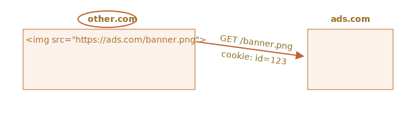

# Куки, document.cookie

<<<<<<< HEAD
Куки -- это небольшие строки данных, которые хранятся непосредственно в браузере. Они являются частью HTTP-протокола, определённого в спецификации [RFC 6265](https://datatracker.ietf.org/doc/html/rfc6265).

Куки обычно устанавливаются веб-сервером при помощи заголовка `Set-Cookie`. Затем браузер будет автоматически добавлять их в (почти) каждый запрос на тот же домен при помощи заголовка `Cookie`.
=======
Cookies are small strings of data that are stored directly in the browser. They are a part of the HTTP protocol, defined by the [RFC 6265](https://tools.ietf.org/html/rfc6265) specification.

Cookies are usually set by a web server using the response `Set-Cookie` HTTP header. Then, the browser automatically adds them to (almost) every request to the same domain using the `Cookie` HTTP header.
>>>>>>> d78b01e9833009fab534462e05c03cffc51bf0e3

Один из наиболее частых случаев использования куки -- это аутентификация:

<<<<<<< HEAD
1. При входе на сайт сервер отсылает в ответ HTTP-заголовок `Set-Cookie` для того, чтобы установить куки со специальным уникальным идентификатором сессии ("session identifier").
2. Во время следующего запроса к этому же домену браузер посылает на сервер HTTP-заголовок `Cookie`.
3. Таким образом, сервер понимает, кто сделал запрос.
=======
1. Upon sign-in, the server uses the `Set-Cookie` HTTP header in the response to set a cookie with a unique "session identifier".
2. Next time the request is sent to the same domain, the browser sends the cookie over the net using the `Cookie` HTTP header.
3. So the server knows who made the request.
>>>>>>> d78b01e9833009fab534462e05c03cffc51bf0e3

Мы также можем получить доступ к куки непосредственно из браузера, используя свойство `document.cookie`.

<<<<<<< HEAD
Куки имеют множество особенностей и тонкостей в использовании, и в этой главе мы подробно с ними разберёмся.
=======
There are many tricky things about cookies and their attributes. In this chapter, we'll cover them in detail.
>>>>>>> d78b01e9833009fab534462e05c03cffc51bf0e3

## Чтение из document.cookie

```online
Хранит ли ваш браузер какие-то куки с этого сайта? Посмотрим:
```

```offline
Если предположить, что вы зашли на сайт, то куки можно посмотреть вот так:
```

```js run
// На javascript.info мы используем сервис Google Analytics для сбора статистики,
// поэтому какие-то куки должны быть
alert( document.cookie ); // cookie1=value1; cookie2=value2;...
```


<<<<<<< HEAD
Значение `document.cookie` состоит из пар `ключ=значение`, разделённых `; `. Каждая пара представляет собой отдельное куки.

Чтобы найти определённое куки, достаточно разбить строку из `document.cookie` по `; `, и затем найти нужный ключ. Для этого мы можем использовать как регулярные выражения, так и функции для обработки массивов.

Оставим эту задачу читателю для самостоятельного выполнения. Кроме того, в конце этой главы вы найдёте полезные функции для работы с куки.
=======
The value of `document.cookie` consists of `name=value` pairs, delimited by `; `. Each one is a separate cookie.

To find a particular cookie, we can split `document.cookie` by `; `, and then find the right name. We can use either a regular expression or array functions to do that.

We leave it as an exercise for the reader. Also, at the end of the chapter, you'll find helper functions to manipulate cookies.
>>>>>>> d78b01e9833009fab534462e05c03cffc51bf0e3

## Запись в document.cookie

<<<<<<< HEAD
Мы можем писать в `document.cookie`. Но это не просто свойство данных, а [акcессор (геттер/сеттер)](info:property-accessors). Присваивание к нему обрабатывается особым образом.

**Запись в `document.cookie` обновит только упомянутые в ней куки, но при этом не затронет все остальные.**
=======
We can write to `document.cookie`. But it's not a data property, it's an [accessor (getter/setter)](info:property-accessors). An assignment to it is treated specially.

**A write operation to `document.cookie` updates only the cookie mentioned in it and doesn't touch other cookies.**
>>>>>>> d78b01e9833009fab534462e05c03cffc51bf0e3

Например, этот вызов установит куки с именем `user` и значением `John`:

```js run
document.cookie = "user=John"; // обновляем только куки с именем 'user'
alert(document.cookie); // показываем все куки
```

<<<<<<< HEAD
Если вы запустите этот код, то, скорее всего, увидите множество куки. Это происходит, потому что операция `document.cookie=` перезапишет не все куки, а лишь куки с вышеупомянутым именем `user`.

Технически, и имя и значение куки могут состоять из любых символов, для правильного форматирования следует использовать встроенную функцию `encodeURIComponent`:

```js run
// специальные символы (пробелы), требуется кодирование
=======
If you run it, you will likely see multiple cookies. That's because the `document.cookie=` operation does not overwrite all cookies. It only sets the mentioned cookie `user`.

Technically, name and value can have any characters. To keep the valid formatting, they should be escaped using a built-in `encodeURIComponent` function:

```js run
// special characters (spaces) need encoding
>>>>>>> d78b01e9833009fab534462e05c03cffc51bf0e3
let name = "my name";
let value = "John Smith"

// кодирует в my%20name=John%20Smith
document.cookie = encodeURIComponent(name) + '=' + encodeURIComponent(value);

alert(document.cookie); // ...; my%20name=John%20Smith
```


<<<<<<< HEAD
```warn header="Ограничения"
Существует несколько ограничений:
- После `encodeURIComponent` пара `name=value` не должна занимать более 4Кб. Таким образом, мы не можем хранить в куки большие данные.
- Общее количество куки на один домен ограничивается примерно 20+. Точное ограничение зависит от конкретного браузера.
```

У куки есть ряд настроек, многие из которых важны и должны быть установлены.

Эти настройки указываются после пары `ключ=значение` и отделены друг от друга разделителем `;`, вот так:
=======
```warn header="Limitations"
There are a few limitations:
- You can only set/update a single cookie at a time using `document.cookie`.
- The `name=value` pair, after `encodeURIComponent`, should not exceed 4KB. So we can't store anything huge in a cookie.
- The total number of cookies per domain is limited to around 20+, the exact limit depends on the browser.
```

Cookies have several attributes, many of which are important and should be set.

The attributes are listed after `key=value`, delimited by `;`, like this:
>>>>>>> d78b01e9833009fab534462e05c03cffc51bf0e3

```js run
document.cookie = "user=John; path=/; expires=Tue, 19 Jan 2038 03:14:07 GMT"
```

<<<<<<< HEAD
## path

- **`path=/mypath`**

URL-префикс пути, куки будут доступны для страниц под этим путём. Должен быть абсолютным. По умолчанию используется текущий путь.

Если куки установлено с `path=/admin`, то оно будет доступно на страницах `/admin` и `/admin/something`, но не на страницах `/home` или `/adminpage`.

Как правило, указывают в качестве пути корень `path=/`, чтобы наше куки было доступно на всех страницах сайта.

=======
>>>>>>> d78b01e9833009fab534462e05c03cffc51bf0e3
## domain

- **`domain=site.com`**

<<<<<<< HEAD
Домен определяет, где доступен файл куки. Однако на практике существуют определённые ограничения. Мы не можем указать здесь какой угодно домен.

**Нет никакого способа разрешить доступ к файлам куки из другого домена 2-го уровня, поэтому `other.com` никогда не получит куки, установленный по адресу `site.com`.**

Это ограничение безопасности, позволяющее нам хранить конфиденциальные данные в файлах куки, которые должны быть доступны только на одном сайте.

По умолчанию куки доступны лишь тому домену, который его установил.

Пожалуйста, обратите внимание, что по умолчанию файл куки также не передаётся поддомену, например `forum.site.com `.

```js
// если мы установим файл куки на веб-сайте site.com...
document.cookie = "user=John"

// ...мы не увидим его на forum.site.com
alert(document.cookie); // нет user
```
=======
A domain defines where the cookie is accessible. In practice though, there are limitations. We can't set any domain.
>>>>>>> d78b01e9833009fab534462e05c03cffc51bf0e3

...Но это можно изменить. Если мы хотим разрешить поддоменам типа `forum.site.com` получать куки, установленные на `site.com`, это возможно.

<<<<<<< HEAD
Чтобы это произошло, при установке файла куки в `site.com `, мы должны явно установить параметр `domain` для корневого домена: `domain=site.com `. После этого все поддомены увидят такой файл cookie.

Например:

```js
// находясь на странице site.com
// сделаем куки доступным для всех поддоменов *.site.com:
document.cookie = "user=John; domain=site.com"
=======
It's a safety restriction, to allow us to store sensitive data in cookies that should be available only on one site.

By default, a cookie is accessible only at the domain that set it.

Please note, by default, a cookie is not shared with a subdomain, such as `forum.site.com`.

```js
// if we set a cookie at site.com website...
document.cookie = "user=John"

// ...we won't see it at forum.site.com
alert(document.cookie); // no user
```

...But this can be changed. If we'd like to allow subdomains like `forum.site.com` to get a cookie set at `site.com`, that's possible.

For that to happen, when setting a cookie at `site.com`, we should explicitly set the `domain` attribute to the root domain: `domain=site.com`. Then all subdomains will see such a cookie.

For example:

```js
// at site.com
// make the cookie accessible on any subdomain *.site.com:
document.cookie = "user=John; *!*domain=site.com*/!*"
>>>>>>> d78b01e9833009fab534462e05c03cffc51bf0e3

// позже

// на forum.site.com
alert(document.cookie); // есть куки user=John
```

<<<<<<< HEAD
По историческим причинам установка `domain=.site.com` (с точкой перед `site.com`) также работает и разрешает доступ к куки для поддоменов. Это старая запись, но можно использовать и её, если нужно, чтобы поддерживались очень старые браузеры.

Таким образом, опция `domain` позволяет нам разрешить доступ к куки для поддоменов.

## expires, max-age

По умолчанию, если куки не имеют ни одного из этих параметров, то они удалятся при закрытии браузера. Такие куки называются сессионными ("session cookies").

Чтобы помочь куки "пережить" закрытие браузера, мы можем установить значение опций `expires` или `max-age`.

- **`expires=Tue, 19 Jan 2038 03:14:07 GMT`**

Дата истечения срока действия куки, когда браузер удалит его автоматически.

Дата должна быть точно в этом формате, во временной зоне GMT. Мы можем использовать `date.toUTCString`, чтобы получить правильную дату. Например, мы можем установить срок действия куки на 1 день.
=======
```warn header="Legacy syntax"
Historically, `domain=.site.com` (with a dot before `site.com`) used to work the same way, allowing access to the cookie from subdomains. Leading dots in domain names are now ignored, but some browsers may decline to set the cookie containing such dots.
```

To summarize, the `domain` attribute allows to make a cookie accessible at subdomains.

## path

- **`path=/mypath`**

The URL path prefix must be absolute. It makes the cookie accessible for pages under that path. By default, it's the current path.

If a cookie is set with `path=/admin`, it's visible on pages `/admin` and `/admin/something`, but not at `/home`, `/home/admin` or `/`.

Usually, we should set `path` to the root: `path=/` to make the cookie accessible from all website pages. If this attribute is not set the default is calculated using [this method](https://developer.mozilla.org/en-US/docs/Web/HTTP/Cookies#path_default_value).

## expires, max-age

By default, if a cookie doesn't have one of these attributes, it disappears when the browser/tab is closed. Such cookies are called "session cookies"

To let cookies survive a browser close, we can set either the `expires` or `max-age` attribute. `max-Age` has precedence if both are set.

- **`expires=Tue, 19 Jan 2038 03:14:07 GMT`**

The cookie expiration date defines the time when the browser will automatically delete it (according to the browser's time zone).

The date must be exactly in this format, in the GMT timezone. We can use `date.toUTCString` to get it. For instance, we can set the cookie to expire in 1 day:
>>>>>>> d78b01e9833009fab534462e05c03cffc51bf0e3

```js
// +1 день от текущей даты
let date = new Date(Date.now() + 86400e3);
date = date.toUTCString();
document.cookie = "user=John; expires=" + date;
```

Если мы установим в `expires` прошедшую дату, то куки будет удалено.

-  **`max-age=3600`**

<<<<<<< HEAD
Альтернатива `expires`, определяет срок действия куки в секундах с текущего момента.

Если задан ноль или отрицательное значение, то куки будет удалено:

```js
// куки будет удалено через 1 час
=======
It's an alternative to `expires` and specifies the cookie's expiration in seconds from the current moment.

If set to zero or a negative value, the cookie is deleted:

```js
// cookie will die in +1 hour from now
>>>>>>> d78b01e9833009fab534462e05c03cffc51bf0e3
document.cookie = "user=John; max-age=3600";

// удалим куки (срок действия истекает прямо сейчас)
document.cookie = "user=John; max-age=0";
```

## secure

- **`secure`**

Куки следует передавать только по HTTPS-протоколу.

**По умолчанию куки, установленные сайтом `http://site.com`, также будут доступны на сайте `https://site.com` и наоборот.**

То есть, куки, по умолчанию, опираются на доменное имя, они не обращают внимания на протоколы.

<<<<<<< HEAD
С этой настройкой, если куки будет установлено на сайте `https://site.com`, то оно не будет доступно на том же сайте с протоколом HTTP, как `http://site.com`. Таким образом, если в куки хранится конфиденциальная информация, которую не следует передавать по незашифрованному протоколу HTTP, то нужно установить этот флаг.

```js
// предполагается, что сейчас мы на https://
// установим опцию secure для куки (куки доступно только через HTTPS)
=======
With this attribute, if a cookie is set by `https://site.com`, then it doesn't appear when the same site is accessed by HTTP, as `http://site.com`. So if a cookie has sensitive content that should never be sent over unencrypted HTTP, the `secure` flag is the right thing.

```js
// assuming we're on https:// now
// set the cookie to be secure (only accessible over HTTPS)
>>>>>>> d78b01e9833009fab534462e05c03cffc51bf0e3
document.cookie = "user=John; secure";
```

## samesite

<<<<<<< HEAD
Это ещё одна настройка безопасности, применяется для защиты от так называемой XSRF-атаки (межсайтовая подделка запроса).
=======
This is another security attribute `samesite`. It's designed to protect from so-called XSRF (cross-site request forgery) attacks.
>>>>>>> d78b01e9833009fab534462e05c03cffc51bf0e3

Чтобы понять, как настройка работает и где может быть полезной, посмотрим на XSRF-атаки.

### Атака XSRF

<<<<<<< HEAD
Представьте, вы авторизовались на сайте `bank.com`. То есть: у вас есть куки для аутентификации с этого сайта. Ваш браузер отправляет его на сайт `bank.com` с каждым запросом, чтобы сервер этого сайта узнавал вас и выполнял все конфиденциальные финансовые операции.
=======
Imagine, you are logged into the site `bank.com`. That is: you have an authentication cookie from that site. Your browser sends it to `bank.com` with every request so that it recognizes you and performs all sensitive financial operations.
>>>>>>> d78b01e9833009fab534462e05c03cffc51bf0e3

Теперь, просматривая веб-страницу в другом окне, вы случайно переходите на сайт `evil.com`, который автоматически отправляет форму `<form action="https://bank.com/pay">` на сайт `bank.com` с заполненными полями, которые инициируют транзакцию на счёт хакера.

<<<<<<< HEAD
Браузер посылает куки при каждом посещении `bank.com`, даже если форма была отправлена с `evil.com`. Таким образом, банк узнает вас и выполнит платёж.


Такая атака называется межсайтовая подделка запроса (или Cross-Site Request Forgery, XSRF).

Конечно же, в реальной жизни банки защищены от такой атаки. Во всех сгенерированных сайтом `bank.com` формах есть специальное поле, так называемый "токен защиты от xsrf", который вредоносная страница не может ни сгенерировать, ни каким-либо образом извлечь из удалённой страницы (она может отправить форму туда, но не может получить данные обратно). И сайт `bank.com` при получении формы проверяет его наличие.

Но такая защита требует усилий на её реализацию: нам нужно убедиться, что в каждой форме есть поле с токеном, также мы должны проверить все запросы.

### Настройка samesite

Параметр куки `samesite` предоставляет ещё один способ защиты от таких атак, который (теоретически) не должен требовать "токенов защиты xsrf".
=======
The browser sends cookies every time you visit the site `bank.com`, even if the form was submitted from `evil.com`. So the bank recognizes you and performs the payment.


This is a so-called "Cross-Site Request Forgery" (in short, XSRF) attack.

Real banks are protected from it of course. All forms generated by `bank.com` have a special field, a so-called "XSRF protection token", that an evil page can't generate or extract from a remote page. It can submit a form there, but can't get the data back. The site `bank.com` checks for such a token in every form it receives.

Such a protection takes time to implement though. We need to ensure that every form has the required token field, and we must also check all requests.

### Use cookie samesite attribute

The cookie `samesite` attribute provides another way to protect from such attacks, that (in theory) should not require "xsrf protection tokens".
>>>>>>> d78b01e9833009fab534462e05c03cffc51bf0e3

У него есть два возможных значения:

<<<<<<< HEAD
- **`samesite=strict` (или, что то же самое, `samesite` без значения)**
=======
- **`samesite=strict`**
>>>>>>> d78b01e9833009fab534462e05c03cffc51bf0e3

Куки с `samesite=strict` никогда не отправятся, если пользователь пришёл не с этого же сайта.

<<<<<<< HEAD
Другими словами, если пользователь переходит по ссылке из почты, отправляет форму с `evil.com` или выполняет любую другую операцию, происходящую с другого домена, то куки не отправляется.

Если куки имеют настройку `samesite`, то атака XSRF не имеет шансов на успех, потому что отправка с сайта `evil.com` происходит без куки. Таким образом, сайт `bank.com` не распознает пользователя и не произведёт платёж.

Защита довольно надёжная. Куки с настройкой `samesite` будет отправлено только в том случае, если операции происходят с сайта `bank.com`, например отправка формы сделана со страницы на `bank.com`.
=======
In other words, whether a user follows a link from their email, submits a form from `evil.com`, or does any operation that originates from another domain, the cookie is not sent.

If authentication cookies have the `samesite=strict` attribute, then an XSRF attack has no chance of succeeding, because a submission from `evil.com` comes without cookies. So `bank.com` will not recognize the user and will not proceed with the payment.

The protection is quite reliable. Only operations that come from `bank.com` will send the `samesite=strict` cookie, e.g. a form submission from another page at `bank.com`.
>>>>>>> d78b01e9833009fab534462e05c03cffc51bf0e3

Хотя есть небольшие неудобства.

<<<<<<< HEAD
Когда пользователь перейдёт по ссылке на `bank.com`, например из своих заметок, он будет удивлён, что сайт `bank.com` не узнал его. Действительно, куки с `samesite=strict` в этом случае не отправляется.

Мы могли бы обойти это ограничение, используя два куки: одно куки для "общего узнавания", только для того, чтобы поздороваться: "Привет, Джон", и другое куки для операций изменения данных с `samesite=strict`. Тогда пользователь, пришедший на сайт, увидит приветствие, но платежи нужно инициировать с сайта банка, чтобы отправилось второе куки.
=======
When a user follows a legitimate link to `bank.com`, like from their notes, they'll be surprised that `bank.com` does not recognize them. Indeed, `samesite=strict` cookies are not sent in that case.

We could work around that by using two cookies: one for "general recognition", only to say: "Hello, John", and the other one for data-changing operations with `samesite=strict`. Then, a person coming from outside of the site will see a welcome, but payments must be initiated from the bank's website, for the second cookie to be sent.
>>>>>>> d78b01e9833009fab534462e05c03cffc51bf0e3

- **`samesite=lax` (same as `samesite` without value)**

<<<<<<< HEAD
Это более мягкий вариант, который также защищает от XSRF и при этом не портит впечатление от использования сайта.
=======
A more relaxed approach that also protects from XSRF and doesn't break the user experience.
>>>>>>> d78b01e9833009fab534462e05c03cffc51bf0e3

Режим Lax так же, как и `strict`, запрещает браузеру отправлять куки, когда запрос происходит не с сайта, но добавляет одно исключение.

Куки с `samesite=lax` отправляется, если два этих условия верны:
1. Используются безопасные HTTP-методы (например, GET, но не POST).

<<<<<<< HEAD
    Полный список безопасных HTTP-методов можно посмотреть в спецификации [RFC7231](https://datatracker.ietf.org/doc/html/rfc7231#section-4.2.1). По сути, безопасными считаются методы, которые обычно используются для чтения, но не для записи данных. Они не должны выполнять никаких операций на изменение данных. Переход по ссылке является всегда GET-методом, то есть безопасным.

2. Операция осуществляет навигацию верхнего уровня (изменяет URL в адресной строке браузера).

    Обычно это так, но если навигация выполняется в `<iframe>`, то это не верхний уровень. Кроме того, JavaScript-методы для сетевых запросов не выполняют никакой навигации, поэтому они не подходят.

Таким образом, режим `samesite=lax`, позволяет самой распространённой операции "переход по ссылке" передавать куки. Например, открытие сайта из заметок удовлетворяет этим условиям.

Но что-то более сложное, например, сетевой запрос с другого сайта или отправка формы, теряет куки.
=======
    The full list of safe HTTP methods is in the [RFC7231 specification](https://tools.ietf.org/html/rfc7231#section-4.2.1). These are the methods that should be used for reading, but not writing the data. They must not perform any data-changing operations. Following a link is always GET, the safe method.

2. The operation performs a top-level navigation (changes URL in the browser address bar).

    This is usually true, but if the navigation is performed in an `<iframe>`, then it is not top-level. Additionally, JavaScript methods for network requests do not perform any navigation.

So, what `samesite=lax` does, is to allow the most common "go to URL" operation to have cookies. E.g. opening a website link from notes that satisfy these conditions.

But anything more complicated, like a network request from another site or a form submission, loses cookies.
>>>>>>> d78b01e9833009fab534462e05c03cffc51bf0e3

Если это вам подходит, то добавление `samesite=lax`, скорее всего, не испортит впечатление пользователей от работы с сайтом и добавит защиту.

<<<<<<< HEAD
В целом, `samesite` отличная настройка. 
=======
Overall, `samesite` is a great attribute.

There's a drawback:

- `samesite` is ignored (not supported) by very old browsers, the year 2017 or so.
>>>>>>> d78b01e9833009fab534462e05c03cffc51bf0e3

Но у неё есть важный недостаток:

<<<<<<< HEAD
- `samesite` игнорируется (не поддерживается) старыми браузерами, выпущенными до 2017 года и ранее.

**Так что, если мы будем полагаться исключительно на `samesite`, то старые браузеры будут уязвимы.**

Но мы, безусловно, можем использовать `samesite` вместе с другими методами защиты, такими как XSRF-токены, чтобы добавить дополнительный слой защиты, а затем, в будущем, когда старые браузеры полностью исчезнут, мы, вероятно, сможем полностью удалить XSRF-токены.

## httpOnly

Эта настройка не имеет ничего общего с JavaScript, но мы должны упомянуть её для полноты изложения.

Веб-сервер использует заголовок `Set-Cookie` для установки куки. И он может установить настройку `httpOnly`.

Эта настройка запрещает любой доступ к куки из JavaScript. Мы не можем видеть такое куки или манипулировать им с помощью `document.cookie`.

Эта настройка используется в качестве меры предосторожности от определённых атак, когда хакер внедряет свой собственный JavaScript-код в страницу и ждёт, когда пользователь посетит её. Это вообще не должно быть возможным, хакер не должен быть в состоянии внедрить свой код на ваш сайт, но могут быть ошибки, которые позволят хакеру сделать это.


Обычно, если такое происходит, и пользователь заходит на страницу с JavaScript-кодом хакера, то этот код выполняется и получает доступ к `document.cookie`, и тем самым к куки пользователя, которые содержат аутентификационную информацию. Это плохо.
=======
But we can use `samesite` together with other protection measures, like xsrf tokens, to add a layer of defence and then, in the future, when old browsers die out, we'll probably be able to drop xsrf tokens.

## httpOnly

This attribute has nothing to do with JavaScript, but we have to mention it for completeness.

The web server uses the `Set-Cookie` header to set a cookie. Also, it may set the `httpOnly` attribute.

This attribute forbids any JavaScript access to the cookie. We can't see such a cookie or manipulate it using `document.cookie`.

This is used as a precautionary measure, to protect from certain attacks when a hacker injects his own JavaScript code into a page and waits for a user to visit that page. That shouldn't be possible at all, hackers should not be able to inject their code into our site, but there may be bugs that let them do it.


Normally, if such a thing happens, and a user visits a web-page with a hacker's JavaScript code, then that code executes and gains access to `document.cookie` with user cookies containing authentication information. That's bad.
>>>>>>> d78b01e9833009fab534462e05c03cffc51bf0e3

Но если куки имеет настройку `httpOnly`, то `document.cookie` не видит его, поэтому такое куки защищено.

## Приложение: Функции для работы с куки

Вот небольшой набор функций для работы с куки, более удобных, чем ручная модификация `document.cookie`.

<<<<<<< HEAD
Для этого существует множество библиотек, так что они, скорее, в демонстрационных целях. Но при этом полностью рабочие.

### getCookie(name)

Самый короткий способ получить доступ к куки -- это использовать [регулярные выражения](info:regular-expressions).
=======
### getCookie(name)

The shortest way to access a cookie is to use a [regular expression](info:regular-expressions).
>>>>>>> d78b01e9833009fab534462e05c03cffc51bf0e3

Функция `getCookie(name)` возвращает куки с указанным `name`:

```js
// возвращает куки с указанным name,
// или undefined, если ничего не найдено
function getCookie(name) {
  let matches = document.cookie.match(new RegExp(
    "(?:^|; )" + name.replace(/([\.$?*|{}\(\)\[\]\\\/\+^])/g, '\\$1') + "=([^;]*)"
  ));
  return matches ? decodeURIComponent(matches[1]) : undefined;
}
```

Здесь `new RegExp` генерируется динамически, чтобы находить `; name=<value>`.

Обратите внимание, значение куки кодируется, поэтому `getCookie` использует встроенную функцию `decodeURIComponent` для декодирования.

### setCookie(name, value, attributes)

<<<<<<< HEAD
Устанавливает куки с именем `name` и значением `value`, с настройкой `path=/` по умолчанию (можно изменить, чтобы добавить другие значения по умолчанию):
=======
Sets the cookie's `name` to the given `value` with `path=/` by default (can be modified to add other defaults):
>>>>>>> d78b01e9833009fab534462e05c03cffc51bf0e3

```js run
function setCookie(name, value, attributes = {}) {

  attributes = {
    path: '/',
<<<<<<< HEAD
    // при необходимости добавьте другие значения по умолчанию
    ...options
  };

  if (options.expires instanceof Date) {
    options.expires = options.expires.toUTCString();
=======
    // add other defaults here if necessary
    ...attributes
  };

  if (attributes.expires instanceof Date) {
    attributes.expires = attributes.expires.toUTCString();
>>>>>>> d78b01e9833009fab534462e05c03cffc51bf0e3
  }

  let updatedCookie = encodeURIComponent(name) + "=" + encodeURIComponent(value);

  for (let attributeKey in attributes) {
    updatedCookie += "; " + attributeKey;
    let attributeValue = attributes[attributeKey];
    if (attributeValue !== true) {
      updatedCookie += "=" + attributeValue;
    }
  }

  document.cookie = updatedCookie;
}

// Пример использования:
setCookie('user', 'John', {secure: true, 'max-age': 3600});
```

### deleteCookie(name)

Чтобы удалить куки, мы можем установить отрицательную дату истечения срока действия:

```js
function deleteCookie(name) {
  setCookie(name, "", {
    'max-age': -1
  })
}
```

<<<<<<< HEAD
```warn header="Операции обновления или удаления куки должны использовать те же путь и домен"
Обратите внимание: когда мы обновляем или удаляем куки, нам следует использовать только такие же настройки пути и домена, как при установке куки.
=======
```warn header="Updating or deleting must use same path and domain"
Please note: when we update or delete a cookie, we should use exactly the same path and domain attributes as when we set it.
>>>>>>> d78b01e9833009fab534462e05c03cffc51bf0e3
```

Всё вместе: [cookie.js](cookie.js).


## Приложение: Сторонние куки

<<<<<<< HEAD
Куки называются сторонними, если они размещены с домена, отличающегося от страницы, которую посещает пользователь.

Например:
1. Страница `site.com` загружает баннер с другого сайта: ``.
2. Вместе с баннером удалённый сервер `ads.com` может установить заголовок `Set-Cookie` с куки, например, `id=1234`. Такие куки создаются с домена `ads.com` и будут видны только на сайте `ads.com`:
=======
A cookie is called "third-party" if it's placed by a domain other than the page the user is visiting.

For instance:
1. A page at `site.com` loads a banner from another site: ``.
2. Along with the banner, the remote server at `ads.com` may set the `Set-Cookie` header with a cookie like `id=1234`. Such a cookie originates from the `ads.com` domain, and will only be visible at `ads.com`:
>>>>>>> d78b01e9833009fab534462e05c03cffc51bf0e3

    

3. В следующий раз при доступе к `ads.com` удалённый сервер получит куки `id` и распознает пользователя:

    

<<<<<<< HEAD
4. Что ещё более важно, когда пользователь переходит с `site.com` на другой сайт `other.com`, на котором тоже есть баннер, то `ads.com` получит куки, так как они принадлежат `ads.com`, таким образом `ads.com` распознает пользователя и может отслеживать его перемещения между сайтами:
=======
4. What's even more important is, when the user moves from `site.com` to another site `other.com`, which also has a banner, then `ads.com` gets the cookie, as it belongs to `ads.com`, thus recognizing the visitor and tracking him as he moves between sites:
>>>>>>> d78b01e9833009fab534462e05c03cffc51bf0e3

    


Сторонние куки в силу своей специфики обычно используются для целей отслеживания посещаемых пользователем страниц и показа рекламы. Они привязаны к исходному домену, поэтому ads.com может отслеживать одного и того же пользователя на разных сайтах, если оттуда идёт обращение к нему.

<<<<<<< HEAD
Естественно, некоторым пользователям не нравится, когда их отслеживают, поэтому браузеры позволяют отключать такие куки.
=======
Naturally, some people don't like being tracked, so browsers allow them to disable such cookies.
>>>>>>> d78b01e9833009fab534462e05c03cffc51bf0e3

Кроме того, некоторые современные браузеры используют специальные политики для таких куки:
- Safari вообще не разрешает сторонние куки.
- У Firefox есть "чёрный список" сторонних доменов, чьи сторонние куки он блокирует.


```smart
Если мы загружаем скрипт со стороннего домена, например `<script src="https://google-analytics.com/analytics.js">`, и этот скрипт использует `document.cookie`, чтобы установить куки, то такое куки не является сторонним.

Если скрипт устанавливает куки, то нет разницы откуда был загружен скрипт -- куки принадлежит домену текущей веб-страницы.
```

## Приложение: GDPR

<<<<<<< HEAD
Эта тема вообще не связана с JavaScript, но следует её иметь в виду при установке куки.

В Европе существует законодательство под названием GDPR, которое устанавливает для сайтов ряд правил, обеспечивающих конфиденциальность пользователей. И одним из таких правил является требование явного разрешения от пользователя на использование отслеживающих куки.
=======
This topic is not related to JavaScript at all, it is just something to keep in mind when setting cookies.

There's a legislation in Europe called GDPR, that enforces a set of rules for websites to respect the users' privacy. One of these rules is to require explicit permission for tracking cookies from the user.
>>>>>>> d78b01e9833009fab534462e05c03cffc51bf0e3

Обратите внимание, это относится только к куки, используемым для отслеживания/идентификации/авторизации.

То есть, если мы установим куки, которые просто сохраняют некоторую информацию, но не отслеживают и не идентифицируют пользователя, то мы свободны от этого правила.

<<<<<<< HEAD
Но если мы собираемся установить куки с информацией об аутентификации или с идентификатором отслеживания, то пользователь должен явно разрешить это.

Есть два основных варианта как сайты следуют GDPR. Вы наверняка уже видели их в сети:
=======
But if we are going to set a cookie with an authentication session or a tracking ID, then a user must allow that.

Websites generally have two variants of complying with GDPR. You are likely to have seen them both on the web:
>>>>>>> d78b01e9833009fab534462e05c03cffc51bf0e3

1. Если сайт хочет установить куки для отслеживания только для авторизованных пользователей.

    То в регистрационной форме должен быть установлен флажок "принять политику конфиденциальности" (которая определяет, как используются куки),  пользователь должен установить его, и только тогда сайт сможет использовать авторизационные куки.

2. Если сайт хочет установить куки для отслеживания всем пользователям.

<<<<<<< HEAD
    Чтобы сделать это законно, сайт показывает модальное окно для пользователей, которые зашли в первый раз, и требует от них согласие на использование куки. Затем сайт может установить такие куки и показать пользователю содержимое страницы. Хотя это создаёт неудобства для новых посетителей - никому не нравится наблюдать модальные окна вместо контента. Но GDPR в данной ситуации требует явного согласия пользователя.


GDPR касается не только куки, но и других вопросов, связанных с конфиденциальностью, которые выходят за рамки материала этой главы.
=======
    To do so legally, a website shows a modal "splash screen" for newcomers and requires them to agree to the cookies. Then the website can set them and let people see the content. That can be disturbing for new visitors though. No one likes to see such "must-click" modal splash screens instead of the content. But GDPR requires an explicit agreement.


GDPR is not only about cookies, it is about other privacy-related issues too, but that is beyond our scope.
>>>>>>> d78b01e9833009fab534462e05c03cffc51bf0e3


## Итого

<<<<<<< HEAD
`document.cookie` предоставляет доступ к куки.
- Операция записи изменяет только то куки, которое было указано.
- Имя и значение куки должны быть закодированы.
- Одно куки вмещает до 4kb данных, разрешается более 20 куки на сайт (зависит от браузера).

Настройки куки:
- `path=/`, по умолчанию устанавливается текущий путь, делает куки видимым только по указанному пути и ниже.
- `domain=site.com`, по умолчанию куки видно только на текущем домене, если явно указан домен, то куки видно и на поддоменах.
- `expires` или `max-age` устанавливает дату истечения срока действия, без них куки умрёт при закрытии браузера.
- `secure` делает куки доступным только при использовании HTTPS.
- `samesite` запрещает браузеру отправлять куки с запросами, поступающими извне, помогает предотвратить XSRF-атаки.

Дополнительно:
- Сторонние куки могут быть запрещены браузером, например Safari делает это по умолчанию.
- Установка отслеживающих куки пользователям из стран ЕС требует их явного согласия на это в соответствии с законодательством GDPR.
=======
`document.cookie` provides access to cookies.
- Write operations modify only the cookie mentioned in it.
- Name/value must be encoded.
- One cookie may not exceed 4KB in size. The number of cookies allowed on a domain is around 20+ (varies by browser).

Cookie attributes:
- `path=/`, by default current path, makes the cookie visible only under that path.
- `domain=site.com`, by default a cookie is visible on the current domain only. If the domain is set explicitly, the cookie becomes visible on subdomains.
- `expires` or `max-age` sets the cookie expiration time. Without them, the cookie dies when the browser is closed.
- `secure` makes the cookie HTTPS-only.
- `samesite` forbids the browser to send the cookie with requests coming from outside the site. This helps to prevent XSRF attacks.

Additionally:
- The browser may forbid third-party cookies, e.g. Safari does that by default. There is also work in progress to implement this in Chrome.
- When setting a tracking cookie for EU citizens, GDPR requires to ask for permission.
>>>>>>> d78b01e9833009fab534462e05c03cffc51bf0e3
