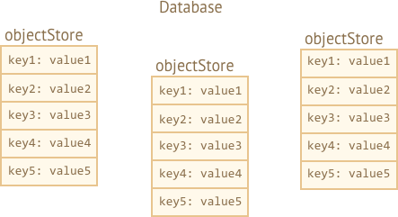
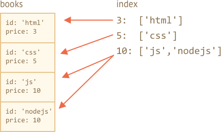

libs:
  - 'https://cdn.jsdelivr.net/npm/idb@3.0.2/build/idb.min.js'

---

# IndexedDB

IndexedDB - это встроенная база данных, более мощная, чем `localStorage`.

- Хранилище ключей/значений: доступны несколько типов ключей, а значения могут быть (почти) любыми.
- Поддерживает транзакции для надёжности.
- Поддерживает запросы в диапазоне ключей и индексы.
- Позволяет хранить больше данных, чем `localStorage`.

Для традиционных клиент-серверных приложений эта мощность обычно чрезмерна. IndexedDB предназначена для оффлайн приложений, можно совмещать с ServiceWorkers и другими технологиями.

Интерфейс для IndexedDB, описанный в спецификации <https://www.w3.org/TR/IndexedDB>, основан на событиях.

<<<<<<< HEAD
Мы также можем использовать `async/await` с помощью обёртки, которая основана на промисах, например <https://github.com/jakearchibald/idb>. Это очень удобно, но обёртка не идеальна, она не может полностью заменить события. Поэтому мы начнём с событий, а затем, когда разберёмся в IndexedDB, рассмотрим и обёртку.
=======
We can also use `async/await` with the help of a promise-based wrapper, like <https://github.com/jakearchibald/idb>. That's pretty convenient, but the wrapper is not perfect, it can't replace events for all cases. So we'll start with events, and  then, after we gain understanding of IndexedDb, we'll use the wrapper.
>>>>>>> 9cb33f4039e5751bfd0e2bca565a37aa463fb477

## Открыть базу данных

<<<<<<< HEAD
Для начала работы с IndexedDB нужно открыть базу данных.
=======
To start working with IndexedDB, we first need to open a database.
>>>>>>> 9cb33f4039e5751bfd0e2bca565a37aa463fb477

Синтаксис:

```js
let openRequest = indexedDB.open(name, version);
```

- `name` -- название базы данных, строка.
- `version` -- версия базы данных, положительное целое число, по умолчанию `1` (объясняется ниже).

<<<<<<< HEAD
У нас может быть множество баз данных с различными именами, но все они существуют в контексте текущего источника (домен/протокол/порт). Разные сайты не могут получить доступ к базам данных друг друга.

После этого вызова необходимо назначить обработчик событий для объекта `openRequest`:
- `success`: база данных готова к работе, готов "объект базы данных" `openRequest.result`, его следует использовать для дальнейших вызовов.
- `error`: не удалось открыть базу данных.
- `upgradeneeded`: устарела версия базы данных (смотрите ниже).
=======
We can have many databases with different names, but all of them exist within the current origin (domain/protocol/port). Different websites can't access databases of each other.

After the call, we need to listen to events on `openRequest` object:
- `success`: database is ready, there's the "database object" in `openRequest.result`, that we should use it for further calls.
- `error`: open failed.
- `upgradeneeded`: database version is outdated (see below).
>>>>>>> 9cb33f4039e5751bfd0e2bca565a37aa463fb477

**IndexedDB имеет встроенный механизм "версионирования схемы", который отсутствует в серверных базах данных.**

<<<<<<< HEAD
В отличие от серверных баз данных, IndexedDB работает на стороне клиента, в браузере, и у нас нет прямого доступа к данным. Но когда мы публикуем новую версию нашего приложения, то возможно, что нам необходимо обновить базу данных.
=======
Unlike server-side databases, IndexedDB is client-side, in the browser, so we don't have the data at hands. But when we publish a new version of our app, we may need to update the database.
>>>>>>> 9cb33f4039e5751bfd0e2bca565a37aa463fb477

Если локальная версия базы данных меньше, чем версия, определённая в `open`, то сработает специальное событие `upgradeneeded`, и мы сможем сравнить версии и обновить структуры данных по мере необходимости.

Это событие также сработает, если базы данных ещё не существует, так что в этом обработчике мы можем выполнить инициализацию.

Например, когда мы впервые публикуем наше приложение, мы открываем базу данных с версией `1` и выполняем инициализацию в обработчике `upgradeneeded`:

```js
let openRequest = indexedDB.open("store", *!*1*/!*);

openRequest.onupgradeneeded = function() {
  // срабатывает, если на клиенте нет базы данных
  // ...выполнить инициализацию...
};

openRequest.onerror = function() {
  console.error("Error", openResult.error);
};

openRequest.onsuccess = function() {
  let db = openRequest.result;
  // продолжить работу с базой данных, используя объект db
};
```

Когда мы публикуем вторую версию:

```js
let openRequest = indexedDB.open("store", *!*2*/!*);

// проверить существование указанной версии базы данных, обновить по мере необходимости:
openRequest.onupgradeneeded = function() {
  let db = openRequest.result;
  switch(db.version) { // существующая (старая) версия базы данных
    case 0:
      // версия 0 подразумевает, что на клиенте нет базы данных
      // выполнить инициализацию
    case 1:
      // на клиенте версия базы данных 1
      // обновить
  }
};
```

После `openRequest.onsuccess` у нас есть объект базы данных в `openRequest.result`, который мы будем использовать для дальнейших операций.

Удалить базу данных:

```js
let deleteRequest = indexedDB.deleteDatabase(name)
// deleteRequest.onsuccess/onerror отслеживает результат
```


## Хранилище объектов

Хранилище объектов - это основная концепция IndexedDB. В других базах данных это "таблицы" или "коллекции". Здесь хранятся данные. В базе данных может быть множество хранилищ: одно для пользователей, другое для товаров и так далее.

Несмотря на то, что название -- "хранилище объектов", примитивы тоже могут там храниться.

**Мы можем хранить почти любое значение, в том числе сложные объекты.**

IndexedDB использует [стандартный алгоритм сериализации](https://www.w3.org/TR/html53/infrastructure.html#section-structuredserializeforstorage) для клонирования и хранения объекта. Это как `JSON.stringify`, но более мощный, способный хранить гораздо больше типов данных.

Пример объекта, который нельзя сохранить: объект с циклическими ссылками. Такие объекты не сериализуемы. `JSON.stringify` также выдаст ошибку при сериализации.

**Каждому значению в хранилище должен соответствовать уникальный ключ.**     

<<<<<<< HEAD
Ключ должен быть одним из следующих типов: number, date, string, binary или array. Это уникальный идентификатор: по ключу мы можем искать/удалять/обновлять значения.



Как мы видим, можно указать ключ при добавлении значения в хранилище, аналогично `localStorage`. Но когда мы храним объекты, IndexedDB позволяет установить свойство объекта в качестве ключа, что гораздо удобнее. Или мы можем автоматически сгенерировать ключи.
=======
A key must have a type one of: number, date, string, binary, or array. It's an unique identifier: we can search/remove/update values by the key.


As we'll see very soon, we can provide a key when we add an value to the store, similar to `localStorage`. But when we store objects, IndexedDB allows to setup an object property as the key, that's much more convenient. Or we can auto-generate keys.

But we need to create an object store first.
>>>>>>> 9cb33f4039e5751bfd0e2bca565a37aa463fb477

Но для начала нужно создать хранилище.

Синтаксис для создания хранилища объектов:
```js
db.createObjectStore(name[, keyOptions]);
```

Обратите внимание, что операция является синхронной, использование `await` не требуется.

- `name` - это название хранилища, например `"books"` для книг,
- `keyOptions` - это необязательный объект с одним или двумя свойствами:
  - `keyPath` -- путь к свойству объекта, которое IndexedDB будет использовать в качестве ключа, например `id`.
  - `autoIncrement` -- если `true`, то ключ будет формироваться автоматически для новых объектов, как постоянно увеличивающееся число.

<<<<<<< HEAD
Если при создании хранилища не указать `keyOptions`, то нам потребуется явно указать ключ позже, при сохранении объекта.
=======
If we don't supply `keyOptions`, then we'll need to provide a key explicitly later, when storing an object.
>>>>>>> 9cb33f4039e5751bfd0e2bca565a37aa463fb477

Например, это хранилище объектов использует свойство `id` как ключ:
```js
db.createObjectStore('books', {keyPath: 'id'});
```

**Хранилище объектов можно создавать/изменять только при обновлении версии базы данных в обработчике `upgradeneeded`.**

Это техническое ограничение. Вне обработчика мы сможем добавлять/удалять/обновлять данные, но хранилища объектов могут быть созданы/удалены/изменены только во время обновления версии базы данных.

<<<<<<< HEAD
Для обновления версии базы есть два основных подхода:
1. Мы можем реализовать функции обновления по версиям: с 1 на 2, с 2 на 3 и т.д. Потом в `upgradeneeded` сравнить версии (например, была 2, сейчас 4) и запустить операции обновления для каждой промежуточной версии (2 на 3, затем 3 на 4).
2. Или мы можем взять список существующих хранилищ объектов, используя `db.objectStoreNames`. Этот объект является [DOMStringList](https://html.spec.whatwg.org/multipage/common-dom-interfaces.html#domstringlist), в нём есть метод `contains(name)`, используя который можно проверить существование хранилища. Посмотреть, какие хранилища есть и создать те, которых нет.

Для простых баз данных второй подход может быть проще и предпочтительнее.
=======
That's a technical limitation. Outside of the handler we'll be able to add/remove/update the data, but object stores can be created/removed/altered only during version update.

To perform database version upgrade, there are two main approaches:
1. We can implement per-version upgrade functions: from 1 to 2, from 2 to 3, from 3 to 4 etc. Then, in `upgradeneeded` we can compare versions (e.g. old 2, now 4) and run per-version upgrades step by step, for every intermediate version (2 to 3, then 3 to 4).
2. Or we can just examine the database: get a list of existing object stores as `db.objectStoreNames`. That object is a [DOMStringList](https://html.spec.whatwg.org/multipage/common-dom-interfaces.html#domstringlist) that provides `contains(name)` method to check for existance. And then we can do updates depending on what exists and what doesn't.

For small databases the second path may be simpler.
>>>>>>> 9cb33f4039e5751bfd0e2bca565a37aa463fb477

Вот демонстрация второго способа:

```js
let openRequest = indexedDB.open("db", 1);

<<<<<<< HEAD
// создаём хранилище объектов для books, если ешё не существует
=======
// create/upgrade the database without version checks
>>>>>>> 9cb33f4039e5751bfd0e2bca565a37aa463fb477
openRequest.onupgradeneeded = function() {
  let db = openRequest.result;
  if (!db.objectStoreNames.contains('books')) { // if there's no "books" store
    db.createObjectStore('books', {keyPath: 'id'}); // create it
  }
};
```


Чтобы удалить хранилище объектов:

```js
db.deleteObjectStore('books')
```

## Транзакции

Термин "транзакция" является общеизвестным, транзакции используются во многих видах баз данных.

Транзакция - это группа операций, которые должны быть или все выполнены, или все не выполнены (всё или ничего).

Например, когда пользователь что-то покупает, нам нужно:
1. Вычесть деньги с его счёта.
2. Отправить ему покупку.

Будет очень плохо, если мы успеем завершить первую операцию, а затем что-то пойдёт не так, например отключат электричество, и мы не сможем завершить вторую операцию. Обе операции должны быть успешно завершены (покупка сделана, отлично!) или необходимо отменить обе операции (в этом случае пользователь сохранит свои деньги и может попытаться купить ещё раз).

Транзакции гарантируют это.

**Все операции с данными в IndexedDB могут быть сделаны только внутри транзакций.**

Для начала транзакции:

```js run
db.transaction(store[, type]);
```

<<<<<<< HEAD
- `store` - это название хранилища, к которому транзакция получит доступ, например, `"books"`. Может быть массивом названий, если нам нужно предоставить доступ к нескольким хранилищам.
- `type` – тип транзакции, один из:
  - `readonly` -- только чтение, по умолчанию.
  - `readwrite` -- только чтение и запись данных, создание/удаление самих хранилищ объектов недоступно.
=======
- `store` is a store name that the transaction is going to access, e.g. `"books"`. Can be an array of store names if we're going to access multiple stores.
- `type` – a transaction type, one of:
  - `readonly` -- can only read, the default.
  - `readwrite` -- can only read and write the data, but not create/remove/alter object stores.
>>>>>>> 9cb33f4039e5751bfd0e2bca565a37aa463fb477

IndexedDB автоматически создаёт транзакцию типа `versionchange`, когда открывает базу данных, для обработчика `updateneeded`. Вот почему это единственное место, где мы можем обновить структуру базы данных, создавать/удалять хранилища объектов.

<<<<<<< HEAD
```smart header="Почему существует несколько типов транзакций?"
Производительность является причиной, почему транзакции необходимо помечать как `readonly` или `readwrite`.

Несколько readonly транзакций могут одновременно работать с одним и тем же хранилищем объектов, а readwrite транзакций - не могут. Транзакции типа readwrite "блокируют" хранилище для записи. Следующая такая транзакция должна дождаться выполнения предыдущей, перед тем как получит доступ к тому же самому хранилищу.
=======
```smart header="Why there exist different types of transactions?"
Performance is the reason why transactions need to be labeled either `readonly` and `readwrite`.

Many `readonly` transactions are able to access concurrently the same store, but `readwrite` transactions can't. A `readwrite` transaction "locks" the store for writing. The next transaction must wait before the previous one finishes before accessing the same store.
>>>>>>> 9cb33f4039e5751bfd0e2bca565a37aa463fb477
```

После того, как транзакция будет создана, мы можем добавить элемент в хранилище, вот так:

```js
let transaction = db.transaction("books", "readwrite"); // (1)

// получить хранилище объектов для работы с ним
*!*
let books = transaction.objectStore("books"); // (2)
*/!*

let book = {
  id: 'js',
  price: 10,
  created: new Date()
};

*!*
let request = books.add(book); // (3)
*/!*

request.onsuccess = function() { // (4)
  console.log("Книга добавлена в хранилище", request.result);
};

request.onerror = function() {
  console.log("Ошибка", request.error);
};
```

<<<<<<< HEAD
Мы сделали четыре шага:

1. Создать транзакцию и указать все хранилища, к которым необходим доступ, строка `(1)`.
2. Получить хранилище объектов, используя `transaction.objectStore(name)`, строка `(2)`.
3. Выполнить запрос на добавление элемента в хранилище объектов `books.add(book)`, строка `(3)`.
4. ...Обработать результат запроса `(4)`, затем мы можем выполнить другие запросы и так далее.
=======
There were basically four steps:

1. Create a transaction, mention all stores it's going to access, at `(1)`.
2. Get the store object using `transaction.objectStore(name)`, at `(2)`.
3. Perform the request to the object store `books.add(book)`, at `(3)`.
4. ...Handle request success/error `(4)`, then we can make other requests if needed, etc.
>>>>>>> 9cb33f4039e5751bfd0e2bca565a37aa463fb477

Хранилища объектов поддерживают два метода для добавления значений:

- **put(value, [key])**
    Добавляет значение `value` в хранилище. Ключ `key` необходимо указать, если при создании хранилища объектов не было указано свойство `keyPath` или `autoIncrement`. Если уже есть значение с таким же ключом, то оно будет заменено.

- **add(value, [key])**
<<<<<<< HEAD
    То же, что `put`, но если уже существует значение с таким ключом, то запрос не выполнится, будет сгенерирована ошибка с названием `"ConstraintError"`.
=======
    Same as `put`, but if there's already a value with the same key, then the request fails, and an error with the name `"ConstraintError"` is generated.

Similar to opening a database, we can send a request: `books.add(book)`, and then wait for `success/error` events.
>>>>>>> 9cb33f4039e5751bfd0e2bca565a37aa463fb477

Аналогично открытию базы, мы отправляем запрос: `books.add(book)` и после ожидаем события `success/error`.

<<<<<<< HEAD
- `request.result` для `add` является ключом нового объекта.
- Ошибка находится в `request.error` (если есть).

## Автоматическая фиксация транзакций
=======
## Transactions' autocommit

In the example above we started the transaction and made `add` request. But as we stated previously, a transaction may have multiple associated requests, that must either all success or all fail. How do we mark the transaction as finished, no more requests to come?
>>>>>>> 9cb33f4039e5751bfd0e2bca565a37aa463fb477

В примере выше мы запустили транзакцию и выполнили запрос `add`. Но, как говорилось ранее, транзакция может включать в себя несколько запросов, которые все вместе должны либо успешно завершиться, либо нет. Как нам закончить транзакцию, обозначить, что больше запросов в ней не будет?

Короткий ответ: этого не требуется.

В следующей 3.0 версии спецификации, вероятно, будет возможность вручную завершить транзакцию, но сейчас, в версии 2.0, такой возможности нет.

<<<<<<< HEAD
**Когда все запросы завершены и [очередь микрозадач](info:microtask-queue) пуста, тогда транзакция завершится автоматически.**

Как правило, это означает, что транзакция автоматически завершается, когда выполнились все её запросы и завершился текущий код.

Таким образом, в приведённом выше примере не требуется никакой специальный вызов, чтобы завершить транзакцию.
=======
Usually, we can assume that a transaction commits when all its requests are complete, and the current code finishes.

So, in the example above no special call is needed to finish the transaction.
>>>>>>> 9cb33f4039e5751bfd0e2bca565a37aa463fb477

Такое автозавершение транзакций имеет важный побочный эффект. Мы не можем вставить асинхронную операцию, такую как `fetch` или `setTimeout` в середину транзакции. IndexedDB никак не заставит транзакцию "висеть" и ждать их выполнения.

В приведённом ниже коде в запросе `request2` в строке с `(*)` будет ошибка, потому что транзакция уже завершена, больше нельзя выполнить в ней запрос:

```js
let request1 = books.add(book);

request1.onsuccess = function() {
  fetch('/').then(response => {
*!*
    let request2 = books.add(anotherBook); // (*)
*/!*
    request2.onerror = function() {
      console.log(request2.error.name); // TransactionInactiveError
    };
  });
};
```

Всё потому, что `fetch` является асинхронной операцией, макрозадачей. Транзакции завершаются раньше, чем браузер приступает к выполнению макрозадач.

Авторы спецификации IndexedDB из соображений производительности считают, что транзакции должны завершаться быстро.

В частности, `readwrite` транзакции "блокируют" хранилища от записи. Таким образом, если одна часть приложения инициирует `readwrite` транзакцию в хранилище объектов `books`, то другая часть приложения, которая хочет сделать то же самое, должна ждать: новая транзакция "зависает" до завершения первой. Это может привести к странным задержкам, если транзакции слишком долго выполняются.

Что же делать?

В приведённом выше примере мы могли бы запустить новую транзакцию `db.transaction` перед новым запросом `(*)`.

Но ещё лучше выполнять операции вместе, в рамках одной транзакции: отделить транзакции IndexedDB от других асинхронных операций.

Сначала сделаем `fetch`, подготовим данные, если нужно, затем создадим транзакцию и выполним все запросы к базе данных.

Чтобы поймать момент успешного выполнения, мы можем повесить обработчик на событие `transaction.oncomplete`:

```js
let transaction = db.transaction("books", "readwrite");

// ...выполнить операции...

transaction.oncomplete = function() {
  console.log("Транзакция выполнена");
};
```

Только `complete` гарантирует, что транзакция сохранена целиком. По отдельности запросы могут выполниться, но при финальной записи что-то может пойти не так (ошибка ввода-вывода, проблема с диском, например).

Чтобы вручную отменить транзакцию, выполните:

```js
transaction.abort();
```

Это отменит все изменения, сделанные запросами в транзакции, и сгенерирует событие `transaction.onabort`.


## Обработка ошибок

Запросы на запись могут выполниться неудачно.

Мы должны быть готовы к этому, не только из-за возможных ошибок на нашей стороне, но и по причинам, которые не связаны с транзакцией. Например, размер хранилища может быть превышен. И мы должны быть готовы обработать такую ситуацию.

**При ошибке в запросе соответствующая транзакция отменяется полностью, включая изменения, сделанные другими её запросами.**

<<<<<<< HEAD
Если мы хотим продолжить транзакцию (например, попробовать другой запрос без отмены изменений), это также возможно. Для этого в обработчике `request.onerror` следует вызвать `event.preventDefault()`.

В примере ниже новая книга добавляется с тем же ключом (`id`), что и существующая. Метод `store.add` генерирует в этом случае ошибку `"ConstraintError"`. Мы обрабатываем её без отмены транзакции:
=======
In some situations, we may want to handle the failure (e.g. try another request), without canceling existing changes, and continue the transaction. That's possible. The `request.onerror` handler is able to prevent the transaction abort by calling `event.preventDefault()`.

In the example below a new book is added with the same key (`id`) as the existing one. The `store.add` method generates a `"ConstraintError"` in that case. We handle it without canceling the transaction:
>>>>>>> 9cb33f4039e5751bfd0e2bca565a37aa463fb477

```js
let transaction = db.transaction("books", "readwrite");

let book = { id: 'js', price: 10 };

let request = transaction.objectStore("books").add(book);

request.onerror = function(event) {
  // ConstraintError возникает при попытке добавить объект с ключом, который уже существует
  if (request.error.name == "ConstraintError") {
<<<<<<< HEAD
    console.log("Книга с таким id уже существует"); // обрабатываем ошибку
    event.preventDefault(); // предотвращаем отмену транзакции
    ...можно попробовать использовать другой ключ...
=======
    console.log("Book with such id already exists"); // handle the error
    event.preventDefault(); // don't abort the transaction
    // use another key for the book?
>>>>>>> 9cb33f4039e5751bfd0e2bca565a37aa463fb477
  } else {
    // неизвестная ошибка
    // транзакция будет отменена
  }
};

transaction.onabort = function() {
  console.log("Ошибка", transaction.error);
};
```

### Делегирование событий

Нужны ли обработчики onerror/onsuccess для каждого запроса? Не всегда. Мы можем использовать делегирование событий.

**События IndexedDB всплывают: `запрос` -> `транзакция` -> `база данных`.**

Все события являются DOM-событиями с фазами перехвата и всплытия, но обычно используется только всплытие.

Поэтому мы можем перехватить все ошибки, используя обработчик `db.onerror`, для оповещения пользователя или других целей:

```js
db.onerror = function(event) {
  let request = event.target; // запрос, в котором произошла ошибка

  console.log("Ошибка", request.error);
};
```

...А если мы полностью обработали ошибку? В этом случае мы не хотим сообщать об этом.

Мы можем остановить всплытие и, следовательно, `db.onerror`, используя `event.stopPropagation()` в `request.onerror`.

```js
request.onerror = function(event) {
  if (request.error.name == "ConstraintError") {
    console.log("Книга с таким id уже существует"); // обрабатываем ошибку
    event.preventDefault(); // предотвращаем отмену транзакции
    event.stopPropagation(); // предотвращаем всплытие ошибки
  } else {
    // ничего не делаем
    // транзакция будет отменена
    // мы можем обработать ошибку в transaction.onabort
  }
};
```

## Поиск по ключам

<<<<<<< HEAD
Есть два основных вида поиска в хранилище объектов:
1. По ключу или по диапазону ключей. То есть: по `book.id` в хранилище "books".
2. По полям объекта, например, `book.price`.
=======
There are two main types of search in an object store:
1. By a key or a key range. That is: by `book.id` in our "books" storage.
2. By another object field, e.g. `book.price`.
>>>>>>> 9cb33f4039e5751bfd0e2bca565a37aa463fb477

Сначала давайте разберёмся с ключами и диапазоном ключей `(1)`.

Методы поиска поддерживают либо точные ключи, либо так называемые "запросы с диапазоном" -- [IDBKeyRange](https://www.w3.org/TR/IndexedDB/#keyrange) объекты, которые задают "диапазон ключей".

Диапазоны создаются с помощью следующих вызовов:

- `IDBKeyRange.lowerBound(lower, [open])` означает: `>lower` (или `≥lower`, если `open` это true)
- `IDBKeyRange.upperBound(upper, [open])` означает: `<upper` (или `≤upper`, если `open` это true)
- `IDBKeyRange.bound(lower, upper, [lowerOpen], [upperOpen])` означает: между `lower` и `upper`, включительно, если соответствующий `open` равен `true`.
- `IDBKeyRange.only(key)` -- диапазон, который состоит только из одного ключа `key`, редко используется.

Все методы поиска принимают аргумент `query`, который может быть либо точным ключом, либо диапазоном ключей:

- `store.get(query)` -- поиск первого значения по ключу или по диапазону.
- `store.getAll([query], [count])` -- поиск всех значений, можно ограничить, передав `count`.
- `store.getKey(query)` -- поиск первого ключа, который удовлетворяет запросу, обычно передаётся диапазон.
- `store.getAllKeys([query], [count])` -- поиск всех ключей, которые удовлетворяют запросу, обычно передаётся диапазон, возможно ограничить поиск, передав `count`.
- `store.count([query])` -- получить общее количество ключей, которые удовлетворяют запросу, обычно передаётся диапазон.

Например, в хранилище у нас есть множество книг. Помните, поле `id` является ключом, поэтому все эти методы могут искать по ключу `id`.

Примеры запросов:

```js
// получить одну книгу
books.get('js')

// получить все книги с 'css' < id < 'html'
books.getAll(IDBKeyRange.bound('css', 'html'))

// получить книги с 'html' <= id
books.getAll(IDBKeyRange.lowerBound('html', true))

// получить все книги
books.getAll()

// получить все ключи: id >= 'js'
books.getAllKeys(IDBKeyRange.lowerBound('js', true))
```

```smart header="Хранилище объектов всегда отсортировано"
Хранилище объектов внутренне сортирует значения по ключам.

Поэтому запросы, которые возвращают много значений, всегда возвращают их в порядке сортировки по ключу.
```


## Поиск по индексированному полю

Для поиска по другим полям объекта нам нужно создать дополнительную структуру данных, называемую "индекс" (index).

Индекс является "расширением" к хранилищу, которое отслеживает данное поле объекта. Для каждого значения этого поля хранится список ключей для объектов, которые имеют это значение. Ниже будет более подробная картина.

Синтаксис:

```js
objectStore.createIndex(name, keyPath, [options]);
```

- **`name`** -- название индекса,
- **`keyPath`** -- путь к полю объекта, которое индекс должен отслеживать (мы собираемся сделать поиск по этому полю),
- **`option`** -- необязательный объект со свойствами:
  - **`unique`** -- если true, тогда в хранилище может быть только один объект с заданным значением в `keyPath`. Если мы попытаемся добавить дубликат, то индекс сгенерирует ошибку.
  - **`multiEntry`** -- используется только, если `keyPath` является массивом. В этом случае, по умолчанию, индекс обрабатывает весь массив как ключ. Но если мы укажем true в `multiEntry`, тогда индекс будет хранить список объектов хранилища для каждого значения в этом массиве. Таким образом, элементы массива становятся ключами индекса.

В нашем примере мы храним книги с ключом `id`.

Допустим, мы хотим сделать поиск по полю `price`.

Сначала нам нужно создать индекс. Индексы должны создаваться в `upgradeneeded`, как и хранилище объектов:

```js
openRequest.onupgradeneeded = function() {
  // мы должны создать индекс здесь, в versionchange транзакции
  let books = db.createObjectStore('books', {keyPath: 'id'});
*!*
  let index = inventory.createIndex('price_idx', 'price');
*/!*
};
```

- Индекс будет отслеживать поле `price`.
- Поле price не уникальное, у нас может быть несколько книг с одинаковой ценой, поэтому мы не устанавливаем опцию `unique`.
- Поле price не является массивом, поэтому флаг `multiEntry` не применим.

Представим, что в нашем `inventory` есть 4 книги. Вот картинка, которая показывает, что такое "индекс".



Как уже говорилось, индекс для каждого значения `price` (второй аргумент) хранит список ключей, имеющих эту цену.

Индексы автоматически обновляются, нам не нужно об этом заботиться.

Сейчас, когда мы хотим найти объект по цене, мы просто применяем те же методы поиска к индексу:

```js
let transaction = db.transaction("books"); // readonly
let books = transaction.objectStore("books");
let priceIndex = books.index("price_idx");

*!*
let request = priceIndex.getAll(10);
*/!*

request.onsuccess = function() {
  if (request.result !== undefined) {
    console.log("Книги", request.result); // массив книг с ценой 10
  } else {
    console.log("Нет таких книг");
  }
};
```

Мы также можем использовать `IDBKeyRange`, чтобы создать диапазон и найти дешёвые/дорогие книги:

```js
// найдём книги, где цена < 5
let request = priceIndex.getAll(IDBKeyRange.upperBound(5));
```

Индексы внутренне отсортированы по полю отслеживаемого объекта, в нашем случае по `price`. Поэтому результат поиска будет уже отсортированный по полю `price`.

## Удаление из хранилища

<<<<<<< HEAD
Метод `delete` удаляет значения по запросу, формат вызова такой же как в `getAll`.
=======
The `delete` method looks up values to delete by a query, the call format is similar to `getAll`:
>>>>>>> 9cb33f4039e5751bfd0e2bca565a37aa463fb477

- **`delete(query)`** -- производит удаление соответствующих запросу значений.

Например:
```js
// удалить книгу с id='js'
books.delete('js');
```

Если нам нужно удалить книги, основываясь на цене или на любом другом поле, сначала нам надо найти ключ в индексе, а затем выполнить `delete`:

```js
// найдём ключ, где цена = 5
let request = priceIndex.getKey(5);

request.onsuccess = function() {
  let id = request.result;
  let deleteRequest = books.delete(id);
};
```

Чтобы удалить всё:
```js
books.clear(); // очищаем хранилище.
```

## Курсоры

Такие методы как `getAll/getAllKeys` возвращают массив ключей/значений.

<<<<<<< HEAD
Но хранилище объектов может быть огромным, больше, чем доступно памяти.

Тогда метод `getAll` вернёт ошибку при попытке получить все записи в массиве.
=======
But an object storage can be huge, bigger than the available memory. Then `getAll` will fail to get all records as an array.
>>>>>>> 9cb33f4039e5751bfd0e2bca565a37aa463fb477

Что делать?

Курсоры предоставляют возможности для работы в таких ситуациях.

**Объект *cursor* идёт по хранилищу объектов с заданным запросом (query) и возвращает пары ключ/значение по очереди, а не все сразу. Это позволяет экономить память.**

Так как хранилище объектов внутренне отсортировано по ключу, курсор проходит по хранилищу в порядке хранения ключей (по возрастанию по умолчанию).

Синтаксис:
```js
// как getAll, но с использованием курсора:
let request = store.openCursor(query, [direction]);

// чтобы получить ключи, не значения (как getAllKeys): store.openKeyCursor
```

- **`query`** ключ или диапазон ключей, как для `getAll`.
- **`direction`** необязательный аргумент, доступные значения:
  - `"next"` -- по умолчанию, курсор будет проходить от самого маленького ключа к большему.
  - `"prev"` -- обратный порядок: от самого большого ключа к меньшему.
  - `"nextunique"`, `"prevunique"` -- то же самое, но курсор пропускает записи с тем же ключом, что уже был (только для курсоров по индексам, например, для нескольких книг с price=5, будет возвращена только первая).

**Основным отличием курсора является то, что `request.onsuccess` генерируется многократно: один раз для каждого результата.**

Вот пример того, как использовать курсор:

```js
let transaction = db.transaction("books");
let books = transaction.objectStore("books");

let request = books.openCursor();

// вызывается для каждой найденной курсором книги
request.onsuccess = function() {
  let cursor = request.result;
  if (cursor) {
    let key = cursor.key; // ключ книги (поле id)
    let value = cursor.value; // объект книги
    console.log(key, value);
    cursor.continue();
  } else {
    console.log("Книг больше нет");
  }
};
```

Основные методы курсора:

<<<<<<< HEAD
- `advance(count)` -- продвинуть курсор на `count` позиций, пропустив значения.
- `continue([key])` -- продвинуть курсор к следующему значению в диапазоне соответсвия (или до позиции сразу после ключа key, если указан).
=======
- `advance(count)` -- advance the cursor `count` times, skipping values.
- `continue([key])` -- advance the cursor to the next value in range matching (or immediately after `key` if given).
>>>>>>> 9cb33f4039e5751bfd0e2bca565a37aa463fb477

Независимо от того, есть ли ещё значения, соответствующие курсору или нет - вызывается `onsuccess`, затем в` result` мы можем получить курсор, указывающий на следующую запись или равный `undefined`.

В приведённом выше примере курсор был создан для хранилища объектов.

Но мы также можем создать курсор для индексов. Как мы помним, индексы позволяют искать по полю объекта. Курсоры для индексов работают так же, как для хранилищ объектов -- они позволяют экнономить память, возвращая одно значение в единицу времени.

Для курсоров по индексам `cursor.key` является ключом индекса (например price), нам следует использовать свойство `cursor.primaryKey` как ключ объекта:

```js
let request = priceIdx.openCursor(IDBKeyRange.upperBound(5));

// вызывается для каждой записи
request.onsuccess = function() {
  let cursor = request.result;
  if (cursor) {
    let key = cursor.primaryKey; // следующий ключ в хранилище объектов (поле id)
    let value = cursor.value; // следующее значение в хранилище объектов (объект "книга")
    let key = cursor.key; // следующий ключ индекса (price)
    console.log(key, value);
    cursor.continue();
  } else {
    console.log("Книг больше нет");
  }
};
```

## Обёртка для промисов

Добавлять к каждому запросу `onsuccess/onerror` немного громоздко. Мы можем сделать нашу жизнь проще, используя делегирование событий, например, установить обработчики на все транзакции, но использовать `async/await` намного удобнее.

Давайте далее в главе использовать небольшую обёртку над промисами <https://github.com/jakearchibald/idb>. Она создаёт глобальный `idb` объект с [промисифицированными](info:promisify) IndexedDB методами.

Тогда вместо `onsuccess/onerror` мы можем писать примерно так:

```js
let db = await idb.openDb('store', 1, db => {
  if (db.oldVersion == 0) {
    // выполняем инициализацию
    db.createObjectStore('books', {keyPath: 'id'});
  }
});

let transaction = db.transaction('books', 'readwrite');
let books = transaction.objectStore('books');

try {
  await books.add(...);
  await books.add(...);

  await transaction.complete;

  console.log('сохранено');
} catch(err) {
  console.log('ошибка', err.message);
}

```

Теперь у нас красивый "плоский асинхронный" код и, конечно, будет работать `try..catch`.

### Обработка ошибок

<<<<<<< HEAD
Если мы не перехватим ошибку, то она "провалится" дальше, до ближайшего внешнего `try..catch`.
=======
If we don't catch an error, then it falls through, till the closest outer `try..catch`.
>>>>>>> 9cb33f4039e5751bfd0e2bca565a37aa463fb477

Необработанная ошибка становится событием "unhandled promise rejection" в объекте `window`.

Мы можем обработать такие ошибки вот так:

```js
window.addEventListener('unhandledrejection', event => {
  let request = event.target; // объект запроса IndexedDB
  let error = event.reason; //  Необработанный объект ошибки, как request.error
  ...сообщить об ошибке...
});
```

### Подводный камень: "Inactive transaction"

<<<<<<< HEAD
Как мы уже знаем, транзакции автоматически завершаются, как только браузер завершает работу с текущим кодом и макрозадачу. Поэтому, если мы поместим *микрозадачу* наподобие `fetch` в середину транзакции, транзакция не будет ожидать её завершения. Произойдёт автозавершение транзакции. Поэтому при следующем запросе возникнет ошибка.
=======
A we know already, a transaction auto-commits as soon as the browser is done with the current code and microtasks. So if we put an *macrotask* like `fetch` in the middle of a transaction, then the transaction won't wait for it to finish. It just auto-commits. So the next request in it would fail.
>>>>>>> 9cb33f4039e5751bfd0e2bca565a37aa463fb477

Для промисифицирующей обёртки и `async/await` поведение такое же.

Вот пример `fetch` в середине транзакции:

```js
let transaction = db.transaction("inventory", "readwrite");
let inventory = transaction.objectStore("inventory");

await inventory.add({ id: 'js', price: 10, created: new Date() });

await fetch(...); // (*)

await inventory.add({ id: 'js', price: 10, created: new Date() }); // Ошибка
```

Следующий `inventory.add` после `fetch` `(*)` не сработает, сгенерируется ошибка "inactive transaction", потому что транзакция уже завершена и закрыта к этому времени.

Решение такое же, как при работе с обычным IndexedDB: либо создать новую транзакцию, либо разделить задачу на части.
1. Подготовить данные и получить всё, что необходимо.
2. Затем сохранить в базу данных.

### Получение встроенных объектов

Внутренне обёртка выполняет встроенные IndexedDB запросы, добавляя к ним `onerror/onsuccess`, и возвращает промисы, которые отклоняются или выполняются с переданным результатом.

Это работает в большинстве случаев. Примеры можно увидеть на странице библиотеки <https://github.com/jakearchibald/idb>.

В некоторых редких случаях, когда нам нужен оригинальный объект `request`, мы можем получить в нему доступ, используя свойство `promise.request`:

```js
let promise = books.add(book); // получаем промис (без await, не ждём результата)

let request = promise.request; // встроенный объект запроса
let transaction = request.transaction; // встроенный объект транзакции

// ...работаем с IndexedDB...

let result = await promise; // если ещё нужно
```

## Итого

IndexedDB можно рассматривать как "localStorage на стероидах". Это простая база данных типа ключ-значение, достаточно мощная для оффлайн приложений, но простая в использовании.

Лучшим руководством является спецификация, [текущая версия 2.0](https://w3c.github.io/IndexedDB), но также поддерживаются несколько методов из [3.0](https://w3c.github.io/IndexedDB/) (не так много отличий) версии.

Использование можно описать в нескольких фразах:

1. Подключить обёртку над промисами, например [idb](https://github.com/jakearchibald/idb).
2. Открыть базу данных: `idb.openDb(name, version, onupgradeneeded)`
    - Создание хранилищ объектов и индексов происходит в обработчике `onupgradeneeded`.
    - Обновление версии - либо сравнивая номера версий, либо можно проверить что существует, а что нет.
3. Для запросов:
    - Создать транзакцию `db.transaction('books')` (можно указать readwrite, если надо).
    - Получить хранилище объектов `transaction.objectStore('books')`.
4. Затем для поиска по ключу вызываем методы непосредственно у хранилища объектов.
    - Для поиска по любому полю объекта создайте индекс.
5. Если данные не помещаются в памяти, то используйте курсор.

Демо-приложение:

[codetabs src="books" current="index.html"]
