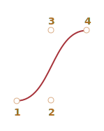

# Кривые Безье

Кривые Безье используются в компьютерной графике для рисования плавных изгибов, в CSS-анимации и много где ещё.

Это очень простая вещь, которую стоит изучить один раз, а затем чувствовать себя комфортно в мире векторной графики и продвинутых анимаций.

## Опорные точки

[Кривая Безье](https://ru.wikipedia.org/wiki/%D0%9A%D1%80%D0%B8%D0%B2%D0%B0%D1%8F_%D0%91%D0%B5%D0%B7%D1%8C%D0%B5) задаётся опорными точками.

Их может быть две, три, четыре или больше. Например:

По двум точкам:


По трём точкам:


По четырём точкам:



Если вы посмотрите внимательно на эти кривые, то "на глазок" заметите:

1. **Точки не всегда на кривой.** Это совершенно нормально, как именно строится кривая мы рассмотрим чуть позже.
2. **Степень кривой равна числу точек минус один.**
Для двух точек – это линейная кривая (т.е. прямая), для трёх точек – квадратическая кривая (парабола), для четырёх – кубическая.
3. **Кривая всегда находится внутри [выпуклой оболочки](https://ru.wikipedia.org/wiki/%D0%92%D1%8B%D0%BF%D1%83%D0%BA%D0%BB%D0%B0%D1%8F_%D0%BE%D0%B1%D0%BE%D0%BB%D0%BE%D1%87%D0%BA%D0%B0), образованной опорными точками:**

     

Благодаря последнему свойству в компьютерной графике можно оптимизировать проверку пересечения двух кривых. Если их выпуклые оболочки не пересекаются, то и кривые тоже не пересекутся. Таким образом, проверка пересечения выпуклых оболочек в первую очередь может дать быстрый ответ на вопрос о наличии пересечения. Проверить пересечение или выпуклые оболочки гораздо проще, потому что это прямоугольники, треугольники и т.д. (см. рисунок выше), гораздо более простые фигуры, чем кривая.

**Основная ценность кривых Безье для рисования в том, что, двигая точки, кривую можно менять, причём кривая при этом меняется интуитивно понятным образом.**

Попробуйте двигать точки мышью в примере ниже:

[iframe src="demo.svg?nocpath=1&p=0,0,0.5,0,0.5,1,1,1" height=370]

**Как можно заметить, кривая натянута по касательным 1 -> 2 и 3 -> 4.**

После небольшой практики становится понятно, как расположить точки, чтобы получить нужную форму. А, соединяя несколько кривых, можно получить практически что угодно.

Вот некоторые примеры:

  

## Алгоритм "де Кастельжо"

Есть математическая формула для кривых Безье, но давайте рассмотрим её чуть позже, потому что [Алгоритм де Кастельжо](http://ru.wikipedia.org/wiki/%D0%90%D0%BB%D0%B3%D0%BE%D1%80%D0%B8%D1%82%D0%BC_%D0%B4%D0%B5_%D0%9A%D0%B0%D1%81%D1%82%D0%B5%D0%BB%D1%8C%D0%B6%D0%BE) идентичен математическому определению кривой и наглядно показывает, как она строится.

Рассмотрим его на примере трёх точек (точки 1,2 и 3 можно двигать). Нажатие на кнопку "play" запустит демонстрацию.

[iframe src="demo.svg?p=0,0,0.5,1,1,0&animate=1" height=370]

**Построение кривой Безье c 3 точками по "алгоритму де Кастельжо":**

1. Рисуются опорные точки. В примере это: `1`, `2`, `3`.
2. Строятся отрезки между опорными точками в следующем порядке 1 -> 2 -> 3. На рисунке они <span style="color:#825E28">коричневые</span>.
3. Параметр `t` "пробегает" значения от `0` до `1`. В примере использован шаг `0.05`, т.е. в цикле `0, 0.05, 0.1, 0.15, ... 0.95, 1`.

    Для каждого из этих значений `t`:

    - На каждом из <span style="color:#825E28">коричневых</span> отрезков берётся точка, находящаяся на расстоянии, пропорциональном `t`, от его начала. Так как отрезков два, то и точек две.

        Например, при `t=0` -- точки будут в начале, при `t=0.25` -- на расстоянии в 25% от начала отрезка, при `t=0.5` -- 50% (на середине), при `t=1` -- в конце отрезков.

    - Эти точки соединяются. На рисунке ниже соединяющий их отрезок изображён <span style="color:#167490">синим</span>.


| При `t=0.25`             | При `t=0.5`            |
| ------------------------ | ---------------------- |
|    |  |


4. На получившемся <span style="color:#167490">синем</span> отрезке берётся точка на расстоянии, соответствующем `t`. То есть, для `t=0.25` (левый рисунок) получаем точку в конце первой четверти отрезка, для `t=0.5` (правый рисунок) – в середине отрезка. На рисунках выше эта точка отмечена <span style="color:red">красным</span>.

5. По мере того, как `t` "пробегает" последовательность от `0` до `1`, каждое значение `t` добавляет к кривой точку. Совокупность таких точек для всех значений образует кривую Безье. Она <span style="color:red">красная</span> и имеет параболическую форму на картинках выше.

Был описан процесс для построения по трём точкам. Но то же самое происходит и с четырьмя точками.

Демо для четырёх точек (точки можно двигать):

[iframe src="demo.svg?p=0,0,0.5,0,0.5,1,1,1&animate=1" height=370]

Алгоритм для 4 точек:

- Точки по порядку соединяются отрезками: 1 -> 2, 2 -> 3, 3 -> 4. Получается три <span style="color:#825E28">коричневых</span> отрезка.
- Для `t` на отрезке от `0` до `1`:
    - На отрезках берутся точки, соответствующие текущему `t`, соединяются. Получается два <span style="color:#0A0">зелёных отрезка</span> .
    - На этих отрезках берутся точки, соответствующие текущему `t`, соединяются. Получается один <span style="color:#167490">синий отрезок</span>.
    - На синем отрезке берётся точка, соответствующая текущему `t`. При запуске примера выше она <span style="color:red">красная</span>.

- Эти точки вместе описывают кривую.

Алгоритм является рекурсивным и может быть обобщён на любое количество контрольных точек.

Дано N контрольных точек:

1. Соединяем их, чтобы получить N-1 отрезков.
2. Затем для каждого `t` от `0` до `1` берём точку на каждом отрезке на расстоянии пропорциональном `t` и соединяем их. Там будет N-2 отрезков.
3. Повторяем 2 шаг, пока не останется одна точка.

Эти точки образуют кривую.

```online
**Запускайте и приостанавливайте примеры, чтобы ясно увидеть отрезки и то, как строится кривая.**
```


Кривая, которая выглядит как `y=1/t`:

[iframe src="demo.svg?p=0,0,0,0.75,0.25,1,1,1&animate=1" height=370]

Зигзагообразные контрольные точки тоже работают нормально:

[iframe src="demo.svg?p=0,0,1,0.5,0,0.5,1,1&animate=1" height=370]

Создание петли возможно:

[iframe src="demo.svg?p=0,0,1,0.5,0,1,0.5,0&animate=1" height=370]

Негладкая кривая Безье (да, это тоже возможно):

[iframe src="demo.svg?p=0,0,1,1,0,1,1,0&animate=1" height=370]

```online
Если в описании алгоритма есть что-то непонятное, посмотрите "живые" примеры выше, они наглядно показывают, как строится кривая.
```

Поскольку алгоритм является рекурсивным, мы можем построить кривые Безье любого порядка, используя 5, 6 или более контрольных точек. Но на практике много точек не так полезны. Обычно мы берём 2-3 точки, а для сложных линий склеиваем несколько кривых. Это проще для разработки и расчёта.

```smart header="Как нарисовать кривую *через* заданные точки?"
Для задания кривой Безье используются контрольные точки. Как видим, они не находятся на кривой, кроме первой и последней.

Иногда перед нами стоит другая задача: нарисовать кривую *через* несколько точек, чтобы все они были на одной гладкой кривой. Эта задача называется [интерполяцией](https://en.wikipedia.org/wiki/Interpolation), и она за рамками нашего изложения.

Для таких кривых существуют математические формулы, например, [полином Лагранжа](https://ru.wikipedia.org/wiki/%D0%98%D0%BD%D1%82%D0%B5%D1%80%D0%BF%D0%BE%D0%BB%D1%8F%D1%86%D0%B8%D0%BE%D0%BD%D0%BD%D1%8B%D0%B9_%D0%BC%D0%BD%D0%BE%D0%B3%D0%BE%D1%87%D0%BB%D0%B5%D0%BD_%D0%9B%D0%B0%D0%B3%D1%80%D0%B0%D0%BD%D0%B6%D0%B0). В компьютерной графике [сплайн-интерполяция](https://ru.wikipedia.org/wiki/%D0%9A%D1%83%D0%B1%D0%B8%D1%87%D0%B5%D1%81%D0%BA%D0%B8%D0%B9_%D1%81%D0%BF%D0%BB%D0%B0%D0%B9%D0%BD) часто используется для построения плавных кривых, соединяющих множество точек.
```


## Математика

Кривая Безье может быть описана с помощью математической формулы.

Как мы видели, на самом деле нет необходимости её знать, большинство людей просто рисуют кривую, перемещая точки с помощью мыши. Но если вы увлекаетесь математикой -- вот она.

Координаты кривой с контрольными точками <code>P<sub>i</sub></code>: первая контрольная точка имеет координаты <code>P<sub>1</sub> = (x<sub>1</sub>, y<sub>1</sub>)</code>, вторая: <code>P<sub>2</sub> = (x<sub>2</sub>, y<sub>2</sub>)</code> и т.д., описываются уравнением, зависящим от параметра `t` на отрезке `[0,1]`.

- Формула для 2-х точечной кривой:

    <code>P = (1-t)P<sub>1</sub> + tP<sub>2</sub></code>
- Для 3 контрольных точек:

    <code>P = (1−t)<sup>2</sup>P<sub>1</sub> + 2(1−t)tP<sub>2</sub> + t<sup>2</sup>P<sub>3</sub></code>
- Для 4 контрольных точек:

    <code>P = (1−t)<sup>3</sup>P<sub>1</sub> + 3(1−t)<sup>2</sup>tP<sub>2</sub>  +3(1−t)t<sup>2</sup>P<sub>3</sub> + t<sup>3</sup>P<sub>4</sub></code>

Это векторные уравнения. Другими словами, мы можем поставить `x` и `y` вместо `P`, чтобы получить соответствующие координаты.

Например, 3-точечная кривая образована точками `(x,y)`, рассчитанными как:

- <code>x = (1−t)<sup>2</sup>x<sub>1</sub> + 2(1−t)tx<sub>2</sub> + t<sup>2</sup>x<sub>3</sub></code>
- <code>y = (1−t)<sup>2</sup>y<sub>1</sub> + 2(1−t)ty<sub>2</sub> + t<sup>2</sup>y<sub>3</sub></code>

Вместо <code>x<sub>1</sub>, y<sub>1</sub>, x<sub>2</sub>, y<sub>2</sub>, x<sub>3</sub>, y<sub>3</sub></code> мы должны поместить координаты 3 контрольных точек, а затем при перемещении `t` от `0` до `1` для каждого значения `t` мы получим `(x,y)` кривой.

Например, если контрольными точками являются `(0,0)`, `(0.5,1)` и `(1,0)`, уравнения становятся:

- <code>x = (1−t)<sup>2</sup> * 0 + 2(1−t)t * 0.5 + t<sup>2</sup> * 1 = (1-t)t + t<sup>2</sup> = t</code>
- <code>y = (1−t)<sup>2</sup> * 0 + 2(1−t)t * 1 + t<sup>2</sup> * 0 = 2(1-t)t = –2t<sup>2</sup> + 2t</code>

Теперь, в то время как `t` "пробегает" от `0` до `1`, набор значений `(x, y)` для каждого `t` образует кривую для таких контрольных точек.

## Итого

Кривые Безье задаются опорными точками.

Мы рассмотрели два определения кривых:

1. Через математическую формулу.
2. Использование процесса рисования: алгоритм де Кастельжо.

Их удобство в том, что:

- Можно рисовать плавные линии с помощью мыши, перемещая контрольные точки.
- Сложные формы могут быть сделаны из нескольких кривых Безье.

Применение:

- В компьютерной графике, моделировании, в графических редакторах. Шрифты описываются с помощью кривых Безье.
- В веб-разработке – для графики на Canvas или в формате SVG. Кстати, все живые примеры выше написаны на SVG. Фактически, это один SVG-документ, к которому точки передаются параметрами. Вы можете открыть его в отдельном окне и посмотреть исходник: [demo.svg](demo.svg?p=0,0,1,0.5,0,0.5,1,1&animate=1).
- В CSS-анимации для задания траектории или скорости передвижения.
