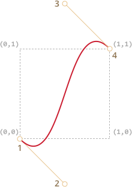

# CSS-анимации

CSS позволяет совершать простые анимации без использования JavaScript.

JavaScript может быть использован для управления CSS-анимациями. Это позволит делать более сложные анимации, использую небольшие кусочки кода.

## CSS переходы [#css-transitions]

Идея CSS переходов проста: мы указываем, что некоторое свойство должно быть анимированно и как оно должно быть анимированно. А когда свойство меняется, браузер сам обработает это изменение и построит анимацию.

Все что нам необходимо после этого - поменять свойство. И браузер сделает плавное изменение этого свойства.

Например, CSS код ниже анимирует `background-color` за 3 секунды:

```css
.animated {
  transition-property: background-color;
  transition-duration: 3s;
}
```

Теперь, если элементу установлен класс `.animated`, любое изменение свойства `background-color` будет анимироваться в течении трех секунды.

Нажмите кнопку ниже, чтобы анимировать фон:

```html run autorun height=60
<button id="color">Нажми меня</button>

<style>
  #color {
    transition-property: background-color;
    transition-duration: 3s;
  }
</style>

<script>
  color.onclick = function() {
    this.style.backgroundColor = 'red';
  };
</script>
```

Существует 4 свойства для описания CSS-переходов:

- `transition-property` -- свойство перехода
- `transition-duration` -- продолжительность перехода
- `transition-timing-function` -- временная функция перехода
- `transition-delay` -- задержка начала перехода

Далее мы расмотрим их все, но давайте отметим сейчас, что общее свойство `transition` позволяет объявить их вместе в последовательности: `property duration timing-function delay`, а также анимировать несколько свойств одновременно.

Например, эта кнопка анимирует два свойства `color` (цвет) и `font-size` (размер шрифта) одновременно:

```html run height=80 autorun no-beautify
<button id="growing">Нажми меня</button>

<style>
#growing {
*!*
  transition: font-size 3s, color 2s;
*/!*
}
</style>

<script>
growing.onclick = function() {
  this.style.fontSize = '36px';
  this.style.color = 'red';
};
</script>
```

Теперь рассмотрим свойства анимации каждое в отдельности.

## transition-property

В свойство `transition-property` записывается список свойств, изменения которых необходимо анимировать, например: `left`, `margin-left`, `height`, `color`.

Анимировать можно не все свойства, но [многие](http://www.w3.org/TR/css3-transitions/#animatable-properties-). Значение свойства `all` означает "анимируй все свойства".

## transition-duration

В `transition-duration` мы можем определить, сколько времени займет анимация. Время должно быть задано в [формате времени CSS](http://www.w3.org/TR/css3-values/#time): в секундах `s` или миллисекундах `ms`.

## transition-delay

В `transition-delay` мы можем определить задержку *перед* началом анимации. Например, если  `transition-delay: 1s`, тогда анимация начнется через 1 секунду после изменения свойства.

Отрицательные значения также допустимы. В таком случае анимация начнется с середины. Например, если `transition-duration: 2s` и `transition-delay: -1s`, тогда анимация займет 1 секунду и начнется с середины.

Здесь приведен пример анимации, сдвигающие цифры от `0` до `9` с использованием CSS свойства `transform` со значением `translate`:

[codetabs src="digits"]

Свойство `transform` анимируется следующим образом:

```css
#stripe.animate {
  transform: translate(-90%);
  transition-property: transform;
  transition-duration: 9s;
}
```

В примере выше JavaScript код добавляет класс `.animate` к элементу -- после чего начинается анимация:

```js
stripe.classList.add('animate');
```

Мы можем начать анимацию "с середины", с определенного числа, например, используя отрицательное значение `transition-delay` соответствующие необходимому числу.

Если вы нажмете на цифру ниже, то анимация начнется с последней секунды:

[codetabs src="digits-negative-delay"]

JavaScript делает это с помощью нескольких строк кода:

```js
stripe.onclick = function() {
  let sec = new Date().getSeconds() % 10;
*!*
  // например, значение -3s здесь начнут анимацию с третьей секунды
  stripe.style.transitionDelay = '-' + sec + 's';
*/!*
  stripe.classList.add('animate');
};
```

## transition-timing-function

Временная функция описывает, как процесс анимации будет распределен во времени. Будет ли она начата медленно и затем ускорится или наоборот.

На первый взгляд это очень сложное свойство, но оно становится понятным, если уделить ему немного времени.

Это свойство может принимать два вида значений: кривую Безье или количество шагов. Давайте начнем с кривой Безье, как с наиболее часто используемой.

### Кривая Безье

Временная функция может быть задана, как [кривая Безье](/bezier-curve) с 4 контрольными точками, удовлетворяющими условиям:

1. Первая контрольная точка: `(0,0)`.
2. Последняя контрольная точка: `(1,1)`.
3. Для промежуточных точек значение `x` должно быть `0..1`, значение `y` может принимать любое значение.

Синтаксис для кривых Безье в CSS: `cubic-bezier(x2, y2, x3, y3)`. Нам необходимо задать только вторую и третью контрольные точки, потому что первая зафиксирована со значением `(0,0)` и четвертая - `(1,1)`.

Временная функция описывает то, насколько быстро происходит анимации во времени.

- Ось `x` -- это ось времени: `0` -- начало анимации, `1` -- конец анимации, соответствующий значению в свойстве `transition-duration`.
- Ось `y` -- это ось изменения значения: `0` -- начальное значения свойства, `1` -- конечное значение свойства.

Самым простым примером анимации является равномерная анимация с линейной скоростью. Она может быть задана с помощью кривой `cubic-bezier(0, 0, 1, 1)`.

Вот как выглядит эта "кривая":


...Как мы видим, это прямая линия. Значению времени (`x`) соответствует, значение завершенности анимации (`y`) которое равномерно приближается от `0` к `1`.

В примере ниже поезд "едет" слева направо с одинаковой скоростью (нажмите на поезд):

[codetabs src="train-linear"]

В свойстве `transition` указана следующая кривая Безье:

```css
.train {
  left: 0;
  transition: left 5s cubic-bezier(0, 0, 1, 1);
  /* JavaScript sets left to 450px */
}
```

...И как мы можем показать замедление поезда?

Мы можем использовать другую кривую Безье: `cubic-bezier(0.0, 0.5, 0.5 ,1.0)`.

Что получилось:


Как мы видимо, анимация начинается быстро: кривая быстро поднимается вверх, и затем все медленнее и медленнее.

Ниже временная функция в действии (нажмите на поезд):

[codetabs src="train"]

CSS:
```css
.train {
  left: 0;
  transition: left 5s cubic-bezier(0, .5, .5, 1);
  /* JavaScript sets left to 450px */
}
```

Есть несколько встроенных обозначений кривых Безье: `linear`, `ease`, `ease-in`, `ease-out` и `ease-in-out`.

`linear` это короткая запись для `cubic-bezier(0, 0, 1, 1)` -- прямой линии, которую мы видели раньше.

Другие названия -- это также сокращения для других `cubic-bezier`:

| <code>ease</code><sup>*</sup> | <code>ease-in</code> | <code>ease-out</code> | <code>ease-in-out</code> |
|-------------------------------|----------------------|-----------------------|--------------------------|
| <code>(0.25, 0.1, 0.25, 1.0)</code> | <code>(0.42, 0, 1.0, 1.0)</code> | <code>(0, 0, 0.58, 1.0)</code> | <code>(0.42, 0, 0.58, 1.0)</code> |
|  |  |  |  |

`*` -- используется по умолчанию, если не задана другая временная функция.

Для того, чтобы замедлить поезд мы можем использовать `ease-out`:

```css
.train {
  left: 0;
  transition: left 5s ease-out;
  /* transition: left 5s cubic-bezier(0, .5, .5, 1); */
}
```

Но получившийся результат немного отличается.

**Кривая Безье может заставить анимацию «выпрыгивать» за пределы диапазона.**

Контрольные точки могут иметь любые значения по оси `y`: отрицательные или сколь угодно большие. В таком случае кривая Безье будет также скакать очень высоко или очень низко, заставляя анимацию выходить за её нормальные пределы.

В приведенном ниже примере код анимации:
```css
.train {
  left: 100px;
  transition: left 5s cubic-bezier(.5, -1, .5, 2);
  /* JavaScript sets left to 400px */
}
```

Свойство `left` будет анимироваться от `100px` до `400px`.

Но когда вы нажмете на поезд, вы увидите следующее:

- Сначала, поезд поедет *назад*: `left` станет меньше, чем `100px`.
- Затем он поедет вперед, немного больше, чем `400px`.
- И затем вернется назад -- в значение `400px`.

[codetabs src="train-over"]

Если мы взглянем на кривую Безье из примера -- становится понятно поведение поезда.



Мы вынесли координату `y` для первой опорной точки ниже нудя и выше единицы для третьей опроной точки, поэтому кривая вышла за пределы "обычного" квадрата. Значения `y` вышли из "стандартного" диапазона `0..1`.

Как мы знаем, ось `y` измеряет "завершенность процесса анимации". Значение `y = 0` соответствует начальному значению анимируемого свойства и `y = 1` -- конечному значению. Таким образом `y<0` делает значение свойства `left` меньше начального значения и `y>1` -- больше конечного.

Это, конечно, "мягкий" вариант. Если значение `y` будут `-99` and `99`, то поезд будет гораздо сильнее выпрыгивать за пределы.

Как сделать кривую Безье необходимую для конкретной задачи? Существует множество инструментов, например можно использовать с сайта <http://cubic-bezier.com/>.

### Шаги

Временная функция `steps(количество шагов[, start/end])` позволяет разделить анимацию на шаги.

Давайте рассмотрим это на, знакомом нам, примере с цифрами.

Ниже представлен список цифр, без какой-либо анимации, который мы будем использовать в качестве основы:

[codetabs src="step-list"]

Давайте сделаем так, чтобы цифры двигались не плавно, а появлялись одна за другой раздельно. Для этого скроем все что находится за красным "окошком" и будем сдвигать список влево по шагам.

Всего будет 9 шагов, один шаг для каждой цифры:

```css
#stripe.animate  {
  transform: translate(-90%);
  transition: transform 9s *!*steps(9, start)*/!*;
}
```

В действии:

[codetabs src="step"]

Первый аргумент временной функции `steps(9, start)` -- количество шагов. Трансформация будет разделена на 9 частей (10% каждая). Временной интервал также будет разделен на 9 частей, таким образом свойство `transition: 9s` обеспечивает нам 9 секунду анимации, что дает по одной секунде на цифру.

Второй аргумент -- одно из ключевых слов: `start` или `end`.

`start` -- означает, что в начале анимации нам необходимо перейти на первый шаг немедленно.

Мы можем наблюдать это во время анимации: когда пользователь нажимает на цифру, значение меняется на `1` (первый шаг) сразу и в следующий раз меняется уже в начале следующей секунды.

Анимация будет происходить так:

- `0s` -- `-10%` (первое изменение в начале первой секунды, сразу после нажатия)
- `1s` -- `-20%`
- ...
- `8s` -- `-80%`
- (на протяжении последней секунды отображается последнее значение).

Альтернативное значение end означало бы, что изменения нужно применять не в начале, а в конце каждой секунды.

Анимация будет происходить так:

- `0s` -- `0`
- `1s` -- `-10%` (первое изменение произойдет в конце первой секунды)
- `2s` -- `-20%`
- ...
- `9s` -- `-90%`

Пример `step(9, end)` в действии (обратите внимание на паузу между первым изменением цифр):

[codetabs src="step-end"]

Также есть сокращённые значения:

- `step-start` -- тоже самое, что `steps(1, start)`. Оно означает, что анимация начнется сразу и произойдет в один шаг. Таким образом она начнется и завершится сразу, как будто и нет никакой анимации.
- `step-end` -- тоже самое, что `steps(1, end)`: выполнит анимацию за один шаг в конце `transition-duration`.

Такие значения используются редко, потому что это не совсем анимация, а точнее будет сказать одношаговые изменения.

## Событие transitionend

Когда завершается анимация, срабатывает событие `transitionend`.

Это широко используется для выполнения действий после завершения анимации. Это также может быть использовано с целью объединения анимаций в последовательности.

Например, корабль в приведенном ниже примере начинает плавать туда и обратно по клику, каждый раз все дальше и дальше вправо:

[iframe src="boat" height=300 edit link]

Анимация начинается с помощью функции `go`, которая вызывается каждый раз снова, когда переход заканчивается и меняется направление:

```js
boat.onclick = function() {
  //...
  let times = 1;

  function go() {
    if (times % 2) {
      // плыть вправо
      boat.classList.remove('back');
      boat.style.marginLeft = 100 * times + 200 + 'px';
    } else {
      // плыть влево
      boat.classList.add('back');
      boat.style.marginLeft = 100 * times - 200 + 'px';
    }

  }

  go();

  boat.addEventListener('transitionend', function() {
    times++;
    go();
  });
};
```

Объект события `transitionend` содержит специфичные свойства:

`event.propertyName`
: Имя свойство, анимация которого завершилась. Может быть полезным, если мы анимируем несколько свойств.

`event.elapsedTime`
: Время (в секундах), которое заняла анимация, без учета `transition-delay`.

## Keyframes

Мы можем объединить несколько простых анимаций вместе используя CSS правило `@keyframes`.

Оно определяет "имя" анимации и правила: что, когда и где анимировать. После этого можно использовать свойство `animation`, чтобы назначить анимацию на элемент и определить её дополнительные параметры.

Ниже приведен пример с пояснениями:

```html run height=60 autorun="no-epub" no-beautify
<div class="progress"></div>

<style>
*!*
  @keyframes go-left-right {        /* объявляем имя анимации: "go-left-right" */
    from { left: 0px; }             /* от: left: 0px */
    to { left: calc(100% - 50px); } /* до: left: 100%-50px */
  }
*/!*

  .progress {
*!*
    animation: go-left-right 3s infinite alternate;
    /* применить анимацию "go-left-right" на элементе
       продолжительностью 3 секунды
       количество раз: бесконечно (infinite)
       менять направление анимации каждый раз (alternate)
    */
*/!*

    position: relative;
    border: 2px solid green;
    width: 50px;
    height: 20px;
    background: lime;
  }
</style>
```

Существует множество статей про `@keyframes` и [детальная спецификация](https://drafts.csswg.org/css-animations/).

Возможно вам не придется пользоваться `@keyframes` часто, до тех пор, пока на ваших сайтах не появится постоянно изменяющихся значений.

## Summary

CSS-анимации позволяют плавно или не очень менять одно или несколько свойств.

Они хороши для использования в большинстве задач по анимации. Также нам доступен JavaScript для анимации, следующая глава посвящена этому.

Ограничения CSS-анимаций в сравнении с JavaScript анимациями:

```compare plus="CSS анимации" minus="JavaScript анимации"
+ Простые вещи делаются просто.
+ Быстрые и не создают нагрузку на CPU.
- JavaScript анимации более гибкии. В них может присутствовать любая анимационная логика, как например "взорвать" элемент.
- Можно изменять не только свойства. Мы можем создавать новые элементы с помощью JavaScript для анимации.
```

Большинство анимаций может быть реализовано с использованием CSS, как описано в этой главе. А событие `transitionend` позволяет запускать JavaScript после анимации, поэтому CSS-анимации могут прекрасно интегрируется с кодом.

Но в следующей главе мы рассмотрим некоторые JavaScript анимации, которые позволяют решать более сложные задачи.
