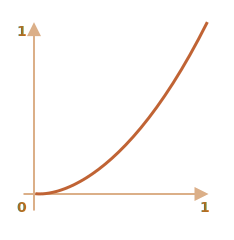
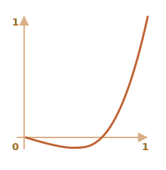

# JavaScript-анимации

С помощью JavaScript-анимаций можно делать вещи, которые нельзя реализовать на CSS.

Например, движение по сложному пути с временной функцией, отличной от кривой Безье, или canvas-анимации.

## Использование setInterval

Анимация реализуется через последовательность кадров, каждый из которых немного меняет HTML/CSS-свойства.

Например, изменение `style.left` от `0px` до `100px` -- двигает элемент. И если мы будем делать это с помощью `setInterval`, изменяя на `2px` с небольшими интервалами времени, например 50 раз в секунду, тогда изменения будут выглядеть плавными. Принцип такой же, как в кино: 24 кадров в секунду достаточно, чтобы создать эффект плавности.

Псевдокод мог бы выглядеть так:

```js
let timer = setInterval(function() {
  if (animation complete) clearInterval(timer);
  else increase style.left by 2px
}, 20); // изменять на 2px каждые 20ms, это около 50 кадров в секунду
```

Более детальная реализация этой анимации:

```js
let start = Date.now(); // запомнить время начала

let timer = setInterval(function() {
  // сколько времени прошло с начала анимации?
  let timePassed = Date.now() - start;

  if (timePassed >= 2000) {
    clearInterval(timer); // закончить анимацию через 2 секунды
    return;
  }

  // отрисовать анимацию на момент timePassed, прошедший с начала анимации
  draw(timePassed);

}, 20);

// в то время как timePassed идёт от 0 до 2000
// left изменяет значение от 0px до 400px
function draw(timePassed) {
  train.style.left = timePassed / 5 + 'px';
}
```

Для просмотра примера, кликните на него:

[codetabs height=200 src="move"]

## Использование requestAnimationFrame

Теперь давайте представим, что у нас есть несколько анимаций, работающих одновременно.

Если мы запустим их независимо с помощью `setInterval(..., 20)`, тогда браузеру будет необходимо выполнять отрисовку гораздо чаще, чем раз в `20ms`.

Это происходит из-за того, что каждая анимация имеет своё собственное время старта и "каждые 20 миллисекунд" для разных анимаций -- разные. Интервалы не выравнены и у нас будет несколько независимых срабатываний в течение `20ms`.

Другими словами:

```js
setInterval(function() {
  animate1();
  animate2();
  animate3();
}, 20)
```

...Меньше нагружают систему, чем три независимых функции:

```js
setInterval(animate1, 20); // независимые анимации
setInterval(animate2, 20); // в разных местах кода
setInterval(animate3, 20);
```

Эти независимые перерисовки лучше сгруппировать вместе, тогда они будут легче для браузера, а значит - не грузить процессор и более плавно выглядеть.

Существует ещё одна вещь, про которую надо помнить: когда CPU перегружен или есть другие причины делать перерисовку реже (например, когда вкладка браузера скрыта), нам не следует делать её каждые `20ms`.

Но как нам узнать об этом в JavaScript? Спецификация [Animation timing](http://www.w3.org/TR/animation-timing/) описывает функцию `requestAnimationFrame`, которая решает все описанные проблемы и делает даже больше.

Синтаксис:
```js
let requestId = requestAnimationFrame(callback)
```

Такой вызов планирует запуск функции `callback` на ближайшее время, когда браузер сочтёт возможным осуществить анимацию.

Если в `callback` происходит изменение элемента, тогда оно будет сгруппировано с другими `requestAnimationFrame` и CSS-анимациями. Таким образом браузер выполнит один геометрический пересчёт и отрисовку, вместо нескольких.

Значение `requestId` может быть использовано для отмены анимации:
```js
// отмена запланированного запуска callback
cancelAnimationFrame(requestId);
```

Функция `callback` имеет один аргумент -- время прошедшее с момента начала загрузки страницы в миллисекундах. Это значение может быть получено с помощью вызова [performance.now()](mdn:api/Performance/now).

Как правило, `callback` запускается очень скоро, если только не перегружен CPU или не разряжена батарея ноутбука, или у браузера нет какой-то ещё причины замедлиться.

Код ниже показывает время между первыми 10 запусками `requestAnimationFrame`. Обычно оно 10-20 мс:

```html run height=40 refresh
<script>
  let prev = performance.now();
  let times = 0;

  requestAnimationFrame(function measure(time) {
    document.body.insertAdjacentHTML("beforeEnd", Math.floor(time - prev) + " ");
    prev = time;

    if (times++ < 10) requestAnimationFrame(measure);
  })
</script>
```

## Структура анимации

Теперь мы можем создать более сложную функцию анимации с помощью `requestAnimationFrame`:

```js
function animate({timing, draw, duration}) {

  let start = performance.now();

  requestAnimationFrame(function animate(time) {
    // timeFraction изменяется от 0 до 1
    let timeFraction = (time - start) / duration;
    if (timeFraction > 1) timeFraction = 1;

    // вычисление текущего состояния анимации
    let progress = timing(timeFraction);

    draw(progress); // отрисовать её

    if (timeFraction < 1) {
      requestAnimationFrame(animate);
    }

  });
}
```

Функция `animate` имеет три аргумента, которые описывают анимацию:

`duration`
: Продолжительность анимации. Например, `1000`.

`timing(timeFraction)`
: Функция расчёта времени, как CSS-свойство `transition-timing-function`, которая будет вычислять прогресс анимации (как ось `y` у кривой Безье) в зависимости от прошедшего времени (`0` в начале, `1` в конце).

    Например, линейная функция значит, что анимация идёт с одной и той же скоростью:

    ```js
    function linear(timeFraction) {
      return timeFraction;
    }
    ```

    График функции:
    

    Это как если бы в `transition-timing-function` передать значение `linear`. Ниже будут представлены более интересные примеры.

`draw(progress)`
: Функция отрисовки, которая получает аргументом значение прогресса анимации и отрисовывает его. Значение `progress=0` означает что анимация находится в начале, и значение `progress=1` -- в конце.

    Эта та функция, которая на самом деле и рисует анимацию.

    Вот как она могла бы двигать элемент:
    ```js
    function draw(progress) {
      train.style.left = progress + 'px';
    }
    ```

    ...Или делать что-нибудь ещё. Мы можем анимировать что угодно, как захотим.


Теперь давайте используем нашу функцию, чтобы анимировать свойство `width` от `0` до `100%`.

Нажмите на элемент для того, чтобы посмотреть пример:

[codetabs height=60 src="width"]

Код:

```js
animate({
  duration: 1000,
  timing(timeFraction) {
    return timeFraction;
  },
  draw(progress) {
    elem.style.width = progress * 100 + '%';
  }
});
```

В отличие от CSS-анимаций, можно создать любую функцию расчёта времени и любую функцию отрисовки. Функция расчёта времени не будет ограничена только кривой Безье, а функция `draw` может менять не только свойства, но и создавать новые элементы (например, для создания анимации фейерверка).

## Функции расчёта времени

Мы уже рассмотрели самый простой пример линейной функции расчёта времени выше.

Давайте посмотрим другие. Мы попробуем выполнить анимации с разными функциями расчёта времени, чтобы посмотреть как они работают.

### Степень n

Если мы хотим ускорить анимацию, мы можем возвести `progress` в степень `n`.

Например, параболическая кривая:

```js
function quad(timeFraction) {
  return Math.pow(timeFraction, 2)
}
```

График:



Посмотрим в действии (нажмите для активации):

[iframe height=40 src="quad" link]

...Или кубическая кривая, или любой другой множитель `n`. Повышение степени увеличивает скорость анимации.

Вот график для функции `progress` в степени `5`:


В действии:

[iframe height=40 src="quint" link]

### Дуга

Функция:

```js
function circ(timeFraction) {
  return 1 - Math.sin(Math.acos(timeFraction));
}
```

График:


[iframe height=40 src="circ" link]

### Обратно: выстрел из лука

Эта функция совершает "выстрел из лука". В начале "натягивается тетива", а затем "выстрел".

В отличие от предыдущей функции, теперь всё зависит от дополнительного параметра `x` -- "коэффициента эластичности". Он определяет силу "натяжения тетивы".

Код:

```js
function back(x, timeFraction) {
  return Math.pow(timeFraction, 2) * ((x + 1) * timeFraction - x)
}
```

**График для `x = 1.5`:**



Для анимации мы используем `x` с определённым значением. Пример для `x` со значением `1.5`:

[iframe height=40 src="back" link]

### Отскоки

Представьте, что мы бросили мяч вниз. Он падает, ударяется о землю, подскакивает несколько раз и останавливается.

Функции `bounce` делает то же самое, но в обратном порядке: "отскоки" начинаются сразу. Для этого заданы специальные коэффициенты:

```js
function bounce(timeFraction) {
  for (let a = 0, b = 1, result; 1; a += b, b /= 2) {
    if (timeFraction >= (7 - 4 * a) / 11) {
      return -Math.pow((11 - 6 * a - 11 * timeFraction) / 4, 2) + Math.pow(b, 2)
    }
  }
}
```

В действии:

[iframe height=40 src="bounce" link]

### Эластичная анимация

Ещё одна "эластичная" функция, которая принимает дополнительный параметр `x` для "начального отрезка".

```js
function elastic(x, timeFraction) {
  return Math.pow(2, 10 * (timeFraction - 1)) * Math.cos(20 * Math.PI * x / 3 * timeFraction)
}
```

**График для `x=1.5`:**


В действии со значением `x=1.5`:

[iframe height=40 src="elastic" link]

## Реверсивные функции: ease*

Итак у нас получилась коллекция функций расчёта времени. Их прямое использование называется «easeIn».

Иногда нужно показать анимацию в обратном режиме. Преобразование функции, которое даёт такой эффект, называется «easeOut».

### easeOut

В режиме "easeOut" `timing` функции оборачиваются функцией `timingEaseOut`:

```js
timingEaseOut(timeFraction) = 1 - timing(1 - timeFraction)
```
Другими словами, мы имеем функцию "преобразования" -- `makeEaseOut`, которая берет "обычную" функцию расчёта времени и возвращает обёртку над ней:

```js
// принимает функцию расчёта времени и возрващает преобразованный вариант
function makeEaseOut(timing) {
  return function(timeFraction) {
    return 1 - timing(1 - timeFraction);
  }
}
```

Например, мы можем взять функцию `bounce` описанную выше:

```js
let bounceEaseOut = makeEaseOut(bounce);
```

Таким образом, отскоки будут не в начале функции, а в конце. Смотрится гораздо лучше:

[codetabs src="bounce-easeout"]

Ниже мы можем увидеть, как трансформации изменяют поведение функции:


Если раньше анимационный эффект, такой как отскоки, был в начале, то после трансформации он будет показан в конце.

На графике выше красным цветом обозначена <span style="color:#EE6B47">обычная функция</span> и синим -- <span style="color:#62C0DC">после easeOut</span>.

- Обычный скачок -- объект сначала медленно скачет внизу, а затем резко подпрыгивает вверх.
- Обратный `easeOut` -- объект вначале прыгает вверх, и затем скачет там.

### easeInOut

Мы можем применить эффект дважды -- в начале и конце анимации. Такая трансформация называется "easeInOut".

Для функции расчёта времени, анимация будет вычисляться следующим образом:

```js
if (timeFraction <= 0.5) { // первая половина анимации
  return timing(2 * timeFraction) / 2;
} else { // вторая половина анимации
  return (2 - timing(2 * (1 - timeFraction))) / 2;
}
```

Код функции-обёртки:

```js
function makeEaseInOut(timing) {
  return function(timeFraction) {
    if (timeFraction < .5)
      return timing(2 * timeFraction) / 2;
    else
      return (2 - timing(2 * (1 - timeFraction))) / 2;
  }
}

bounceEaseInOut = makeEaseInOut(bounce);
```

В действии, `bounceEaseInOut`:

[codetabs src="bounce-easeinout"]

Функция "easeInOut" объединяет два графика в один: `easeIn` (обычный) для первой половины анимации and `easeOut` (обратный) -- для второй половины.

Разница хорошо заметна, если сравнивать графики `easeIn`, `easeOut` и `easeInOut` для функции `circ`:


- <span style="color:#EE6B47">Красный</span> обычный вариант `circ` (`easeIn`).
- <span style="color:#8DB173">Зелёный</span> -- `easeOut`.
- <span style="color:#62C0DC">Синий</span> -- `easeInOut`.

Как видно, график первой половины анимации представляет собой уменьшенный `easeIn`, а второй – уменьшенный `easeOut`. В результате, анимация начинается и заканчивается одинаковым эффектом.

## Более интересная функция "draw"

Вместо передвижения элемента мы можем делать что-нибудь ещё. Всё, что нам нужно -- это правильно написать функцию `draw`.

Вот пример "скачущей" анимации набирающегося текста:

[codetabs src="text"]

## Итого

JavaScript может помочь в тех случаях, когда CSS не справляется или нужен жёсткий контроль над анимацией. JavaScript-анимации должны быть сделаны с помощью `requestAnimationFrame`. Это встроенный метод браузера, который вызывает переданную в него функцию в тот момент, когда браузер готовится совершить перерисовку (обычно это происходит быстро, но конкретные задержки зависят от браузера).

Когда вкладка скрыта, на ней совсем не происходит перерисовок, и функция не будет вызвана: анимация будет приостановлена и не потратит ресурсы. Это хорошо.

Вспомогательная функция `animate` для создания анимации:

```js
function animate({timing, draw, duration}) {

  let start = performance.now();

  requestAnimationFrame(function animate(time) {
    // timeFraction изменяется от 0 до 1
    let timeFraction = (time - start) / duration;
    if (timeFraction > 1) timeFraction = 1;

    // вычисление текущего состояния анимации
    let progress = timing(timeFraction);

    draw(progress); // отрисовать её

    if (timeFraction < 1) {
      requestAnimationFrame(animate);
    }

  });
}
```

Опции:

- `duration` -- общая продолжительность анимации в миллисекундах.
- `timing` -- функция вычисления прогресса анимации. Получается момент времени от 0 до 1, возвращает прогресс анимации, обычно тоже от 0 до 1.
- `draw` -- функция отрисовки анимации.

Конечно, мы могли бы улучшить вспомогательную функцию и добавить в неё больше наворотов. Но JavaScript-анимации не каждый день используются, а только когда хотят сделать что-то интересное и необычное. Не стоит усложнять функцию до тех пор пока это вам не понадобились.

JavaScript-анимации могут использовать любые функции расчёта времени. Мы рассмотрели множество примеров и их вариаций, чтобы сделать их ещё более универсальными. В отличие от CSS, мы здесь не ограничены только кривой Безье.

То же самое и с `draw`: мы можем анимировать всё что угодно, не только CSS-свойства.
