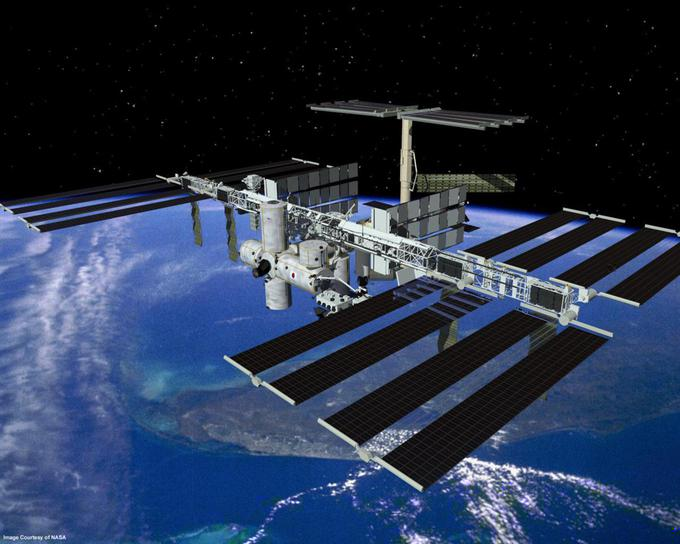

# С орбитальной высоты

Этот раздел описывает набор современных стандартов для "web компонентов".

На текущий момент, эти стандарты находятся в процессе разработки. Некоторые фичи имеют хорошую поддержку и интеграцию в современный стандарт HTML/DOM, в то время как другие пока еще в черновиках. Вы можете попробовать примеры в любом современном браузере (возможно, Google Chrome поддерживает самые последние фичи, так как ребята из Google предположительно стоят за большинством спецификаций по этой теме).

## Что общего между...

В идее самостоятельного компонента нет ничего нового. Такой подход используется во многих фреймворках.

Прежде чем мы погрузимся в детали реализации, взгляните на это великое достижение человечества:

Это Международная Космическая Станция (МКС).

А это то, как она устроена (приблизительно):

Международная Космическая Станция:
- Состоит из множества компонентов.
- Каждый компонент в свою очередь, состоит из множества более мелких деталей.
- Компоненты имеют очень сложное устройство, и гораздо сложнее большинства сайтов.
- Компоненты разработаны на международной основе, командами из разных стран и говорящих на разных языках.

...И эта штука летает, поддерживая жизни людей в космосе!

Как создаются столь сложные устройства?

Какие принципы мы могли бы позаимствовать, чтобы сделать нашу разработку такой же надежной и масштабируемой? Или, по крайней мере, приблизиться к такому уровню.

## Компонентная архитектура

Хорошо известное правило разработки сложного программного обеспечения гласит: не создавай сложное программное обеспечение.

Если что то становится сложным -- раздели это на более простые части и соедини наиболее очевидным способом.

**Хороший архитектор -- это тот, кто может сложные вещи сделать простыми.**

Мы можем разделить пользовательский интерфейс на визуальные компоненты: каждый из них занимает свое место на странице, может "выполнять" хорошо описанную задачу, и отделен от остальных.

Рассмотрим какой-нибудь вебсайт, например Twitter.

Он естественным образом разделен на компоненты:

1. Верхняя навигация.
2. Данные пользователя.
3. Предложения подписаться.
4. Форма отправки сообщения.
5. (а так же 6 и 7) -- сообщения.

Компоненты могут содержать подкомпоненты, например сообщения могут быть частями родительского компонента "список сообщений". Кликабельное пользовательская картинка может быть самостоятельным компонентом и т.д.

Как мы определяем, что является компонентом? Это приходит из соображений здравого смысла, а также с интуицией и опытом. Обычно это объект, отделимый визуально, который мы можем описать с точки зрения того, что он делает и как он взаимодействует со страницей. В примере выше, страница сожержит блоки, каждый из которых играет свою роль, и логично выделить их в компоненты.

- Компонент имеет свой собственный JavaScript класс.
- DOM структура управляется исключительно своим классом, и внешний код не имеет к ней доступа (принцип "инкапсуляции").
- CSS стили, примененные к компоненту.
- API: события, методы класса и т.п., для взаимодействия с другими компонентами.

Опять же, компонент в целом не представляет ничего особенного.

Существует множество фреймворков и методов разработки для их создания, каждый из которых со своими плюсами и минусами. Обычно особые CSS классы и условности используются для обеспечения "ощущения компонентов" -- области видимости CSS и инкапсуляция DOM.

"Веб-компоненты" предоставляют встроенные возможности браузера для этого, поэтому нам больше не нужно имитировать их.

- [Пользовательские элементы](https://html.spec.whatwg.org/multipage/custom-elements.html#custom-elements) -- для определения пользовательских HTML-элементов.
- [Теневой DOM](https://dom.spec.whatwg.org/#shadow-trees) -- для создание внутреннего DOM компонента, скрытого от остальных.
- [CSS области видимости](https://drafts.csswg.org/css-scoping/) -- для определения стилей, которые применяются только внутри теневого DOM компонента.
- [Перенаправление событий](https://dom.spec.whatwg.org/#retarget) и другие мелочи для создания более удобных в разработке пользовательских компонентов.

В следующей главе мы погрузимся в детали "Пользовательских Элементов" -- основа и хорошо поддерживаемая особенность веб-компонентов, которая и сама по себе хороша.
