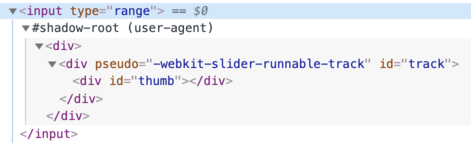

# Shadow DOM

Shadow DOM используется для инкапсуляции. Благодаря ему у компонента появляется своё собственное "теневое" DOM дерево, к которому не произойдёт случайного доступа из главного документа, и которое может иметь изолированные CSS-правила и т. д.

## Встроенный shadow DOM

Задумывались ли вы о том, как устроены и стилизованы сложные браузерные элементы управления?

Например `<input type="range">`:

<p>
<input type="range">
</p>

Браузер рисует их своими силами и по своему усмотрению. Их DOM структура обычно нам не видна, но в инструментах разработчика мы можем на неё посмотреть. К примеру, в Chrome для этого нужно активировать пункт "Show user agent shadow DOM".

После этого `<input type="range">` выглядит так:



То, что находится под `#shadow-root` - и называется "shadow DOM".

Мы не можем получить доступ к shadow DOM встроенных элементов с помощью обычных JavaScript вызовов или с помощью селекторов. Это не просто обычные потомки, это мощное средство инкапсуляции.

В примере выше можно заметить очень полезный атрибут `pseudo`. Он нестандартный, существует по историческим причинам. С его помощью можно стилизовать подэлементы через CSS, например, так:

```html run autorun
<style>
/* делаем цвет дорожки слайдера красным */
input::-webkit-slider-runnable-track {
  background: red;
}
</style>

<input type="range">
```

Ещё раз заметим, что `pseudo` – нестандартный атрибут. Если говорить хронологически, то сначала браузеры начали экспериментировать с инкапсуляцией DOM-структур внутренних элементов управления, а уже потом, через некоторое время, появился стандарт Shadow DOM, который позволяет делать то же самое нам, разработчикам.

Далее мы воспользуемся современным стандартом Shadow DOM, описанным в этой: [DOM spec](https://dom.spec.whatwg.org/#shadow-trees) и других спецификациях.

## Shadow tree

Каждый DOM элемент может иметь 2 типа поддеревьев DOM:

1. Light tree -- обычное DOM поддерево, состоящее из HTML потомков. Все поддеревья, о которых мы говорили в предыдущих главах, были "light".
2. Shadow tree -- скрытое DOM поддерево, не отражающееся в HTML, скрытое от посторонних глаз.

Если у элемента имеются оба поддерева, браузер отрисовывает только shadow дерево. Однако мы все же можем отрисовать смесь содержимого shadow и light деревьев. Позже в главе <info:slots-composition> мы рассмотрим детали.

Shadow дерево можно использовать в пользовательских элементах (Custom Elements), чтобы спрятать внутренности компонентов и применить локальные стили.

Например, этот `<show-hello>` элемент прячет свой внутренний DOM в shadow дереве:

```html run autorun height=60
<script>
customElements.define('show-hello', class extends HTMLElement {
  connectedCallback() {
    const shadow = this.attachShadow({mode: 'open'});
    shadow.innerHTML = `<p>
      Hello, ${this.getAttribute('name')}
    </p>`;
  }  
});
</script>

<show-hello name="John"></show-hello>
```

А вот как получившийся DOM выглядит в инструментах разработчика в Chrome, весь контент внутри "#shadow-root":


Итак, вызов `elem.attachShadow({mode: …})` создаёт shadow дерево.

Но есть два ограничения:
1. Для каждого элемента мы можем создать только один shadow root.
2. В качестве `elem` может быть использован пользовательский элемент (Custom Element), либо один из следующих элементов: "article", "aside", "blockquote", "body", "div", "footer", "h1..h6", "header", "main" "nav", "p", "section", или "span". Остальные, например, ``, не могут содержать shadow дерево.

Свойство `mode` задаёт уровень инкапсуляции. У него может быть только два значения:
- `"open"` -- shadow root доступен как `elem.shadowRoot`.

    Любой код может достучаться до shadow дерева элемента `elem`.   
- `"closed"` -- `elem.shadowRoot` всегда возвращает `null`.

    До теневого DOM в таком случае мы сможем добраться только по ссылке, которую возвращает `attachShadow` (и, скорее всего, она будет спрятана внутри класса). Нативные браузерные shadow деревья, такие как у `<input type="range">`, закрыты. До них не добраться.

Возвращаемый `attachShadow` [shadow root](https://dom.spec.whatwg.org/#shadowroot), подобен элементу,- мы можем воспользоваться `innerHTML` или методами DOM, такими как `append`, чтобы наполнить его.

Элемент с shadow root называется "shadow tree host" и доступен в качестве свойства `host` у shadow root:

```js
// при условии, что {mode: "open"}, иначе elem.shadowRoot равен null
alert(elem.shadowRoot.host === elem); // true
```

## Инкапсуляция

Shadow DOM отделён от главного документа:

1. Элементы Shadow DOM не видны из обычного DOM с помощью `querySelector`. В частности, элементы в Shadow DOM могут иметь такие же id, как у элементов в обычном DOM (light DOM). Они будут уникальными внутри shadow tree.
2. У Shadow DOM свои стили. Стили из внешнего DOM не применятся.

Например:

```html run untrusted height=40
<style>
*!*
  /* стили документа не применятся в shadow tree внутри #elem (1) */
*/!*
  p { color: red; }
</style>

<div id="elem"></div>

<script>
  elem.attachShadow({mode: 'open'});
*!*
    // у shadow tree свои стили (2)
*/!*
  elem.shadowRoot.innerHTML = `
    <style> p { font-weight: bold; } </style>
    <p>Hello, John!</p>
  `;

*!*
  // <p> виден только запросам внутри shadow tree (3)
*/!*
  alert(document.querySelectorAll('p').length); // 0
  alert(elem.shadowRoot.querySelectorAll('p').length); // 1
</script>  
```

1. Стили главного документа не влияют на shadow tree.
2. ...Но свои внутренние стили работают.
3. Чтобы добраться до элементов в shadow tree, нам нужно искать их изнутри самого дерева.

## Ссылки

- DOM: <https://dom.spec.whatwg.org/#shadow-trees>
- Совместимость: <https://caniuse.com/#feat=shadowdomv1>
- Shadow DOM упоминается во многих других спецификациях, например [DOM Parsing](https://w3c.github.io/DOM-Parsing/#the-innerhtml-mixin) указывает, что у shadow root есть `innerHTML`.


## Итого

Shadow DOM - это способ создать DOM с изолированными компонентами.

1. `shadowRoot = elem.attachShadow({mode: open|closed})` -- создаёт теневой DOM для `elem`. Если `mode="open"`, он доступен через свойство `elem.shadowRoot`.
2. Мы можем наполнить `shadowRoot` с помощью `innerHTML` или других методов DOM.

Элементы Shadow DOM:
- Обладают собственной областью видимости для id,
- Невидимы JavaScript селекторам из главного документа, таким как `querySelector`,
- Стилизуются своими стилями из shadow tree, не из главного документа.

Shadow DOM, если имеется, отрисовывается браузером вместо так называемого "light DOM" (обычные потомки). В главе <info:slots-composition> мы разберём, как их миксовать.
