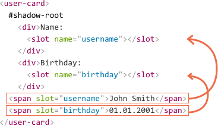

# Слоты теневого DOM, композиция

Многие типы компонентов, такие как вкладки, меню, галереи изображений и другие, требуют отображения контента.

Также как встроенный в браузер `<select>` ожидает получить контент пунктов `<option>`, компонент `<custom-tabs>` может ожидать, что будет передано фактическое содержимое вкладок, а `<custom-menu>` --  пунктов меню.

Код, использующий меню `<custom-menu>`, может выглядеть так:

```html
<custom-menu>
  <title>Сладости</title>
  <item>Леденцы</item>
  <item>Фруктовые тосты</item>
  <item>Кексы</item>
</custom-menu>
```

...Затем компонент должен правильно его отобразить -- как обычное меню с заданным названием и пунктами, обработать события меню и т.д.

Как это реализовать?

Можно попробовать проанализировать элемент и динамически скопировать и переставить DOM-узлы. Это возможно, но если мы будем перемещать элементы в теневой DOM, CSS-стили документа не будут применяться, и мы потеряем визуальное оформление. Кроме того, нужно будет писать дополнительный код.

К счастью, нам этого делать не нужно. Теневая модель документа поддерживает элементы `<slot>`, которые автоматически наполняются контентом из основного DOM-дерева.

## Именованные слоты

Давайте рассмотрим работу слотов на простом примере.

Теневой DOM `<user-card>` имеет два слота, заполненных из основного DOM:

```html run autorun="no-epub" untrusted height=80
<script>
customElements.define('user-card', class extends HTMLElement {
  connectedCallback() {
    this.attachShadow({mode: 'open'});
    this.shadowRoot.innerHTML = `
      <div>Имя:
*!*
        <slot name="username"></slot>
*/!*
      </div>
      <div>Дата рождения:
*!*
        <slot name="birthday"></slot>
*/!*
      </div>
    `;
  }
});
</script>

<user-card>
  <span *!*slot="username"*/!*>Иван Иванов</span>
  <span *!*slot="birthday"*/!*>01.01.2001</span>
</user-card>
```

В теневом DOM `<slot name="X">` определяет "точку вставки" -- место, где отображаются элементы с `slot="X"`.

Затем браузер выполняет "композицию": берёт элементы из основного  DOM-дерева и отображает их в соответствующих слотах теневого DOM-дерева. В результате мы получаем именно то, что хотели -- обобщённый компонент, который можно наполнить данными.

После выполнения скрипта структура DOM выглядит следующим образом (без учёта композиции):

```html
<user-card>
  #shadow-root
    <div>Имя:
      <slot name="username"></slot>
    </div>
    <div>Дата рождения:
      <slot name="birthday"></slot>
    </div>
  <span slot="username">Иван Иванов</span>
  <span slot="birthday">01.01.2001</span>
</user-card>
```

В этом нет ничего странного. Мы создали теневую модель документа, и вот она здесь. Теперь у элемента есть два DOM-дерева: основное и теневое.

Чтобы отобразить содержимое, для каждого `<slot name="...">` в теневом DOM браузер ищет `slot="..."` с таким же именем в основном DOM. Эти элементы отображаются внутри слотов:



В результате выстраивается так называемое "плоское" DOM-дерево:

```html
<user-card>
  #shadow-root
    <div>Имя:
      <slot name="username">
        <!-- элемент слота вставляется в слот как одно целое -->
        <span slot="username">Иван Иванов</span>
      </slot>
    </div>
    <div>Дата рождения:
      <slot name="birthday">
        <span slot="birthday">01.01.2001</span>
      </slot>
    </div>
</user-card>
```

...Но "плоское" DOM-дерево создаётся только для отображения контента и обработки событий. Это то, что мы видим на экране. Фактически расположение узлов не меняется.

Это можно легко проверить, запустив `querySelector`: все узлы находятся на своих местах.

```js
// узлы <span> основного DOM находятся в том же месте, в `<user-card>`
alert( document.querySelector('user-card span').length ); // 2
```

Это может показаться странным, но у теневого DOM-дерева со слотами  есть ещё один "уровень DOM" -- "плоский" DOM -- результат вставки слотов. Браузер его отображает и использует для наследования стилей и распространения событий. Но JavaScript всё равно видит документ "как есть" -- таким, какой он был до построения "плоского" DOM-дерева.

````warn header="Атрибут slot=\"...\" могут иметь только потомки верхнего уровня"
Атрибут `slot="..."` применяется только для прямых потомков ведущего элемента теневого дерева (в нашем примере это элемент `<user-card>`). Для вложенных элементов он игнорируется.

Например, здесь второй `<span>` игнорируется (так как он не является потомком верхнего уровня элемента `<user-card>`):
```html
<user-card>
  <span slot="username">Иван Иванов</span>
  <div>
    <!-- bad slot, not top-level: -->
    <span slot="birthday">01.01.2001</span>
  </div>
</user-card>
```

На практике нет смысла добавлять в слот глубоко вложенный элемент, поэтому это ограничение просто служит для правильного построения структуры DOM.
````

## Резервный контент слота

Если мы добавляем данные в `<slot>`, они становятся резервным контентом. Браузер отображает его, если в основном DOM-дереве отсутствуют данные.

Например, в этой части теневого дерева текст `Аноним` отображается, если в основном дереве нет значения `slot="username"`.

```html
<div>Имя:
  <slot name="username">Аноним</slot>
</div>
```

## Слот по умолчанию

Первый неименованный `<slot>` в теневом дереве является слотом по умолчанию. Он собирает данные со всех узлов основного дерева, не добавленные в другие слоты.

Например, давайте добавим слот по умолчанию в наш элемент `<user-card>`; он будет собирать всю информацию о пользователе, не занесённую в другие слоты:

```html run autorun="no-epub" untrusted height=140
<script>
customElements.define('user-card', class extends HTMLElement {
  connectedCallback() {
    this.attachShadow({mode: 'open'});
    this.shadowRoot.innerHTML = `
    <div>Имя:
      <slot name="username"></slot>
    </div>
    <div>Дата рождения:
      <slot name="birthday"></slot>
    </div>
    <fieldset>
      <legend>Другая информация</legend>
*!*
      <slot></slot>
*/!*
    </fieldset>
    `;
  }
});
</script>

<user-card>
*!*
  <div>Я люблю плавать.</div>
*/!*
  <span slot="username">Иван Иванов</span>
  <span slot="birthday">01.01.2001</span>
*!*
  <div>...И играть в волейбол!</div>
*/!*
</user-card>
```

Весь контент основного дерева, не добавленный в слоты, попадает в группу полей "Другая информация".

Элементы добавляются в слот по очереди, один за другим, поэтому оба элемента данных, которые не были добавлены в слоты, попадают в слот по умолчанию.

Плоское DOM-дерево выглядит так:

```html
<user-card>
  #shadow-root
    <div>Имя:
      <slot name="username">
        <span slot="username">Иван Иванов</span>
      </slot>
    </div>
    <div>Дата рождения:
      <slot name="birthday">
        <span slot="birthday">01.01.2001</span>
      </slot>
    </div>
    <fieldset>
      <legend>Обо мне</legend>
*!*
      <slot>
        <div>Привет!</div>
        <div>Я Иван!</div>
      </slot>
*/!*
    </fieldset>
</user-card>
```

## Пример меню

Давайте вернёмся к меню `<custom-menu>`, упомянутому в начале главы.

Мы можем использовать слоты для распределения элементов.

Вот разметка для меню `<custom-menu>`:

```html
<custom-menu>
  <span slot="title">Сладости</span>
  <li slot="item">Леденцы</li>
  <li slot="item">Фруктовые тосты</li>
  <li slot="item">Кексы</li>
</custom-menu>
```

Шаблон теневого DOM-дерева с правильными слотами:

```html
<template id="tmpl">
  <style> /* стили меню */ </style>
  <div class="menu">
    <slot name="title"></slot>
    <ul><slot name="item"></slot></ul>
  </div>
</template>
```

1. `<span slot="title">` попадает в `<slot name="title">`.
2. В шаблоне много элементов `<li slot="item">`, но только один `<slot name="item">`. Это совершенно нормально. Все элементы из `slot="item"` добавляются в `<slot name="item">` один за другим, формируя список.

Плоское DOM-дерево становится таким:

```html
<custom-menu>
  #shadow-root
    <style> /* стили меню */ </style>
    <div class="menu">
      <slot name="title">
        <span slot="title">Сладости</span>
      </slot>
      <ul>
        <slot name="item">
          <li slot="item">Леденцы</li>
          <li slot="item">Фруктовые тосты</li>
          <li slot="item">Кексы</li>
        </slot>
      </ul>
    </div>
</custom-menu>
```

Кто-то может сказать, что в валидном DOM-дереве тег `<li>` должен быть прямым потомком тега `<ul>`. Но так как это плоский DOM, который описывает то, как компонент отображается, то такая ситуация вполне закономерна.

Осталось только добавить обработчик `click` для открытия и закрытия списка, и меню `<custom-menu>` готово:

```js
customElements.define('custom-menu', class extends HTMLElement {
  connectedCallback() {
    this.attachShadow({mode: 'open'});

    // tmpl -- шаблон теневого DOM-дерева (выше)
    this.shadowRoot.append( tmpl.content.cloneNode(true) );

    // мы не можем выбрать узлы основного DOM, поэтому обработаем клики в слоте
    this.shadowRoot.querySelector('slot[name="title"]').onclick = () => {
      // открыть/закрыть меню
      this.shadowRoot.querySelector('.menu').classList.toggle('closed');
    };
  }
});
```

Вот полное демо:

[iframe src="menu" height=140 edit]

Конечно, мы можем добавить к меню другие функции: события, методы и т.д.

## Мониторинг слотов

Что если внешний код хочет динамически добавить или удалить пункты меню?

**Браузер выполняет мониторинг слотов и обновляет отображение при добавлении и удалении элементов в слотах.**

Также, так как узлы основного DOM-дерева не копируются, а только отображаются в слотах, изменения внутри них сразу же становятся видны.

Таким образом, нам ничего не нужно делать для обновления отображения. Но если компонент хочет узнать об изменениях в слотах, можно использовать событие `slotchange`.

Например, здесь пункт меню вставляется динамически через 1 секунду, и заголовок меняется через 2 секунды:

```html run untrusted height=80
<custom-menu id="menu">
  <span slot="title">Сладости</span>
</custom-menu>

<script>
customElements.define('custom-menu', class extends HTMLElement {
  connectedCallback() {
    this.attachShadow({mode: 'open'});
    this.shadowRoot.innerHTML = `<div class="menu">
      <slot name="title"></slot>
      <ul><slot name="item"></slot></ul>
    </div>`;

    // shadowRoot не может иметь обработчиков событий, поэтому используется первый потомок
    this.shadowRoot.firstElementChild.addEventListener('slotchange',
      e => alert("slotchange: " + e.target.name)
    );
  }
});

setTimeout(() => {
  menu.insertAdjacentHTML('beforeEnd', '<li slot="item">Леденцы</li>')
}, 1000);

setTimeout(() => {
  menu.querySelector('[slot="title"]').innerHTML = "Новое меню";
}, 2000);
</script>
```

Отображение меню обновляется каждый раз без нашего вмешательства.

Здесь есть два события `slotchange`:

1. При инициализации:

    `slotchange: title` запускается сразу же, как только `slot="title"` из основного дерева попадает в соответствующий слот.
2. Через 1 секунду:

    `slotchange: item` запускается, когда добавляется новый элемент `<li slot="item">`.

Обратите внимание, что событие `slotchange` не запускается через 2 секунды, когда меняется контент `slot="title"`. Это происходит потому, что сам слот не меняется. Мы изменяем только контент элемента, который находится в слоте, а это совсем другое.

Если мы хотим отслеживать внутренние изменения основного DOM-дерева из JavaScript, можно также использовать более обобщённый механизм: [MutationObserver](info:mutation-observer).

## API слотов

Наконец, давайте поговорим о методах JavaScript, связанных со слотами.

Как мы видели раньше, JavaScript смотрит на "реальный", а не на плоский DOM. Но если у теневого дерева есть `{mode: 'open'}`, мы можем выяснить, какие элементы находятся в слоте, и наоборот, определить слот по элементу, который в нём находится:

- `node.assignedSlot` -- возвращает элемент `<slot>`, в котором находится `node`.
- `slot.assignedNodes({flatten: true/false})` -- DOM-узлы, которые находятся в слоте. Опция `flatten` имеет значение по умолчанию `false`. Если явно изменить значение на `true`, она просматривает плоский DOM глубже и возращает вложенные слоты, если есть вложенные компоненты, и резервный контент, если в слоте нет узлов.
- `slot.assignedElements({flatten: true/false})` -- DOM-элементы, которые находятся в слоте (так же, как описано выше, но только по отношению к узлам элементов).

Эти методы можно использовать не только для отображения контента, который находится в слотах, но и для его отслеживания в JavaScript.

Например, если компонент `<custom-menu>` хочет знать, что он показывает, он должен отследить событие `slotchange` и получить пункты меню из `slot.assignedElements`:

```html run untrusted height=120
<custom-menu id="menu">
  <span slot="title">Сладости</span>
  <li slot="item">Леденцы</li>
  <li slot="item">Фруктовые тосты</li>
</custom-menu>

<script>
customElements.define('custom-menu', class extends HTMLElement {
  items = []

  connectedCallback() {
    this.attachShadow({mode: 'open'});
    this.shadowRoot.innerHTML = `<div class="menu">
      <slot name="title"></slot>
      <ul><slot name="item"></slot></ul>
    </div>`;

    // контент слота добавляется/удаляется/заменяется
*!*
    this.shadowRoot.firstElementChild.addEventListener('slotchange', e => {
      let slot = e.target;
      if (slot.name == 'item') {
        this.items = slot.assignedElements().map(elem => elem.textContent);
        alert("Items: " + this.items);
      }
    });
*/!*
  }
});

// items update after 1 second
setTimeout(() => {
  menu.insertAdjacentHTML('beforeEnd', '<li slot="item">Кексы</li>')
}, 1000);
</script>
```


## Итого

С помощью слотов можно отображать потомков основного DOM-дерева в теневом DOM.

Существует два вида слотов:

- Именованные слоты: `<slot name="X">...</slot>` -- получают контент потомков с `slot="X"`.
- Слот по умолчанию: первый `<slot>` без имени (последующие неименованные слоты игнорируются) -- получает контент потомков основного дерева, которые не находятся в слотах.
- Если одному слоту назначено несколько элементов, они добавляются один за другим.
- Содержимое элемента `<slot>` используется как резервный контент. Он отображается, если в слоте нет потомков основного дерева.

Процесс отображения элементов внутри слота называется "композицией". В результате композиции строится "плоский DOM".

При композиции не происходит перемещения узлов -- с точки зрения JavaScript, DOM остаётся прежним.

JavaScript может получить доступ к слотам с помощью следующих методов:
- `slot.assignedNodes/Elements()` -- возвращает узлы/элементы, которые находятся внутри `slot`.
- `node.assignedSlot` -- обратный метод, возвращает слот по узлу.

Если мы хотим знать, что показываем, мы можем отследить контент слота следующими способами:
- событие `slotchange` -- запускается, когда слот наполняется контентом в первый раз, и при каждой операции добавления/удаления/замещения элемента в слоте, за исключением его потомков. Слот -- это `event.target`.
- [MutationObserver](info:mutation-observer) для более глубокого просмотра контента и отслеживания его изменений.

Теперь, когда элементы из основного DOM находятся в теневом DOM, давайте посмотрим, как их правильно стилизовать. Основное правило звучит так: теневые элементы стилизуются внутри, а основные элементы -- снаружи; однако есть заметные исключения.

Мы рассмотрим их подробно в следующей главе.
