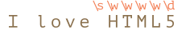

# Символьные классы

<<<<<<< HEAD
Рассмотрим практическую задачу - у нас есть номер телефона вида `"+7(903)-123-45-67"`, и нам нужно превратить его в строку только из чисел: `79035419441`.
=======
Consider a practical task -- we have a phone number like `"+7(903)-123-45-67"`, and we need to turn it into pure numbers: `79031234567`.
>>>>>>> 162280b6d238ce32bbd8ff7a3f7992be82c2311a

Для этого мы можем найти и удалить все, что не является числом. С этим нам помогут символьные классы.

*Символьный класс* - это специальное обозначение, которое соответствует любому символу из определённого набора.

Для начала давайте рассмотрим класс "цифра". Он обозначается как `pattern:\d` и в регулярном выражении соответствует "любой одной цифре".

Например, давайте найдём первую цифру в номере телефона:

```js run
let str = "+7(903)-123-45-67";

let regexp = /\d/;

alert( str.match(regexp) ); // 7
```

Без флага `pattern:g` регулярное выражение ищет только первое совпадение, то есть первую цифру `pattern:\d`.

Давайте добавим флаг `pattern:g`, чтобы найти все цифры:

```js run
let str = "+7(903)-123-45-67";

let regexp = /\d/g;

alert( str.match(regexp) ); // массив совпадений: 7,9,0,3,1,2,3,4,5,6,7

<<<<<<< HEAD
// и можно сделать из них уже чисто цифровой номер телефона
alert( str.match(regexp).join('') ); // 79035419441
=======
// let's make the digits-only phone number of them:
alert( str.match(regexp).join('') ); // 79031234567
>>>>>>> 162280b6d238ce32bbd8ff7a3f7992be82c2311a
```

Это был символьный класс для цифр. Есть и другие символьные классы.

Наиболее используемые:

`pattern:\d` ("d" от английского "digit" означает "цифра")
: Цифра: символ от `0` до `9`.

`pattern:\s` ("s": от английского "space" – "пробел")
: Пробельные символы: включает в себя символ пробела, табуляции `\t`, перевода строки `\n` и некоторые другие редкие пробельные символы, обозначаемые как `\v`, `\f` и `\r`.

`pattern:\w` ("w": от английского "word" – "слово")
: Символ "слова", а точнее – буква латинского алфавита или цифра или подчёркивание `_`. Нелатинские буквы не являются частью класса `pattern:\w`, то есть буква русского алфавита не подходит.

Для примера, `pattern:\d\s\w` обозначает "цифру", за которой идёт пробельный символ, а затем символ слова, например `match:1 a`.

**Регулярное выражение может содержать как обычные символы, так и символьные классы.**

Например, `pattern:CSS\d` соответствует строке `match:CSS` с цифрой после неё:

```js run
let str = "Есть ли стандарт CSS4?";
let regexp = /CSS\d/

alert( str.match(regexp) ); // CSS4
```

Также мы можем использовать несколько символьных классов:

```js run
alert( "I love HTML5!".match(/\s\w\w\w\w\d/) ); // ' HTML5'
```

Соответствие (каждому символьному классу соответствует один символ результата):



## Обратные символьные классы

Для каждого символьного класса существует "обратный класс", обозначаемый той же буквой, но в верхнем регистре.

"Обратный" означает, что он соответствует всем другим символам, например:

`pattern:\D`
: Не цифра: любой символ, кроме `pattern:\d`, например буква.

`pattern:\S`
: Не пробел: любой символ, кроме `pattern:\s`, например буква.

`pattern:\W`
: Любой символ, кроме `pattern:\w`, то есть не буквы из латиницы, не знак подчёркивания и не цифра. В частности, русские буквы принадлежат этому классу.

Мы уже видели, как сделать чисто цифровой номер из строки вида `subject:+7(903)-123-45-67`:  найти все цифры и соединить их.

```js run
let str = "+7(903)-123-45-67";

alert( str.match(/\d/g).join('') ); // 79031234567
```

Альтернативный, более короткий путь - найти нецифровые символы `pattern:\D` и удалить их из строки:


```js run
let str = "+7(903)-123-45-67";

alert( str.replace(/\D/g, "") ); // 79031234567
```

<<<<<<< HEAD
## Точка - это любой символ
=======
## A dot is "any character"
>>>>>>> 162280b6d238ce32bbd8ff7a3f7992be82c2311a

Точка `pattern:.` - это специальный символьный класс, который соответствует "любому символу, кроме новой строки".

Для примера:

```js run
alert( "Ю".match(/./) ); // Ю
```

Или в середине регулярного выражения:

```js run
let regexp = /CS.4/;

alert( "CSS4".match(regexp) ); // CSS4
alert( "CS-4".match(regexp) ); // CS-4
alert( "CS 4".match(regexp) ); // CS 4 (пробел тоже является символом)
```

Обратите внимание, что точка означает "любой символ", но не "отсутствие символа". Там должен быть какой-либо символ, чтобы соответствовать условию поиска:

```js run
alert( "CS4".match(/CS.4/) ); // null, нет совпадений потому что нет символа для точки
```

### Точка как буквально любой символ, с флагом "s"

<<<<<<< HEAD
Обычно точка не соответствует символу новой строки `\n`.
=======
By default, a dot doesn't match the newline character `\n`.
>>>>>>> 162280b6d238ce32bbd8ff7a3f7992be82c2311a

То есть, регулярное выражение `pattern:A.B` будет искать символ `match:A` и затем `match:B`, с любым символом между ними, кроме перевода строки `\n`:

```js run
alert( "A\nB".match(/A.B/) ); // null (нет совпадения)
```

Но во многих ситуациях точкой мы хотим обозначить действительно "любой символ", включая перевод строки.

Как раз для этого нужен флаг `pattern:s`. Если регулярное выражение имеет его, то точка `pattern:.` соответствует буквально любому символу:

```js run
alert( "A\nB".match(/A.B/s) ); // A\nB (совпадение!)
```

<<<<<<< HEAD
````warn header="Внимание, пробелы!"
Обычно мы уделяем мало внимания пробелам. Для нас строки `subject:1-5` и `subject: 1 - 5` практически идентичны.
=======
````warn header="Not supported in Firefox, IE, Edge"
Check <https://caniuse.com/#search=dotall> for the most recent state of support. At the time of writing it doesn't include Firefox, IE, Edge.

Luckily, there's an alternative, that works everywhere. We can use a regexp like `pattern:[\s\S]` to match "any character".

```js run
alert( "A\nB".match(/A[\s\S]B/) ); // A\nB (match!)
```

The pattern `pattern:[\s\S]` literally says: "a space character OR not a space character". In other words, "anything". We could use another pair of complementary classes, such as `pattern:[\d\D]`, that doesn't matter. Or even the `pattern:[^]` -- as it means match any character except nothing.

Also we can use this trick if we want both kind of "dots" in the same pattern: the actual dot `pattern:.` behaving the regular way ("not including a newline"), and also a way to match "any character" with `pattern:[\s\S]` or alike.
````

````warn header="Pay attention to spaces"
Usually we pay little attention to spaces. For us strings `subject:1-5` and `subject:1 - 5` are nearly identical.
>>>>>>> 162280b6d238ce32bbd8ff7a3f7992be82c2311a

Но если регулярное выражение не учитывает пробелы, оно может не сработать.

Давайте попробуем найти цифры, разделённые дефисом:

```js run
alert( "1 - 5".match(/\d-\d/) ); // null, нет совпадения!
```

Исправим это, добавив пробелы в регулярное выражение `pattern:\d - \d`:

```js run
alert( "1 - 5".match(/\d - \d/) ); // 1 - 5, теперь работает
// или можно использовать класс \s:
alert( "1 - 5".match(/\d\s-\s\d/) ); // 1 - 5, тоже работает
```

**Пробел - это символ. Такой же важный, как любой другой.**

Нельзя просто добавить или удалить пробелы из регулярного выражения, и ожидать, что оно будет также работать.

Другими словами, в регулярном выражении все символы имеют значение, даже пробелы.
````

## Итого

Существуют следующие символьные классы:

- `pattern:\d` -- цифры.
- `pattern:\D` -- не цифры.
- `pattern:\s` -- пробельные символы, табы, новые строки.
- `pattern:\S` -- все, кроме `pattern:\s`.
- `pattern:\w` -- латиница, цифры, подчёркивание `'_'`.
- `pattern:\W` -- все, кроме `pattern:\w`.
- `pattern:.` -- любой символ, если с флагом регулярного выражения `pattern:s`, в противном случае любой символ, кроме перевода строки `\n`.

...Но это не всё!

В кодировке Юникод, которую JavaScript использует для строк, каждому символу соответствует ряд свойств, например - какого языка это буква (если буква), является ли символ знаком пунктуации, и т.п.

Можно искать, в том числе, и по этим свойствам. Для этого нужен флаг `pattern:u`, который мы рассмотрим в следующей главе.
