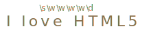

# Символьные классы

Рассмотрим практическую задачу - у нас есть номер телефона `"+7(903)-123-45-67"`, и нам нужно превратить его в строку только из чисел: `79035419441`.

Для этого мы можем найти и удалить все, что не является числом. Символьные классы могут помочь с этим.

Символьный класс - это специальное обозначение, которое соответствует любому символу из определённого набора.

Для начала давайте рассмотрим класс "цифра". Он обозначается как `\d`. Мы помещаем это обозначение в регулярное выражение, что соответствует "любой одной цифре".

Например, давайте найдём первую цифру в номере телефона:

```js run
let str = "+7(903)-123-45-67";

let reg = /\d/;

alert( str.match(reg) ); // 7
```

Без флага `g` регулярное выражение ищет только первое совпадение, то есть первую цифру `\d`.

Давайте добавим флаг `g`, чтобы найти все цифры:

```js run
let str = "+7(903)-123-45-67";

let reg = /\d/g;

alert( str.match(reg) ); // массив совпадений: 7,9,0,3,1,2,3,4,5,6,7

alert( str.match(reg).join('') ); // 79035419441
```

Это был символьный класс для цифр. Есть и другие подобные классы.

Наиболее используемые:

`\d` ("d" от английского "digit" означает "цифра")
: Цифра: символ от `0` до `9`.

`\s` ("s": от английского "space" – "пробел")
: Символ пробела: включает пробелы, символы табуляции, переводы строк.

`\w` ("w": от английского "word" – "слово")
: Символ «слова», а точнее – буква латинского алфавита или цифра или подчёркивание '_'. Нелатинские буквы не являются частью `\w`, то есть буква русского алфавита не подходит.

Для примера, `pattern:\d\s\w` обозначает "цифру", за которой идёт пробельный символ, а затем символ слова, как в строке `"1 a"`.

**Регулярное выражение может содержать как обычные символы, так и символьные классы.**

Например, `pattern:CSS\d` соответствует строке `match:CSS` с цифрой после неё:

```js run
let str = "Стандарт CSS4 - это здорово";
let reg = /CSS\d/

alert( str.match(reg) ); // CSS4
```

Также мы можем использовать несколько символьных классов одновременно:

```js run
alert( "I love HTML5!".match(/\s\w\w\w\w\d/) ); // ' HTML5'
```

Соответствие (каждому символьному классу соответствует один символ результата):



## Граница слова: \b

Граница слова `pattern:\b` - это специальный символьный класс.

Он обозначает не какой-то конкретный символ, а границу между символами.

Например, `pattern:\bJava\b` соответствует` match:Java` в строке `subject:Hello, Java!`, но не в скрипте `subject: Hello, JavaScript!`.

```js run
alert( "Hello, Java!".match(/\bJava\b/) ); // Java
alert( "Hello, JavaScript!".match(/\bJava\b/) ); // null
```

Граница имеет "нулевую ширину" в том смысле, что обычно символьный класс означает символ в результате (например, букву или цифру), но не в этом случае.

Граница – это проверка.

Когда механизм регулярных выражений выполняет поиск, он перемещается по строке в попытке найти совпадение. В каждой позиции строки он пытается найти шаблон.

Когда шаблон содержит `pattern:\b`, он проверяет, что позиция в строке является границей слова, то есть одним из трёх вариантов:

<<<<<<< HEAD
- Внутри текста, если с одной стороны `\w`, а с другой – не `\w`.
- Начало текста, если первый символ `\w`.
- Конец текста, если последний символ `\w`.
=======
There are three different positions that qualify as word boundaries:

- At string start, if the first string character is a word character `\w`.
- Between two characters in the string, where one is a word character `\w` and the other is not.
- At string end, if the last string character is a word character `\w`.
>>>>>>> 8c30654f694fe8682f5631809980be931ee4ed72

Например, в строке `subject:Hello, Java!` Следующие позиции соответствуют `\b`:


Так что это соответствует `pattern:\bHello\b`, потому что:

<<<<<<< HEAD
1. В начале строки совпадает первый тест `\b`.
2. Далее слово `Hello` совпадает.
3. Далее `\b` снова совпадает, так как мы находимся между `o` и пробелом.
=======
1. At the beginning of the string the first `\b` test matches.
2. Then the word `Hello` matches.
3. Then `\b` matches, as we're between `o` (a word character) and a space (not a word character).
>>>>>>> 8c30654f694fe8682f5631809980be931ee4ed72

Pattern `pattern:\bJava\b` также совпадает. Но не `pattern:\bHell\b` (потому что после `l` нет границы слова), и не `Java!\b` (потому что восклицательный знак не является словесным символом, поэтому после него нет границы слова).

```js run
alert( "Hello, Java!".match(/\bHello\b/) ); // Hello
alert( "Hello, Java!".match(/\bJava\b/) );  // Java
alert( "Hello, Java!".match(/\bHell\b/) );  // null (нет совпадения)
alert( "Hello, Java!".match(/\bJava!\b/) ); // null (нет совпадения)
```

Ещё раз отметим, что `pattern:\b` заставляет поисковую систему проверять границы, поэтому `pattern:Java\b` находит `match:Java` только тогда, когда за ней следует граница слова, но не добавляет этот символ к результату.

Обычно мы используем `\b`, чтобы найти отдельные английские слова. Таким образом, если нам нужен `"Java"` язык, то `pattern:\bJava\b` находит только отдельное слово и ничего не находит, когда оно является частью, как в `"JavaScript"`.

Другой пример: регулярное выражение `pattern:\b\d\d\b` ищет отдельно стоящие двузначные числа. Другими словами, требуется, чтобы до и после `pattern:\d\d` был символ, отличный от `\w` (или начало/конец строки)

```js run
alert( "1 23 456 78".match(/\b\d\d\b/g) ); // 23,78
```

```warn header="Граница слова не работает для алфавитов, не основанных на латинице"
Проверка границы слова `\b` проверяет границу между `\w` и чем-то ещё. Но `\w` означает английскую букву (или цифру или знак подчёркивания), поэтому тест не будет работать для других символов (например, кириллицы или иероглифов).

Позже мы придём к символьным классам для работы с Юникодом, которые позволяют решать похожие задачи для разных языков.
```


## Обратные символьные классы

Для каждого символьного класса существует "обратный класс", обозначаемый той же буквой, но в верхнем регистре.

"Обратный" означает, что он соответствует всем другим символам, например:

`\D`
: Не цифра: любой символ, кроме `\d`, например буква.

`\S`
: Не пробел: любой символ, кроме `\s`, например буква.

`\W`
: Любой символ, кроме `\w`, то есть не буквы из латиницы, не знак подчёркивания и не цифра. В частности, русские буквы принадлежат этому классу.

`\B`
: Проверка, обратная `\b`.

В начале главы мы увидели, как получить все цифры из строки с номером телефона `subject:+7(903)-123-45-67`.

Один из способов - это сопоставить все цифры и соединить их:

```js run
let str = "+7(903)-123-45-67";

alert( str.match(/\d/g).join('') ); // 79031234567
```

Альтернативный, более короткий путь - найти нецифровые символы `\D` и удалить их из строки:


```js run
let str = "+7(903)-123-45-67";

alert( str.replace(/\D/g, "") ); // 79031234567
```

## Пробелы – обычные символы

Обычно мы уделяем мало внимания пробелам. Для нас строки `subject:1-5` и `subject: 1 - 5` практически идентичны.

Но если регулярное выражение не учитывает пробелы, оно может не работать.

Давайте попробуем найти цифры, разделённые тире:

```js run
alert( "1 - 5".match(/\d-\d/) ); // null, нет совпадения!
```

Здесь мы исправляем это, добавляя пробелы в регулярное выражение `pattern:\d - \d`:

```js run
alert( "1 - 5".match(/\d - \d/) ); // 1 - 5, теперь это работает
```

**Пробел - это символ. По важности он равен любому другому символу.**

Конечно, пробелы в регулярных выражениях нужны только в том случае, если мы их ищем. Лишние пробелы (как и любые другие лишние символы) могут помешать совпадению:

```js run
alert( "1-5".match(/\d - \d/) ); // null, потому что строка '1-5' не содержит пробелов
```

Другими словами, в регулярном выражении все символы имеют значение, даже пробелы.

## Точка - это любой символ

Точка `"."` - это специальный символьный класс, который соответствует "любому символу, кроме новой строки".

Для примера:

```js run
alert( "Ю".match(/./) ); // Ю
```

Или в середине регулярного выражения:

```js run
let reg = /CS.4/;

alert( "CSS4".match(reg) ); // CSS4
alert( "CS-4".match(reg) ); // CS-4
alert( "CS 4".match(reg) ); // CS 4 (пробел тоже является символом)
```

Обратите внимание, что точка означает "любой символ", но не "отсутствие символа". Там должен быть какой-либо символ, чтобы соответствовать условию поиска:

```js run
alert( "CS4".match(/CS.4/) ); // null, нет совпадений потому что нет символа соответствующего точке
```

### Точка, как буквально любой символ, с флагом "s"

Обычно точка не соответствует символу новой строки.

Для примера, `pattern:A.B` соответствует `match:A` и далее `match:B`, с любым символом между ними, кроме новой строки.

Например, ниже в результате нет совпадений:

```js run
alert( "A\nB".match(/A.B/) ); // null (нет совпадения)

// будут соответствовать пробел или буква, но не \n
```

Иногда это неудобно, мы действительно хотим "любой символ", включая перевод строки.

Это то, что делает флаг `s`. Если регулярное выражение имеет его, то точка `"."` соответствует буквально любому символу:

```js run
alert( "A\nB".match(/A.B/s) ); // A\nB (совпадение!)
```

## Итого

Существуют следующие символьные классы:

- `pattern:\d` -- цифры.
- `pattern:\D` -- не цифры.
- `pattern:\s` -- пробельные символы, табы, новые строки.
- `pattern:\S` -- все, кроме `pattern:\s`.
- `pattern:\w` -- латиница, цифры, подчёркивание `'_'`.
- `pattern:\W` -- все, кроме `pattern:\w`.
- `pattern:.` -- любой символ, если с флагом регулярного выражения `'s'`, в противном случае любой, кроме символа новой строки.

...Но это не все!

В кодировке Unicode, которую JavaScript использует для строк, каждому символу соответствует ряд свойств, например - какого языка это буква, является ли символ знаком пунктуации, и т.п.

Современный JavaScript позволяет использовать эти свойства в регулярном выражении для поиска, например:

- Кириллица: `pattern:\p{Script=Cyrillic}` или `pattern:\p{sc=Cyrillic}`.
- Тире (будь то короткое `-` или длинное тире `—`): `pattern:\p{Dash_Punctuation}` или `pattern:\p{pd}`.
- Обозначение валюты, как например, `pattern:\p{Currency_Symbol}` или `pattern:\p{sc}`.
- ...И многое другое. Юникод имеет много категорий символов, которые мы можем выбрать.

Для работы этих шаблонов необходим флаг регулярного выражения `'u'`. Подробнее об этом в главе [](info:regexp-unicode).
