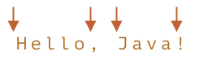

# Граница слова: \b

Граница слова `pattern:\b` - проверка, как `pattern:^` и `pattern:$`.

Когда движок регулярных выражений (программный модуль, реализующий поиск по регулярным выражениям) видит `pattern:\b`, он проверяет, что позиция в строке является границей слова.

Есть три вида позиций, которые являются границами слова:

- Начало текста, если его первый символ `pattern:\w`.
- Позиция внутри текста, если слева находится `pattern:\w`, а справа – не `pattern:\w`, или наоборот.
- Конец текста, если его последний символ `pattern:\w`.

Например, регулярное выражение `pattern:\bJava\b` будет найдено в строке `subject:Hello, Java!`, где `subject:Java` - отдельное слово, но не будет найдено в строке `subject:Hello, JavaScript!`.

```js run
alert( "Hello, Java!".match(/\bJava\b/) ); // Java
alert( "Hello, JavaScript!".match(/\bJava\b/) ); // null
```

В строке `subject:Hello, Java!` следующие позиции соответствуют `pattern:\b`:



Так что она соответствует регулярному выражению `pattern:\bHello\b`, потому что:

1. В начале строки совпадает первая проверка `pattern:\b`.
2. Далее слово `pattern:Hello` совпадает.
3. Далее проверка `pattern:\b` - снова совпадает, так как мы находимся между `subject:o` и пробелом.

Шаблон `pattern:\bJava\b` также совпадёт. Но не `pattern:\bHell\b` (потому что после `subject:l` нет границы слова), и не `pattern:Java!\b` (восклицательный знак не является "символом слова" `pattern:\w`, поэтому после него нет границы слова).

```js run
alert( "Hello, Java!".match(/\bHello\b/) ); // Hello
alert( "Hello, Java!".match(/\bJava\b/) );  // Java
alert( "Hello, Java!".match(/\bHell\b/) );  // null (нет совпадения)
alert( "Hello, Java!".match(/\bJava!\b/) ); // null (нет совпадения)
```

Мы можем использовать `pattern:\b` не только со словами, но и с цифрами.

Например, регулярное выражение `pattern:\b\d\d\b` ищет отдельно стоящие двузначные числа. Другими словами, оно требует, чтобы и до и после `pattern:\d\d` были символы, отличные от `pattern:\w`, такие как пробелы или пунктуация (или начало/конец текста).

```js run
alert( "1 23 456 78".match(/\b\d\d\b/g) ); // 23,78
alert( "12,34,56".match(/\b\d\d\b/g) ); // 12,34,56
```

```warn header="Граница слова `pattern:\b` не работает для алфавитов, не основанных на латинице"
Проверка границы слова `pattern:\b` проверяет границу, должно быть `pattern:\w` с одной стороны и "не `pattern:\w`" - с другой.

Но `pattern:\w` означает латинскую букву (или цифру или знак подчёркивания), поэтому проверка не будет работать для других символов, например, кириллицы или иероглифов).
```
