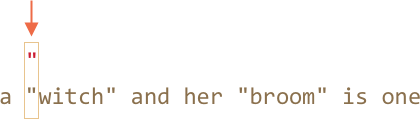
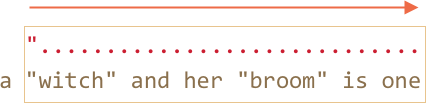

# Жадные и ленивые квантификаторы

На первый взгляд квантификаторы очень просты, но на самом деле, всё не так просто.

Нужно очень хорошо разбираться, как работает поиск, если планируешь использовать что-то более сложное, чем: `pattern:/\d+/`.

Давайте, в качестве примера, рассмотрим следующую задачу:

У нас есть текст, в котором нужно заменить все кавычки `"..."` на "ёлочки": `«...»`. Которые используются в типографике многих стран.

Например: `"Привет, мир"` должно превратиться в `«Привет, мир»`. Некоторые страны предпочитают другие кавычки, вроде `„Witam, świat!”` (польский) или `「你好，世界」` (китайский), но для нашей задачи давайте выберем `«...»`.

Первое, что нам нужно, это найти строки с кавычками, а затем -- мы можем их заменить.

Регулярное выражение вроде `pattern:/".+"/g` (кавычка, какой-то текст, другая кавычка) может выглядеть хорошим решением, но это не так!

Давайте проверим это:

```js run
let reg = /".+"/g;

let str = 'a "witch" and her "broom" is one';

alert( str.match(reg) ); // "witch" and her "broom"
```

...Как мы видим, это работает не как задумано!

Вместо того, чтобы найти два совпадения `match:"width"` и `match:"broom"`, было найдено одно:`match:"witch" and her "broom"`. 

Это можно описать, как "жадность -- причина всех зол".

## Жадный поиск

Чтобы найти совпадение, движок регулярного выражения следует следующему алгоритму:

- Для каждой позиции в строке
    - Совпадение шаблона на текущей позиции
    - Если нет совпадения, переход к следующей позиции

Эти общие слова никак не объясняют, почему регулярное выражение работает неправильно, так что давайте разберём подробно, как работает шаблон `pattern:".+"`.

1. Первый символ шаблона -- это кавычка `pattern:"`.

    Движок регулярного выражения пытается найти его на нулевой позиции исходной строки `subject:a "witch" and her "broom" is one`, но там находится `subject:a`, так что совпадения сразу нет.

    Затем он продолжает: двигается к следующей позиции исходной строки и пытается найти первый символ шаблона там. И, наконец, находит кавычку на третьей позиции:

    

2. Кавычка замечена, после чего движок пытается найти совпадение для оставшегося шаблона. Пытается увидеть, удовлетворяет ли остаток строки шаблону `pattern:.+"`.

    В нашем случае следующий символ шаблона: `pattern:.` (точка). Она обозначает "любой символ, кроме новой строки", так что следующая буква строки `match:'w'` подходит.

    

3. Затем точка повторяется из-за квантификатора `pattern:.+`. Движок регулярного выражения строит совпадение, беря символы один за другим, пока это возможно.

      ...Когда же это перестанет быть возможным? Точке соответствуют любые символы, так что движок остановется только тогда, когда достигнет конца строки: 

    

4. Тогда движок перестанет повторяться для `pattern:.+` и попробует найти следующий символ шаблона. Это кавычка `pattern:"`. Но есть проблема: строка закончилась, больше нет символов!

    Движок регулярного выражения понимает, что захватил слишком много `pattern:.+` и начинает *отступать*.

    Другими словами, он сокращает совпадение по квантификатору на один символ:

    

    Теперь он предполагает, что `pattern:.+` заканчивается за один символ до конца строки и пытается сопоставить остаток шаблона для этой позиции.

    Если бы тут была кавычка, тогда бы работа закончилась, но последний символ -- это `subject:'e'`, так что он не подходит.

5. ...Поэтому движок уменьшает количество повторений `pattern:.+` на ещё один символ:

    

    Кавычка `pattern:'"'`не соответствует `subject:'n'`.

6. Движок продолжает отступать: он уменьшает количество повторений `pattern:'.'` пока оставшийся шаблон (в нашем случае `pattern:'"'`) не совпадёт:

    

7. Совпадение найдено.

8. Так что первое совпадение: `match:"witch" and her "boom"`. Дальнейший поиск продолжается с того места, где закончился предыдущий, в оставшейся строке `subject:is one` нет кавычек, так что совпадений больше нет.

Это определённо не то, что мы ожидали. Но так оно работает.

**В жадном режиме (по умолчанию) квантификатор повторяется столько раз, сколько это возможно.**

Движок регулярного выражения пытается получить максимальное количество символов соответствующих `pattern:.+`, а потом сократить это количество символ за символом.

Для нашей задачи мы хотим другого. Именно для этого и создан "ленивый" квантификатор.

## Lazy mode

The lazy mode of quantifier is an opposite to the greedy mode. It means: "repeat minimal number of times".

We can enable it by putting a question mark `pattern:'?'` after the quantifier, so that it becomes  `pattern:*?` or `pattern:+?` or even `pattern:??` for `pattern:'?'`.

To make things clear: usually a question mark `pattern:?` is a quantifier by itself (zero or one), but if added *after another quantifier (or even itself)* it gets another meaning -- it switches the matching mode from greedy to lazy.

The regexp `pattern:/".+?"/g` works as intended: it finds `match:"witch"` and `match:"broom"`:

```js run
let reg = /".+?"/g;

let str = 'a "witch" and her "broom" is one';

alert( str.match(reg) ); // witch, broom
```

To clearly understand the change, let's trace the search step by step.

1. The first step is the same: it finds the pattern start `pattern:'"'` at the 3rd position:

    

2. The next step is also similar: the engine finds a match for the dot `pattern:'.'`:

    

3. And now the search goes differently. Because we have a lazy mode for `pattern:+?`, the engine doesn't try to match a dot one more time, but stops and tries to match the rest of the pattern  `pattern:'"'` right now:

    

    If there were a quote there, then the search would end, but there's `'i'`, so there's no match.
4. Then the regular expression engine increases the number of repetitions for the dot and tries one more time:

    

    Failure again. Then the number of repetitions is increased again and again...
5. ...Till the match for the rest of the pattern is found:

    

6. The next search starts from the end of the current match and yield one more result:

    

In this example we saw how the lazy mode works for `pattern:+?`. Quantifiers `pattern:+?` and `pattern:??` work the similar way -- the regexp engine increases the number of repetitions only if the rest of the pattern can't match on the given position.

**Laziness is only enabled for the quantifier with `?`.**

Other quantifiers remain greedy.

For instance:

```js run
alert( "123 456".match(/\d+ \d+?/g) ); // 123 4
```

1. The pattern `pattern:\d+` tries to match as many numbers as it can (greedy mode), so it finds  `match:123` and stops, because the next character is a space `pattern:' '`.
2. Then there's a space in pattern, it matches.
3. Then there's `pattern:\d+?`. The quantifier is in lazy mode, so it finds one digit `match:4` and tries to check if the rest of the pattern matches from there.

    ...But there's nothing in the pattern after `pattern:\d+?`.

    The lazy mode doesn't repeat anything without a need. The pattern finished, so we're done. We have a match `match:123 4`.
4. The next search starts from the character `5`.

```smart header="Optimizations"
Modern regular expression engines can optimize internal algorithms to work faster. So they may work a bit different from the described algorithm.

But to understand how regular expressions work and to build regular expressions, we don't need to know about that. They are only used internally to optimize things.

Complex regular expressions are hard to optimize, so the search may work exactly as described as well.
```

## Alternative approach

With regexps, there's often more than one way to do the same thing.

In our case we can find quoted strings without lazy mode using the regexp `pattern:"[^"]+"`:

```js run
let reg = /"[^"]+"/g;

let str = 'a "witch" and her "broom" is one';

alert( str.match(reg) ); // witch, broom
```

The regexp `pattern:"[^"]+"` gives correct results, because it looks for a quote `pattern:'"'` followed by one or more non-quotes `pattern:[^"]`, and then the closing quote.

When the regexp engine looks for `pattern:[^"]+` it stops the repetitions when it meets the closing quote, and we're done.

Please note, that this logic does not replace lazy quantifiers!

It is just different. There are times when we need one or another.

**Let's see an example where lazy quantifiers fail and this variant works right.**

For instance, we want to find links of the form `<a href="..." class="doc">`, with any `href`.

Which regular expression to use?

The first idea might be: `pattern:/<a href=".*" class="doc">/g`.

Let's check it:
```js run
let str = '...<a href="link" class="doc">...';
let reg = /<a href=".*" class="doc">/g;

// Works!
alert( str.match(reg) ); // <a href="link" class="doc">
```

It worked. But let's see what happens if there are many links in the text?

```js run
let str = '...<a href="link1" class="doc">... <a href="link2" class="doc">...';
let reg = /<a href=".*" class="doc">/g;

// Whoops! Two links in one match!
alert( str.match(reg) ); // <a href="link1" class="doc">... <a href="link2" class="doc">
```

Now the result is wrong for the same reason as our "witches" example. The quantifier `pattern:.*` took too many characters.

The match looks like this:

```html
<a href="....................................." class="doc">
<a href="link1" class="doc">... <a href="link2" class="doc">
```

Let's modify the pattern by making the quantifier `pattern:.*?` lazy:

```js run
let str = '...<a href="link1" class="doc">... <a href="link2" class="doc">...';
let reg = /<a href=".*?" class="doc">/g;

// Works!
alert( str.match(reg) ); // <a href="link1" class="doc">, <a href="link2" class="doc">
```

Now it seems to work, there are two matches:

```html
<a href="....." class="doc">    <a href="....." class="doc">
<a href="link1" class="doc">... <a href="link2" class="doc">
```

...But let's test it on one more text input:

```js run
let str = '...<a href="link1" class="wrong">... <p style="" class="doc">...';
let reg = /<a href=".*?" class="doc">/g;

// Wrong match!
alert( str.match(reg) ); // <a href="link1" class="wrong">... <p style="" class="doc">
```

Now it fails. The match includes not just a link, but also a lot of text after it, including `<p...>`.

Why?

That's what's going on:

1. First the regexp finds a link start `match:<a href="`.
2. Then it looks for `pattern:.*?`: takes one character (lazily!), check if there's a match for `pattern:" class="doc">` (none).
3. Then takes another character into `pattern:.*?`, and so on... until it finally reaches `match:" class="doc">`.

But the problem is: that's already beyound the link, in another tag `<p>`. Not what we want.

Here's the picture of the match aligned with the text:

```html
<a href="..................................." class="doc">
<a href="link1" class="wrong">... <p style="" class="doc">
```

So the laziness did not work for us here.

We need the pattern to look for `<a href="...something..." class="doc">`, but both greedy and lazy variants have problems.

The correct variant would be: `pattern:href="[^"]*"`. It will take all characters inside the `href` attribute till the nearest quote, just what we need.

A working example:

```js run
let str1 = '...<a href="link1" class="wrong">... <p style="" class="doc">...';
let str2 = '...<a href="link1" class="doc">... <a href="link2" class="doc">...';
let reg = /<a href="[^"]*" class="doc">/g;

// Works!
alert( str1.match(reg) ); // null, no matches, that's correct
alert( str2.match(reg) ); // <a href="link1" class="doc">, <a href="link2" class="doc">
```

## Summary

Quantifiers have two modes of work:

Greedy
: By default the regular expression engine tries to repeat the quantifier as many times as possible. For instance, `pattern:\d+` consumes all possible digits. When it becomes impossible to consume more (no more digits or string end), then it continues to match the rest of the pattern. If there's no match then it decreases the number of repetitions (backtracks) and tries again.

Lazy
: Enabled by the question mark `pattern:?` after the quantifier. The regexp engine tries to match the rest of the pattern before each repetition of the quantifier.

As we've seen, the lazy mode is not a "panacea" from the greedy search. An alternative is a "fine-tuned" greedy search, with exclusions. Soon we'll see more examples of it.
