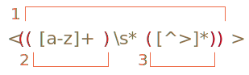

# Скобочные группы

Часть шаблона можно заключить в скобки `pattern:(...)`. Это называется "скобочная группа".

У такого выделения есть два эффекта:

1. Позволяет поместить часть совпадения в отдельный массив.
2. Если установить квантификтор после скобок, то он будет применяться ко всему содержимому скобки, а не к одному символу.

## Пример

В примере ниже шаблон `pattern:(go)+` ищет как минимум одно совпадение с `match:'go'`:

```js run
alert( 'Gogogo now!'.match(/(go)+/i) ); // "Gogogo"
```

Без скобок, шаблон `pattern:/go+/` означает символ `subject:g` и идущий после него символ `subject:o`, который повторяется один или более раз. Например, `match:goooo` или `match:gooooooooo`.

Скобки группируют символы в слово `pattern:(go)`.

Сделаем что-то более сложное -- регулярное выражение, которое соответствует адресу  электронной почты.

Пример такой почты:

```
my@mail.com
john.smith@site.com.uk
```

Шаблон для поиска адреса: `pattern:[-.\w]+@([\w-]+\.)+[\w-]{2,20}`.

1. Первая часть `pattern:[-.\w]+` (перед `@`) может включать любые числовые или буквенные символы, точку и тире, чтобы соответствовать `match:john.smith`.
2. Затем идёт `pattern:@` и домен. Это может быть поддомен (например, `host.site.com.uk`), поэтому мы сопоставляем его как слово, за которым следует точка `pattern:([\w-]+\.)` (повторяется квантификатором `pattern:+`). Затем в конце должно быть слово `pattern:[\w-]{2,20}`, например `match:com` или `match:uk` (но не очень длинное: 2-20 символов).

Это регулярное выражение не идеальное, но как правило работает.

Например, мы можем найти все электронные адреса в строке:

```js run
let reg = /[-.\w]+@([\w-]+\.)+[\w-]{2,20}/g;

alert("my@mail.com @ his@site.com.uk".match(reg)); // my@mail.com, his@site.com.uk
```

В этом регулярном выражении скобки были использованы для создания повторяющейся группы `pattern:(...)+`. Но есть и другие применения. Посмотрим на них.

## Содержимое скобок

Скобочные группы нумеруются слева направо. Поисковой движок запоминает содержимое, которое соответствует каждой скобочной группе, и позволяет ссылаться на него в шаблоне регулярного выражения или строке для замены.

Например, мы хотим найти HTML теги `pattern:<.*?>` и обработать их. Было бы удобно иметь содержимое тега, внутри уголков, в отдельной переменной.

Давайте заключим внутреннее содержимое в круглые скобки: `pattern:<(.*?)>`.

Теперь получим как тег целиком `match:<h1>`, так и его содержимое `match:h1` в виде массива:

```js run
let str = '<h1>Hello, world!</h1>';
let reg = /<(.*?)>/;

alert( str.match(reg) ); // <h1>,h1 (массив)
```

## Вложенные группы

Скобки могут быть и вложенными.

Например, при поиске тега в `subject:<span class="my">` нас может интересовать:

1. Содержимое тега целиком: `match:span class="my"`.
2. Название тега: `match:span`.
3. Атрибуты тега: `match:class="my"`.

Давайте добавим скобки для них:

```js run
let str = '<span class="my">';

let reg = /<(([a-z]+)\s*([^>]*))>/;

let result = str.match(reg);
alert(result); // <span class="my">, span class="my", span, class="my"
```

Вот так выглядят скобочные группы в шаблоне:



Соответствие для каждой в строке:


По нулевому индексу в `result` всегда идёт полное совпадение.

Затем следуют группы, нумеруемые слева направо, по открывающим скобкам. Группа, открывающая скобка которой идёт первой, получает первый индекс в результате - `result[1]`. Там находится всё содержимое тега.

Затем в `result[2]` идёт группа, образованная второй открывающей скобкой `pattern:([a-z]+)` -- имя тега, далее в `result[3]` будет остальное содержимое тега: `pattern:([^>]*)`.

**Даже если скобочная группа необязательна и не входит в совпадение, соответствующий элемент массива `result` существует и равен `undefined`.**

Например, рассмотрим регулярное выражение `pattern:a(z)?(c)?`. Оно ищет букву `"a"`, за которой идёт необязательная буква `"z"`, за которой, в свою очередь, идёт необязательная буква `"c"`.

Если применить его к строке из одной буквы `subject:a`, то результат будет такой:

```js run
let match = 'a'.match(/a(z)?(c)?/);

alert( match.length ); // 3
alert( match[0] ); // a (всё совпадение)
alert( match[1] ); // undefined
alert( match[2] ); // undefined
```

Массив имеет длину `3`, но все скобочные группы пустые.

А теперь более сложная ситуация для строки `subject:ack`:

```js run
let match = 'ack'.match(/a(z)?(c)?/)

alert( match.length ); // 3
alert( match[0] ); // ac (всё совпадение)
alert( match[1] ); // undefined, потому что для (z)? ничего нет
alert( match[2] ); // c
```

Длина массива всегда равна `3`. Для группы `pattern:(z)?` ничего нет, поэтому результат `["ac", undefined, "c"]`.

## Именованные группы

Запоминать группы по номерам не очень удобно. Для простых шаблонов это допустимо, но в более сложных случаях мы можем давать скобкам имена.

Это делается добавлением `pattern:?<name>` непосредственно после открытия скобки.

Например:

```js run
*!*
let dateRegexp = /(?<year>[0-9]{4})-(?<month>[0-9]{2})-(?<day>[0-9]{2})/;
*/!*
let str = "2019-04-30";

let groups = str.match(dateRegexp).groups;

alert(groups.year); // 2019
alert(groups.month); // 04
alert(groups.day); // 30
```

Как вы можете видеть, группы располагаются в свойстве `groups` результата.

## Исключение из запоминания через ?:

Бывает так, что скобки нужны, чтобы квантификатор правильно применился, но мы не хотим, чтобы их содержимое попало в результат.

Скобочную группу можно исключить из запоминаемых и нумеруемых, добавив в её начало `pattern:?:`.

В примере ниже мы получим только имя `match:John` как отдельный элемент совпадения:

```js run
let str = "Gogogo John!";

*!*
// ?: исключает go из запоминания
let reg = /(?:go)+ (\w+)/i;
*/!*

let result = str.match(reg);

alert( result.length ); // 2
alert( result[1] ); // John
```

```warn header="Метод `match` не возвращает скобки при наличии флага `g`"
У метода [match](mdn:js/String/match) есть важная особенность: если у регулярного выражения есть флаг `pattern:/.../g`, то он ищет все совпадения, но содержимое скобок отдельно не возвращает.

Например:

```js run
let str = '<h1>Hello, world!</h1>';
let reg = /<(.*?)>/*!*g*/!*;

alert( str.match(reg) ); // <h1>,</h1> (массив)
```

Как видно, найдены все теги (совпадения целиком), но без выделения скобок.

Если необходимы все совпадения со скобками, то мы можем использовать другой метод [matchAll](mdn:js/String/matchAll). Мы рассмотрим его позже, когда


## Итого

Круглые скобки группируют вместе часть регулярного выражения, так что квантификатор применяется к ним в целом.

Скобочные группы нумеруются слева направо и могут именоваться с помощью `(?<name>...)`.

На текст совпадения, соответствующий скобочной группе, можно ссылаться в строке замены через `$1`, `$2` и т.д. или по имени `$name`, если она именована.

Часть совпадения, соответствующую скобочной группе, мы также получаем в результатах поиска, отдельным элементом массива (или в `.groups`, если группа именована).

Можно исключить скобочную группу из запоминания, добавив в её начало `pattern:?:` -- `(?:...)`. Это используется, если необходимо применить квантификатор ко всей группе, но исключить попадание их содержимого в результат.
