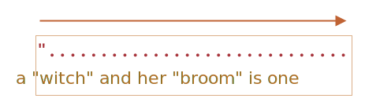
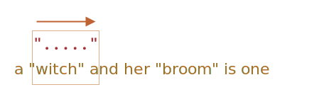

# Жадные и ленивые квантификаторы

На первый взгляд квантификаторы - это просто, но на самом деле это не совсем так.

Нужно очень хорошо разбираться, как работает поиск, если планируем искать что-то сложнее, чем `pattern:/\d+/`.

Давайте в качестве примера рассмотрим следующую задачу:

У нас есть текст, в котором нужно заменить все кавычки `"..."` на "ёлочки" `«...»`, которые используются в типографике многих стран.

Например: `"Привет, мир"` должно превратиться в `«Привет, мир»`. Есть и другие кавычки, вроде `„Witam, świat!”` (польский язык) или `「你好，世界」` (китайский язык), но для нашей задачи давайте выберем `«...»`.

Первое, что нам нужно - это найти строки с кавычками, а затем мы сможем их заменить.

Регулярное выражение вроде `pattern:/".+"/g` (кавычка, какой-то текст, другая кавычка) может выглядеть хорошим решением, но это не так!

Давайте это проверим:

```js run
let regexp = /".+"/g;

let str = 'a "witch" and her "broom" is one';

alert( str.match(regexp) ); // "witch" and her "broom"
```

...Как мы видим, регулярное выражение работает не как задумано!

Вместо того, чтобы найти два совпадения `match:"witch"` и `match:"broom"`, было найдено одно:`match:"witch" and her "broom"`.

Причину можно описать, как "жадность -- причина всех зол".

## Жадный поиск

Чтобы найти совпадение, движок регулярных выражений работает по следующему алгоритму:

- Для каждой позиции в строке для поиска:
    - Попробовать найти совпадение с шаблоном на этой позиции.
    - Если нет совпадения, переход к следующей позиции.

Эти общие слова никак не объясняют, почему регулярное выражение работает неправильно, так что давайте разберём подробно, как работает шаблон `pattern:".+"`.

1. Первый символ шаблона -- это кавычка `pattern:"`.

    Движок регулярного выражения пытается найти его на нулевой позиции исходной строки `subject:a "witch" and her "broom" is one`, но там -- `subject:a`, так что совпадения нет.

    Он продолжает: двигается к следующей позиции исходной строки и пытается найти первый символ шаблона там. У него не получается, он двигается дальше и, наконец, находит кавычку на третьей позиции:

    

2. Кавычка замечена, после чего движок пытается найти совпадение для оставшегося шаблона. Смотрит, удовлетворяет ли остаток строки шаблону `pattern:.+"`.

    В нашем случае следующий символ шаблона: `pattern:.` (точка). Она обозначает "любой символ, кроме новой строки", так что следующая буква строки `match:'w'` подходит.

    

3. Затем точка повторяется из-за квантификатора `pattern:.+`. Движок регулярного выражения добавляет к совпадению один символ за другим.

    ...До каких пор? Точке соответствуют любые символы, так что движок остановится только тогда, когда достигнет конца строки:

    

4. Тогда он перестанет повторять `pattern:.+` и попробует найти следующий символ шаблона. Это кавычка `pattern:"`. Но есть проблема: строка для поиска закончилась, больше нет символов!

    Движок регулярного выражения понимает, что захватил слишком много `pattern:.+` и начинает *отступать*.

    Другими словами, он сокращает совпадение по квантификатору на один символ:

    

    Теперь он предполагает, что `pattern:.+` заканчивается за один символ до конца строки и пытается сопоставить остаток шаблона для этой позиции.

    Если бы тут была кавычка, тогда бы поиск закончился, но последний символ -- это `subject:'e'`, так что он не подходит.

5. ...Поэтому движок уменьшает количество повторений `pattern:.+` ещё на один символ:

    

    Кавычка `pattern:'"'`не соответствует `subject:'n'`.

6. Движок продолжает возвращаться: он уменьшает количество повторений `pattern:'.'`, пока оставшийся шаблон (в нашем случае `pattern:'"'`) не совпадёт:

    

7. Совпадение найдено.

8. Так что первое совпадение: `match:"witch" and her "broom"`. Если у регулярного выражения стоит флаг `pattern:g`, то поиск продолжится с того места, где закончился предыдущий. В оставшейся строке `subject:is one` нет кавычек, так что совпадений больше не будет.

Это, определённо, не то, что мы ожидали. Но так оно работает.

**В жадном режиме (по умолчанию) квантификатор повторяется столько раз, сколько это возможно.**

Движок регулярного выражения пытается получить максимальное количество символов, соответствующих `pattern:.+`, а затем сокращает это количество символ за символом, если остаток шаблона не совпадает.

В нашей задаче мы хотим другого. И нам поможет ленивый режим квантификатора.

## Ленивый режим

"Ленивый" режим противоположен "жадному". Он означает: "повторять квантификатор наименьшее количество раз".

Мы можем включить его, вставив знак вопроса `pattern:'?'` после квантификатора, то есть будет `pattern:*?` или `pattern:+?` или даже `pattern:??` для `pattern:'?'`.

Проясним: обычно знак вопроса `pattern:?` сам по себе является квантификатором (ноль или один), но, если он добавлен *после другого квантификатора (или даже после самого себя)*, он получает другое значение -- он меняет режим совпадения с жадного на ленивый.

Регулярное выражение `pattern:/".+?"/g` работает как задумано, оно находит `match:"witch"` и `match:"broom"`:

```js run
let regexp = /".+?"/g;

let str = 'a "witch" and her "broom" is one';

alert( str.match(regexp) ); // "witch","broom"
```

Чтобы лучше понять, что поменялось, давайте рассмотрим процесс поиска шаг за шагом.

1. Первый шаг будет таким же: движок находит начало шаблона `pattern:'"'` на 3-ей позиции:

    

2. Следующий шаг аналогичен: он найдёт совпадение для точки `pattern:'.'`:

    

3. А отсюда поиск продолжится по-другому. Из-за того, что у нас включён ленивый режим для `pattern:+?`, движок не будет пытаться найти совпадение для точки ещё раз, оно остановится и попробует найти совпадение для оставшегося шаблона `pattern:'"'` прямо сейчас:

    

    Если бы на этом месте была кавычка, то поиск бы закончился, но там находится `'i'`, то есть совпадения нет.
4. Тогда движок регулярного выражения увеличит количество повторений для точки и попробует ещё раз:

    

    Опять неудача. Тогда количество повторений будет увеличено ещё и ещё...
5. ...До тех пор, пока совпадение для оставшегося шаблона не будет найдено:

    

6. Следующий поиск начнётся с того места, где закончилось текущее совпадение и у нас будет ещё один результат:

    

В этом примере мы увидели, как ленивый режим работает для `pattern:+?`. Квантификаторы `pattern:*?` и `pattern:??` работают аналогичным образом -- движок регулярного выражения увеличит количество совпадений, только если не сможет найти совпадение для оставшегося шаблона на текущей позиции.

**Ленивый режим включается только для квантификаторов с `?`.**

Остальные квантификаторы остаются жадными.

Например:

```js run
alert( "123 456".match(/\d+ \d+?/) ); // 123 4
```

1. Шаблон `pattern:\d+` пытается найти столько цифр, сколько возможно (жадный режим), так что он находит `match:123` и останавливается, потому что следующим символом будет пробел `pattern:' '`.
2. Дальше в шаблоне пробел и в строке тоже, так что есть совпадение.
3. Затем идёт `pattern:\d+?`. Квантификатор находится в ленивом режиме, так что он находит одну цифру `match:4` и проверяет, есть ли совпадение для оставшегося шаблона с этого места.

    ...Но в шаблоне `pattern:\d+?` больше ничего нет.

    Ленивый режим ничего не повторяет без необходимости. Шаблон закончился, заканчивается и поиск. Мы получаем `match:123 4`.

```smart header="Оптимизации"
Современные движки регулярных выражений могут оптимизировать внутренние алгоритмы ради ускорения. Так что их работа может несколько отличаться от описанного алгоритма.

Но эти внутренние оптимизации для нас незаметны, снаружи всё будет работать, как описано.

Сложные регулярные выражения трудно оптимизировать, так что поиск может работать и в точности так, как было описано.
```

## Альтернативный подход

С регулярными выражениями часто есть несколько путей добиться одного и того же результата.

В нашем случаем мы можем найти кавычки без использования ленивого режима с помощью регулярного выражения `pattern:"[^"]+"`:

```js run
let regexp = /"[^"]+"/g;

let str = 'a "witch" and her "broom" is one';

alert( str.match(regexp) ); // "witch","broom"
```

Регулярное выражение `pattern:"[^"]+"` получит нужный результат, потому что оно ищет кавычку `pattern:'"'`, за которой следует один или несколько символов "не-кавычек" `pattern:[^"]`, а затем -- закрывающая кавычка.

Движок регулярного выражения набирает, сколько может, `pattern:[^"]+`, пока не встречает закрывающую кавычку, на которой останавливается.

Обратите внимание, что эта логика не заменяет ленивые квантификаторы!

Просто она работает по-другому. Временами нужен один вариант, временами -- другой.

**Давайте посмотрим пример, в котором ленивый квантификатор не справляется, а этот вариант работает правильно.**

Например, мы хотим найти ссылки вида `<a href="..." class="doc">`, с произвольным `href`.

Какое регулярное выражение нам нужно использовать?

Первой мыслью может быть: `pattern:/<a href=".*" class="doc">/g`.

Давайте проверим:
```js run
let str = '...<a href="link" class="doc">...';
let regexp = /<a href=".*" class="doc">/g;

// Работает!
alert( str.match(regexp) ); // <a href="link" class="doc">
```

Регулярное выражение работает. Но давайте посмотрим, что произойдёт, если в тексте будет много ссылок?

```js run
let str = '...<a href="link1" class="doc">... <a href="link2" class="doc">...';
let regexp = /<a href=".*" class="doc">/g;

// Упс! Две ссылки в одном совпадении!
alert( str.match(regexp) ); // <a href="link1" class="doc">... <a href="link2" class="doc">
```

В данном случае мы получили неправильный результат по той же причине, что в примере с "witches". Квантификатор `pattern:.*` забирает слишком много символов.

Совпадение будет выглядеть так:

```html
<a href="....................................." class="doc">
<a href="link1" class="doc">... <a href="link2" class="doc">
```

Давайте изменим шаблон, сделав квантификатор ленивым `pattern:.*?`:

```js run
let str = '...<a href="link1" class="doc">... <a href="link2" class="doc">...';
let regexp = /<a href=".*?" class="doc">/g;

// Работает!
alert( str.match(regexp) ); // <a href="link1" class="doc">, <a href="link2" class="doc">
```

Теперь кажется, что всё работает правильно. У нас есть два совпадения:

```html
<a href="....." class="doc">    <a href="....." class="doc">
<a href="link1" class="doc">... <a href="link2" class="doc">
```

...Но давайте попробуем его на ещё одном тексте:

```js run
let str = '...<a href="link1" class="wrong">... <p style="" class="doc">...';
let regexp = /<a href=".*?" class="doc">/g;

// Неправильное совпадение!
alert( str.match(regexp) ); // <a href="link1" class="wrong">... <p style="" class="doc">
```

Ну вот, ленивый квантификатор нас подвёл. В совпадении находится не только ссылка, но и текст после неё, включая `<p...>`.

Почему?

Происходит следующее:

1. Первым делом регулярное выражение находит начало ссылки `match:<a href="`.
2. Затем оно ищет `pattern:.*?`, берёт один символ (лениво!) и проверяет, есть ли совпадение для `pattern:" class="doc">` (нет).
3. Затем берёт другой символ для `pattern:.*?`, и так далее... пока не достигнет `match:" class="doc">`. Поиск завершён.

Но с этим есть проблема: конец совпадения находится уже за границей ссылки `<a...>`, вообще в другом теге `<p>`. Что нам не подходит.

Вот как совпадение выглядит по отношению к исходному тексту:

```html
<a href="..................................." class="doc">
<a href="link1" class="wrong">... <p style="" class="doc">
```

Итак, нужен шаблон для поиска `<a href="...something..." class="doc">`, но и с ленивым и с жадным режимами есть проблема.

Правильным вариантом может стать: `pattern:href="[^"]*"`. Он найдёт все символы внутри атрибута `href` до ближайшей следующей кавычки, как раз то, что нам нужно.

Работающий пример:

```js run
let str1 = '...<a href="link1" class="wrong">... <p style="" class="doc">...';
let str2 = '...<a href="link1" class="doc">... <a href="link2" class="doc">...';
let regexp = /<a href="[^"]*" class="doc">/g;

// Работает!
alert( str1.match(regexp) ); // совпадений нет, всё правильно
alert( str2.match(regexp) ); // <a href="link1" class="doc">, <a href="link2" class="doc">
```

## Итого

У квантификаторов есть два режима работы:

Жадный
: По умолчанию движок регулярного выражения пытается повторить квантификатор столько раз, сколько это возможно. Например, `pattern:\d+` получит все возможные цифры. Когда цифры закончатся или он дойдёт до конца строки, движок продолжит искать совпадение для оставшегося шаблона. Если совпадения не будет, он уменьшит количество повторов (осуществит возврат) и попробует снова.

Ленивый
: Включается с помощью знака вопроса `pattern:?` после квантификатора. Движок регулярного выражения пытается найти совпадение для оставшегося шаблона перед каждым повторением квантификатора.

Как мы увидели на примере поиска строк в кавычках, ленивый режим не "панацея" от всех проблем жадного поиска. В качестве альтернативы может выступать "хорошо настроенный" жадный поиск, как в шаблоне `pattern:"[^"]+"`.
