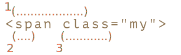

# Скобочные группы

Часть шаблона можно заключить в скобки `pattern:(...)`. Это называется "скобочная группа".

У такого выделения есть два эффекта:

1. Позволяет поместить часть совпадения в отдельный массив.
2. Если установить квантификатор после скобок, то он будет применяться ко всему содержимому скобки, а не к одному символу.

## Примеры

Разберём скобки на примерах.

### Пример: gogogo

Без скобок шаблон `pattern:go+` означает символ `subject:g` и идущий после него символ `subject:o`, который повторяется один или более раз. Например, `match:goooo` или `match:gooooooooo`.

Скобки группируют символы вместе. Так что `pattern:(go)+` означает `match:go`, `match:gogo`, `match:gogogo` и т.п.

```js run
alert( 'Gogogo now!'.match(/(go)+/i) ); // "Gogogo"
```

### Пример: домен

Сделаем что-то более сложное -- регулярное выражение, которое соответствует домену сайта.

Например:

```
mail.com
users.mail.com
smith.users.mail.com
```

Как видно, домен состоит из повторяющихся слов, причём после каждого, кроме последнего, стоит точка.

На языке регулярных выражений `pattern:(\w+\.)+\w+`:

```js run
let regexp = /(\w+\.)+\w+/g;

alert( "site.com my.site.com".match(regexp) ); // site.com,my.site.com
```

Поиск работает, но такому шаблону не соответствует домен с дефисом, например, `my-site.com`, так как дефис не входит в класс `pattern:\w`.

Можно исправить это, заменим `pattern:\w` на `pattern:[\w-]` везде, кроме как в конце: `pattern:([\w-]+\.)+\w+`.

### Пример: email

Предыдущий пример можно расширить, создав регулярное выражение для поиска email.

Формат email: `имя@домен`. В качестве имени может быть любое слово, разрешены дефисы и точки. На языке регулярных выражений это `pattern:[-.\w]+`.

Итоговый шаблон:

```js run
let regexp = /[-.\w]+@([\w-]+\.)+[\w-]+/g;

alert("my@mail.com @ his@site.com.uk".match(regexp)); // my@mail.com, his@site.com.uk
```

Это регулярное выражение не идеальное, но, как правило, работает и помогает исправлять опечатки. Окончательную проверку правильности email, в любом случае, можно осуществить, лишь послав на него письмо.

## Содержимое скобок в match

Скобочные группы нумеруются слева направо. Поисковой движок запоминает содержимое, которое соответствует каждой скобочной группе, и позволяет получить его в результате.

Метод `str.match(regexp)`, если у регулярного выражения `regexp` нет флага `g`, ищет первое совпадение и возвращает его в виде массива:

1. На позиции `0` будет всё совпадение целиком.
2. На позиции `1` - содержимое первой скобочной группы.
3. На позиции `2` - содержимое второй скобочной группы.
4. ...и так далее...

Например, мы хотим найти HTML теги `pattern:<.*?>` и обработать их. Было бы удобно иметь содержимое тега (то, что внутри уголков) в отдельной переменной.

Давайте заключим внутреннее содержимое в круглые скобки: `pattern:<(.*?)>`.

Теперь получим как тег целиком `match:<h1>`, так и его содержимое `match:h1` в виде массива:

```js run
let str = '<h1>Hello, world!</h1>';

let tag = str.match(/<(.*?)>/);

alert( tag[0] ); // <h1>
alert( tag[1] ); // h1
```

### Вложенные группы

Скобки могут быть и вложенными.

Например, при поиске тега в `subject:<span class="my">` нас может интересовать:

1. Содержимое тега целиком: `match:span class="my"`.
2. Название тега: `match:span`.
3. Атрибуты тега: `match:class="my"`.

Заключим их в скобки в шаблоне: `pattern:<(([a-z]+)\s*([^>]*))>`.

Вот их номера (слева направо, по открывающей скобке):


В действии:

```js run
let str = '<span class="my">';

let regexp = /<(([a-z]+)\s*([^>]*))>/;

let result = str.match(regexp);
alert(result[0]); // <span class="my">
alert(result[1]); // span class="my"
alert(result[2]); // span
alert(result[3]); // class="my"
```

По нулевому индексу в `result` всегда идёт полное совпадение.

Затем следуют группы, нумеруемые слева направо, по открывающим скобкам. Группа, открывающая скобка которой идёт первой, получает первый индекс в результате - `result[1]`. Там находится всё содержимое тега.

Затем в `result[2]` идёт группа, образованная второй открывающей скобкой `pattern:([a-z]+)` -- имя тега, далее в `result[3]` будет остальное содержимое тега: `pattern:([^>]*)`.

Соответствие для каждой группы в строке:



### Необязательные группы

Даже если скобочная группа необязательна (например, стоит квантификатор `pattern:(...)?`), соответствующий элемент массива `result` существует и равен `undefined`.

Например, рассмотрим регулярное выражение `pattern:a(z)?(c)?`. Оно ищет букву `"a"`, за которой идёт необязательная буква `"z"`, за которой, в свою очередь, идёт необязательная буква `"c"`.

Если применить его к строке из одной буквы `subject:a`, то результат будет такой:

```js run
let match = 'a'.match(/a(z)?(c)?/);

alert( match.length ); // 3
alert( match[0] ); // a (всё совпадение)
alert( match[1] ); // undefined
alert( match[2] ); // undefined
```

Массив имеет длину `3`, но все скобочные группы пустые.

А теперь более сложная ситуация для строки `subject:ac`:

```js run
let match = 'ac'.match(/a(z)?(c)?/)

alert( match.length ); // 3
alert( match[0] ); // ac (всё совпадение)
alert( match[1] ); // undefined, потому что для (z)? ничего нет
alert( match[2] ); // c
```

Длина массива всегда равна `3`. Для группы `pattern:(z)?` ничего нет, поэтому результат: `["ac", undefined, "c"]`.

## Поиск всех совпадений с группами: matchAll

```warn header="`matchAll` является новым, может потребоваться полифил"
Метод не поддерживается в старых браузерах.

Может потребоваться полифил, например <https://github.com/ljharb/String.prototype.matchAll>.
```

При поиске всех совпадений (флаг `pattern:g`) метод `match` не возвращает скобочные группы.

Например, попробуем найти все теги в строке:

```js run
let str = '<h1> <h2>';

let tags = str.match(/<(.*?)>/g);

alert( tags ); // <h1>,<h2>
```

Результат - массив совпадений, но без деталей о каждом. Но на практике скобочные группы тоже часто нужны.

Для того, чтобы их получать, мы можем использовать метод `str.matchAll(regexp)`.

Он был добавлен в язык JavaScript гораздо позже чем `str.match`, как его "новая и улучшенная" версия.

Он, как и `str.match(regexp)`, ищет совпадения, но у него есть три отличия:

1. Он возвращает не массив, а перебираемый объект.
2. При поиске с флагом `pattern:g`, он возвращает каждое совпадение в виде массива со скобочными группами.
3. Если совпадений нет, он возвращает не `null`, а просто пустой перебираемый объект.

Например:

```js run
let results = '<h1> <h2>'.matchAll(/<(.*?)>/gi);

// results - не массив, а перебираемый объект
alert(results); // [object RegExp String Iterator]

alert(results[0]); // undefined (*)

results = Array.from(results); // превращаем в массив

alert(results[0]); // <h1>,h1 (первый тег)
alert(results[1]); // <h2>,h2 (второй тег)
```

Как видите, первое отличие - очень важное, это демонстрирует строка `(*)`. Мы не можем получить совпадение как  `results[0]`, так как этот объект не является псевдомассивом. Его можно превратить в настоящий массив при помощи `Array.from`. Более подробно о псевдомассивах и перебираемых объектов мы говорили в главе <info:iterable>.

В явном преобразовании через `Array.from` нет необходимости, если мы перебираем результаты в цикле, вот так:

```js run
let results = '<h1> <h2>'.matchAll(/<(.*?)>/gi);

for(let result of results) {
  alert(result);
  // первый вывод: <h1>,h1
  // второй: <h2>,h2
}
```

...Или используем деструктуризацию:

```js
let [tag1, tag2] = '<h1> <h2>'.matchAll(/<(.*?)>/gi);
```

Каждое совпадение, возвращаемое `matchAll`, имеет тот же вид, что и при `match` без флага `pattern:g`: это массив с дополнительными свойствами `index` (позиция совпадения) и `input` (исходный текст):

```js run
let results = '<h1> <h2>'.matchAll(/<(.*?)>/gi);

let [tag1, tag2] = results;

alert( tag1[0] ); // <h1>
alert( tag1[1] ); // h1
alert( tag1.index ); // 0
alert( tag1.input ); // <h1> <h2>
```

```smart header="Почему результат `matchAll` - перебираемый объект, а не обычный массив?"
Зачем так сделано? Причина проста - для оптимизации.

При вызове `matchAll` движок JavaScript возвращает перебираемый объект, в котором ещё нет результатов. Поиск осуществляется по мере того, как мы запрашиваем результаты, например, в цикле.

Таким образом, будет найдено ровно столько результатов, сколько нам нужно.

Например, всего в тексте может быть 100 совпадений, а в цикле после 5-го результата мы поняли, что нам их достаточно и сделали `break`. Тогда движок не будет тратить время на поиск остальных 95.
```

## Именованные группы

Запоминать группы по номерам не очень удобно. Для простых шаблонов это допустимо, но в сложных регулярных выражениях считать скобки затруднительно. Гораздо лучше - давать скобкам имена.

Это делается добавлением `pattern:?<name>` непосредственно после открытия скобки.

Например, поищем дату в формате "день-месяц-год":

```js run
*!*
let dateRegexp = /(?<year>[0-9]{4})-(?<month>[0-9]{2})-(?<day>[0-9]{2})/;
*/!*
let str = "2019-04-30";

let groups = str.match(dateRegexp).groups;

alert(groups.year); // 2019
alert(groups.month); // 04
alert(groups.day); // 30
```

Как вы можете видеть, группы располагаются в свойстве `groups` результата `match`.

Чтобы найти не только первую дату, используем флаг `pattern:g`.

Также нам понадобится `matchAll`, чтобы получить скобочные группы:

```js run
let dateRegexp = /(?<year>[0-9]{4})-(?<month>[0-9]{2})-(?<day>[0-9]{2})/g;

let str = "2019-10-30 2020-01-01";

let results = str.matchAll(dateRegexp);

for(let result of results) {
  let {year, month, day} = result.groups;

  alert(`${day}.${month}.${year}`);
  // первый вывод: 30.10.2019
  // второй: 01.01.2020
}
```

## Скобочные группы при замене

Метод `str.replace(regexp, replacement)`, осуществляющий замену совпадений с `regexp` в строке `str`, позволяет использовать в строке замены содержимое скобок. Это делается при помощи обозначений вида `pattern:$n`, где `pattern:n` - номер скобочной группы.

Например:

```js run
let str = "John Bull";
let regexp = /(\w+) (\w+)/;

alert( str.replace(regexp, '$2, $1') ); // Bull, John
```

Для именованных скобок ссылка будет выглядеть как `pattern:$<имя>`.

Например, заменим даты в формате "год-месяц-день" на "день.месяц.год":

```js run
let regexp = /(?<year>[0-9]{4})-(?<month>[0-9]{2})-(?<day>[0-9]{2})/g;

let str = "2019-10-30, 2020-01-01";

alert( str.replace(regexp, '$<day>.$<month>.$<year>') );
// 30.10.2019, 01.01.2020
```

## Исключение из запоминания через ?:

Бывает так, что скобки нужны, чтобы квантификатор правильно применился, но мы не хотим, чтобы их содержимое было выделено в результате.

Скобочную группу можно исключить из запоминаемых и нумеруемых, добавив в её начало `pattern:?:`.

Например, если мы хотим найти `pattern:(go)+`, но не хотим иметь в массиве-результате отдельным элементом содержимое скобок (`go`), то можем написать `pattern:(?:go)+`.

В примере ниже мы получим только имя `match:John` как отдельный элемент совпадения:

```js run
let str = "Gogogo John!";

*!*
// ?: исключает go из запоминания
let regexp = /(?:go)+ (\w+)/i;
*/!*

let result = str.match(regexp);

alert( result[0] ); // Gogogo John (полное совпадение)
alert( result[1] ); // John
alert( result.length ); // 2 (больше в массиве элементов нет)
```

Как видно, содержимое скобок `pattern:(?:go)` не стало отдельным элементом массива `result`.

## Итого

Круглые скобки группируют вместе часть регулярного выражения, так что квантификатор применяется к ним в целом.

Скобочные группы нумеруются слева направо. Также им можно дать имя с помощью `pattern:(?<name>...)`.

Часть совпадения, соответствующую скобочной группе, мы можем получить в результатах поиска.

- Метод `str.match` возвращает скобочные группы только без флага `pattern:g`.
- Метод `str.matchAll` возвращает скобочные группы всегда.

Если скобка не имеет имени, то содержимое группы будет по своему номеру в массиве-результате, если имеет, то также в свойстве `groups`.

Содержимое скобочной группы можно также использовать при замене `str.replace(regexp, replacement)`: по номеру `$n` или по имени `$<имя>`.

Можно исключить скобочную группу из запоминания, добавив в её начало `pattern:?:`. Это используется, если необходимо применить квантификатор ко всей группе, но не запоминать их содержимое в отдельном элементе массива-результата. Также мы не можем ссылаться на такие скобки в строке замены.
