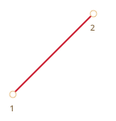
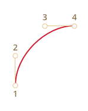
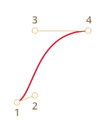
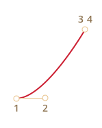
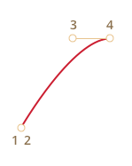
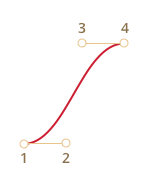
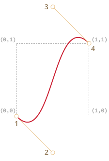

archive:
  ref: css-animations

---

# CSS-анимации

Все современные браузеры, кроме IE9- поддерживают <a href="http://www.w3.org/TR/css3-transitions/">CSS transitions</a> и <a href="http://www.w3.org/TR/css3-animations/">CSS animations</a>, которые позволяют реализовать анимацию средствами CSS, без привлечения JavaScript.

Однако, как мы увидим далее, для более тонкого контроля анимации JavaScript вовсе не будет лишним.

## CSS transitions [#css-transition]

Идея проста. Мы указываем, что некоторое свойство будет анимироваться при помощи специальных CSS-правил. Далее, при изменении этого свойства, браузер сам обработает анимацию.

Например, CSS, представленный ниже, 3 секунды анимирует свойство `background-color`.

```css
.animated {
  transition-property: background-color;
  transition-duration: 3s;
}
```

Теперь любое изменение фонового цвета будет анимироваться в течение 3х секунд.

При клике на эту кнопку происходит анимация её фона:

```html run autorun height=60
<button id="color">Кликни меня</button>

<style>
  #color {
    transition-property: background-color;
    transition-duration: 3s;
  }
</style>

<script>
  color.onclick = function() {
    this.style.backgroundColor = 'red';
  }
</script>
```

Есть всего 5 свойств, задающих анимацию:

- `transition-property`
- `transition-duration`
- `transition-timing-function`
- `transition-delay`

Далее мы изучим их все, пока лишь заметим, что общее свойство `transition` может перечислять их все, в порядке: `property duration timing-function delay`, а также задавать анимацию нескольких свойств сразу.

Например, при клике на эту кнопку анимируются одновременно цвет и размер шрифта:

```html run height=80 autorun no-beautify
<button id="growing">Кликни меня</button>

<style>
#growing {
*!*
  transition: font-size 3s, color 2s;
*/!*
}
</style>

<script>
growing.onclick = function() {
  this.style.fontSize='36px';
  this.style.color='red';
}
</script>
```

Далее мы рассмотрим свойства анимации по отдельности.

## transition-property

Список свойств, которые будут анимироваться, например: `left`, `margin-left`, `height`, `color`.

Анимировать можно не все свойства, но [многие](http://www.w3.org/TR/css3-transitions/#animatable-properties-). Значение `all` означает "анимировать все свойства".

## transition-duration

Продолжительность анимации, задаётся в формате [CSS time](http://www.w3.org/TR/css3-values/#time), то есть в секундах `s` или `ms`.

## transition-delay

Задержка до анимации. Например, если `transition-delay: 1s`, то анимация начнётся через 1 секунду после смены свойства.

Возможны отрицательные значения, при этом анимация начнётся с середины.

Например, вот анимация цифр от `0` до `9`:

[codetabs src="digits"]

Она осуществляется сменой `margin-left` у элемента с цифрами, примерно так:

```css
#stripe.animate {
  margin-left: -174px;
  transition-property: margin-left;
  transition-duration: 9s;
}
```

В примере выше JavaScript просто добавляет элементу класс -- и анимация стартует:

```js
digit.classList.add('animate');
```

Можно стартовать её "с середины", с нужной цифры, например соответствующей текущей секунде, при помощи отрицательного `transition-delay`.

В примере ниже при клике на цифру она начнёт двигаться с текущей секунды:

[codetabs src="digits-negative-delay"]

В JavaScript это делается дополнительной строкой:

```js
stripe.onclick = function() {
  var sec = new Date().getSeconds() % 10;
*!*
  // например, значение -3s начнёт анимацию с 3-й секунды
  stripe.style.transitionDelay = '-' + sec + 's';
*/!*
  stripe.classList.add('animate');
};
```

## transition-timing-function

Временнáя функция, которая задаёт, как процесс анимации будет распределён во времени, например начнётся ли анимация медленно, чтобы потом ускориться или наоборот.

Самое сложное, но при небольшом изучении -- вполне очевидное свойство.

У него есть два основных вида значения: кривая Безье и по шагам. Начнём с первого.

### Кривая Безье

В качестве временной функции можно выбрать любую [кривую Безье](/bezier) с 4 опорными точками, удовлетворяющую условиям:

1. Начальная точка `(0,0)`.
2. Конечная точка `(1,1)`.
3. Для промежуточных точек значения `x` должны быть в интервале  `0..1`, `y` -- любыми.

Синтаксис для задания кривой Безье в CSS: `cubic-bezier(x2, y2, x3, y3)`. В нём указываются координаты только двух точек: второй и третьей, так как первая и последняя фиксированы.

Она указывает, как быстро развивается процесс анимации во времени.

- По оси `x` идёт время: `0` -- начальный момент, `1` -- конец времени `transition-duration`.
- По оси `y` -- завершённость процесса: `0` -- начальное значение анимируемого свойства, `1` -- конечное.

Самый простой вариант -- это когда процесс развивается равномерно, "линейно" по времени. Это можно задать кривой Безье `cubic-bezier(0, 0, 1, 1)`.

График этой "кривой" таков:



...Как видно, это просто прямая. По мере того, как проходит время `x`, завершённость анимации `y` равномерно приближается от `0` к `1`.

Поезд в примере ниже с постоянной скоростью "едет" слева направо, используя такую временную функцию:

[codetabs src="train-linear"]

CSS для анимации:
```css
.train {
  left: 0;
  transition: left 5s cubic-bezier(0, 0, 1, 1);
  /* JavaScript ставит значение left: 450px */
}
```

Как нам показать, что поезд тормозит?

Для этого используем кривую Безье: `cubic-bezier(0.0, 0.5, 0.5 ,1.0)`.

График этой кривой:



Как видно, процесс вначале развивается быстро -- кривая резко идёт вверх, а затем всё медленнее, медленнее.

Вы можете увидеть эту временную функцию в действии, кликнув на поезд:

[codetabs src="train"]

CSS для анимации:
```css
.train {
  left: 0;
  transition: left 5s cubic-bezier(0, .5, .5, 1);
  /* JavaScript ставит значение left: 450px */
}
```

Существует несколько стандартных обозначений кривых: `linear`, `ease`, `ease-in`, `ease-out` и `ease-in-out`.

Значение `linear` -- это прямая, мы её уже видели.

Остальные кривые являются короткой записью следующих `cubic-bezier`:

| <code>ease</code><sup>*</sup> | <code>ease-in</code> | <code>ease-out</code> | <code>ease-in-out</code> |
|-------------------------------|----------------------|-----------------------|--------------------------|
| <code>(0.25, 0.1, 0.25, 1.0)</code> | <code>(0.42, 0, 1.0, 1.0)</code> | <code>(0, 0, 0.58, 1.0)</code> | <code>(0.42, 0, 0.58, 1.0)</code> |
|  |  |  |  |

`*` -- По умолчанию, если никакой временной функции не указано, используется `ease`.

**Кривая Безье может заставить анимацию "выпрыгивать" за пределы диапазона.**

Допустимо указывать для кривой Безье как отрицательные `y`, так и сколь угодно большие. При этом кривая Безье будет также по `y` выскакивать за пределы диапазона `0..1`, представляющего собой начало-конец значения.

В примере ниже CSS-код анимации таков:
```css
.train {
  left: 100px;
  transition: left 5s cubic-bezier(.5, -1, .5, 2);
  /* JavaScript поменяет left на 400px */
}
```

Свойство `left` должно меняться от `100px` до `400px`.

Однако, если кликнуть на поезд, то мы увидим, что:

- Он едет сначала назад, то есть `left` становится меньше `100px`.
- Затем вперёд, причём выезжает за назначенные `400px`.
- А затем опять назад -- до `400px`.

[codetabs src="train-over"]

Почему так происходит -- отлично видно, если взглянуть на кривую Безье с указанными опорными точками:



Мы вынесли координату `y` для второй опорной точки на 1 ниже нуля, а для третьей опорной точки -- на 1 выше единицы, поэтому и кривая вышла за границы "обычного" квадрата. Её значения по `y` вышли из стандартного диапазона `0..1`.

Как мы помним, значению `y = 0` соответствует "нулевое" положение анимации, а `y = 1` -- конечное. Получается, что значения `y<0` двинули поезд назад, меньше исходного `left`, а значения `y>1` -- больше итогового `left`.

Это, конечно, "мягкий" вариант. Если поставить значения `y` порядка `-99`, `99`, то поезд будет куда более сильно выпрыгивать за диапазон.

Итак, кривая Безье позволяет задавать "плавное"" течение анимации. Подобрать кривую Безье вручную можно на сайте <http://cubic-bezier.com/>.

### Шаги steps

Временная функция `steps(количество шагов[, start/end])` позволяет разбить анимацию на чёткое количество шагов.

Проще всего это увидеть на примере. Выше мы видели плавную анимацию цифр от `0` до `9` при помощи смены `margin-left` у элемента, содержащего `0123456789`.

Чтобы цифры сдвигались не плавно, а шли чётко и раздельно, одна за другой -- мы разобьём анимацию на 9 шагов:
```css
#stripe.animate  {
  margin-left: -174px;
  transition: margin-left 9s *!*steps(9, start)*/!*;
}
```

В действии `step(9, start)`:

[codetabs src="step"]

Первый аргумент `steps` -- количество шагов, то есть изменение `margin-left` разделить на 9 частей, получается примерно по `19px`. На то же количество частей делится и временной интервал, то есть по `1s`.

`start` -- означает, что при начале анимации нужно сразу применить первое изменение. Это проявляется тем, что при нажатии на цифру она меняется на `1` (первое изменение `margin-left`) мгновенно, а затем в начале каждой следующей секунды.

То есть, процесс развивается так:

- `0s` -- `-19px` (первое изменение в начале 1-й секунды, сразу при нажатии)
- `1s` -- `-38px`
- ...
- `8s` -- `-174px`
- (на протяжении последней секунды видно окончательное значение).

Альтернативное значение `end` означало бы, что изменения нужно применять не в начале, а в конце каждой секунды, то есть так:

- `0s` -- `0`
- `1s` -- `-19px` (первое изменение в конце 1-й секунды)
- `2s` -- `-38px`
- ...
- `9s` -- `-174px`

В действии `step(9, end)`:

[codetabs src="step-end"]

Также есть сокращённые значения:

- `step-start` -- то же, что `steps(1, start)`, то есть завершить анимацию в 1 шаг сразу.
- `step-end` -- то же, что `steps(1, end)`, то есть завершить анимацию в 1 шаг по истечении `transition-duration`.

Такие значения востребованы редко, так как это даже и не анимация почти, но тоже бывают полезны.

## Событие transitionend

На конец CSS-анимации можно повесить обработчик на событие `transitionend`.

Это широко используется, чтобы после анимации сделать какое-то действие или объединить несколько анимаций в одну.

Например, лодочка в примере ниже при клике начинает плавать туда-обратно, с каждым разом уплывая всё дальше вправо:

[iframe src="boat" height=300 edit link]

Её анимация осуществляется функцией `go`, которая перезапускается по окончании, с переворотом через CSS:

```js
boat.onclick = function() {
  //...
  var times = 1;

  function go() {
    if (times % 2) {
      // плывём вправо
      boat.classList.remove('back');
      boat.style.marginLeft = 100 * times + 200 + 'px';
    } else {
      // плывём влево
      boat.classList.add('back');
      boat.style.marginLeft = 100 * times - 200 + 'px';
    }

  }

  go();

  boat.addEventListener('transitionend', function() {
    times++;
    go();
  });
};
```

Объект события `transitionend` содержит специфические свойства:

`propertyName`
: Свойство, анимация которого завершилась.

`elapsedTime`
: Время (в секундах), которое заняла анимация, без учета `transition-delay`.

Свойство `propertyName` может быть полезно при одновременной анимации нескольких свойств. Каждое свойство даст своё событие, и можно решить, что с ним делать дальше.

## CSS animations

Более сложные анимации делаются объединением простых при помощи CSS-правила `@keyframes`.

В нём задаётся "имя" анимации и правила: что, откуда и куда анимировать. Затем при помощи свойства `animation: имя параметры` эта анимация подключается к элементу, задаётся время анимации и дополнительные параметры, как её применять.

Пример с пояснениями в комментарии:

```html run height=60 autorun="no-epub" no-beautify
<div class="progress"></div>

<style>
*!*
  @keyframes go-left-right {   /* назовём анимацию: "go-left-right" */
    from {
      left: 0px;               /* от: left: 0px */
    }
    to {
      left: calc(100% - 50px); /* до: left: 100%-50px */
    }
  }
*/!*


  .progress {
*!*
    /* применить анимацию go-left-right */
    /* продолжительность 3s */
    /* количество раз: бесконечное (infinite) */
    /* менять направление анимации каждый раз (alternate) */
    animation: go-left-right 3s infinite alternate;
*/!*

    position: relative;
    border: 2px solid green;
    width: 50px;
    height: 20px;
    background: lime;
  }
</style>
```

Этот стандарт пока в черновике, поэтому в Chrome, Safari, Opera  нужен префикс `-webkit`.

Статей про CSS animations достаточно много, посмотрите, например:

- [Статья про CSS Animation](http://css.yoksel.ru/css-animation/).
- [Пример бесконечной подпрыгивающей анимации на CSS Animation и кривых Безье](https://albiebrown.github.io/gravify/).

## Итого

CSS-анимации позволяют плавно или не очень менять одно или несколько свойств.

Альтернатива им -- плавное изменение значений свойств через JavaScript, мы рассмотрим подробности далее.

Ограничения и достоинства CSS-анимаций по сравнению с JavaScript:

```compare
- Временная функция может быть задана кривой Безье или через шаги. Более сложные анимации, состоящие из нескольких кривых, реализуются их комбинацией при помощи [CSS animations](http://www.w3.org/TR/css3-animations/), но JavaScript-функции всегда гибче.
- CSS-анимации касаются только свойств, а в JavaScript можно делать всё, что угодно, удалять элементы, создавать новые.
- Отсутствует поддержка в IE9-
+ Простые вещи делаются просто.
+ "Легче" для процессора, чем анимации JavaScript, лучше используется графический ускоритель. Это очень важно для мобильных устройств.
```

Подавляющее большинство анимаций делается через CSS.

При этом JavaScript запускает их начало -- как правило, добавлением класса, в котором задано новое свойство, и может отследить окончание через событие `transitionend`.
